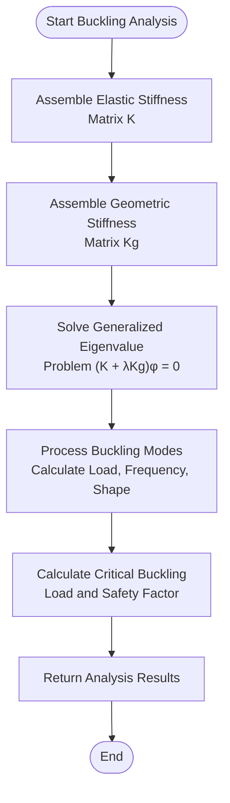

# Advanced Analysis Engine

<cite>
**Referenced Files in This Document**   
- [AdvancedAnalysisEngine.ts](file://src\structural-analysis\analysis\AdvancedAnalysisEngine.ts)
- [structural.ts](file://src\types\structural.ts)
- [SparseMatrixSolver.ts](file://src\structural-analysis\analysis\SparseMatrixSolver.ts)
</cite>

## Table of Contents
1. [Introduction](#introduction)
2. [Core Components](#core-components)
3. [Configuration Objects](#configuration-objects)
4. [Time-History Analysis](#time-history-analysis)
5. [Pushover Analysis](#pushover-analysis)
6. [Buckling Analysis](#buckling-analysis)
7. [Analysis Results](#analysis-results)
8. [Numerical Considerations](#numerical-considerations)

## Introduction

The Advanced Analysis Engine provides sophisticated structural analysis capabilities for engineering applications. It implements three advanced analysis methods: time-history analysis, pushover analysis, and buckling analysis. The engine is designed to handle complex 3D structures and provides detailed results for structural performance evaluation.

The engine operates on a Structure3D object that contains the complete structural model including nodes, elements, materials, sections, and loads. It uses sparse matrix representations for efficient computation of large structural systems.

**Section sources**
- [AdvancedAnalysisEngine.ts](file://src\structural-analysis\analysis\AdvancedAnalysisEngine.ts#L123-L612)
- [structural.ts](file://src\types\structural.ts#L92-L98)

## Core Components

The Advanced Analysis Engine is implemented as a class that encapsulates the analysis functionality. The engine requires a Structure3D object for initialization and provides methods for performing various types of advanced analyses.


**Diagram sources**
- [AdvancedAnalysisEngine.ts](file://src\structural-analysis\analysis\AdvancedAnalysisEngine.ts#L123-L612)
- [structural.ts](file://src\types\structural.ts#L92-L98)
- [SparseMatrixSolver.ts](file://src\structural-analysis\analysis\SparseMatrixSolver.ts#L5-L14)

**Section sources**
- [AdvancedAnalysisEngine.ts](file://src\structural-analysis\analysis\AdvancedAnalysisEngine.ts#L123-L612)
- [structural.ts](file://src\types\structural.ts#L92-L98)

## Configuration Objects

The Advanced Analysis Engine uses configuration objects to specify analysis parameters for each type of analysis. These configuration objects define the specific parameters needed for each analysis method.

### TimeHistoryConfig

The TimeHistoryConfig interface defines the configuration for time-history analysis, which simulates the dynamic response of a structure to time-varying loads.

```mermaid
classDiagram
class TimeHistoryConfig {
+timeStep : number
+totalTime : number
+dampingRatio : number
+integrationMethod : 'newmark' | 'wilson' | 'central-difference'
+loadHistory : Array<{
time : number
loads : Array<{
nodeId : string
direction : 'x' | 'y' | 'z'
magnitude : number
}>
}>
}
```

**Diagram sources**
- [AdvancedAnalysisEngine.ts](file://src\structural-analysis\analysis\AdvancedAnalysisEngine.ts#L18-L31)

**Section sources**
- [AdvancedAnalysisEngine.ts](file://src\structural-analysis\analysis\AdvancedAnalysisEngine.ts#L18-L31)

### PushoverConfig

The PushoverConfig interface defines the configuration for pushover analysis, which evaluates the nonlinear static behavior of a structure under increasing lateral loads.

```mermaid
classDiagram
class PushoverConfig {
+controlNode : string
+controlDirection : 'x' | 'y' | 'z'
+maxDisplacement : number
+incrementSteps : number
+convergenceTolerance : number
+yieldCriteria : {
materialStrainLimit : number
elementRotationLimit : number
}
}
```

**Diagram sources**
- [AdvancedAnalysisEngine.ts](file://src\structural-analysis\analysis\AdvancedAnalysisEngine.ts#L36-L46)

**Section sources**
- [AdvancedAnalysisEngine.ts](file://src\structural-analysis\analysis\AdvancedAnalysisEngine.ts#L36-L46)

### BucklingConfig

The BucklingConfig interface defines the configuration for buckling analysis, which determines the critical load factors at which a structure becomes unstable.

```mermaid
classDiagram
class BucklingConfig {
+numberOfModes : number
+shiftValue? : number
+includeGeometricStiffness : boolean
+loadPattern : Array<{
nodeId : string
direction : 'x' | 'y' | 'z'
magnitude : number
}>
}
```

**Diagram sources**
- [AdvancedAnalysisEngine.ts](file://src\structural-analysis\analysis\AdvancedAnalysisEngine.ts#L51-L60)

**Section sources**
- [AdvancedAnalysisEngine.ts](file://src\structural-analysis\analysis\AdvancedAnalysisEngine.ts#L51-L60)

## Time-History Analysis

Time-history analysis simulates the dynamic response of a structure to time-varying loads using numerical integration methods. The Advanced Analysis Engine implements the Newmark integration scheme for this purpose.

### Newmark Integration Scheme

The Newmark integration scheme is a family of numerical methods for solving second-order ordinary differential equations that arise in structural dynamics. The engine uses the average acceleration method (β = 0.25, γ = 0.5), which is unconditionally stable for linear systems.


**Diagram sources**
- [AdvancedAnalysisEngine.ts](file://src\structural-analysis\analysis\AdvancedAnalysisEngine.ts#L136-L226)
- [AdvancedAnalysisEngine.ts](file://src\structural-analysis\analysis\AdvancedAnalysisEngine.ts#L417-L430)

**Section sources**
- [AdvancedAnalysisEngine.ts](file://src\structural-analysis\analysis\AdvancedAnalysisEngine.ts#L136-L226)

### Implementation Details

The time-history analysis implementation follows these steps:

1. Assemble the global stiffness matrix (K), mass matrix (M), and damping matrix (C)
2. Generate time steps based on the specified time step and total time
3. Initialize displacement, velocity, and acceleration vectors
4. For each time step:
   - Calculate the load vector at the current time (with interpolation if necessary)
   - Apply the Newmark integration scheme to calculate the displacement, velocity, and acceleration at the next time step
   - Track the maximum response values
   - Store displacement history at regular intervals to reduce memory usage

The damping matrix is calculated using Rayleigh damping, which is a linear combination of the mass and stiffness matrices: C = αM + βK, where α and β are damping coefficients derived from the specified damping ratio and assumed frequencies.

## Pushover Analysis

Pushover analysis is a nonlinear static procedure that evaluates the performance of a structure under increasing lateral loads. It helps identify the formation of plastic hinges and the overall ductility of the structure.

### Displacement-Controlled Solving

The pushover analysis uses a displacement-controlled approach, where the displacement at a control node in a specified direction is incrementally increased, and the corresponding forces are solved for.


**Diagram sources**
- [AdvancedAnalysisEngine.ts](file://src\structural-analysis\analysis\AdvancedAnalysisEngine.ts#L231-L314)
- [AdvancedAnalysisEngine.ts](file://src\structural-analysis\analysis\AdvancedAnalysisEngine.ts#L492-L503)

**Section sources**
- [AdvancedAnalysisEngine.ts](file://src\structural-analysis\analysis\AdvancedAnalysisEngine.ts#L231-L314)

### Implementation Details

The pushover analysis implementation follows these steps:

1. Initialize the pushover curve, plastic hinges array, and displacement increment
2. Assemble the initial stiffness matrix
3. For each increment step:
   - Increase the displacement at the control node in the specified direction
   - Determine the degree of freedom (DOF) index for the control node and direction
   - Solve for the forces required to achieve the target displacement using a displacement-controlled solver
   - Check if the solution has converged; if not, break the analysis
   - Calculate the base shear from the reaction forces
   - Check for plastic hinge formation based on the yield criteria
   - Update the stiffness matrix if plastic hinges have formed
   - Store the current point in the pushover curve
   - Check if the structure has reached its ultimate capacity (based on force degradation)

The analysis identifies performance points including the yield point, ultimate point, and calculates the ductility ratio. The yield point is determined using a bilinear approximation of the pushover curve.

## Buckling Analysis

Buckling analysis determines the critical load factors at which a structure becomes unstable due to geometric nonlinearity. The Advanced Analysis Engine solves the generalized eigenvalue problem to find buckling modes.

### Generalized Eigenvalue Problem

The buckling analysis solves the generalized eigenvalue problem: (K + λKg)φ = 0, where K is the elastic stiffness matrix, Kg is the geometric stiffness matrix, λ is the eigenvalue (buckling load factor), and φ is the eigenvector (buckling mode shape).



**Diagram sources**
- [AdvancedAnalysisEngine.ts](file://src\structural-analysis\analysis\AdvancedAnalysisEngine.ts#L319-L356)
- [AdvancedAnalysisEngine.ts](file://src\structural-analysis\analysis\AdvancedAnalysisEngine.ts#L597-L611)

**Section sources**
- [AdvancedAnalysisEngine.ts](file://src\structural-analysis\analysis\AdvancedAnalysisEngine.ts#L319-L356)

### Implementation Details

The buckling analysis implementation follows these steps:

1. Assemble the elastic stiffness matrix (K) from the structural properties
2. Assemble the geometric stiffness matrix (Kg) based on the specified load pattern
3. Solve the generalized eigenvalue problem to find the buckling modes
4. Process the eigenvalue results to calculate:
   - Buckling load factor (eigenvalue λ)
   - Frequency of the mode (sqrt(|λ|) / (2π))
   - Mode shape (eigenvector φ) converted to node displacements
5. Calculate the critical buckling load (minimum buckling load factor)
6. Calculate the safety factor by comparing the critical buckling load to the applied load

The geometric stiffness matrix accounts for the effects of axial forces on the lateral stiffness of structural elements, which is crucial for accurate buckling analysis.

## Analysis Results

The Advanced Analysis Engine returns results in the AdvancedAnalysisResult structure, which extends the base AnalysisResult interface with analysis-specific properties.

```mermaid
classDiagram
class AdvancedAnalysisResult {
+analysisType : 'time-history' | 'pushover' | 'buckling' | 'modal'
+timeHistoryResults? : {
timeSteps : number[]
displacementHistory : Array<{
time : number
displacements : Array<{
nodeId : string
ux : number
uy : number
uz : number
}>
}>
maxResponse : {
displacement : number
velocity : number
acceleration : number
time : number
}
}
+pushoverResults? : {
pushoverCurve : Array<{
displacement : number
baseShear : number
step : number
}>
performancePoints : Array<{
yieldPoint : { displacement : number; force : number }
ultimatePoint : { displacement : number; force : number }
ductilityRatio : number
}>
plasticHinges : Array<{
elementId : string
location : number
rotationAngle : number
momentCapacity : number
}>
}
+bucklingResults? : {
bucklingModes : Array<{
modeNumber : number
bucklingLoad : number
frequency : number
modeShape : Array<{
nodeId : string
ux : number
uy : number
uz : number
}>
}>
criticalBucklingLoad : number
safetyFactor : number
}
}
class AnalysisResult {
+displacements : {
nodeId : string | number
ux : number
uy : number
uz : number
rx : number
ry : number
rz : number
}[]
+forces : {
elementId : string | number
nx : number
vy : number
vz : number
tx : number
my : number
mz : number
}[]
+stresses : {
elementId : string | number
axialStress : number
shearStress : number
bendingStress : number
}[]
+isValid : boolean
+maxDisplacement : number
+maxStress : number
}
AdvancedAnalysisResult --|> AnalysisResult
```

**Diagram sources**
- [AdvancedAnalysisEngine.ts](file://src\structural-analysis\analysis\AdvancedAnalysisEngine.ts#L65-L118)
- [structural.ts](file://src\types\structural.ts#L120-L129)

**Section sources**
- [AdvancedAnalysisEngine.ts](file://src\structural-analysis\analysis\AdvancedAnalysisEngine.ts#L65-L118)

The AdvancedAnalysisResult structure includes:

- **analysisType**: Indicates the type of analysis performed
- **timeHistoryResults**: Contains time-history specific results including time steps, displacement history, and maximum response values
- **pushoverResults**: Contains pushover specific results including the pushover curve, performance points, and plastic hinge information
- **bucklingResults**: Contains buckling specific results including buckling modes, critical buckling load, and safety factor
- Inherited properties from AnalysisResult: Basic analysis results including displacements, forces, stresses, and validity indicators

## Numerical Considerations

The Advanced Analysis Engine incorporates several numerical considerations to ensure stability, accuracy, and performance for computationally intensive analyses.

### Convergence Criteria

The engine implements convergence criteria for iterative solution methods:

- **Time-history analysis**: The Newmark integration scheme is unconditionally stable for linear systems when using the average acceleration method (β = 0.25, γ = 0.5)
- **Pushover analysis**: The displacement-controlled solver uses a convergence tolerance parameter to determine when the solution has converged
- **Buckling analysis**: The generalized eigenvalue solver uses appropriate numerical methods to ensure accurate eigenvalue extraction

### Performance Implications

The engine uses several techniques to optimize performance:

1. **Sparse matrix representation**: Uses sparse data structures to efficiently store and manipulate large stiffness, mass, and damping matrices
2. **Memory optimization**: Stores displacement history at regular intervals (every 10th step) to reduce memory usage
3. **Efficient algorithms**: Implements optimized numerical methods for solving structural equations
4. **Parallelizable operations**: Many operations can be parallelized for improved performance on multi-core systems

### Stability Considerations

The engine addresses numerical stability through:

- **Appropriate time step selection**: For time-history analysis, the time step should be small enough to capture the highest frequency of interest
- **Damping modeling**: Uses Rayleigh damping to provide numerical damping for high-frequency modes
- **Convergence monitoring**: Monitors convergence of iterative solvers and provides warnings when convergence is not achieved
- **Error checking**: Validates input parameters and checks for singular matrices

These numerical considerations ensure that the Advanced Analysis Engine provides reliable and accurate results for complex structural analysis problems.