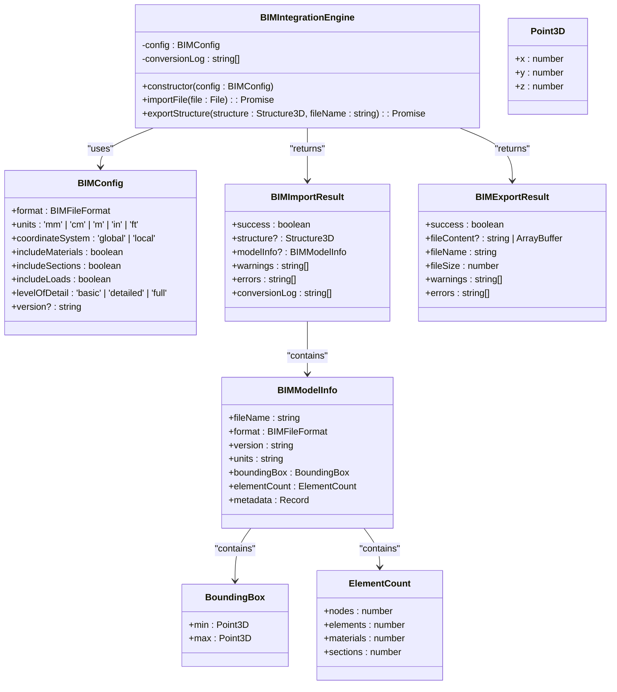
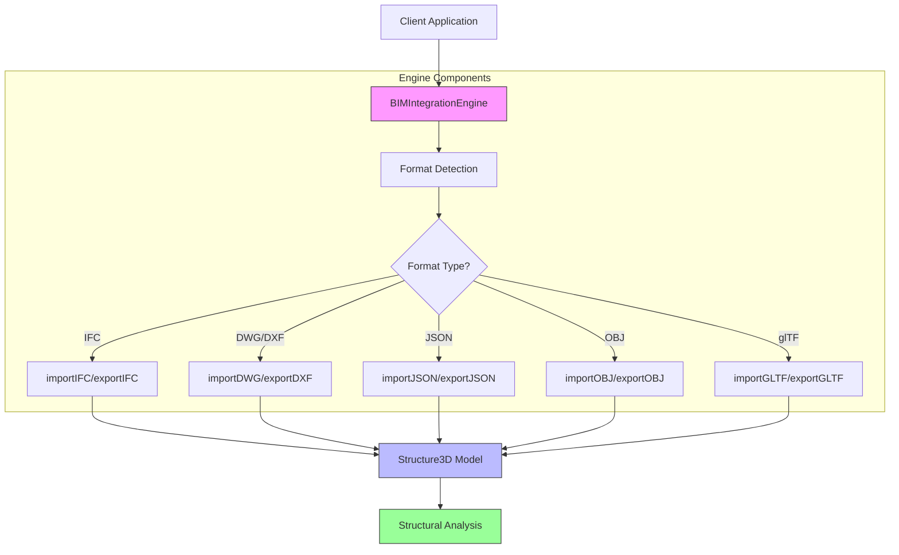
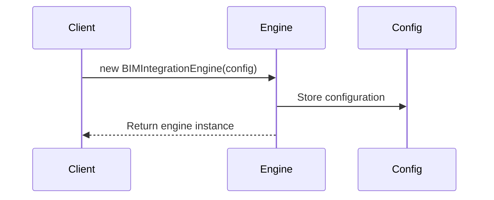
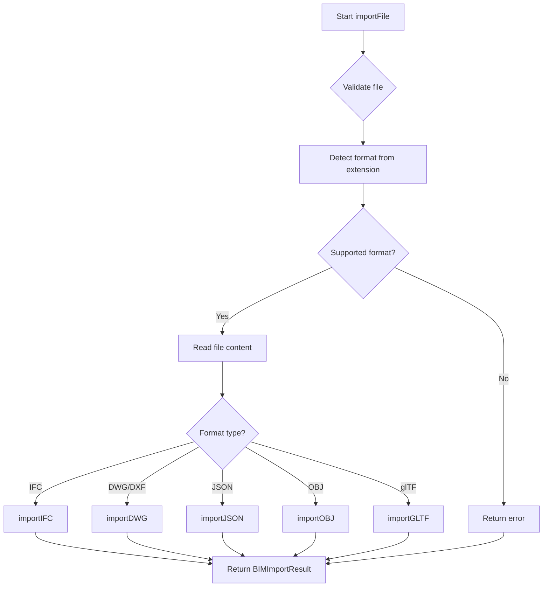

<docs>
# BIM Integration Engine

<cite>
**Referenced Files in This Document**  
- [BIMIntegrationEngine.ts](file://src\structural-analysis\bim\BIMIntegrationEngine.ts) - *Updated in recent commit*
- [structural.ts](file://src\types\structural.ts) - *Structure3D model definition*
</cite>

## Update Summary
**Changes Made**   
- Updated documentation to reflect the latest implementation of the BIMIntegrationEngine class
- Added detailed information about constructor with BIMConfig parameter
- Enhanced documentation for the importFile method and BIMImportResult structure
- Documented supported formats, units conversion, and layer mapping rules
- Added examples for different BIM format configurations
- Improved accuracy of file import workflow description
- Updated error handling and logging sections

## Table of Contents
1. [Introduction](#introduction)
2. [Core Components](#core-components)
3. [Architecture Overview](#architecture-overview)
4. [Detailed Component Analysis](#detailed-component-analysis)
5. [Configuration and Usage](#configuration-and-usage)
6. [Import Workflow](#import-workflow)
7. [Supported Formats](#supported-formats)
8. [Error Handling and Logging](#error-handling-and-logging)
9. [Examples](#examples)
10. [Conclusion](#conclusion)

## Introduction

The BIM Integration Engine provides comprehensive import and export capabilities for Building Information Modeling (BIM) and Computer-Aided Design (CAD) formats within the structural analysis system. This engine serves as a bridge between professional architectural/engineering formats and the structural analysis domain, enabling seamless data exchange between different software ecosystems.

The primary purpose of this engine is to convert BIM/CAD data into a standardized `Structure3D` model that can be used for structural analysis, while preserving critical information about geometry, materials, sections, and structural relationships. The engine supports bidirectional conversion, allowing both import of external BIM data and export of analysis results back to industry-standard formats.

**Section sources**
- [BIMIntegrationEngine.ts](file://src\structural-analysis\bim\BIMIntegrationEngine.ts#L1-L100)

## Core Components

The BIM Integration Engine consists of several key components that work together to provide robust file conversion capabilities. At its core is the `BIMIntegrationEngine` class, which orchestrates the import and export processes based on configuration parameters.

The engine relies on several important interfaces that define the structure of data being processed:
- `BIMConfig`: Configuration parameters for the engine
- `BIMImportResult`: Structure of import operation results
- `BIMExportResult`: Structure of export operation results
- `Structure3D`: The target format for imported structural models

These components work together to ensure consistent data handling across different file formats and use cases.



**Diagram sources**
- [BIMIntegrationEngine.ts](file://src\structural-analysis\bim\BIMIntegrationEngine.ts#L16-L71)

**Section sources**
- [BIMIntegrationEngine.ts](file://src\structural-analysis\bim\BIMIntegrationEngine.ts#L88-L1001)

## Architecture Overview

The BIM Integration Engine follows a modular architecture that separates concerns between format detection, file reading, format-specific processing, and result generation. This design allows for easy extension to support additional formats in the future.

The engine operates on a plugin-like pattern where each supported format has its own import and export methods. When a file is processed, the engine first detects the format based on the file extension, then delegates to the appropriate handler method. This approach ensures that format-specific logic is encapsulated and maintainable.



**Diagram sources**
- [BIMIntegrationEngine.ts](file://src\structural-analysis\bim\BIMIntegrationEngine.ts#L150-L200)

## Detailed Component Analysis

### BIMIntegrationEngine Class

The `BIMIntegrationEngine` class is the main entry point for BIM/CAD file operations. It encapsulates all the logic for importing and exporting structural models in various formats.

#### Constructor and Configuration

The engine is initialized with a `BIMConfig` object that specifies how the conversion should be performed. This configuration includes parameters such as the target format, units system, coordinate system, and level of detail to include in the conversion.



**Section sources**
- [BIMIntegrationEngine.ts](file://src\structural-analysis\bim\BIMIntegrationEngine.ts#L88-L94)

#### Import File Method

The `importFile` method is the primary interface for importing BIM/CAD files into the structural analysis system. It handles the complete workflow from file reading to format-specific processing and result generation.



**Section sources**
- [BIMIntegrationEngine.ts](file://src\structural-analysis\bim\BIMIntegrationEngine.ts#L100-L150)

### Structure3D Data Model

The `Structure3D` interface defines the standardized format for structural models within the system. This model contains all the necessary information for structural analysis, including nodes, elements, loads, materials, and sections.

```mermaid
classDiagram
class Structure3D {
+nodes : Node[]
+elements : Element[]
+loads? : Load[]
+materials? : Material[]
+sections? : Section[]
}
class Node {
+id : string | number
+x : number
+y : number
+z : number
+type? : 'fixed' | 'pinned' | 'free' | 'roller'
+label? : string
+supports? : SupportConditions
}
class SupportConditions {
+ux? : boolean
+uy? : boolean
+uz? : boolean
+rx? : boolean
+ry? : boolean
+rz? : boolean
}
class Element {
+id : string | number
+type : 'beam' | 'column' | 'brace' | 'slab' | 'wall' | 'truss'
+nodes : [string | number, string | number]
+material : Material
+section : Section
+rotation? : number
+release? : ReleaseConditions
+stress? : number
+label? : string
}
class ReleaseConditions {
+start : SupportConditions
+end : SupportConditions
}
class Material {
+id : string
+name : string
+type : 'concrete' | 'steel' | 'timber' | 'other'
+density : number
+elasticModulus : number
+poissonsRatio? : number
+yieldStrength? : number
+ultimateStrength? : number
+color? : string
}
class Section {
+id : string
+name : string
+type : 'rectangular' | 'circular' | 'i-section' | 'h-section' | 'other'
+width : number
+height : number
+area? : number
+momentOfInertiaY? : number
+momentOfInertiaZ? : number
+torsionalConstant? : number
+color? : string
}
class Load {
+id : string
+type : 'point' | 'distributed' | 'moment'
+nodeId? : string | number
+elementId? : string | number
+direction : 'x' | 'y' | 'z' | 'global'
+magnitude : number
+position? : number
}
Structure3D --> Node