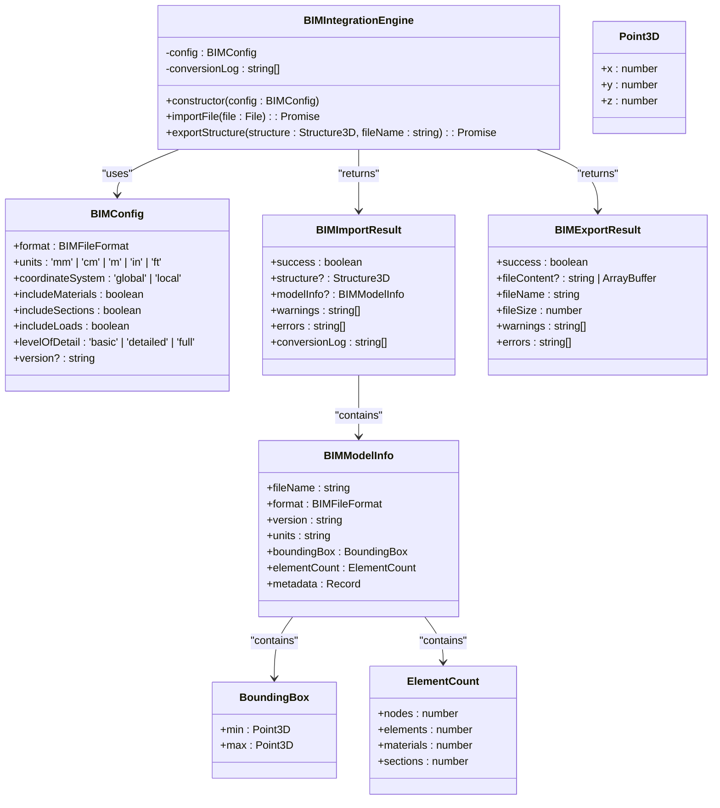
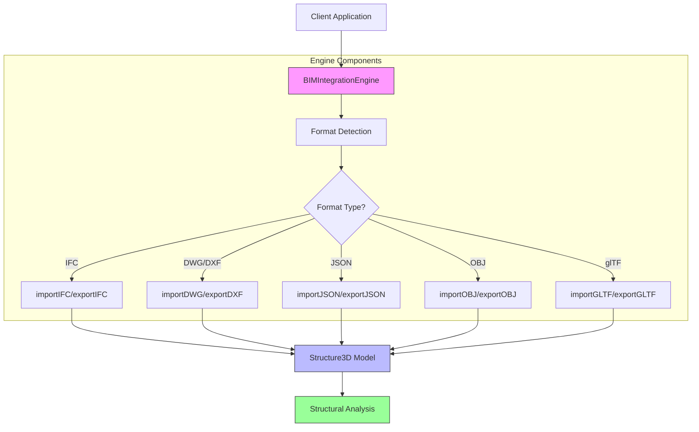
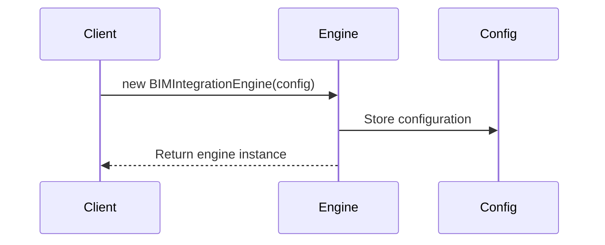
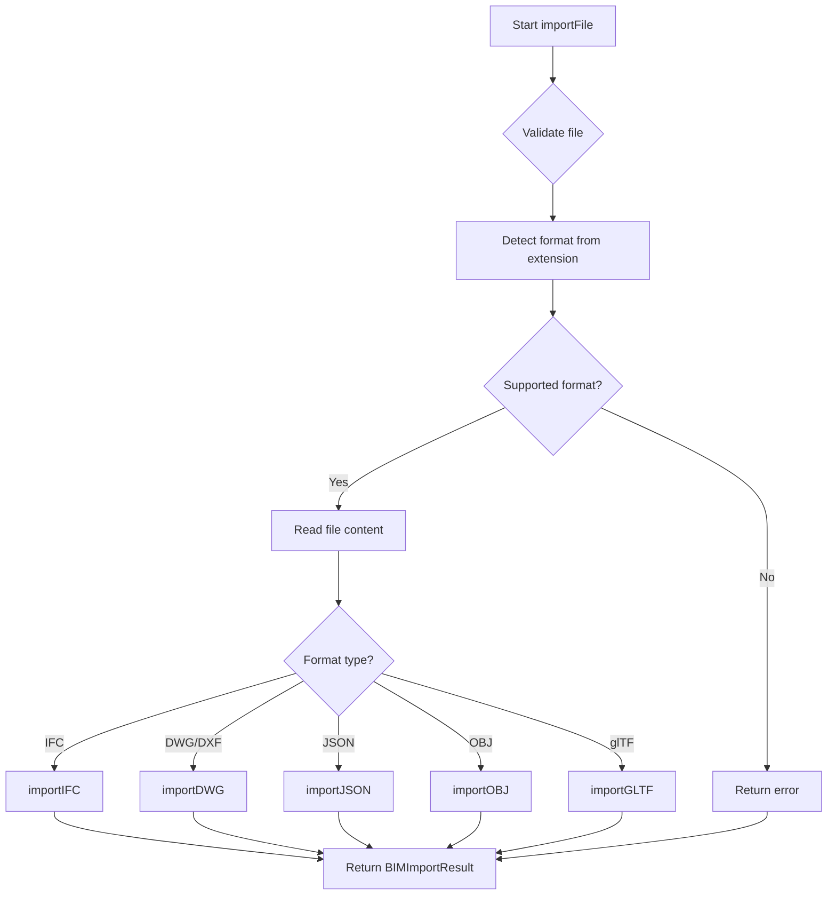
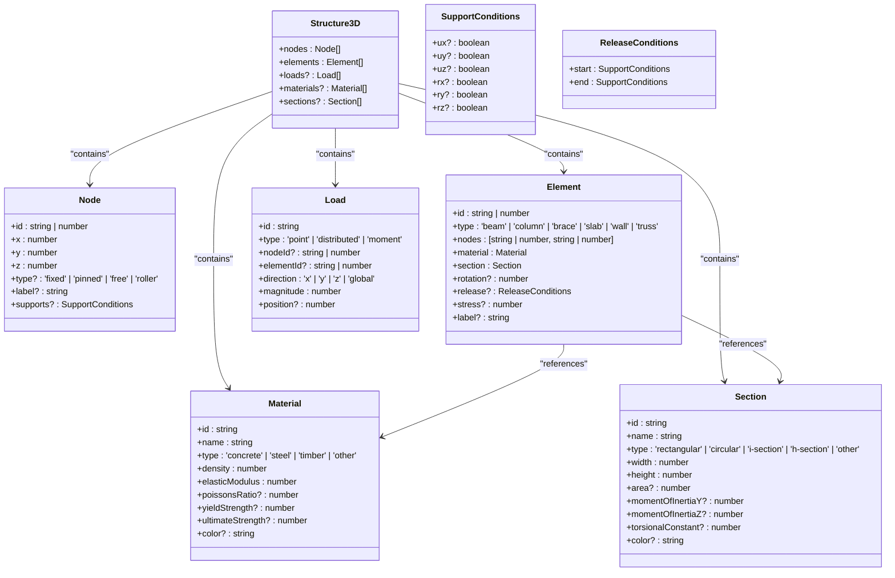
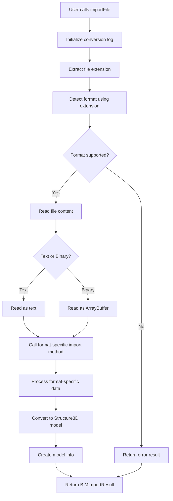

# BIM Integration Engine

<cite>
**Referenced Files in This Document**  
- [BIMIntegrationEngine.ts](file://src/structural-analysis/bim/BIMIntegrationEngine.ts)
- [structural.ts](file://src/types/structural.ts)
</cite>

## Table of Contents
1. [Introduction](#introduction)
2. [Core Components](#core-components)
3. [Architecture Overview](#architecture-overview)
4. [Detailed Component Analysis](#detailed-component-analysis)
5. [Configuration and Usage](#configuration-and-usage)
6. [Import Workflow](#import-workflow)
7. [Supported Formats](#supported-formats)
8. [Error Handling and Logging](#error-handling-and-logging)
9. [Examples](#examples)
10. [Conclusion](#conclusion)

## Introduction

The BIM Integration Engine provides comprehensive import and export capabilities for Building Information Modeling (BIM) and Computer-Aided Design (CAD) formats within the structural analysis system. This engine serves as a bridge between professional architectural/engineering formats and the structural analysis domain, enabling seamless data exchange between different software ecosystems.

The primary purpose of this engine is to convert BIM/CAD data into a standardized `Structure3D` model that can be used for structural analysis, while preserving critical information about geometry, materials, sections, and structural relationships. The engine supports bidirectional conversion, allowing both import of external BIM data and export of analysis results back to industry-standard formats.

**Section sources**
- [BIMIntegrationEngine.ts](file://src/structural-analysis/bim/BIMIntegrationEngine.ts#L1-L100)

## Core Components

The BIM Integration Engine consists of several key components that work together to provide robust file conversion capabilities. At its core is the `BIMIntegrationEngine` class, which orchestrates the import and export processes based on configuration parameters.

The engine relies on several important interfaces that define the structure of data being processed:
- `BIMConfig`: Configuration parameters for the engine
- `BIMImportResult`: Structure of import operation results
- `BIMExportResult`: Structure of export operation results
- `Structure3D`: The target format for imported structural models

These components work together to ensure consistent data handling across different file formats and use cases.



**Diagram sources**
- [BIMIntegrationEngine.ts](file://src/structural-analysis/bim/BIMIntegrationEngine.ts#L16-L71)

**Section sources**
- [BIMIntegrationEngine.ts](file://src/structural-analysis/bim/BIMIntegrationEngine.ts#L88-L1001)

## Architecture Overview

The BIM Integration Engine follows a modular architecture that separates concerns between format detection, file reading, format-specific processing, and result generation. This design allows for easy extension to support additional formats in the future.

The engine operates on a plugin-like pattern where each supported format has its own import and export methods. When a file is processed, the engine first detects the format based on the file extension, then delegates to the appropriate handler method. This approach ensures that format-specific logic is encapsulated and maintainable.



**Diagram sources**
- [BIMIntegrationEngine.ts](file://src/structural-analysis/bim/BIMIntegrationEngine.ts#L150-L200)

## Detailed Component Analysis

### BIMIntegrationEngine Class

The `BIMIntegrationEngine` class is the main entry point for BIM/CAD file operations. It encapsulates all the logic for importing and exporting structural models in various formats.

#### Constructor and Configuration

The engine is initialized with a `BIMConfig` object that specifies how the conversion should be performed. This configuration includes parameters such as the target format, units system, coordinate system, and level of detail to include in the conversion.



**Diagram sources**
- [BIMIntegrationEngine.ts](file://src/structural-analysis/bim/BIMIntegrationEngine.ts#L88-L92)

#### Import File Method

The `importFile` method is the primary interface for importing BIM/CAD files into the structural analysis system. It handles the complete workflow from file reading to format-specific processing and result generation.



**Diagram sources**
- [BIMIntegrationEngine.ts](file://src/structural-analysis/bim/BIMIntegrationEngine.ts#L100-L150)

### Structure3D Data Model

The `Structure3D` interface defines the standardized format for structural models within the system. This model contains all the necessary information for structural analysis, including nodes, elements, loads, materials, and sections.



**Diagram sources**
- [structural.ts](file://src/types/structural.ts#L92-L98)

**Section sources**
- [structural.ts](file://src/types/structural.ts#L6-L129)

## Configuration and Usage

### BIMConfig Interface

The `BIMConfig` interface defines the configuration options for the BIM Integration Engine. These settings control how files are imported and exported, allowing users to customize the behavior based on their specific requirements.

| Property | Type | Description | Default |
|---------|------|-------------|---------|
| format | BIMFileFormat | Target format for conversion | - |
| units | 'mm' \| 'cm' \| 'm' \| 'in' \| 'ft' | Units system to use | - |
| coordinateSystem | 'global' \| 'local' | Coordinate system reference | - |
| includeMaterials | boolean | Whether to include material data | true |
| includeSections | boolean | Whether to include section data | true |
| includeLoads | boolean | Whether to include load data | true |
| levelOfDetail | 'basic' \| 'detailed' \| 'full' | Level of detail in conversion | 'detailed' |
| version | string | Format version (if applicable) | - |

**Section sources**
- [BIMIntegrationEngine.ts](file://src/structural-analysis/bim/BIMIntegrationEngine.ts#L16-L25)

### BIMImportResult Structure

The `BIMImportResult` interface defines the structure of results returned by the import operations. This standardized format provides consistent feedback regardless of the source format.

| Property | Type | Description |
|---------|------|-------------|
| success | boolean | Whether the import was successful |
| structure | Structure3D | The imported structural model (if successful) |
| modelInfo | BIMModelInfo | Information about the imported model |
| warnings | string[] | Non-critical issues encountered |
| errors | string[] | Critical errors that prevented success |
| conversionLog | string[] | Detailed log of the conversion process |

**Section sources**
- [BIMIntegrationEngine.ts](file://src/structural-analysis/bim/BIMIntegrationEngine.ts#L64-L71)

## Import Workflow

The import workflow follows a systematic process to convert BIM/CAD files into structural analysis models. This process ensures data integrity and provides meaningful feedback when issues occur.



**Diagram sources**
- [BIMIntegrationEngine.ts](file://src/structural-analysis/bim/BIMIntegrationEngine.ts#L100-L200)

## Supported Formats

The BIM Integration Engine supports multiple industry-standard formats for both import and export operations.

### Format Detection

The engine uses file extensions to detect the format of input files. The following mappings are supported:

| Extension | Format | Type |
|----------|--------|------|
| ifc | IFC (Industry Foundation Classes) | Text |
| dwg | AutoCAD Drawing | Binary |
| dxf | AutoCAD Drawing Exchange Format | Text |
| step, stp | STEP (Standard for the Exchange of Product Data) | Text |
| iges, igs | IGES (Initial Graphics Exchange Specification) | Text |
| obj | Wavefront OBJ | Text |
| gltf, glb | glTF (GL Transmission Format) | Text/Binary |
| json | JSON | Text |

**Section sources**
- [BIMIntegrationEngine.ts](file://src/structural-analysis/bim/BIMIntegrationEngine.ts#L10-L14)

### Format-Specific Processing

Each supported format has dedicated import and export methods that handle the specific requirements and characteristics of that format.

#### IFC Processing

For IFC files, the engine performs the following steps:
1. Parse the IFC header to extract version and schema information
2. Parse IFC entities from the file content
3. Convert IFC entities to the internal Structure3D model
4. Generate model information including bounding box and element counts

#### DWG/DXF Processing

For DWG and DXF files, the engine provides basic import capabilities:
1. Parse the CAD data (simplified implementation)
2. Create nodes from CAD points
3. Create elements from CAD lines
4. Apply basic structural properties

Note: Full DWG/DXF parsing requires additional libraries and is currently in basic mode.

#### JSON Processing

For JSON files, the engine:
1. Parses the JSON content
2. Validates the structure against the Structure3D interface
3. Returns the parsed model directly

This format is used for native structure files that are already in the correct format.

## Error Handling and Logging

The BIM Integration Engine includes comprehensive error handling and logging capabilities to ensure reliable operation and provide useful feedback.

### Error Handling Strategy

The engine follows a defensive programming approach, validating inputs and handling exceptions gracefully. All operations are wrapped in try-catch blocks to prevent unhandled exceptions from crashing the application.

When an error occurs, the engine returns a `BIMImportResult` or `BIMExportResult` with:
- `success: false`
- Appropriate error messages in the `errors` array
- Any warnings in the `warnings` array
- The complete conversion log for debugging

### Logging System

The engine maintains a detailed conversion log that records key events during the import/export process. Each log entry includes a timestamp and descriptive message.

The log is stored in the `conversionLog` property of the engine instance and is included in the result object. This allows users to debug issues by examining the complete sequence of operations that were attempted.

```mermaid
flowchart TD
A[Operation starts] --> B[Call log() method]
B --> C[Add timestamped message]
C --> D[Store in conversionLog]
D --> E[Display in console]
E --> F[Continue operation]
```

**Section sources**
- [BIMIntegrationEngine.ts](file://src/structural-analysis/bim/BIMIntegrationEngine.ts#L350-L360)

## Examples

### Basic Usage

```typescript
// Create configuration for IFC import
const config: BIMConfig = {
  format: 'ifc',
  units: 'm',
  coordinateSystem: 'global',
  includeMaterials: true,
  includeSections: true,
  includeLoads: true,
  levelOfDetail: 'detailed'
};

// Initialize the engine
const engine = new BIMIntegrationEngine(config);

// Import a file
const fileInput = document.getElementById('fileInput') as HTMLInputElement;
const file = fileInput.files[0];

const result = await engine.importFile(file);

if (result.success) {
  console.log('Import successful');
  console.log('Model info:', result.modelInfo);
  // Use result.structure for analysis
} else {
  console.error('Import failed:', result.errors);
  console.log('Warnings:', result.warnings);
  console.log('Conversion log:', result.conversionLog);
}
```

### Handling Different Formats

```typescript
// Configuration for DWG import
const dwgConfig: BIMConfig = {
  format: 'dwg',
  units: 'mm',
  coordinateSystem: 'local',
  includeMaterials: false,
  includeSections: false,
  includeLoads: false,
  levelOfDetail: 'basic'
};

const dwgEngine = new BIMIntegrationEngine(dwgConfig);

// The engine automatically detects format from file extension
const dwgFile = /* DWG file */;
const dwgResult = await dwgEngine.importFile(dwgFile);

// Similarly for other formats
const objConfig: BIMConfig = {
  format: 'obj',
  units: 'm',
  coordinateSystem: 'global',
  levelOfDetail: 'basic'
};

const objEngine = new BIMIntegrationEngine(objConfig);
const objFile = /* OBJ file */;
const objResult = await objEngine.importFile(objFile);
```

### Exporting Results

```typescript
// After structural analysis, export results back to BIM format
const exportConfig: BIMConfig = {
  format: 'ifc',
  units: 'm',
  coordinateSystem: 'global',
  includeMaterials: true,
  includeSections: true,
  includeLoads: true,
  levelOfDetail: 'detailed'
};

const exportEngine = new BIMIntegrationEngine(exportConfig);

// Export the analyzed structure
const exportResult = await exportEngine.exportStructure(
  analyzedStructure, 
  'analysis_results.ifc'
);

if (exportResult.success) {
  console.log('Export successful');
  console.log('File size:', exportResult.fileSize);
  // exportResult.fileContent contains the IFC data
} else {
  console.error('Export failed:', exportResult.errors);
}
```

## Conclusion

The BIM Integration Engine provides a robust solution for importing and exporting structural models in various BIM and CAD formats. By standardizing on the `Structure3D` model, it enables seamless integration between different software systems in the architectural and engineering workflow.

Key features of the engine include:
- Support for multiple industry-standard formats
- Configurable conversion parameters
- Comprehensive error handling and logging
- Bidirectional import/export capabilities
- Standardized result structures

The engine's modular design makes it easy to extend with additional formats in the future, ensuring it can adapt to evolving industry standards and user requirements.