# Cloud Service Engine

<cite>
**Referenced Files in This Document**   
- [CloudServiceEngine.ts](file://src/cloud/CloudServiceEngine.ts)
- [SmartIntegrationDashboard.tsx](file://src/components/SmartIntegrationDashboard.tsx) - *Updated in recent commit*
- [webSocketService.ts](file://src/services/webSocketService.ts) - *Added in recent commit*
</cite>

## Table of Contents
1. [Introduction](#introduction)
2. [Configuration and Initialization](#configuration-and-initialization)
3. [Authentication and User Management](#authentication-and-user-management)
4. [Project Management](#project-management)
5. [File Storage and Management](#file-storage-and-management)
6. [Real-time Collaboration](#real-time-collaboration)
7. [Data Serialization and Security](#data-serialization-and-security)
8. [Event System and Notifications](#event-system-and-notifications)
9. [Offline Support and Network Resilience](#offline-support-and-network-resilience)
10. [Utility Functions and Helpers](#utility-functions-and-helpers)
11. [Security Considerations](#security-considerations)

## Introduction

The CloudServiceEngine class provides comprehensive cloud integration capabilities for structural analysis applications, enabling multi-user collaboration, secure data storage, and real-time synchronization. This API documentation details the complete functionality of the CloudServiceEngine, including configuration options, authentication mechanisms, project management features, and collaboration tools designed specifically for structural engineering workflows.

**Section sources**
- [CloudServiceEngine.ts](file://src/cloud/CloudServiceEngine.ts#L136-L725)

## Configuration and Initialization

### Constructor Parameters

The CloudServiceEngine is configured through a configuration object that specifies cloud service endpoints and feature flags. The constructor accepts partial configuration that extends default values.

```typescript
constructor(config: Partial<CloudConfig> = {})
```

**Configuration Options:**

| Parameter | Type | Default | Description |
|---------|------|---------|-------------|
| `apiEndpoint` | string | `https://api.structuralapp.com` | Base URL for REST API endpoints |
| `websocketEndpoint` | string | `wss://ws.structuralapp.com` | WebSocket URL for real-time collaboration |
| `storageEndpoint` | string | `https://storage.structuralapp.com` | Base URL for file storage operations |
| `authEnabled` | boolean | `true` | Enables user authentication and authorization |
| `encryptionEnabled` | boolean | `true` | Enables client-side data encryption for sensitive structural data |
| `maxFileSize` | number | `100` | Maximum file size limit in MB |
| `collaborationEnabled` | boolean | `true` | Enables real-time collaboration features |
| `realtimeSync` | boolean | `true` | Enables real-time synchronization of changes |
| `offlineSupport` | boolean | `true` | Enables offline operation and automatic sync when online |

### Initialization Process

The `initialize()` method prepares the cloud service by establishing network connections and synchronizing offline changes.

```typescript
async initialize(): Promise<boolean>
```

This method performs the following operations:
1. Checks network connectivity to the API endpoint
2. Initializes WebSocket connection for real-time collaboration (if enabled)
3. Synchronizes any offline changes with the cloud (if offline support is enabled)

**Section sources**
- [CloudServiceEngine.ts](file://src/cloud/CloudServiceEngine.ts#L164-L184)
- [CloudServiceEngine.ts](file://src/cloud/CloudServiceEngine.ts#L8-L18)

## Authentication and User Management

### User Authentication

The CloudServiceEngine provides secure user authentication through email and password credentials.

```typescript
async authenticate(credentials: { email: string; password: string }): Promise<CloudUser | null>
```

Authentication process:
- Sends credentials to the authentication endpoint
- Stores authentication token in localStorage upon successful login
- Updates user status to "online" in the system
- Returns user information including permissions and role

### User Sign Out

```typescript
async signOut(): Promise<void>
```

The signOut method:
- Updates user status to "offline"
- Removes authentication token from localStorage
- Closes WebSocket connection
- Clears current user session

### User Information Access

```typescript
getCurrentUser(): CloudUser | null
isAuthenticated(): boolean
```

These methods provide access to the current user's information and authentication status.

**User Interface:**


**Diagram sources**
- [CloudServiceEngine.ts](file://src/cloud/CloudServiceEngine.ts#L21-L40)

**Section sources**
- [CloudServiceEngine.ts](file://src/cloud/CloudServiceEngine.ts#L189-L208)
- [CloudServiceEngine.ts](file://src/cloud/CloudServiceEngine.ts#L31-L40)

## Project Management

### Project Creation

```typescript
async createProject(
    name: string, 
    structure: Structure3D, 
    metadata: Partial<CloudProjectMetadata> = {}
): Promise<CloudProject | null>
```

Creates a new project with the specified structural model. The method automatically:
- Encrypts the structure data if encryption is enabled
- Sets default metadata values
- Joins the project collaboration room upon creation
- Returns the created project with assigned ID and version

### Project Loading

```typescript
async loadProject(projectId: string): Promise<CloudProject | null>
```

Retrieves a project from the cloud storage and:
- Decrypts the structure data if encryption is enabled
- Automatically joins the project's collaboration room
- Returns the complete project with all metadata and structural data

### Project Saving

```typescript
async saveProject(project: CloudProject): Promise<boolean>
```

Saves project changes to the cloud with automatic version increment. Key features:
- Automatically increments version number
- Broadcasts changes to all collaborators in real-time
- Handles offline scenarios by caching changes locally
- Returns true even for successful offline saves

### Project Listing

```typescript
async listProjects(page: number = 1, limit: number = 20): Promise<CloudListResponse<CloudProject>>
```

Retrieves a paginated list of user projects with metadata. The response includes:
- Total count of projects
- Current page and limit
- HasMore flag indicating additional pages
- Timestamp of the response

### Project Sharing

```typescript
async shareProject(
    projectId: string, 
    userEmail: string, 
    role: CloudUser['role'] = 'viewer'
): Promise<boolean>
```

Shares a project with another user by email address, assigning the specified role. The method:
- Notifies all collaborators of the new user
- Respects permission hierarchies based on user roles
- Supports viewer, editor, admin, and owner roles

**Project Data Model:**


**Diagram sources**
- [CloudServiceEngine.ts](file://src/cloud/CloudServiceEngine.ts#L43-L56)
- [CloudServiceEngine.ts](file://src/cloud/CloudServiceEngine.ts#L58-L67)
- [structural.ts](file://src/types/structural.ts#L92-L98)

**Section sources**
- [CloudServiceEngine.ts](file://src/cloud/CloudServiceEngine.ts#L233-L269)
- [CloudServiceEngine.ts](file://src/cloud/CloudServiceEngine.ts#L274-L299)
- [CloudServiceEngine.ts](file://src/cloud/CloudServiceEngine.ts#L304-L342)
- [CloudServiceEngine.ts](file://src/cloud/CloudServiceEngine.ts#L347-L363)
- [CloudServiceEngine.ts](file://src/cloud/CloudServiceEngine.ts#L368-L397)

## File Storage and Management

### File Upload

```typescript
async uploadFile(
    file: File, 
    projectId?: string,
    tags: string[] = []
): Promise<CloudFile | null>
```

Uploads files to cloud storage with the following features:
- Validates file size against configured maximum
- Associates files with specific projects (optional)
- Supports tagging for organization and search
- Returns file metadata including ID and download URL

### File Download

```typescript
async downloadFile(fileId: string): Promise<Blob | null>
```

Downloads a file from cloud storage as a Blob object, which can be used for:
- Displaying images or documents
- Saving files to the user's device
- Processing file content in the application

**File Interface:**


**Diagram sources**
- [CloudServiceEngine.ts](file://src/cloud/CloudServiceEngine.ts#L103-L115)

**Section sources**
- [CloudServiceEngine.ts](file://src/cloud/CloudServiceEngine.ts#L455-L488)
- [CloudServiceEngine.ts](file://src/cloud/CloudServiceEngine.ts#L493-L508)

## Real-time Collaboration

### Comment System

The CloudServiceEngine supports collaborative commenting on structural models.

```typescript
async addComment(
    projectId: string,
    content: string,
    elementId?: string,
    position?: { x: number; y: number; z: number }
): Promise<ProjectComment | null>
```

Comments can be:
- General project comments
- Element-specific comments tied to structural elements
- Spatial comments with 3D coordinates for precise location referencing

```typescript
async getComments(projectId: string): Promise<ProjectComment[]>
```

Retrieves all comments for a project, including nested replies.

**Comment Data Structure:**

```mermaid
classDiagram
class ProjectComment {
+id : string
+userId : string
+projectId : string
+elementId? : string
+content : string
+position? : { x : number; y : number; z : number }
+timestamp : Date
+replies? : ProjectComment[]
+resolved : boolean
}
ProjectComment --> ProjectComment : "contains replies"
```

**Diagram sources**
- [CloudServiceEngine.ts](file://src/cloud/CloudServiceEngine.ts#L80-L90)

**Section sources**
- [CloudServiceEngine.ts](file://src/cloud/CloudServiceEngine.ts#L402-L437)
- [CloudServiceEngine.ts](file://src/cloud/CloudServiceEngine.ts#L442-L450)

## Data Serialization and Security

### Data Format

All structural data is serialized as JSON using the Structure3D interface, which includes:
- Nodes with coordinate and property information
- Elements connecting nodes with material and section properties
- Loads applied to the structure
- Material and section definitions

### Encryption

The CloudServiceEngine implements client-side encryption for sensitive structural data:

```typescript
private encryptData(data: any): string
private decryptData(encryptedData: string): any
```

**Security Implementation:**
- Data is encrypted before transmission to the cloud
- Encryption occurs client-side, ensuring data privacy
- Simplified base64 encoding is used in the current implementation (production systems should use robust encryption algorithms)
- Structure data is encrypted when `encryptionEnabled` is true in the configuration

### API Communication

All API requests use standard HTTP methods with proper headers:
- JSON content type for structured data
- Bearer token authentication
- Error handling with descriptive messages
- Type-safe responses using CloudResponse and CloudListResponse interfaces


**Diagram sources**
- [CloudServiceEngine.ts](file://src/cloud/CloudServiceEngine.ts#L697-L705)
- [CloudServiceEngine.ts](file://src/cloud/CloudServiceEngine.ts#L118-L131)

**Section sources**
- [CloudServiceEngine.ts](file://src/cloud/CloudServiceEngine.ts#L697-L705)
- [CloudServiceEngine.ts](file://src/cloud/CloudServiceEngine.ts#L118-L131)

## Event System and Notifications

The CloudServiceEngine implements a real-time event system using both WebSockets and browser events.

### WebSocket Communication

```mermaid
sequenceDiagram
participant Client as "Client"
participant WebSocket as "WebSocket"
participant Server as "Server"
Client->>WebSocket : initializeWebSocket()
WebSocket->>Server : Connect to wss : //ws.structuralapp.com
Server-->>WebSocket : Connection established
WebSocket->>Server : Authentication message
Server-->>WebSocket : Authentication confirmed
Server->>WebSocket : sync_update message
WebSocket->>Client : handleWebSocketMessage()
Client->>Client : handleSyncUpdate() → dispatchEvent()
```



**Diagram sources**
- [CloudServiceEngine.ts](file://src/cloud/CloudServiceEngine.ts#L513-L542)

### Browser Events

The engine dispatches custom browser events for UI components to listen to:

```typescript
// Dispatched when sync updates are received
window.dispatchEvent(new CustomEvent('cloudSyncUpdate', { detail: message }));

// Dispatched when users join the project
window.dispatchEvent(new CustomEvent('cloudUserJoined', { detail: message }));

// Dispatched when users leave the project
window.dispatchEvent(new CustomEvent('cloudUserLeft', { detail: message }));

// Dispatched when new comments are added
window.dispatchEvent(new CustomEvent('cloudCommentAdded', { detail: message }));
```

UI components can listen to these events:

```typescript
window.addEventListener('cloudSyncUpdate', (event) => {
    // Handle structure updates
    console.log('Structure updated by', event.detail.userId);
});

window.addEventListener('cloudUserJoined', (event) => {
    // Update user list in UI
    console.log(event.detail.userId, 'joined the project');
});
```

**Section sources**
- [CloudServiceEngine.ts](file://src/cloud/CloudServiceEngine.ts#L513-L542)
- [CloudServiceEngine.ts](file://src/cloud/CloudServiceEngine.ts#L569-L586)
- [CloudServiceEngine.ts](file://src/cloud/CloudServiceEngine.ts#L588-L603)

## Offline Support and Network Resilience

### Network Monitoring

The CloudServiceEngine automatically monitors network connectivity:

```typescript
private initializeNetworkMonitoring(): void
```

- Listens to browser 'online' and 'offline' events
- Updates internal `isOnline` state accordingly
- Triggers synchronization when connection is restored

### Offline Operation

When offline, the engine:
- Caches project changes in memory
- Allows continued editing and commenting
- Automatically synchronizes changes when back online
- Maintains data integrity through version control

### Conflict Resolution

While explicit conflict resolution strategies are not implemented in the current version, the system provides the foundation for:
- Manual conflict resolution through version history
- Merge strategies for concurrent edits
- Overwrite options for authoritative updates

The SyncUpdate interface includes a `conflictResolution` field that can be extended to support various resolution strategies.


**Diagram sources**
- [CloudServiceEngine.ts](file://src/cloud/CloudServiceEngine.ts#L618-L644)

**Section sources**
- [CloudServiceEngine.ts](file://src/cloud/CloudServiceEngine.ts#L618-L644)
- [CloudServiceEngine.ts](file://src/cloud/CloudServiceEngine.ts#L646-L659)

## Utility Functions and Helpers

### Factory Function

```typescript
export function createCloudServiceEngine(config?: Partial<CloudConfig>): CloudServiceEngine
```

A convenience factory function that creates and returns a new CloudServiceEngine instance with optional configuration.

### Cloud Utilities

The CloudUtils object provides several helper functions:

```typescript
export const CloudUtils = {
    generateThumbnail(structure: Structure3D): string,
    calculateFileSize(project: CloudProject): number,
    validateProject(project: Partial<CloudProject>): string[],
    formatFileSize(bytes: number): string
}
```

**Utility Functions:**

| Function | Parameters | Returns | Description |
|---------|------------|---------|-------------|
| `generateThumbnail` | `structure: Structure3D` | `string` (data URL) | Creates a visual thumbnail of the structural model |
| `calculateFileSize` | `project: CloudProject` | `number` (bytes) | Calculates the serialized size of a project |
| `validateProject` | `project: Partial<CloudProject>` | `string[]` (errors) | Validates project data and returns validation errors |
| `formatFileSize` | `bytes: number` | `string` | Formats byte count into human-readable size (KB, MB, GB) |

**Section sources**
- [CloudServiceEngine.ts](file://src/cloud/CloudServiceEngine.ts#L730-L732)
- [CloudServiceEngine.ts](file://src/cloud/CloudServiceEngine.ts#L737-L794)

## Security Considerations

### Data Protection

The CloudServiceEngine implements multiple security measures for protecting sensitive structural data:

1. **Client-Side Encryption**: Structural models are encrypted before transmission when `encryptionEnabled` is true
2. **Authentication**: Bearer token authentication ensures only authorized users can access data
3. **Secure Endpoints**: HTTPS/WSS protocols for all communications
4. **Permission System**: Role-based access control with granular permissions

### Sensitive Data Handling

For structural engineering applications, special consideration should be given to:
- **Intellectual Property**: Structural designs represent valuable intellectual property that must be protected
- **Compliance**: Adherence to industry regulations and standards for data protection
- **Access Control**: Strict control over who can view, edit, and share structural models

### Recommended Security Enhancements

While the current implementation provides basic security, production deployments should consider:
- Implementing robust encryption algorithms (AES-256) instead of base64 encoding
- Adding two-factor authentication
- Implementing audit logging for sensitive operations
- Adding data retention and deletion policies
- Implementing rate limiting to prevent abuse

**Section sources**
- [CloudServiceEngine.ts](file://src/cloud/CloudServiceEngine.ts#L697-L705)
- [CloudServiceEngine.ts](file://src/cloud/CloudServiceEngine.ts#L31-L40)