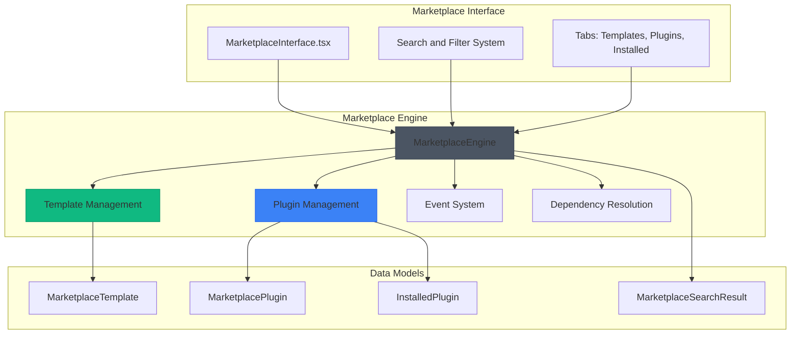
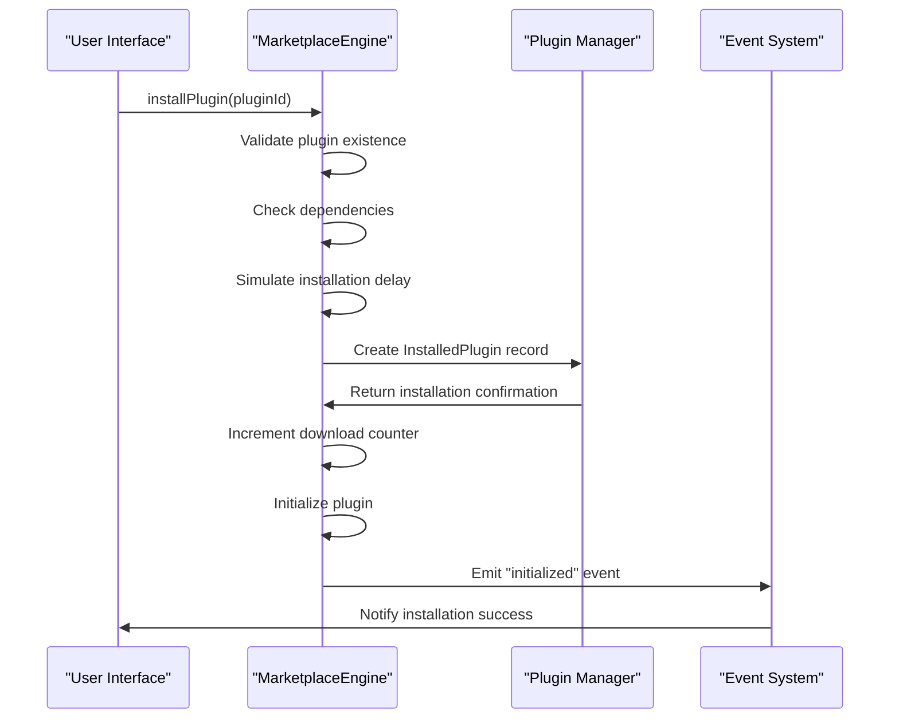
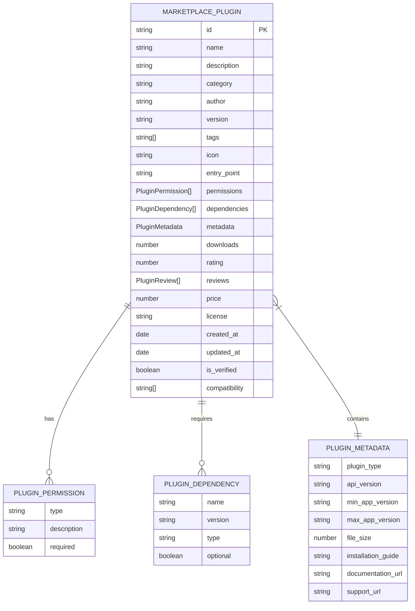
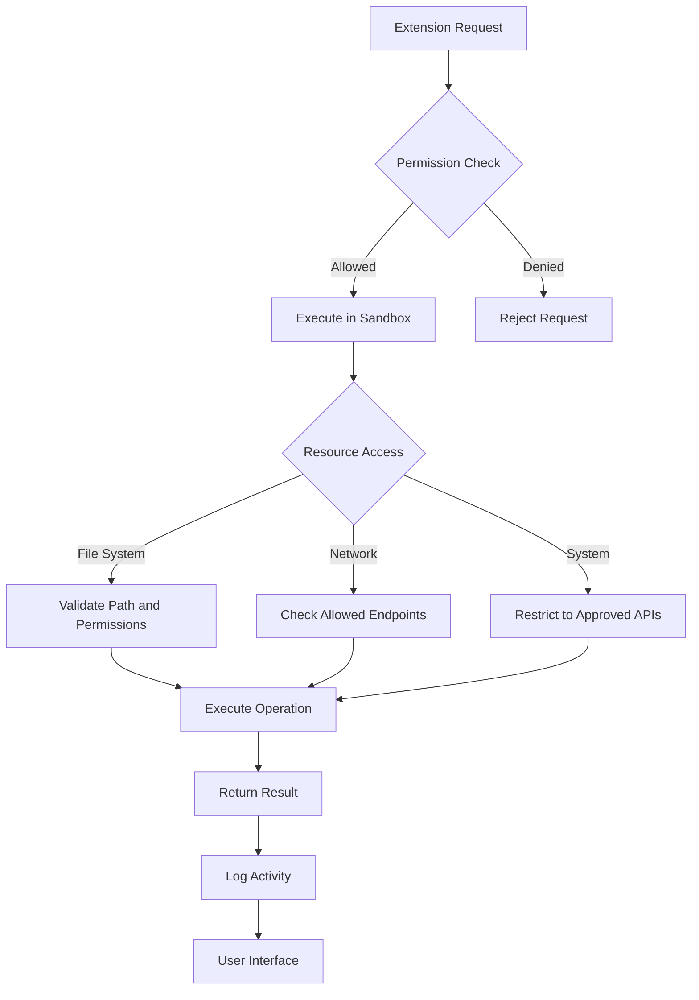
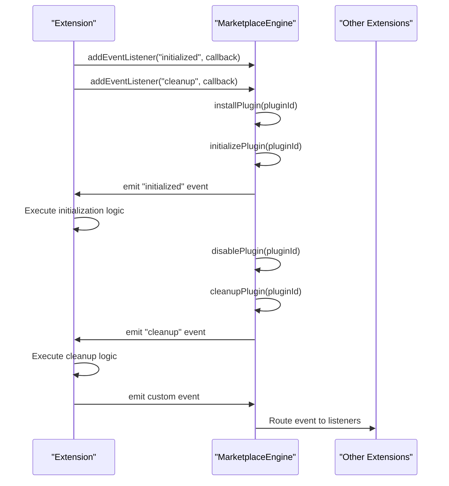

# Marketplace Engine

<cite>
**Referenced Files in This Document**   
- [MarketplaceEngine.ts](file://src/marketplace/MarketplaceEngine.ts)
- [MarketplaceInterface.tsx](file://src/marketplace/MarketplaceInterface.tsx)
- [MarketplaceEngine.test.ts](file://src/marketplace/MarketplaceEngine.test.ts)
- [structural.ts](file://src/types/structural.ts)
</cite>

## Table of Contents
1. [Introduction](#introduction)
2. [Core Components](#core-components)
3. [Architecture Overview](#architecture-overview)
4. [Extension Management](#extension-management)
5. [Extension Manifest Format](#extension-manifest-format)
6. [Sandboxing and Security](#sandboxing-and-security)
7. [Plugin Lifecycle Events](#plugin-lifecycle-events)
8. [Extension Development Examples](#extension-development-examples)
9. [Extension Discovery and Dependency Resolution](#extension-discovery-and-dependency-resolution)
10. [Security Considerations](#security-considerations)

## Introduction
The Marketplace Engine provides a comprehensive system for managing extensions and templates within the structural analysis application. It enables users to discover, install, and manage plugins that extend the core functionality of the application. The system supports both templates for structural designs and plugins for additional features, with robust mechanisms for version compatibility, dependency management, and secure execution.

## Core Components

The Marketplace Engine consists of several core components that work together to provide extension management capabilities. The system is built around the MarketplaceEngine class which handles all operations related to template and plugin management. Key interfaces include MarketplaceTemplate for structural design templates and MarketplacePlugin for functional extensions.

```mermaid
classDiagram
class MarketplaceEngine {
-templates : Map~string, MarketplaceTemplate~
-plugins : Map~string, MarketplacePlugin~
-installedPlugins : Map~string, InstalledPlugin~
-pluginEventListeners : Map~string, Function[]~
+searchTemplates(query, filters, page, pageSize) : Promise~MarketplaceSearchResult~MarketplaceTemplate~~
+getTemplate(templateId) : Promise~MarketplaceTemplate | null~
+downloadTemplate(templateId) : Promise~Structure3D | null~
+uploadTemplate(template) : Promise~string~
+searchPlugins(query, filters, page, pageSize) : Promise~MarketplaceSearchResult~MarketplacePlugin~~
+getPlugin(pluginId) : Promise~MarketplacePlugin | null~
+installPlugin(pluginId) : Promise~boolean~
+uninstallPlugin(pluginId) : Promise~boolean~
+enablePlugin(pluginId) : Promise~boolean~
+disablePlugin(pluginId) : Promise~boolean~
+getInstalledPlugins() : InstalledPlugin[]
+getEnabledPlugins() : InstalledPlugin[]
+addEventListener(pluginId, eventType, callback) : void
+removeEventListener(pluginId, eventType, callback) : void
+emitPluginEvent(pluginId, eventType, data) : void
}
class MarketplaceTemplate {
id : string
name : string
description : string
category : TemplateCategory
author : string
version : string
tags : string[]
preview_image : string
structure_data : Structure3D
metadata : TemplateMetadata
downloads : number
rating : number
reviews : TemplateReview[]
price : number
license : TemplateLicense
created_at : Date
updated_at : Date
is_verified : boolean
}
class MarketplacePlugin {
id : string
name : string
description : string
category : PluginCategory
author : string
version : string
tags : string[]
icon : string
entry_point : string
permissions : PluginPermission[]
dependencies : PluginDependency[]
metadata : PluginMetadata
downloads : number
rating : number
reviews : PluginReview[]
price : number
license : PluginLicense
created_at : Date
updated_at : Date
is_verified : boolean
compatibility : string[]
}
class InstalledPlugin {
plugin : MarketplacePlugin
installed_at : Date
is_enabled : boolean
installation_path : string
config : Record~string, any~
}
class MarketplaceSearchResult~T~ {
items : T[]
total_count : number
page : number
page_size : number
filters_applied : MarketplaceSearchFilter
}
class MarketplaceSearchFilter {
category? : TemplateCategory | PluginCategory
tags? : string[]
price_range? : { min : number; max : number }
rating_min? : number
license? : TemplateLicense | PluginLicense
verified_only? : boolean
free_only? : boolean
}
MarketplaceEngine --> MarketplaceTemplate : "manages"
MarketplaceEngine --> MarketplacePlugin : "manages"
MarketplaceEngine --> InstalledPlugin : "tracks"
MarketplaceEngine --> MarketplaceSearchResult : "returns"
MarketplaceEngine --> MarketplaceSearchFilter : "uses"
```

**Diagram sources**
- [MarketplaceEngine.ts](file://src/marketplace/MarketplaceEngine.ts#L169-L666)
- [MarketplaceEngine.ts](file://src/marketplace/MarketplaceEngine.ts#L8-L27)
- [MarketplaceEngine.ts](file://src/marketplace/MarketplaceEngine.ts#L29-L51)
- [MarketplaceEngine.ts](file://src/marketplace/MarketplaceEngine.ts#L152-L158)
- [MarketplaceEngine.ts](file://src/marketplace/MarketplaceEngine.ts#L144-L150)
- [MarketplaceEngine.ts](file://src/marketplace/MarketplaceEngine.ts#L134-L142)

**Section sources**
- [MarketplaceEngine.ts](file://src/marketplace/MarketplaceEngine.ts#L169-L666)
- [MarketplaceEngine.ts](file://src/marketplace/MarketplaceEngine.ts#L8-L27)
- [MarketplaceEngine.ts](file://src/marketplace/MarketplaceEngine.ts#L29-L51)

## Architecture Overview

The Marketplace Engine follows a modular architecture that separates template management from plugin management while providing a unified interface for both. The system uses a combination of in-memory data structures and asynchronous operations to handle extension operations efficiently.



**Diagram sources**
- [MarketplaceEngine.ts](file://src/marketplace/MarketplaceEngine.ts#L169-L666)
- [MarketplaceInterface.tsx](file://src/marketplace/MarketplaceInterface.tsx#L0-L403)

## Extension Management

The Marketplace Engine provides comprehensive methods for managing extensions through the installExtension, uninstallExtension, and getAvailableExtensions operations. These methods handle the complete lifecycle of plugin installation, configuration, and removal.

### Installation Process
The installation process follows a well-defined sequence to ensure proper setup of extensions:



**Diagram sources**
- [MarketplaceEngine.ts](file://src/marketplace/MarketplaceEngine.ts#L316-L363)
- [MarketplaceEngine.ts](file://src/marketplace/MarketplaceEngine.ts#L479-L519)

### Core Extension Methods

The Marketplace Engine provides several key methods for extension management:

**installPlugin**
- Validates plugin existence
- Checks dependency requirements
- Creates installation record
- Initializes the plugin
- Updates download statistics

**uninstallPlugin**
- Validates installed plugin
- Cleans up plugin resources
- Removes from installed plugins collection
- Returns uninstallation status

**getAvailableExtensions**
- Retrieves all available plugins
- Applies filtering criteria
- Returns paginated results
- Includes metadata and ratings

**Section sources**
- [MarketplaceEngine.ts](file://src/marketplace/MarketplaceEngine.ts#L316-L363)
- [MarketplaceEngine.ts](file://src/marketplace/MarketplaceEngine.ts#L360-L404)

## Extension Manifest Format

The extension manifest format defines the structure and metadata required for marketplace extensions. This standardized format ensures consistency across all plugins and templates in the marketplace.

### Required Metadata Structure



**Diagram sources**
- [MarketplaceEngine.ts](file://src/marketplace/MarketplaceEngine.ts#L29-L51)
- [MarketplaceEngine.ts](file://src/marketplace/MarketplaceEngine.ts#L121-L125)
- [MarketplaceEngine.ts](file://src/marketplace/MarketplaceEngine.ts#L127-L132)
- [MarketplaceEngine.ts](file://src/marketplace/MarketplaceEngine.ts#L87-L96)

### API Version Compatibility

The extension manifest includes compatibility information to ensure proper version matching between the core system and extensions:

- **api_version**: Specifies the marketplace API version the plugin is built for
- **min_app_version**: Minimum application version required
- **max_app_version**: Maximum application version supported (optional)
- **compatibility**: Array of specific application versions that are compatible

### Permission Declarations

Extensions must declare their required permissions in the manifest:

- **file_access**: Read or write access to local files
- **network_access**: Ability to make network requests
- **system_access**: Access to system resources
- **user_data**: Access to user-specific data
- **cloud_storage**: Access to cloud storage services

Each permission includes a description and whether it is required for basic functionality.

**Section sources**
- [MarketplaceEngine.ts](file://src/marketplace/MarketplaceEngine.ts#L29-L51)
- [MarketplaceEngine.ts](file://src/marketplace/MarketplaceEngine.ts#L121-L132)
- [MarketplaceEngine.ts](file://src/marketplace/MarketplaceEngine.ts#L87-L96)

## Sandboxing and Security

The Marketplace Engine implements a sandboxing mechanism to ensure secure execution of third-party extensions. While the current implementation simulates these security features, the architecture is designed to support robust isolation.

### Security Architecture



**Diagram sources**
- [MarketplaceEngine.ts](file://src/marketplace/MarketplaceEngine.ts#L121-L125)
- [MarketplaceEngine.ts](file://src/marketplace/MarketplaceEngine.ts#L479-L519)

The sandboxing mechanism would typically include:
- Isolated execution environment
- Permission-based resource access
- Input validation and sanitization
- Output encoding
- Resource usage monitoring
- Time limits for execution

**Section sources**
- [MarketplaceEngine.ts](file://src/marketplace/MarketplaceEngine.ts#L121-L125)

## Plugin Lifecycle Events

The Marketplace Engine provides a comprehensive event system that allows plugins to respond to various lifecycle events and communicate with the core system and other plugins.

### Event System Architecture



**Diagram sources**
- [MarketplaceEngine.ts](file://src/marketplace/MarketplaceEngine.ts#L406-L448)
- [MarketplaceEngine.ts](file://src/marketplace/MarketplaceEngine.ts#L479-L519)

### Available Lifecycle Events

The system supports the following plugin lifecycle events:

- **initialized**: Triggered when a plugin is successfully installed and enabled
- **cleanup**: Triggered when a plugin is disabled or uninstalled
- **enabled**: Triggered when a previously disabled plugin is re-enabled
- **disabled**: Triggered when an enabled plugin is disabled
- **updated**: Triggered when a plugin is updated to a new version

Plugins can register event listeners using the addEventListener method and remove them with removeEventListener. The event system ensures that errors in one plugin's event handler do not affect other plugins or the core system.

**Section sources**
- [MarketplaceEngine.ts](file://src/marketplace/MarketplaceEngine.ts#L406-L448)

## Extension Development Examples

This section provides examples of how to develop and package marketplace extensions, including UI integration points and API access patterns.

###