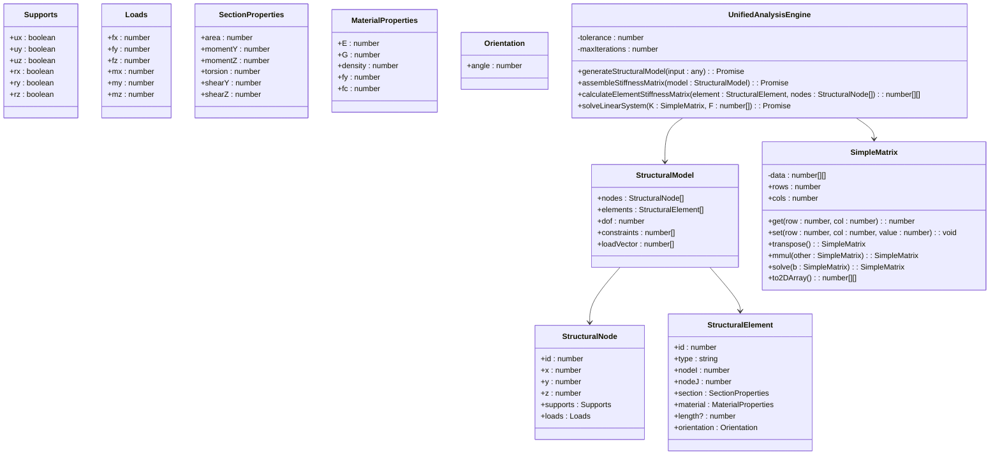
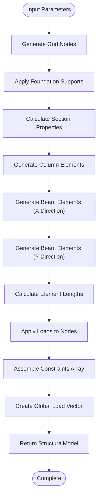
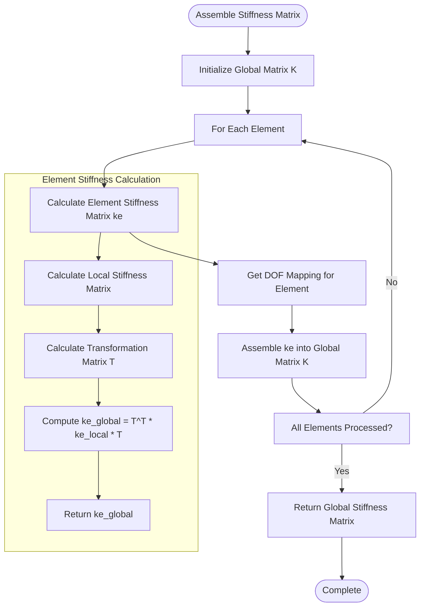
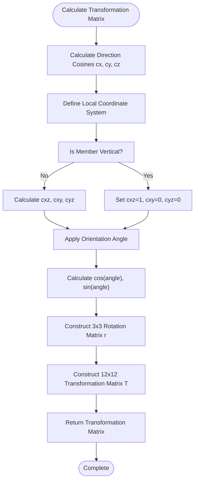

# Unified Analysis Engine

<cite>
**Referenced Files in This Document**   
- [UnifiedAnalysisEngine.ts](file://src/structural-analysis/core/UnifiedAnalysisEngine.ts)
</cite>

## Table of Contents
1. [Introduction](#introduction)
2. [Core Components](#core-components)
3. [Structural Model Generation](#structural-model-generation)
4. [Stiffness Matrix Assembly](#stiffness-matrix-assembly)
5. [Coordinate System and Transformation](#coordinate-system-and-transformation)
6. [Linear System Solution](#linear-system-solution)
7. [Error Handling](#error-handling)
8. [Performance Considerations](#performance-considerations)
9. [Code Examples](#code-examples)

## Introduction
The UnifiedAnalysisEngine class provides a comprehensive structural analysis solution based on the stiffness matrix method, implementing professional engineering standards with high accuracy. This API documentation details the engine's core functionality for performing structural analysis on 3D frame structures, including model generation, stiffness matrix assembly, coordinate transformation, and system solution.

The engine processes input parameters including geometry, materials, loads, and seismic data to generate a complete structural model, assemble the global stiffness matrix using finite element method principles, and solve the resulting linear system to determine structural displacements and responses.

**Section sources**
- [UnifiedAnalysisEngine.ts](file://src/structural-analysis/core/UnifiedAnalysisEngine.ts#L1-L50)

## Core Components

### UnifiedAnalysisEngine Class
The UnifiedAnalysisEngine class serves as the primary interface for structural analysis operations. It encapsulates the complete analysis workflow from model generation to solution processing.

#### Constructor Parameters
The class has no explicit constructor parameters as it uses internal properties:
- `tolerance`: Numerical tolerance for calculations (1e-10)
- `maxIterations`: Maximum iterations for solution convergence (1000)

#### Properties
- `tolerance`: Numerical precision threshold for matrix operations and convergence checks
- `maxIterations`: Maximum number of iterations allowed for iterative solution methods

#### Return Types
- `StructuralModel`: Interface defining the structural model with nodes, elements, degrees of freedom, constraints, and load vector
- `SimpleMatrix`: Custom matrix implementation for numerical calculations with methods for matrix operations

**Diagram sources**
- [UnifiedAnalysisEngine.ts](file://src/structural-analysis/core/UnifiedAnalysisEngine.ts#L7-L175)

**Section sources**
- [UnifiedAnalysisEngine.ts](file://src/structural-analysis/core/UnifiedAnalysisEngine.ts#L177-L634)

## Structural Model Generation

### generateStructuralModel Method
Generates a structural model from input parameters including geometry, materials, loads, and seismic data.

#### Input Parameters
- `geometry`: Object containing structural geometry parameters
  - `jumlahLantai`: Number of floors
  - `gridKolomX`: Number of column bays in X direction
  - `gridKolomY`: Number of column bays in Y direction
  - `bentangX`: Span length in X direction (meters)
  - `bentangY`: Span length in Y direction (meters)
  - `tinggiPerLantai`: Floor height (meters)
- `materials`: Object containing material properties
  - `ecBeton`: Concrete elastic modulus (MPa)
  - `poissonBeton`: Concrete Poisson's ratio
  - `densitasBeton`: Concrete density
  - `fyBaja`: Steel yield strength (MPa)
  - `fcBeton`: Concrete compressive strength (MPa)
- `loads`: Object containing load information
  - `bebanMati`: Dead load (kN/m²)
  - `bebanHidup`: Live load (kN/m²)
- `seismic`: Seismic data (not currently utilized in implementation)

#### Process Flow
1. Generate grid nodes based on floor count and column grid dimensions
2. Apply foundation supports to ground floor nodes (all degrees of freedom constrained)
3. Calculate section properties for columns and beams based on geometry and materials
4. Generate column elements connecting nodes between floors
5. Generate beam elements in both X and Y directions on each floor
6. Calculate element lengths based on node coordinates
7. Apply distributed loads to nodes based on tributary areas
8. Assemble constraints array for constrained degrees of freedom
9. Create global load vector from node loads

**Diagram sources**
- [UnifiedAnalysisEngine.ts](file://src/structural-analysis/core/UnifiedAnalysisEngine.ts#L177-L350)

**Section sources**
- [UnifiedAnalysisEngine.ts](file://src/structural-analysis/core/UnifiedAnalysisEngine.ts#L177-L350)

## Stiffness Matrix Assembly

### assembleStiffnessMatrix Method
Assembles the global stiffness matrix using the finite element method by combining individual element stiffness matrices.

#### Input Parameters
- `model`: StructuralModel object containing nodes, elements, and other model data

#### Process
The method iterates through all structural elements, calculates each element's stiffness matrix in global coordinates, and assembles it into the global stiffness matrix using the element's degree of freedom mapping.

### calculateElementStiffnessMatrix Method
Calculates the element stiffness matrix in global coordinates from local coordinates using transformation matrices.

#### Input Parameters
- `element`: StructuralElement object containing element properties
- `nodes`: Array of StructuralNode objects for node coordinate lookup

#### Element Stiffness Components
The 12x12 element stiffness matrix includes:
- **Axial terms**: Longitudinal stiffness based on EA/L
- **Torsional terms**: Torsional stiffness based on GJ/L
- **Bending Y-axis**: Flexural stiffness about Y-axis with terms for shear deformation
- **Bending Z-axis**: Flexural stiffness about Z-axis with terms for shear deformation

#### Transformation Process
1. Calculate local stiffness matrix in element coordinates
2. Compute transformation matrix from local to global coordinates
3. Apply coordinate transformation: K_global = T^T * K_local * T

**Diagram sources**
- [UnifiedAnalysisEngine.ts](file://src/structural-analysis/core/UnifiedAnalysisEngine.ts#L352-L500)

**Section sources**
- [UnifiedAnalysisEngine.ts](file://src/structural-analysis/core/UnifiedAnalysisEngine.ts#L352-L500)

## Coordinate System and Transformation

### Coordinate System Conventions
The UnifiedAnalysisEngine uses a right-handed Cartesian coordinate system:
- **X-axis**: Primary horizontal direction
- **Y-axis**: Vertical direction (gravity)
- **Z-axis**: Secondary horizontal direction

Each node has six degrees of freedom:
- Translations: ux (X), uy (Y), uz (Z)
- Rotations: rx (X), ry (Y), rz (Z)

### Orientation Angle Handling
The engine supports orientation angles for 3D frame elements to handle members that are not aligned with the global coordinate axes.

#### Transformation Matrix Calculation
The `calculateTransformationMatrix` method computes the transformation from local to global coordinates based on:
- Element direction cosines (cx, cy, cz)
- Member orientation angle (in radians)
- Local coordinate system definition

For vertical members, special handling ensures proper local coordinate system definition when the element is perfectly vertical (D ≈ 0).

**Diagram sources**
- [UnifiedAnalysisEngine.ts](file://src/structural-analysis/core/UnifiedAnalysisEngine.ts#L502-L570)

**Section sources**
- [UnifiedAnalysisEngine.ts](file://src/structural-analysis/core/UnifiedAnalysisEngine.ts#L502-L570)

## Linear System Solution

### solveLinearSystem Method
Solves the linear system K*u = F with boundary conditions to determine nodal displacements.

#### Input Parameters
- `K`: Global stiffness matrix (SimpleMatrix)
- `F`: Global load vector (array of numbers)

#### Solution Process
1. Create augmented matrix for Gaussian elimination
2. Perform forward elimination with partial pivoting
3. Execute back substitution to find solution
4. Return displacement vector

The method uses direct solving via Gaussian elimination with pivoting to ensure numerical stability.

#### Return Type
- Returns Promise<number[]> containing nodal displacements corresponding to unconstrained degrees of freedom

**Section sources**
- [UnifiedAnalysisEngine.ts](file://src/structural-analysis/core/UnifiedAnalysisEngine.ts#L572-L600)

## Error Handling

### Error Conditions
The engine handles several error conditions:

#### Singular Matrix Errors