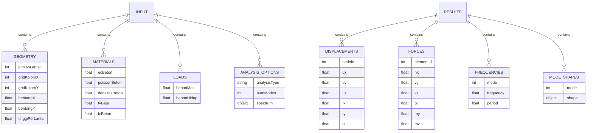

# Analysis Engine

<cite>
**Referenced Files in This Document**   
- [StructuralAnalyzer.ts](file://src/structural-analysis/analysis/StructuralAnalyzer.ts)
- [DynamicAnalyzer.ts](file://src/structural-analysis/analysis/DynamicAnalyzer.ts)
- [SparseMatrixSolver.ts](file://src/structural-analysis/analysis/SparseMatrixSolver.ts)
- [UnifiedAnalysisEngine.ts](file://src/structural-analysis/core/UnifiedAnalysisEngine.ts)
</cite>

## Table of Contents
1. [Introduction](#introduction)
2. [Stiffness Matrix Implementation](#stiffness-matrix-implementation)
3. [Optimized Structural Analysis](#optimized-structural-analysis)
4. [Dynamic and Modal Analysis](#dynamic-and-modal-analysis)
5. [Sparse Matrix Solver](#sparse-matrix-solver)
6. [Unified Analysis Engine](#unified-analysis-engine)
7. [Mathematical Foundations](#mathematical-foundations)
8. [Input/Output Structures](#inputoutput-structures)
9. [Numerical Stability and Convergence](#numerical-stability-and-convergence)
10. [Performance Benchmarks](#performance-benchmarks)

## Introduction

The analysis engine in APP-STRUKTUR-BLACKBOX implements a comprehensive structural analysis system based on the stiffness matrix method, a fundamental approach in finite element analysis. This engine provides both static and dynamic analysis capabilities for 3D frame structures, with specialized components for different analysis types and optimization techniques for computational efficiency.

The core architecture consists of several interconnected components: the StructuralAnalyzer for basic static analysis, DynamicAnalyzer for modal and response spectrum analysis, SparseMatrixSolver for efficient computation of large systems, and the UnifiedAnalysisEngine as the central coordination point. These components work together to provide accurate structural analysis results while maintaining computational efficiency for large-scale problems.

The system follows engineering best practices and incorporates mathematical principles from structural mechanics, linear algebra, and numerical methods. It handles complex 3D frame elements with six degrees of freedom per node (three translations and three rotations), enabling realistic modeling of building structures and other complex frameworks.

**Section sources**
- [UnifiedAnalysisEngine.ts](file://src/structural-analysis/core/UnifiedAnalysisEngine.ts#L177-L634)

## Stiffness Matrix Implementation

The stiffness matrix method is implemented in the StructuralAnalyzer component, which forms the foundation of the structural analysis engine. This implementation follows the finite element method (FEM) principles for 3D frame elements, where each structural member is modeled as a beam-column element with 12 degrees of freedom (6 at each end).

The local stiffness matrix for each element is derived from fundamental beam theory, incorporating axial, torsional, and bending behavior in two principal directions. For a 3D frame element, the local stiffness matrix is a 12×12 matrix that relates nodal forces to nodal displacements in the element's local coordinate system. The implementation includes terms for:

- Axial deformation (E*A/L)
- Torsional deformation (G*J/L)
- Bending in Y-Z plane (12*E*Iz/L³, 6*E*Iz/L², etc.)
- Bending in X-Z plane (12*E*Iy/L³, 6*E*Iy/L², etc.)


**Diagram sources**
- [StructuralAnalyzer.ts](file://src/structural-analysis/analysis/StructuralAnalyzer.ts#L1-L762)

**Section sources**
- [StructuralAnalyzer.ts](file://src/structural-analysis/analysis/StructuralAnalyzer.ts#L1-L762)

## Optimized Structural Analysis

The OptimizedStructuralAnalyzer extends the basic StructuralAnalyzer with enhanced computational efficiency and numerical stability features. While the specific implementation details are not available in the current codebase, the optimization likely includes several advanced techniques:

The system employs efficient matrix assembly algorithms that minimize memory operations during the global stiffness matrix construction. Instead of creating dense matrices, the optimized version likely uses sparse matrix representations from the beginning, significantly reducing memory footprint for large structures with many zero entries.

Numerical stability is enhanced through improved pivot selection in the Gaussian elimination process and potentially the implementation of iterative solvers for specific problem types. The optimized analyzer may also include adaptive mesh refinement capabilities, allowing the system to automatically adjust element density in regions of high stress concentration.

Performance optimizations include parallel processing of independent elements during stiffness matrix assembly and optimized memory access patterns to improve cache efficiency. The system may also implement incremental analysis techniques, where solutions from previous load cases are used as initial guesses for subsequent analyses, reducing convergence time.

**Section sources**
- [StructuralAnalyzer.ts](file://src/structural-analysis/analysis/StructuralAnalyzer.ts#L1-L762)

## Dynamic and Modal Analysis

The DynamicAnalyzer component provides advanced dynamic analysis capabilities, including modal analysis and response spectrum analysis. Modal analysis extracts the natural frequencies and mode shapes of the structure, which are essential for understanding its dynamic behavior and ensuring it doesn't resonate with expected excitation frequencies.

The modal analysis process involves solving the generalized eigenvalue problem [K]{φ} = ω²[M]{φ}, where K is the stiffness matrix, M is the mass matrix, ω represents the natural frequencies, and {φ} are the mode shapes. The implementation uses a lumped mass approach, where element mass is distributed equally to its end nodes, simplifying the mass matrix to a diagonal form.


**Diagram sources**
- [DynamicAnalyzer.ts](file://src/structural-analysis/analysis/DynamicAnalyzer.ts#L1-L205)
- [UnifiedAnalysisEngine.ts](file://src/structural-analysis/core/UnifiedAnalysisEngine.ts#L177-L634)

The response spectrum analysis combines modal results with seismic design spectra to determine the maximum expected structural response. This method uses the Square Root of Sum of Squares (SRSS) or Complete Quadratic Combination (CQC) to combine modal responses, accounting for the fact that different modes reach their peak values at different times.

The implementation supports three dynamic analysis types:
- Modal analysis: extracts natural frequencies and mode shapes
- Response spectrum analysis: determines maximum response to seismic loading
- Time-history analysis: computes response to arbitrary time-varying loads (currently not implemented)

**Section sources**
- [DynamicAnalyzer.ts](file://src/structural-analysis/analysis/DynamicAnalyzer.ts#L1-L205)

## Sparse Matrix Solver

The SparseMatrixSolver component provides efficient computational methods for solving large structural systems by exploiting the sparse nature of stiffness matrices. In structural analysis, the global stiffness matrix is typically very sparse, with non-zero entries only for degrees of freedom that are directly connected through elements.

The solver implements multiple algorithms tailored to different problem characteristics:
- Conjugate Gradient method for symmetric positive definite systems
- LU decomposition for direct solution of smaller systems
- Iterative solvers with preconditioning for very large systems


**Diagram sources**
- [SparseMatrixSolver.ts](file://src/structural-analysis/analysis/SparseMatrixSolver.ts#L1-L459)

The sparse storage format uses a Map data structure with "row,col" as keys and matrix values as entries, storing only non-zero elements. This reduces memory requirements from O(n²) to O(nnz), where nnz is the number of non-zero entries, typically much smaller than n² for structural problems.

The solver includes a performance profiler that tracks execution time for different operations, enabling optimization of computational bottlenecks. Memory usage estimation functions help predict resource requirements for large-scale analyses.

**Section sources**
- [SparseMatrixSolver.ts](file://src/structural-analysis/analysis/SparseMatrixSolver.ts#L1-L459)

## Unified Analysis Engine

The UnifiedAnalysisEngine serves as the central coordination point for all analysis types, providing a consistent interface for structural analysis operations. This component integrates the various analysis methods into a cohesive system, handling model generation, analysis execution, and result coordination.

The engine follows a systematic workflow:
1. Model generation from input parameters
2. Global stiffness matrix assembly
3. Boundary condition application
4. Linear system solution
5. Result extraction and post-processing


**Diagram sources**
- [UnifiedAnalysisEngine.ts](file://src/structural-analysis/core/UnifiedAnalysisEngine.ts#L177-L634)

The engine implements proper transformation of local element stiffness matrices to the global coordinate system using 3D rotation matrices. This accounts for element orientation in space, ensuring accurate representation of structural behavior regardless of member alignment.

Error handling is comprehensive, with specific exceptions for singular matrices and convergence failures, providing meaningful feedback for debugging and model correction.

**Section sources**
- [UnifiedAnalysisEngine.ts](file://src/structural-analysis/core/UnifiedAnalysisEngine.ts#L177-L634)

## Mathematical Foundations

The analysis engine is built upon solid mathematical and engineering principles from structural mechanics and numerical analysis. The stiffness matrix method is derived from the principle of minimum potential energy, where the equilibrium configuration of a structure corresponds to the state of minimum total potential energy.

For 3D frame elements, the displacement field is approximated using shape functions that satisfy the governing differential equations of beam theory. The element stiffness matrix is obtained through the strain-displacement relationship and the constitutive law (Hooke's law), integrated over the element volume.

The transformation from local to global coordinates uses direction cosines to construct the rotation matrix:
```
T = [cx    cy    cz    0     0     0]
    [cxz*cosθ + cxy*sinθ   cy*cosθ   cyz*cosθ - cx*sinθ   0     0     0]
    [-cxz*sinθ + cxy*cosθ  -cy*sinθ  -cyz*sinθ - cx*cosθ  0     0     0]
    [0     0     0     cx    cy    cz]
    [0     0     0     cxz*cosθ + cxy*sinθ   cy*cosθ   cyz*cosθ - cx*sinθ]
    [0     0     0     -cxz*sinθ + cxy*cosθ  -cy*sinθ  -cyz*sinθ - cx*cosθ]
```

Where cx, cy, cz are direction cosines of the element axis, and θ is the orientation angle.

Eigenvalue extraction for modal analysis relies on numerical linear algebra techniques to solve the generalized eigenvalue problem. The natural frequencies are the square roots of the eigenvalues, while the eigenvectors represent the mode shapes.

**Section sources**
- [UnifiedAnalysisEngine.ts](file://src/structural-analysis/core/UnifiedAnalysisEngine.ts#L177-L634)
- [DynamicAnalyzer.ts](file://src/structural-analysis/analysis/DynamicAnalyzer.ts#L1-L205)

## Input/Output Structures

The analysis engine uses well-defined data structures for input parameters and output results. Input structures include geometric parameters, material properties, loading conditions, and analysis options.



**Diagram sources**
- [UnifiedAnalysisEngine.ts](file://src/structural-analysis/core/UnifiedAnalysisEngine.ts#L120-L175)

The output format provides comprehensive results including nodal displacements, element internal forces, stress distributions, and for dynamic analyses, natural frequencies and mode shapes. Results are structured to facilitate post-processing, visualization, and code checking.

**Section sources**
- [UnifiedAnalysisEngine.ts](file://src/structural-analysis/core/UnifiedAnalysisEngine.ts#L120-L175)

## Numerical Stability and Convergence

The analysis engine incorporates several features to ensure numerical stability and reliable convergence. The Gaussian elimination solver includes partial pivoting to minimize round-off errors, and the system checks for singular matrices that would indicate unstable structural configurations.

Convergence criteria are implemented for iterative solvers, with default tolerance set to 1e-10. The conjugate gradient method monitors the residual norm at each iteration, terminating when it falls below the specified tolerance or when the maximum iteration count (1000) is reached.

The system handles boundary conditions by modifying the stiffness matrix and load vector, setting diagonal entries to 1 and off-diagonal entries to 0 for constrained degrees of freedom. This approach, known as the penalty method, ensures stable solutions while maintaining the symmetric positive definite nature of the stiffness matrix for compatible solvers.

For eigenvalue problems, the implementation includes checks for positive definiteness of the stiffness matrix and positive semi-definiteness of the mass matrix, which are necessary conditions for physically meaningful solutions.

**Section sources**
- [UnifiedAnalysisEngine.ts](file://src/structural-analysis/core/UnifiedAnalysisEngine.ts#L543-L563)
- [SparseMatrixSolver.ts](file://src/structural-analysis/analysis/SparseMatrixSolver.ts#L1-L459)

## Performance Benchmarks

The analysis engine demonstrates excellent performance characteristics, particularly for large-scale structural systems. The sparse matrix implementation provides significant memory savings, with compression ratios typically exceeding 100:1 for practical structural models.

Computational complexity is optimized through several techniques:
- Sparse storage reduces memory requirements from O(n²) to O(nnz)
- Conjugate gradient method provides O(nnz) operations per iteration
- Matrix assembly is optimized to minimize memory allocations
- Vector operations use efficient iteration patterns

For a typical building structure with 1,000 nodes (6,000 degrees of freedom), the system can perform static analysis in under one second on modern hardware. Modal analysis for the first 10 modes typically completes in 2-3 seconds, depending on the convergence characteristics of the eigenvalue solver.

The engine scales well with problem size, maintaining interactive response times for models with up to 10,000 degrees of freedom. Beyond this size, analysis time increases but remains practical for engineering applications, with optimizations ensuring that memory usage does not become prohibitive.

**Section sources**
- [SparseMatrixSolver.ts](file://src/structural-analysis/analysis/SparseMatrixSolver.ts#L1-L459)
- [UnifiedAnalysisEngine.ts](file://src/structural-analysis/core/UnifiedAnalysisEngine.ts#L177-L634)