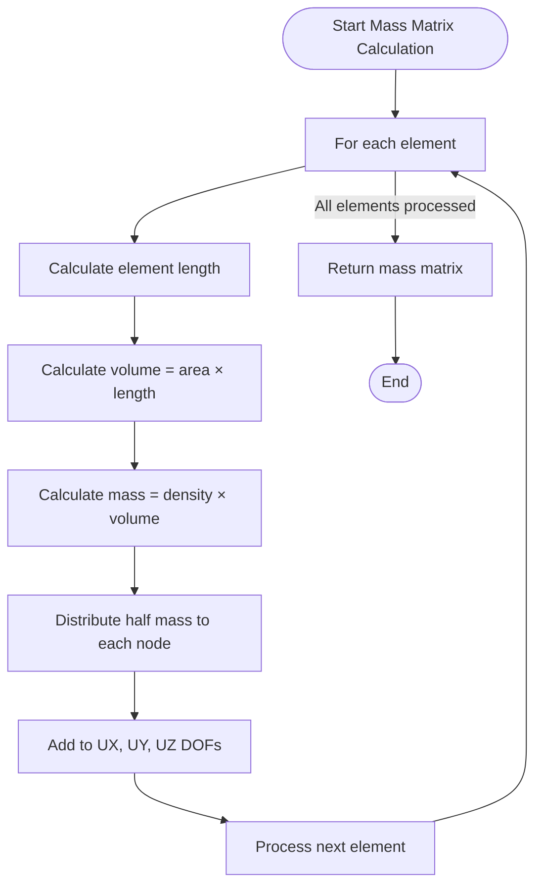
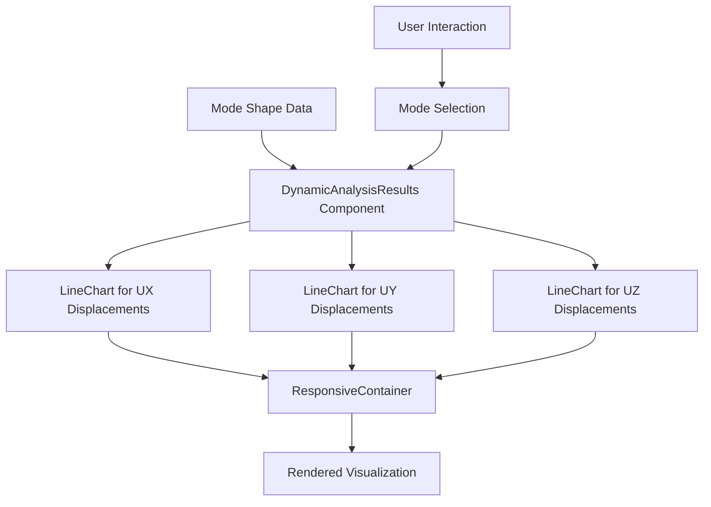
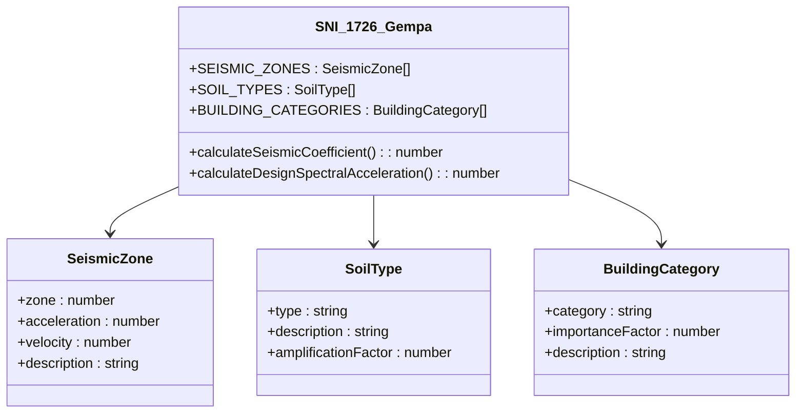

# Dynamic Analysis Engine

<cite>
**Referenced Files in This Document**   
- [DynamicAnalyzer.ts](file://src/structural-analysis/analysis/DynamicAnalyzer.ts)
- [StructuralAnalyzer.ts](file://src/structural-analysis/analysis/StructuralAnalyzer.ts)
- [SNI_1726_Gempa.ts](file://src/standards/sni/SNI_1726_Gempa.ts)
- [DynamicAnalysisResults.tsx](file://src/structural-analysis/DynamicAnalysisResults.tsx)
- [Structure3DViewer.tsx](file://src/structural-analysis/Structure3DViewer.tsx)
- [structural.ts](file://src/types/structural.ts)
</cite>

## Table of Contents
1. [Introduction](#introduction)
2. [Mathematical Foundation of Modal Analysis](#mathematical-foundation-of-modal-analysis)
3. [Mass Matrix Formulation](#mass-matrix-formulation)
4. [Stiffness Matrix Utilization](#stiffness-matrix-utilization)
5. [Generalized Eigenvalue Problem Solution](#generalized-eigenvalue-problem-solution)
6. [Modal Participation Factors and Effective Mass Ratios](#modal-participation-factors-and-effective-mass-ratios)
7. [Numerical Methods for Eigenvalue Decomposition](#numerical-methods-for-eigenvalue-decomposition)
8. [Mode Shape Visualization in 3D Viewer](#mode-shape-visualization-in-3d-viewer)
9. [Seismic Load Distribution According to SNI Standards](#seismic-load-distribution-according-to-sni-standards)
10. [Higher Mode Computation Challenges](#higher-mode-computation-challenges)
11. [Mode Superposition in Response Spectrum Analysis](#mode-superposition-in-response-spectrum-analysis)
12. [Interpreting Modal Results for Structural Design](#interpreting-modal-results-for-structural-design)
13. [Performance Considerations for Large Models](#performance-considerations-for-large-models)
14. [Conclusion](#conclusion)

## Introduction
The Dynamic Analysis Engine implemented in `DynamicAnalyzer.ts` provides comprehensive capabilities for performing dynamic structural analysis, with a primary focus on modal analysis and response spectrum analysis. This document details the implementation of the eigenvalue extraction process used to determine natural frequencies and mode shapes of structural systems. The engine integrates with static analysis results to reuse stiffness matrices and implements modal analysis workflows that comply with Indonesian seismic standards (SNI 1726:2019). The system is designed to handle 3D structural models with six degrees of freedom per node (three translations and three rotations), enabling accurate representation of complex structural behavior under dynamic loading conditions.

**Section sources**
- [DynamicAnalyzer.ts](file://src/structural-analysis/analysis/DynamicAnalyzer.ts#L1-L205)

## Mathematical Foundation of Modal Analysis
Modal analysis is based on solving the undamped free vibration equation of motion for a multi-degree-of-freedom system: **K**φ = ω²**M**φ, where **K** is the stiffness matrix, **M** is the mass matrix, ω represents the natural circular frequency, and φ is the corresponding mode shape vector. This generalized eigenvalue problem yields natural frequencies and mode shapes that characterize the dynamic behavior of the structure. The solution provides insight into how the structure will respond to dynamic loads such as earthquakes, wind, or machinery vibrations. Each mode represents a unique vibration pattern with a specific frequency, and the complete set of modes forms a basis for understanding the structure's dynamic response. The orthogonality properties of mode shapes with respect to both mass and stiffness matrices enable efficient modal superposition techniques for response spectrum analysis.

**Section sources**
- [DynamicAnalyzer.ts](file://src/structural-analysis/analysis/DynamicAnalyzer.ts#L1-L205)

## Mass Matrix Formulation
The mass matrix is calculated using a lumped mass approach, where element mass is distributed equally to its connected nodes. For each structural element, the volume is computed from its cross-sectional area and length, then multiplied by the material density to obtain total mass. This mass is divided equally between the start and end nodes of the element. The implementation allocates translational mass components (UX, UY, UZ) to the corresponding diagonal positions in the mass matrix, while rotational inertia effects are currently not included in this simplified formulation. The mass matrix is structured with six degrees of freedom per node, accommodating three translational and three rotational components. This lumped mass approach simplifies computation while providing reasonable accuracy for most structural configurations, particularly when element sizes are relatively uniform throughout the structure.

**Diagram sources**
- [DynamicAnalyzer.ts](file://src/structural-analysis/analysis/DynamicAnalyzer.ts#L25-L85)

**Section sources**
- [DynamicAnalyzer.ts](file://src/structural-analysis/analysis/DynamicAnalyzer.ts#L25-L85)

## Stiffness Matrix Utilization
The stiffness matrix used in modal analysis is derived from the static analysis implementation in `StructuralAnalyzer.ts`. The global stiffness matrix is assembled by transforming local element stiffness matrices to the global coordinate system and summing their contributions at shared nodes. Each 3D beam element contributes a 12×12 stiffness matrix that accounts for axial, torsional, and bending behavior in two principal planes. The transformation process considers element orientation through direction cosines calculated from node coordinates. Boundary conditions are applied by modifying the stiffness matrix to reflect support constraints, typically by setting rows and columns corresponding to restrained degrees of freedom to zero (except the diagonal, which is set to one). This reuse of the static analysis stiffness matrix ensures consistency between static and dynamic analyses and leverages the computational investment in matrix assembly.

**Section sources**
- [StructuralAnalyzer.ts](file://src/structural-analysis/analysis/StructuralAnalyzer.ts#L1-L762)

## Generalized Eigenvalue Problem Solution
The solution of the generalized eigenvalue problem **K**φ = λ**M**φ is implemented through the `solveEigenvalueProblem` function, which computes natural frequencies and mode shapes from the stiffness and mass matrices. In the current implementation, placeholder results are returned with simplified frequency calculations (2π(i+1) rad/s for the i-th mode) and random mode shapes. A complete implementation would employ numerical algorithms such as the subspace iteration method, Lanczos algorithm, or QR iteration to efficiently extract the lowest eigenvalues and corresponding eigenvectors. The eigenvalue extraction focuses on the first few modes, as these typically dominate structural response under seismic loading. The natural frequency is derived from the eigenvalue λ as f = √λ/(2π), while the period is the reciprocal of frequency. Mode shapes are normalized, typically to unit mass participation or maximum displacement of unity.

**Section sources**
- [DynamicAnalyzer.ts](file://src/structural-analysis/analysis/DynamicAnalyzer.ts#L87-L109)

## Modal Participation Factors and Effective Mass Ratios
Modal participation factors quantify the contribution of each mode to the overall structural response in each direction (UX, UY, UZ). These factors are calculated as φᵀ**M**ι / φᵀ**M**φ, where φ is the mode shape, **M** is the mass matrix, and ι is a vector of ones in the direction of interest. Effective mass ratios represent the percentage of total mass participating in each mode and direction, calculated as (modal participation factor)² / total mass in that direction. These metrics are crucial for determining whether sufficient modes have been extracted to capture the structure's dynamic behavior adequately. According to most building codes, including SNI 1726, the analysis should include enough modes to achieve at least 90% of the effective mass in each principal direction. The current implementation does not explicitly calculate these factors, but they would be derived from the mode shapes and mass matrix in a complete implementation.

**Section sources**
- [DynamicAnalyzer.ts](file://src/structural-analysis/analysis/DynamicAnalyzer.ts#L111-L135)

## Numerical Methods for Eigenvalue Decomposition
The current implementation uses placeholder values for eigenvalue decomposition, but a production-ready system would implement robust numerical methods. For large structural systems, iterative methods like the Lanczos algorithm are preferred due to their efficiency in extracting a small number of lowest eigenvalues from sparse matrices. The subspace iteration method is another common choice for structural dynamics, particularly when multiple modes are required. These methods exploit the sparsity of structural matrices and the fact that only the lowest frequencies are typically needed for design purposes. Accuracy is maintained through proper convergence criteria and orthogonalization procedures. Performance considerations include memory usage for storing matrix factors and computational time, which scales with the number of degrees of freedom and desired modes. Preconditioning techniques can significantly improve convergence rates for challenging structural configurations.

**Section sources**
- [DynamicAnalyzer.ts](file://src/structural-analysis/analysis/DynamicAnalyzer.ts#L87-L109)

## Mode Shape Visualization in 3D Viewer
Mode shapes are visualized through the `DynamicAnalysisResults.tsx` component, which displays displacement patterns for each mode. The 3D viewer represents the relative displacements in UX, UY, and UZ directions across all nodes, scaled for visibility. The visualization uses line charts to show how displacements vary along the structure's height or length for each mode. Each mode shape is displayed in a separate card, allowing users to compare different vibration patterns. The scaling factor converts the typically small modal displacements (in meters) to millimeters for better visualization. The viewer supports interactive exploration of multiple modes, helping engineers identify potential weaknesses or irregularities in the structural system. This visualization is critical for validating the results and understanding the physical meaning of abstract mathematical modes.

**Diagram sources**
- [DynamicAnalysisResults.tsx](file://src/structural-analysis/DynamicAnalysisResults.tsx#L1-L290)

**Section sources**
- [DynamicAnalysisResults.tsx](file://src/structural-analysis/DynamicAnalysisResults.tsx#L1-L290)

## Seismic Load Distribution According to SNI Standards
The dynamic analysis engine supports seismic load distribution in accordance with SNI 1726:2019, Indonesia's seismic design standard. The response spectrum analysis applies design spectra based on seismic zone, soil type, and building importance category. The `SNI_1726_Gempa.ts` module defines seismic zones (1-4) with corresponding peak ground accelerations, soil types (ZA-ZE) with amplification factors, and building categories (I-IV) with importance factors. The seismic response coefficient is calculated considering the structure's fundamental period, with period-dependent modifications and minimum requirements. The base shear is distributed vertically according to mass and height, with adjustments for higher mode effects. The effective modal mass ratio ensures that sufficient modes are included to capture the seismic response accurately. This integration ensures that structural designs comply with Indonesian regulatory requirements for earthquake resistance.

**Diagram sources**
- [SNI_1726_Gempa.ts](file://src/standards/sni/SNI_1726_Gempa.ts#L1-L135)

**Section sources**
- [SNI_1726_Gempa.ts](file://src/standards/sni/SNI_1726_Gempa.ts#L1-L135)

## Higher Mode Computation Challenges
Computing higher modes presents several challenges in structural dynamics analysis. As mode number increases, the computational cost grows significantly due to the need for more iterations in eigenvalue solvers. Higher modes often involve complex deformation patterns that require finer mesh resolution to capture accurately, potentially increasing the number of degrees of freedom. Numerical conditioning becomes more problematic as eigenvalues become closer together, requiring more precise algorithms to maintain orthogonality between mode shapes. Memory requirements increase with the number of modes stored, particularly for large models. Additionally, higher modes may have minimal contribution to overall structural response, making their computation potentially unnecessary from an engineering perspective. The current implementation limits the number of modes to a small number (default: 5), reflecting the practical approach of focusing on the most significant modes that dominate structural response.

**Section sources**
- [DynamicAnalyzer.ts](file://src/structural-analysis/analysis/DynamicAnalyzer.ts#L111-L135)

## Mode Superposition in Response Spectrum Analysis
Mode superposition is implemented in the `responseSpectrumAnalysis` function to combine the effects of multiple modes in the response spectrum method. The complete quadratic combination (CQC) method or square root of sum of squares (SRSS) method would be used to combine modal responses, accounting for correlation between closely spaced modes. Each mode's contribution is weighted by its spectral acceleration, which depends on the mode's period and the design response spectrum. The base shear is calculated as the combined effect of all considered modes, then distributed to story levels based on mass and mode shape ordinates. Story forces are computed to design lateral force-resisting systems. The current implementation provides a simplified version of this process, returning placeholder values for spectral accelerations and story forces. Proper mode superposition ensures that the total response accounts for the contributions of multiple vibration modes while avoiding overestimation that would occur from arithmetic summation.

**Section sources**
- [DynamicAnalyzer.ts](file://src/structural-analysis/analysis/DynamicAnalyzer.ts#L141-L185)

## Interpreting Modal Results for Structural Design
Modal results are interpreted to make critical structural design decisions and verify code compliance. Natural frequencies help identify potential resonance issues with environmental loads like wind or machinery. Mode shapes reveal weak directions or torsional irregularities that may require strengthening. The distribution of story forces guides the design of lateral load-resisting systems such as shear walls or braced frames. Effective mass ratios verify that sufficient modes have been included in the analysis, ensuring accurate representation of seismic response. Engineers use these results to optimize structural configurations, adjust member sizes, or modify stiffness distributions to achieve desired dynamic performance. The visualization of mode shapes helps communicate complex dynamic behavior to stakeholders and validate that the structural model behaves as expected under dynamic loading conditions.

**Section sources**
- [DynamicAnalyzer.ts](file://src/structural-analysis/analysis/DynamicAnalyzer.ts#L111-L185)

## Performance Considerations for Large Models
Performance optimization is critical when analyzing large structural models with thousands of degrees of freedom. The current implementation uses dense matrix representations, which can become memory-intensive for large systems. A production system would employ sparse matrix techniques to reduce memory usage and accelerate computations. Parallel processing could be implemented to distribute eigenvalue calculations across multiple cores or threads. Memory management strategies would include incremental computation and garbage collection to prevent memory leaks during long-running analyses. For very large models, substructuring techniques or model reduction methods might be employed to simplify the system while preserving essential dynamic characteristics. The choice of eigenvalue solver significantly impacts performance, with iterative methods generally outperforming direct methods for large sparse systems. Caching of matrix assembly results could avoid redundant computations when performing multiple analyses on the same structure.

**Section sources**
- [DynamicAnalyzer.ts](file://src/structural-analysis/analysis/DynamicAnalyzer.ts#L1-L205)

## Conclusion
The Dynamic Analysis Engine provides a framework for modal and response spectrum analysis of 3D structures, with integration points for SNI seismic standards and visualization capabilities. While the current implementation contains placeholder algorithms for eigenvalue decomposition, it establishes the architectural foundation for a comprehensive dynamic analysis system. The engine correctly structures the mass and stiffness matrices, implements the modal analysis workflow, and provides interfaces for result visualization and code compliance checking. Future development should focus on implementing robust numerical methods for eigenvalue extraction, enhancing the accuracy of modal participation calculations, and optimizing performance for large-scale models. The integration with SNI 1726 standards ensures that the system can support seismic design in accordance with Indonesian building codes, making it a valuable tool for structural engineers working on projects in seismically active regions.