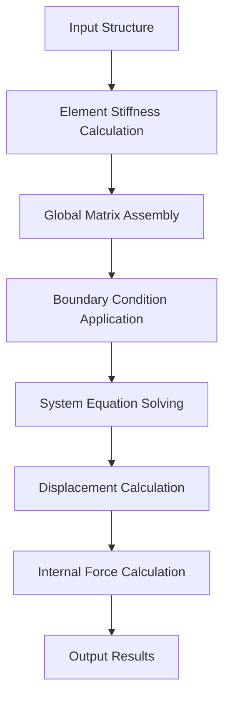

# Static Analysis Engine

<cite>
**Referenced Files in This Document**   
- [StructuralAnalyzer.ts](file://src/structural-analysis/analysis/StructuralAnalyzer.ts)
- [OptimizedStructuralAnalyzer.ts](file://src/structural-analysis/analysis/OptimizedStructuralAnalyzer.ts)
- [SparseMatrixSolver.ts](file://src/structural-analysis/analysis/SparseMatrixSolver.ts)
- [structural.ts](file://src/types/structural.ts)
</cite>

## Table of Contents
1. [Introduction](#introduction)
2. [Core Analysis Methodology](#core-analysis-methodology)
3. [Stiffness Matrix Implementation](#stiffness-matrix-implementation)
4. [Global Matrix Assembly](#global-matrix-assembly)
5. [Coordinate System Transformation](#coordinate-system-transformation)
6. [Boundary Condition Application](#boundary-condition-application)
7. [SparseMatrixSolver Optimization](#sparsematrixsolver-optimization)
8. [Input/Output Data Structures](#inputoutput-data-structures)
9. [Mathematical Formulation](#mathematical-formulation)
10. [Numerical Stability and Error Handling](#numerical-stability-and-error-handling)
11. [Performance Comparison](#performance-comparison)
12. [Analyzer Selection Guidance](#analyzer-selection-guidance)

## Introduction

The Static Analysis Engine provides structural analysis capabilities through two complementary implementations: a basic analyzer for smaller models and an optimized analyzer for large-scale systems. The engine implements the stiffness matrix method to solve structural equilibrium equations, calculating displacements, reactions, and internal forces for 3D frame structures. This document details the implementation of both analyzers, focusing on their mathematical foundations, algorithmic approaches, and performance characteristics.

**Section sources**
- [StructuralAnalyzer.ts](file://src/structural-analysis/analysis/StructuralAnalyzer.ts#L1-L50)
- [OptimizedStructuralAnalyzer.ts](file://src/structural-analysis/analysis/OptimizedStructuralAnalyzer.ts#L1-L50)

## Core Analysis Methodology

The static analysis follows the direct stiffness method, which involves four primary steps: element stiffness matrix calculation, global stiffness matrix assembly, boundary condition application, and system equation solving. The basic analyzer (StructuralAnalyzer.ts) uses dense matrix representations and Gaussian elimination, while the optimized analyzer (OptimizedStructuralAnalyzer.ts) employs sparse matrix techniques and iterative solvers for improved efficiency.

Both analyzers process the same input structure data and produce identical output formats, ensuring consistency across different performance profiles. The analysis workflow begins with element-level stiffness calculations, progresses through global system assembly, applies support conditions, solves for displacements, and finally computes element forces and stresses.

**Diagram sources**
- [StructuralAnalyzer.ts](file://src/structural-analysis/analysis/StructuralAnalyzer.ts#L414-L560)
- [OptimizedStructuralAnalyzer.ts](file://src/structural-analysis/analysis/OptimizedStructuralAnalyzer.ts#L504-L640)

## Stiffness Matrix Implementation

The stiffness matrix implementation follows the standard formulation for 3D frame elements with 12 degrees of freedom (6 per node). Each element's local stiffness matrix is calculated based on material properties (elastic modulus, shear modulus) and section properties (area, moment of inertia, torsional constant).

The local stiffness matrix contains terms for axial deformation, torsion,