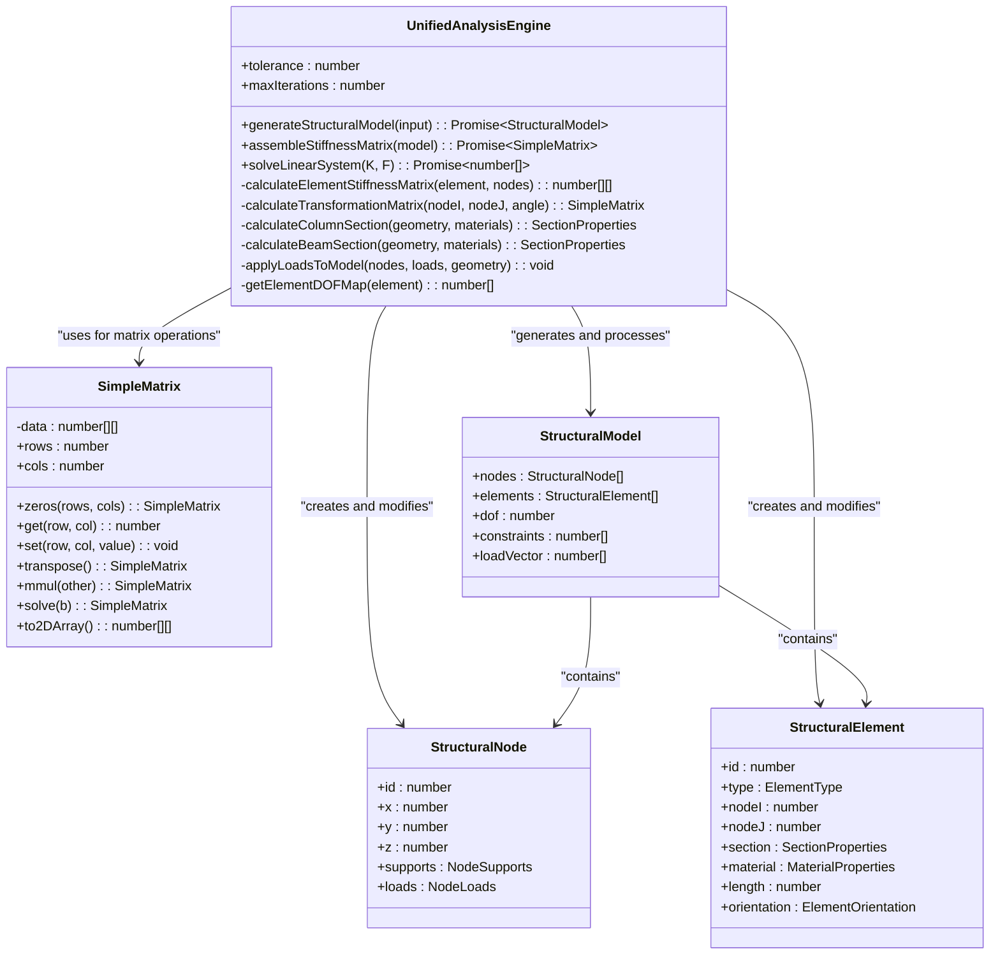
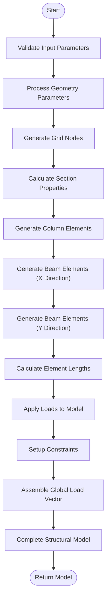
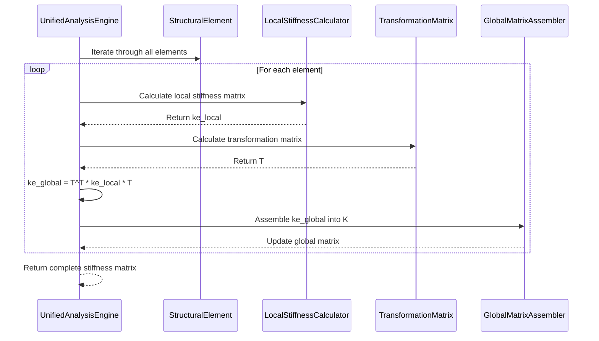
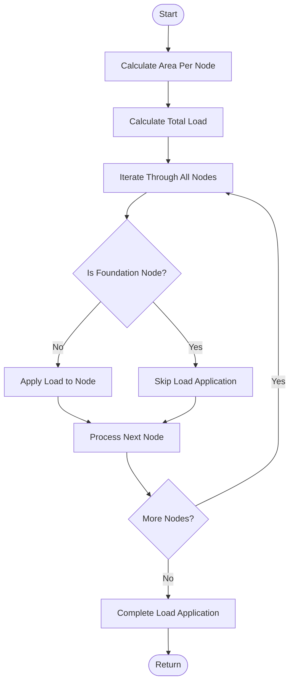
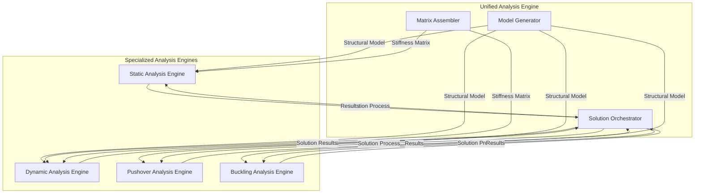
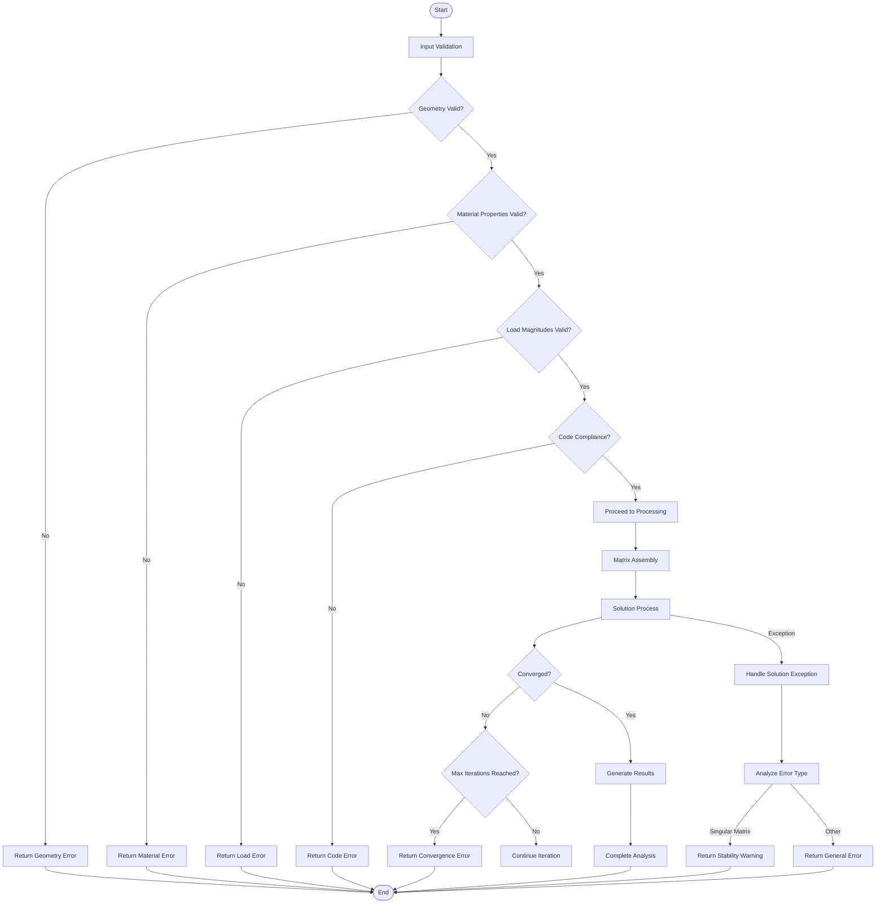

# Unified Analysis Engine

<cite>
**Referenced Files in This Document**   
- [UnifiedAnalysisEngine.ts](file://src/structural-analysis/core/UnifiedAnalysisEngine.ts)
- [UnifiedTypes.ts](file://src/structural-analysis/types/UnifiedTypes.ts)
- [WORKFLOW.md](file://WORKFLOW.md)
</cite>

## Table of Contents
1. [Introduction](#introduction)
2. [Core Architecture](#core-architecture)
3. [Structural Model Generation](#structural-model-generation)
4. [Stiffness Matrix Assembly](#stiffness-matrix-assembly)
5. [Load Distribution and Application](#load-distribution-and-application)
6. [Section Property Calculation](#section-property-calculation)
7. [Integration with Analysis Engines](#integration-with-analysis-engines)
8. [Error Handling and Input Validation](#error-handling-and-input-validation)
9. [Performance Optimization](#performance-optimization)
10. [Extensibility and Future Development](#extensibility-and-future-development)

## Introduction

The Unified Analysis Engine serves as the central coordination point for all structural analysis types within the system, providing a comprehensive framework for generating complete structural models from high-level input parameters. This engine implements the stiffness matrix method with professional engineering standards and high accuracy, orchestrating the entire analysis workflow from parameter input through structural model generation, stiffness matrix assembly, and solution orchestration.

The engine processes input parameters including geometry, materials, and loads to create a complete finite element model of the structure. It supports various structural configurations with dynamic handling of different floor counts, grid layouts, and building geometries. The system is designed to be extensible for future analysis types and integrates with additional standards, providing a robust foundation for both static and dynamic analysis.

**Section sources**
- [UnifiedAnalysisEngine.ts](file://src/structural-analysis/core/UnifiedAnalysisEngine.ts#L177-L634)

## Core Architecture

The Unified Analysis Engine follows a modular architecture with clearly defined components for model generation, matrix assembly, and solution processing. The core class structure revolves around the `UnifiedAnalysisEngine` class, which coordinates the analysis workflow, and the `SimpleMatrix` class, which provides essential matrix operations for structural calculations.

The engine's architecture is designed around the finite element method, with a focus on 3D frame elements that can handle axial, bending, torsional, and shear forces. The system uses a global coordinate system with proper transformation matrices to handle elements at various orientations. Each structural element is represented with 12 degrees of freedom (6 at each node), allowing for comprehensive analysis of complex structural behaviors.



**Diagram sources**
- [UnifiedAnalysisEngine.ts](file://src/structural-analysis/core/UnifiedAnalysisEngine.ts#L7-L634)

**Section sources**
- [UnifiedAnalysisEngine.ts](file://src/structural-analysis/core/UnifiedAnalysisEngine.ts#L7-L176)

## Structural Model Generation

The structural model generation process begins with high-level input parameters and transforms them into a complete finite element model. The engine creates nodes based on the specified geometry, including the number of floors, column grid dimensions, and bay spacings. Each node is assigned appropriate support conditions, with foundation nodes fully restrained and upper floor nodes free to move.

The model generation workflow follows a systematic approach:
1. Create grid nodes for each floor level
2. Calculate section properties based on structural dimensions and material properties
3. Generate column elements connecting nodes between floors
4. Generate beam elements in both X and Y directions
5. Calculate element lengths based on node coordinates
6. Apply loads to the model
7. Setup constraints based on support conditions
8. Assemble the global load vector

The engine handles different structural configurations by dynamically adjusting the node and element generation based on input parameters. For varying floor counts, the system iterates through each floor level, creating the appropriate number of node layers. For different grid layouts, the system adapts to the specified number of bays in both X and Y directions, ensuring proper connectivity between structural elements.



**Diagram sources**
- [UnifiedAnalysisEngine.ts](file://src/structural-analysis/core/UnifiedAnalysisEngine.ts#L177-L300)

**Section sources**
- [UnifiedAnalysisEngine.ts](file://src/structural-analysis/core/UnifiedAnalysisEngine.ts#L177-L300)
- [WORKFLOW.md](file://WORKFLOW.md#L251-L312)

## Stiffness Matrix Assembly

The stiffness matrix assembly process is a critical component of the Unified Analysis Engine, implementing the finite element method to create the global stiffness matrix that represents the structural system. The engine assembles the global stiffness matrix by calculating individual element stiffness matrices and transforming them from local to global coordinates before assembling them into the global matrix.

For each structural element, the engine calculates the local stiffness matrix considering axial, bending, torsional, and shear behavior. The 12x12 local stiffness matrix accounts for all six degrees of freedom at each end of the element. The transformation from local to global coordinates is achieved through a transformation matrix that considers the element's orientation in 3D space.

The assembly process follows these steps:
1. Calculate the local stiffness matrix for each element
2. Compute the transformation matrix from local to global coordinates
3. Transform the local stiffness matrix to global coordinates
4. Assemble the transformed element stiffness matrix into the global stiffness matrix using the degree of freedom mapping

The engine handles the coordinate transformation by calculating direction cosines based on the element's orientation and applying a 3x3 rotation matrix that accounts for the member's orientation angle. This ensures accurate representation of elements at various angles and orientations within the structural system.



**Diagram sources**
- [UnifiedAnalysisEngine.ts](file://src/structural-analysis/core/UnifiedAnalysisEngine.ts#L302-L450)

**Section sources**
- [UnifiedAnalysisEngine.ts](file://src/structural-analysis/core/UnifiedAnalysisEngine.ts#L302-L450)

## Load Distribution and Application

The Unified Analysis Engine implements a systematic approach to load distribution and application, ensuring that loads are properly distributed across nodes based on tributary areas and code requirements. The load application process begins with the calculation of tributary areas for each node, which determines how much of the total load is assigned to each structural node.

The engine follows a specific methodology for load distribution:
1. Calculate the area per node based on the grid spacing in both X and Y directions
2. Determine the total load by combining dead and live loads
3. Distribute the total load to each node based on its tributary area
4. Apply the distributed loads to the appropriate nodes, excluding foundation nodes

The load distribution algorithm considers the structural configuration and ensures that loads are only applied to nodes above the foundation level. This approach accurately represents real-world loading conditions where foundation nodes do not carry vertical loads from upper floors. The engine converts load units from kN to N during the distribution process to maintain consistency with the SI unit system used in calculations.

The system also supports various load types and combinations as defined in the UnifiedTypes interface, including dead loads, live loads, wind loads, and seismic loads. The load application process can be extended to handle additional load types and combinations as required by different building codes and standards.



**Diagram sources**
- [UnifiedAnalysisEngine.ts](file://src/structural-analysis/core/UnifiedAnalysisEngine.ts#L582-L605)

**Section sources**
- [UnifiedAnalysisEngine.ts](file://src/structural-analysis/core/UnifiedAnalysisEngine.ts#L582-L605)
- [UnifiedTypes.ts](file://src/structural-analysis/types/UnifiedTypes.ts#L50-L80)

## Section Property Calculation

The Unified Analysis Engine features an automated section property calculation system that determines the appropriate cross-sectional properties for structural elements based on their dimensions and material properties. This system eliminates the need for manual input of section properties by calculating them dynamically based on the structural configuration.

For column elements, the engine calculates section properties using a dynamic sizing approach that considers the building height and number of floors. The column size is determined as the maximum of 0.3 meters or a value derived from the total building height divided by 50, ensuring that columns are appropriately sized for the structural demands of the building.

For beam elements, the engine uses an optimized sizing approach based on the span length. The beam width is calculated as the span divided by 15, while the beam height is calculated as the span divided by 12. This approach ensures that beams are proportioned appropriately for their span, following engineering best practices for structural efficiency.

The section property calculation includes:
- Cross-sectional area
- Moment of inertia about Y and Z axes
- Torsional constant
- Effective shear areas

The engine also implements a sophisticated calculation for the torsional constant of rectangular sections, using different formulas based on the aspect ratio of the section. This ensures accurate representation of torsional behavior in structural elements.

```mermaid
classDiagram
class SectionProperties {
+area : number
+momentY : number
+momentZ : number
+torsion : number
+shearY : number
+shearZ : number
}
class ColumnCalculator {
+calculateColumnSection(geometry, materials) : SectionProperties
-dynamicSizing(geometry) : number
}
class BeamCalculator {
+calculateBeamSection(geometry, materials) : SectionProperties
-optimizedSizing(span) : {width : number, height : number}
}
class TorsionCalculator {
+calculateTorsionalConstant(b, h) : number
-aspectRatioCheck(a, c) : boolean
}
UnifiedAnalysisEngine --> ColumnCalculator : "delegates"
UnifiedAnalysisEngine --> BeamCalculator : "delegates"
UnifiedAnalysisEngine --> TorsionCalculator : "delegates"
ColumnCalculator --> SectionProperties : "returns"
BeamCalculator --> SectionProperties : "returns"
TorsionCalculator --> SectionProperties : "used in"
```

**Diagram sources**
- [UnifiedAnalysisEngine.ts](file://src/structural-analysis/core/UnifiedAnalysisEngine.ts#L543-L580)

**Section sources**
- [UnifiedAnalysisEngine.ts](file://src/structural-analysis/core/UnifiedAnalysisEngine.ts#L543-L580)

## Integration with Analysis Engines

The Unified Analysis Engine serves as the central coordination point for both static and dynamic analysis engines through standardized interfaces. While the current implementation focuses on static linear elastic analysis, the architecture is designed to seamlessly integrate with dynamic analysis capabilities.

The engine's integration framework follows a modular approach, allowing for the addition of specialized analysis engines for different types of structural analysis. The standardized interfaces ensure consistent data exchange between the Unified Analysis Engine and specialized analysis modules, maintaining data integrity and computational accuracy.

The integration points include:
- Structural model generation that produces a consistent model format for all analysis types
- Standardized load vector assembly that can be extended for dynamic loading conditions
- Common solution methods that can be adapted for different analysis requirements
- Unified results formatting that supports both static and dynamic analysis outputs

The system's design allows for the integration of dynamic analysis engines that can perform time-history analysis, response spectrum analysis, and modal analysis. The engine already includes provisions for dynamic analysis results in the UnifiedAnalysisResults interface, with properties for natural periods, mode shapes, and modal participation factors.



**Diagram sources**
- [UnifiedAnalysisEngine.ts](file://src/structural-analysis/core/UnifiedAnalysisEngine.ts#L177-L634)
- [UnifiedTypes.ts](file://src/structural-analysis/types/UnifiedTypes.ts#L107-L152)

**Section sources**
- [UnifiedAnalysisEngine.ts](file://src/structural-analysis/core/UnifiedAnalysisEngine.ts#L177-L634)
- [UnifiedTypes.ts](file://src/structural-analysis/types/UnifiedTypes.ts#L107-L152)

## Error Handling and Input Validation

The Unified Analysis Engine implements comprehensive error handling and input validation mechanisms to ensure the reliability and accuracy of structural analysis. The system follows a multi-layered approach to validation and error management, addressing issues at various stages of the analysis workflow.

The input validation process occurs during the pre-processing phase and includes:
- Geometric consistency checks to ensure valid building dimensions
- Material property validation to verify realistic material parameters
- Load magnitude verification to prevent unrealistic loading conditions
- Code compliance review to ensure adherence to relevant standards

The engine employs specific validation rules for different input parameters:
- Aspect ratio limits (length/width ≤ 3:1)
- Slenderness limits (height/width ≤ 5:1)
- Bay spacing within recommended ranges (3.0-8.0m)
- Floor height within acceptable limits (2.5-5.0m)

For error handling, the engine implements try-catch blocks around critical operations, particularly during the solution of linear systems. When a singular matrix is encountered, the system throws a descriptive error indicating that the structural system may be unstable or improperly constrained. The tolerance setting of 1e-10 provides a threshold for numerical precision, helping to identify potential issues with matrix conditioning.

The system also defines convergence criteria for iterative processes, with maximum iterations set to 1000 and specific tolerance levels for displacement, force, and energy convergence. These criteria ensure that the analysis process terminates appropriately and provides reliable results.



**Diagram sources**
- [UnifiedAnalysisEngine.ts](file://src/structural-analysis/core/UnifiedAnalysisEngine.ts#L502-L532)
- [WORKFLOW.md](file://WORKFLOW.md#L251-L312)

**Section sources**
- [UnifiedAnalysisEngine.ts](file://src/structural-analysis/core/UnifiedAnalysisEngine.ts#L502-L532)
- [WORKFLOW.md](file://WORKFLOW.md#L251-L312)

## Performance Optimization

The Unified Analysis Engine incorporates several performance optimization techniques to ensure efficient memory usage and computational efficiency. The system is designed to handle complex structural models while maintaining acceptable performance characteristics.

Key optimization strategies include:
- Efficient matrix operations through the SimpleMatrix class implementation
- Memory-efficient data structures for storing structural models
- Optimized algorithms for stiffness matrix assembly
- Parallelizable operations where applicable

The SimpleMatrix class implements essential matrix operations with optimized algorithms, including matrix multiplication, transposition, and solving linear systems. The Gaussian elimination method with partial pivoting ensures numerical stability while maintaining reasonable computational complexity. The matrix operations are implemented to minimize memory allocations and optimize cache usage.

For large structural models, the engine could be extended to use sparse matrix representations, which would significantly reduce memory requirements and improve computational efficiency. The current dense matrix implementation is suitable for small to medium-sized structures but may benefit from sparse matrix techniques for larger, more complex models.

The system also implements performance monitoring through the PerformanceMetrics interface, which tracks analysis time, memory usage, matrix size, convergence iterations, and error tolerance. This allows for systematic evaluation of performance characteristics and identification of potential optimization opportunities.

```mermaid
graph TD
    subgraph "Performance Optimization Techniques"
        MatrixOps[Efficient Matrix Operations]
        MemoryUsage[Optimized Memory Usage]
        AlgorithmOpt[Algorithm Optimization]
        ParallelOps[Parallelizable Operations]
    end
    
    subgraph "Matrix Operations"
        Transpose[Optimized Transpose]
        Multiplication[Efficient Multiplication]
        Solving[Stable Solving Algorithm]
    end
    
    subgraph "Memory Management"
        DataStructures[Efficient Data Structures]
        MemoryAllocation[Minimized Allocations]
        CacheOptimization[Cache-Friendly Access]
    end
    
    subgraph "Algorithmic Improvements"
        Pivoting[Partial Pivoting]
        LoopOptimization[Loop Optimization]
        ComplexityReduction[Complexity Reduction]
    end
    
    subgraph "Scalability Features"
        SparseMatrices[Sparse Matrix Support]
        ParallelProcessing[Parallel Processing]
        MemoryMonitoring[Memory Monitoring]
    end
    
    MatrixOps --> Transpose
    MatrixOps --> Multiplication
    Matrix