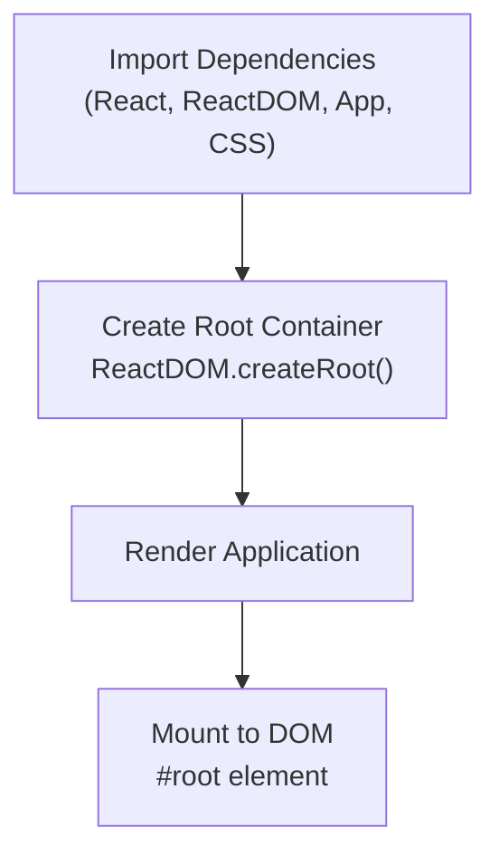
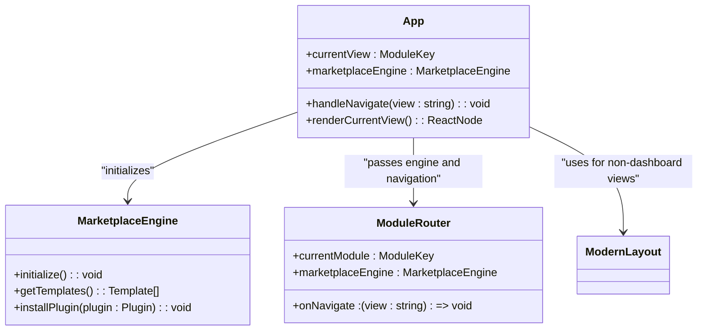
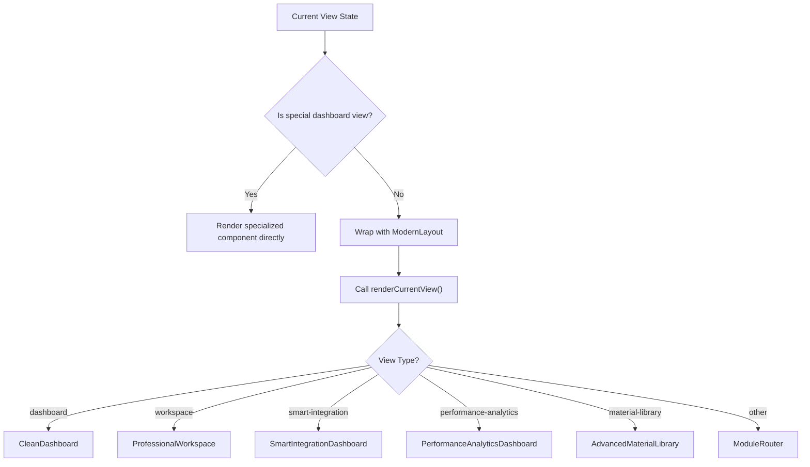
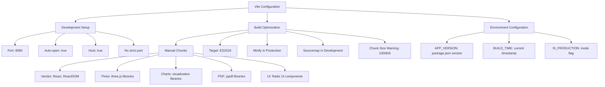
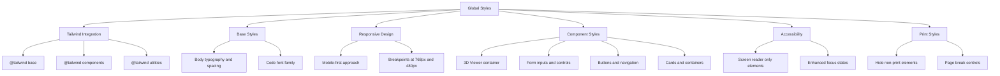
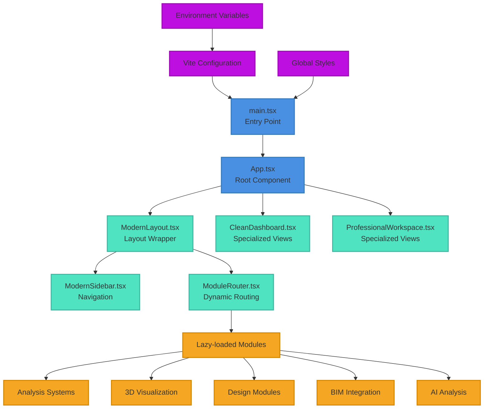

# Application Entry Points

<cite>
**Referenced Files in This Document**   
- [main.tsx](file://src/main.tsx)
- [App.tsx](file://src/App.tsx)
- [index.css](file://src/index.css)
- [vite.config.ts](file://vite.config.ts)
- [ModuleRouter.tsx](file://src/components/routing/ModuleRouter.tsx)
- [ModernLayout.tsx](file://src/components/ModernLayout.tsx)
- [ModernSidebar.tsx](file://src/components/ModernSidebar.tsx)
</cite>

## Table of Contents
1. [Introduction](#introduction)
2. [Main Entry Point: main.tsx](#main-entry-point-maintsx)
3. [Root Component: App.tsx](#root-component-apptsx)
4. [Conditional Rendering Logic](#conditional-rendering-logic)
5. [Vite Integration](#vite-integration)
6. [Global Styles and Environment](#global-styles-and-environment)
7. [Architecture Overview](#architecture-overview)
8. [Conclusion](#conclusion)

## Introduction
This document provides comprehensive documentation for the application entry points of APP-STRUKTUR-BLACKBOX, a structural analysis system with educational capabilities. The documentation focuses on the initialization process, component hierarchy, routing mechanism, and build configuration that enable the application to function as a unified platform for structural engineering analysis and education. The system leverages React for its user interface, Vite for development and build processes, and a modular architecture to organize its extensive feature set.

**Section sources**
- [main.tsx](file://src/main.tsx)
- [App.tsx](file://src/App.tsx)

## Main Entry Point: main.tsx

The `main.tsx` file serves as the primary entry point for the React application, responsible for initializing the React rendering process and mounting the application to the DOM. This file contains the essential bootstrap code that starts the application.

The entry point imports the core React and ReactDOM libraries, the root App component, and the global CSS styles. It uses `ReactDOM.createRoot` to create a root container for the application, targeting the DOM element with the ID 'root' from the index.html file. The application is rendered within React's StrictMode, which helps identify potential problems in the application by running additional checks and warnings during development.

The initialization process is straightforward and follows React 18 conventions, using the modern `createRoot` API instead of the legacy `render` method. This approach provides better performance and supports new React features like concurrent rendering. The entry point does not contain any conditional logic or environment-specific code, ensuring a consistent initialization process across development and production environments.

**Diagram sources**
- [main.tsx](file://src/main.tsx#L1-L10)

**Section sources**
- [main.tsx](file://src/main.tsx#L1-L10)

## Root Component: App.tsx

The `App.tsx` component serves as the root component of the application, orchestrating the overall structure and routing between different system modules. It maintains the application state, particularly the current view, and provides navigation capabilities throughout the system.

The component uses React's `useState` hook to manage the `currentView` state, which determines which module or view is currently displayed. The initial view is set to 'dashboard', providing a consistent starting point for users. The `handleNavigate` function updates this state when users navigate between different parts of the application.

The App component acts as a container that either renders specialized dashboard components directly or wraps other modules with the `ModernLayout` component for consistent presentation. This dual rendering approach allows certain core views to have a simplified presentation while other modules benefit from the full layout with sidebar navigation.

The component imports and initializes the `MarketplaceEngine`, which appears to be a core service for managing marketplace functionality within the application. This engine is passed down to the `ModuleRouter` component when rendering non-dashboard views, suggesting it provides essential services for various modules.

**Diagram sources**
- [App.tsx](file://src/App.tsx#L1-L80)

**Section sources**
- [App.tsx](file://src/App.tsx#L1-L80)

## Conditional Rendering Logic

The application implements a sophisticated conditional rendering system that determines which components to display based on the current view state. This logic is contained within the `App.tsx` component and follows a hierarchical decision-making process.

The rendering logic first checks if the `currentView` matches one of the special dashboard views ('dashboard', 'workspace', 'smart-integration', 'performance-analytics', or 'material-library'). If it does, the corresponding specialized component is rendered directly without the sidebar layout. This approach provides a cleaner interface for these primary workspaces.

For all other views, the application uses a more complex rendering strategy. It wraps the content with the `ModernLayout` component, which provides the sidebar navigation and consistent layout. Within this layout, it calls the `renderCurrentView` function to determine the specific component to display.

The `renderCurrentView` function implements a cascading conditional structure that returns different components based on the `currentView` value:
- Dashboard views render the `CleanDashboard`
- Workspace views render the `ProfessionalWorkspace`
- Smart integration views render the `SmartIntegrationDashboard`
- Performance analytics views render the `PerformanceAnalyticsDashboard`
- Material library views render the `AdvancedMaterialLibrary`
- All other views are handled by the `ModuleRouter`

This conditional rendering system enables the application to maintain a consistent user experience while allowing different modules to have specialized interfaces when needed. The logic ensures that core functional areas have direct access and simplified interfaces, while other modules benefit from the full navigation context.

**Diagram sources**
- [App.tsx](file://src/App.tsx#L14-L77)

**Section sources**
- [App.tsx](file://src/App.tsx#L14-L77)

## Vite Integration

The application leverages Vite as its build tool and development server, configured through the `vite.config.ts` file. This configuration establishes the development environment, build optimizations, and production settings that enable efficient development and optimal performance.

The Vite configuration includes several key features:
- **React Plugin**: Configured with emotion for CSS-in-JS styling, enabling advanced styling capabilities
- **Alias Resolution**: Sets up a '@' alias to resolve to the src directory, simplifying import statements
- **Development Server**: Configured to run on port 8080 with automatic opening and host access
- **Build Optimizations**: Implements code splitting with manual chunks for vendor libraries, three.js, charts, PDF generation, and UI components
- **Environment Variables**: Defines build-time variables for application version, build timestamp, and environment detection

The build configuration is optimized for production, targeting ES2018 JavaScript and enabling minification only in production mode. Source maps are disabled in production for security and size considerations. The configuration also includes chunk size warnings and asset inlining limits to maintain optimal bundle sizes.

The development server is configured to be accessible across the network (host: true) and will not fail if the preferred port is in use (strictPort: false), enhancing developer experience. The optimization dependencies configuration includes a polyfill for Node.js globals, ensuring compatibility with various dependencies.

**Diagram sources**
- [vite.config.ts](file://vite.config.ts#L1-L73)

**Section sources**
- [vite.config.ts](file://vite.config.ts#L1-L73)

## Global Styles and Environment

The application's global styling is managed through the `index.css` file, which serves as the central location for all global CSS rules. This file implements a comprehensive styling system that combines Tailwind CSS with custom CSS rules to create a consistent and responsive user interface.

The global styles are structured in several key sections:
- **Tailwind Directives**: Includes the base, components, and utilities layers from Tailwind CSS
- **Base Styles**: Defines global styles for body, code, and other HTML elements
- **Responsive Design**: Implements mobile-first media queries for different screen sizes
- **Component-Specific Styles**: Provides styling for various UI components including sliders, 3D viewers, grid elements, forms, buttons, cards, tabs, loading states, and accessibility features

The styling system emphasizes touch-friendly interactions with larger touch targets on mobile devices, proper tap highlighting, and responsive feedback through CSS transforms. It also includes accessibility improvements such as screen reader-only elements and enhanced focus states.

The CSS implements a responsive design approach with specific breakpoints for mobile devices (max-width: 768px) and smaller screens (max-width: 480px). This ensures the application is usable across various device sizes, from desktop computers to smartphones.

The styles also include print-specific rules to optimize the application's appearance when printed, hiding non-essential elements and ensuring proper page breaks. This consideration for print output suggests the application may be used for generating reports or documentation.

**Diagram sources**
- [index.css](file://src/index.css#L1-L437)

**Section sources**
- [index.css](file://src/index.css#L1-L437)

## Architecture Overview

The application follows a modular architecture with a clear separation of concerns between the entry point, root component, routing system, and individual modules. This architecture enables the application to manage its complex feature set while maintaining a consistent user experience.

The entry point (`main.tsx`) is minimal and focused solely on initializing the React application and mounting it to the DOM. This separation of concerns ensures that the bootstrap process is reliable and unaffected by changes to the application's business logic.

The root component (`App.tsx`) serves as the central orchestrator, managing application state and routing between different modules. It implements a hybrid navigation approach, using direct rendering for core dashboards and a layout wrapper for other modules. This design provides flexibility in user interface presentation while maintaining consistency where needed.

The routing system is implemented through the `ModuleRouter` component, which uses React's lazy loading and Suspense features for code splitting and performance optimization. The router defines a comprehensive set of modules across various categories including analysis, design, 3D visualization, tools, and utilities.

The application's UI components are organized in a hierarchical structure with reusable components in the `ui` directory and more complex layouts in the main components directory. The `ModernLayout` and `ModernSidebar` components provide a consistent navigation experience across modules, featuring a collapsible sidebar with category-based organization of modules.

The architecture supports both development and production environments through Vite configuration, with appropriate optimizations and feature flags for each environment. The build process generates optimized bundles with code splitting, ensuring fast load times and efficient resource utilization.

**Diagram sources**
- [main.tsx](file://src/main.tsx#L1-L10)
- [App.tsx](file://src/App.tsx#L1-L80)
- [ModernLayout.tsx](file://src/components/ModernLayout.tsx#L1-L35)
- [ModuleRouter.tsx](file://src/components/routing/ModuleRouter.tsx#L1-L410)
- [vite.config.ts](file://vite.config.ts#L1-L73)
- [index.css](file://src/index.css#L1-L437)

**Section sources**
- [main.tsx](file://src/main.tsx#L1-L10)
- [App.tsx](file://src/App.tsx#L1-L80)
- [ModernLayout.tsx](file://src