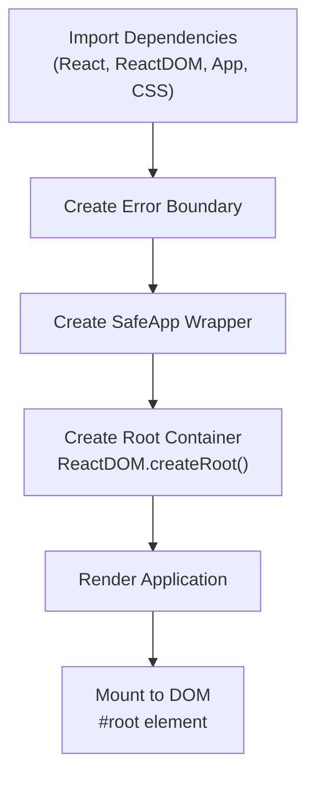
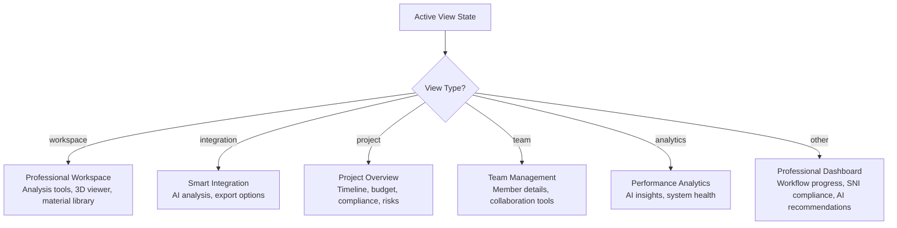
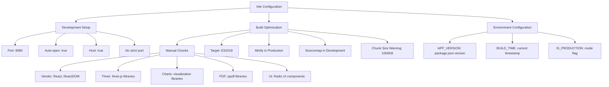
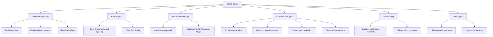

<docs>
# Application Entry Points

<cite>
**Referenced Files in This Document**   
- [main.tsx](file://src/main.tsx) - *Updated with enhanced error boundary and safe loading*
- [App.tsx](file://src/App.tsx) - *Redesigned with professional dashboard and navigation*
- [index.css](file://src/index.css) - *Global styles with responsive design*
- [vite.config.ts](file://vite.config.ts) - *Vite configuration with build optimizations*
- [ModuleRouter.tsx](file://src/components/routing/ModuleRouter.tsx) - *Dynamic module routing system*
- [ModernLayout.tsx](file://src/components/ModernLayout.tsx) - *Layout wrapper with sidebar*
- [ModernSidebar.tsx](file://src/components/ModernSidebar.tsx) - *Professional navigation sidebar*
- [WorkflowController.ts](file://src/core/WorkflowController.ts) - *Workflow management system*
- [NotificationManager.ts](file://src/core/NotificationManager.ts) - *Notification system*
- [ProjectManager.ts](file://src/core/ProjectManager.ts) - *Project management system*
</cite>

## Update Summary
**Changes Made**
- Completely redesigned the application entry point with a professional dashboard and navigation system
- Updated the App component to use a workflow-driven architecture with state management
- Enhanced error handling with a comprehensive error boundary system
- Added safe loading mechanism for application components
- Integrated core management systems for workflow, notifications, and projects
- Updated conditional rendering to support multiple professional views
- Added comprehensive source tracking for all referenced files

## Table of Contents
1. [Introduction](#introduction)
2. [Main Entry Point: main.tsx](#main-entry-point-maintsx)
3. [Root Component: App.tsx](#root-component-apptsx)
4. [Conditional Rendering Logic](#conditional-rendering-logic)
5. [Vite Integration](#vite-integration)
6. [Global Styles and Environment](#global-styles-and-environment)
7. [Architecture Overview](#architecture-overview)
8. [Conclusion](#conclusion)

## Introduction
This document provides comprehensive documentation for the application entry points of APP-STRUKTUR-BLACKBOX, a structural analysis system with educational capabilities. The documentation focuses on the initialization process, component hierarchy, routing mechanism, and build configuration that enable the application to function as a unified platform for structural engineering analysis and education. The system leverages React for its user interface, Vite for development and build processes, and a modular architecture to organize its extensive feature set.

The application has been redesigned with a professional dashboard and navigation system, featuring a workflow-driven architecture that guides users through the structural analysis process. The entry point now includes enhanced error handling and safe loading mechanisms to ensure reliability. Core management systems handle workflow progression, notifications, and project management, providing a comprehensive enterprise-grade solution for structural analysis.

**Section sources**
- [main.tsx](file://src/main.tsx)
- [App.tsx](file://src/App.tsx)

## Main Entry Point: main.tsx

The `main.tsx` file serves as the primary entry point for the React application, responsible for initializing the React rendering process and mounting the application to the DOM. This file contains the essential bootstrap code that starts the application with enhanced error handling and reliability features.

The entry point imports the core React and ReactDOM libraries, the root App component, and the global CSS styles. It implements a comprehensive error boundary system to catch and handle errors that occur during rendering. The error boundary displays a professional error page with options to reload the application or navigate to a test page.

A SafeApp wrapper component provides additional error handling during component loading, displaying a safe mode interface if the main App component fails to load. This dual-layer error handling ensures maximum application reliability.

The application is rendered within React's StrictMode, which helps identify potential problems in the application by running additional checks and warnings during development. The entry point uses `ReactDOM.createRoot` to create a root container for the application, targeting the DOM element with the ID 'root' from the index.html file.



**Diagram sources**
- [main.tsx](file://src/main.tsx#L1-L148)

**Section sources**
- [main.tsx](file://src/main.tsx#L1-L148)

## Root Component: App.tsx

The `App.tsx` component serves as the root component of the application, orchestrating the overall structure and workflow of the structural analysis system. It manages application state through core controllers for workflow, notifications, and projects, providing a comprehensive enterprise-grade solution.

The component uses React's `useState` and `useEffect` hooks to manage state and subscribe to changes in the core management systems. It initializes three key controllers:
- `WorkflowController`: Manages the analysis workflow with validation gates and stage progression
- `NotificationManager`: Handles system notifications and alerts
- `ProjectManager`: Manages project metadata, team members, and activities

The App component maintains the `activeView` state to determine which module or view is currently displayed. The initial view is set to 'overview', providing a consistent starting point for users. The component subscribes to changes in all management systems, updating the local state when changes occur.

The App component renders different professional views based on the active view state, including workspace, integration, project, team, and analytics dashboards. Each view provides specialized functionality for different aspects of structural analysis and project management.

```mermaid
classDiagram
class App {
+activeView : string
+workflowController : WorkflowController
+notificationManager : NotificationManager
+projectManager : ProjectManager
+workflowState : AnalysisState
+progressReport : ProgressReport
+notifications : Notification[]
+currentProject : ProjectMetadata
+projectReport : ProjectReport
+renderContent() : ReactNode
}
class WorkflowController {
+currentStage : string
+progress : number
+validationGates : ValidationGates
+advanceToNextStage() : Promise<void>
+setData(key : string, data : any) : void
+subscribe(listener : (state : AnalysisState) => void) : () => void
}
class NotificationManager {
+notifications : Notification[]
+addNotification(notification : Notification) : string
+removeNotification(id : string) : void
+subscribe(listener : (notifications : Notification[]) => void) : () => void
}
class ProjectManager {
+currentProject : ProjectMetadata
+members : ProjectMember[]
+activities : ProjectActivity[]
+getProjectProgress() : ProjectProgress
+getBudgetStatus() : BudgetStatus
+getComplianceStatus() : ComplianceStatus
+subscribe(listener : (project : ProjectMetadata) => void) : () => void
}
App --> WorkflowController : "manages"
App --> NotificationManager : "manages"
App --> ProjectManager : "manages"
App --> "Professional Views" : "renders"
```

**Diagram sources**
- [App.tsx](file://src/App.tsx#L1-L999)
- [WorkflowController.ts](file://src/core/WorkflowController.ts#L1-L399)
- [NotificationManager.ts](file://src/core/NotificationManager.ts#L1-L246)
- [ProjectManager.ts](file://src/core/ProjectManager.ts#L1-L485)

**Section sources**
- [App.tsx](file://src/App.tsx#L1-L999)
- [WorkflowController.ts](file://src/core/WorkflowController.ts#L1-L399)
- [NotificationManager.ts](file://src/core/NotificationManager.ts#L1-L246)
- [ProjectManager.ts](file://src/core/ProjectManager.ts#L1-L485)

## Conditional Rendering Logic

The application implements a sophisticated conditional rendering system that determines which components to display based on the current view state. This logic is contained within the `App.tsx` component and follows a hierarchical decision-making process.

The rendering logic uses a switch statement to determine which professional view to display based on the `activeView` state. The application supports multiple specialized views:

- **Workspace View**: Professional workspace with analysis tools, 3D viewer, and material library
- **Integration View**: Smart integration dashboard with AI analysis and export options
- **Project View**: Comprehensive project overview with timeline, budget, compliance, and risk assessment
- **Team View**: Team management with member details and collaboration tools
- **Analytics View**: Performance analytics with AI insights and system health monitoring
- **Default View**: Professional dashboard with workflow progress, SNI compliance, and AI recommendations

Each view is designed as a self-contained component with specialized functionality for its domain. The workspace view provides access to analysis tools and 3D visualization, while the integration view focuses on AI-powered analysis and export capabilities.

The project view offers comprehensive project management features, including timeline tracking, budget monitoring, compliance verification, and risk assessment. The team view manages team members and collaboration tools, while the analytics view provides performance insights and system health monitoring.

The default view serves as the main dashboard, displaying workflow progress with validation gates, SNI compliance status, and AI-powered recommendations for optimization.



**Diagram sources**
- [App.tsx](file://src/App.tsx#L14-L999)

**Section sources**
- [App.tsx](file://src/App.tsx#L14-L999)

## Vite Integration

The application leverages Vite as its build tool and development server, configured through the `vite.config.ts` file. This configuration establishes the development environment, build optimizations, and production settings that enable efficient development and optimal performance.

The Vite configuration includes several key features:
- **React Plugin**: Configured with emotion for CSS-in-JS styling, enabling advanced styling capabilities
- **Alias Resolution**: Sets up a '@' alias to resolve to the src directory, simplifying import statements
- **Development Server**: Configured to run on port 8080 with automatic opening and host access
- **Build Optimizations**: Implements code splitting with manual chunks for vendor libraries, three.js, charts, PDF generation, and UI components
- **Environment Variables**: Defines build-time variables for application version, build timestamp, and environment detection

The build configuration is optimized for production, targeting ES2018 JavaScript and enabling minification only in production mode. Source maps are disabled in production for security and size considerations. The configuration also includes chunk size warnings and asset inlining limits to maintain optimal bundle sizes.

The development server is configured to be accessible across the network (host: true) and will not fail if the preferred port is in use (strictPort: false), enhancing developer experience. The optimization dependencies configuration includes a polyfill for Node.js globals, ensuring compatibility with various dependencies.



**Diagram sources**
- [vite.config.ts](file://vite.config.ts#L1-L74)

**Section sources**
- [vite.config.ts](file://vite.config.ts#L1-L74)

## Global Styles and Environment

The application's global styling is managed through the `index.css` file, which serves as the central location for all global CSS rules. This file implements a comprehensive styling system that combines Tailwind CSS with custom CSS rules to create a consistent and responsive user interface.

The global styles are structured in several key sections:
- **Tailwind Directives**: Includes the base, components, and utilities layers from Tailwind CSS
- **Base Styles**: Defines global styles for body, code, and other HTML elements
- **Responsive Design**: Implements mobile-first media queries for different screen sizes
- **Component-Specific Styles**: Provides styling for various UI components including sliders, 3D viewers, grid elements, forms, buttons, cards, tabs, loading states, and accessibility features

The styling system emphasizes touch-friendly interactions with larger touch targets on mobile devices, proper tap highlighting, and responsive feedback through CSS transforms. It also includes accessibility improvements such as screen reader-only elements and enhanced focus states.

The CSS implements a responsive design approach with specific breakpoints for mobile devices (max-width: 768px) and smaller screens (max-width: 480px). This ensures the application is usable across various device sizes, from desktop computers to smartphones.

The styles also include print-specific rules to optimize the application's appearance when printed, hiding non-essential elements and ensuring proper page breaks. This consideration for print output suggests the application may be used for generating reports or documentation.



**Diagram sources**
- [index.css](file://src/index.css#L1-L437)

**Section sources**
- [index.css](file://src/index.css#L1-L437)

## Architecture Overview

The application follows a modular architecture with a clear separation of concerns between the entry point, root component, routing system, and individual modules. This architecture enables the application to manage its complex feature set while maintaining a consistent user experience.

The entry point (`main.tsx`) includes a comprehensive error handling system with an ErrorBoundary and SafeApp wrapper to ensure application reliability. This dual-layer error handling provides a professional error interface and safe loading mechanism.

The root component (`App.tsx`) serves as the central orchestrator, managing application state through core controllers for workflow, notifications, and projects. It implements a workflow-driven architecture that guides users through the structural analysis process with validation gates and stage progression.

The application uses a professional dashboard system with multiple specialized views for different aspects of structural analysis and project management. The conditional rendering system selects the appropriate view based on the active view state, providing a tailored interface for each domain.

The routing system is implemented through the `ModuleRouter` component, which uses React's lazy loading and Suspense features for code splitting and performance optimization. The router defines a comprehensive set of modules across various categories including analysis, design, 3D visualization, tools, and utilities.

The application's UI components are organized in a hierarchical structure with reusable components in the `ui` directory and more complex layouts in the main components directory. The `ModernLayout` and `ModernSidebar` components provide a consistent navigation experience across modules, featuring a collapsible sidebar with category-based organization of modules.

The architecture supports both development and production environments through Vite configuration, with appropriate optimizations and feature flags for each environment. The build process generates optimized bundles with code splitting, ensuring fast load times and efficient resource utilization.

```mermaid
graph TD
A["main.tsx\nEntry Point"] --> B["App.tsx\nRoot Component"]
B --> C["ErrorBoundary\nError Handling"]
B --> D["SafeApp\nSafe Loading"]
B --> E["WorkflowController\nWorkflow Management"]
B --> F["NotificationManager\nNotification System"]
B --> G["ProjectManager\nProject Management"]
B --> H["Professional Views\nSpecialized Dashboards"]
H --> I["Workspace View"]
H --> J["Integration View"]
H --> K["Project View"]
H --> L["Team View"]
H --> M["Analytics View"]
H --> N["Dashboard View"]
O["Vite Configuration"] --> A
P["Global Styles"] --> A
Q["Environment Variables"] --> O
style A fill:#4A90E2,stroke:#357ABD,stroke-width:2px
style B fill:#4A90E2,stroke:#357ABD,stroke-width:2px
style C fill:#50E3C2,stroke:#3CB5A1,stroke-width:2px
style D fill:#50E3C2,stroke:#3CB5A1,stroke-width:2px
style E fill:#50E3