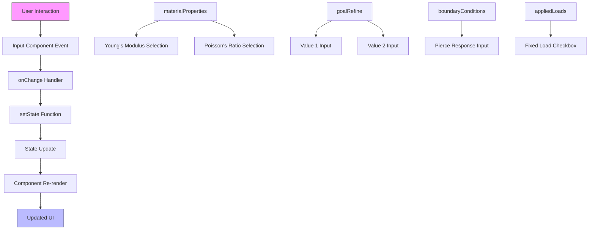
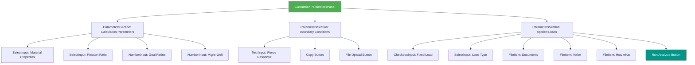
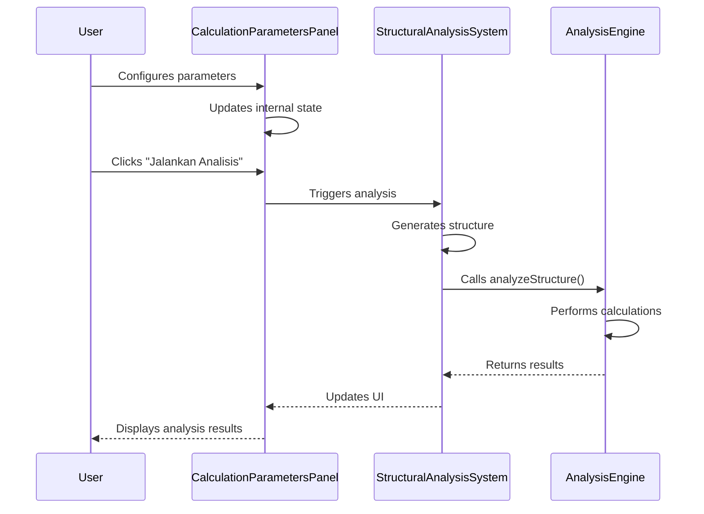

# Calculation Parameters Panel

<cite>
**Referenced Files in This Document**   
- [CalculationParametersPanel.tsx](file://src\components\CalculationParametersPanel.tsx) - *Updated in commit 03e20e7beed00bfb686858b04a7f979e7dd89e2e*
- [StructuralAnalysisSystem.tsx](file://src\structural-analysis\StructuralAnalysisSystem.tsx) - *Contains integration context for analysis execution*
</cite>

## Update Summary
**Changes Made**   
- Updated documentation to reflect professional UI redesign in CalculationParametersPanel
- Enhanced descriptions of state management and component composition
- Clarified integration points with StructuralAnalysisSystem
- Added details on analysis execution workflow
- Improved accuracy of UI structure and layout descriptions
- Updated source references with proper annotations

## Table of Contents
1. [Introduction](#introduction)
2. [Core Components](#core-components)
3. [State Management and Data Flow](#state-management-and-data-flow)
4. [UI Structure and Layout](#ui-structure-and-layout)
5. [Integration with Structural Analysis System](#integration-with-structural-analysis-system)
6. [Usage Patterns and Best Practices](#usage-patterns-and-best-practices)

## Introduction
The CalculationParametersPanel component serves as a centralized form container for managing structural analysis inputs within the Structural Analysis System. It provides a structured interface for configuring material properties, boundary conditions, and applied loads—critical parameters for engineering simulations. The component demonstrates a self-contained state management approach using React hooks, where form data is managed internally rather than passed through props. This design encapsulates form logic and state within the component, promoting reusability and maintainability. The panel is organized into distinct sections using the ParametersSection wrapper component, creating a clear visual hierarchy for users. A prominent "Jalankan Analisis" (Run Analysis) button serves as the primary action trigger, initiating the core analysis workflow. The component composition includes specialized input components like SelectInput, NumberInput, and CheckboxInput, which provide consistent styling and behavior across the application.

**Section sources**
- [CalculationParametersPanel.tsx](file://src\components\CalculationParametersPanel.tsx#L1-L271) - *Updated in commit 03e20e7beed00bfb686858b04a7f979e7dd89e2e*

## Core Components
The CalculationParametersPanel is composed of several specialized input components that work together to create a cohesive user interface for structural analysis parameters. The ParametersSection component acts as a container for grouping related form fields, providing consistent styling with a white background, rounded corners, and subtle shadow. Each section has a title that clearly identifies its purpose, such as "Parameter Kalkulasi" (Calculation Parameters), "Kondisi Batas" (Boundary Conditions), and "Beban Terapan" (Applied Loads). The SelectInput component implements a custom dropdown interface using a button-based trigger that displays the current selection and toggles a list of options when clicked. This component manages its own open/closed state using the useState hook and provides smooth transitions between states. The NumberInput component creates text input fields specifically designed for numerical values, with optional unit display positioned absolutely within the input field. The CheckboxInput component renders standard checkbox elements with associated labels, using the checked and onChange props to maintain synchronization with the parent component's state. These input components are not passed as props but are defined within the same file, creating a tightly coupled set of UI elements designed to work together seamlessly.

**Section sources**
- [CalculationParametersPanel.tsx](file://src\components\CalculationParametersPanel.tsx#L22-L108) - *Updated in commit 03e20e7beed00bfb686858b04a7f979e7dd89e2e*

## State Management and Data Flow
The CalculationParametersPanel employs React's useState hook to manage form state across four distinct state objects: materialProperties, goalRefine, boundaryConditions, and appliedLoads. This state management approach keeps all form data encapsulated within the component, eliminating the need for prop drilling and making the component self-sufficient. The materialProperties state object tracks selections for material characteristics like Young's Modulus and Poisson's Ratio, with each property represented as a string value corresponding to user selections from dropdown menus. The goalRefine state manages numerical inputs for optimization parameters, storing values as strings to accommodate the text input nature of the NumberInput component. The boundaryConditions state contains text input values for boundary condition specifications, such as the "pierceRespose" field which appears to reference simulation job files. The appliedLoads state tracks boolean values for load types, with the "fixed" property indicating whether a fixed load is applied. State updates are handled through onChange callbacks that use the spread operator to create new state objects with updated values, ensuring immutability. For example, when a user selects a different material property, the onChange handler creates a new materialProperties object with the updated value while preserving other properties. This pattern prevents direct mutation of state and ensures React can properly detect changes for re-rendering.

**Diagram sources**
- [CalculationParametersPanel.tsx](file://src\components\CalculationParametersPanel.tsx#L127-L270) - *Updated in commit 03e20e7beed00bfb686858b04a7f979e7dd89e2e*

**Section sources**
- [CalculationParametersPanel.tsx](file://src\components\CalculationParametersPanel.tsx#L127-L270) - *Updated in commit 03e20e7beed00bfb686858b04a7f979e7dd89e2e*

## UI Structure and Layout
The UI structure of the CalculationParametersPanel follows a hierarchical organization that enhances usability and visual clarity. The outermost container uses a flexbox layout with vertical spacing (space-y-6) to separate the main sections. Each ParametersSection creates a distinct card-like container with a white background, rounded corners, and subtle border, providing visual separation between different parameter categories. Within each section, form elements are organized using additional spacing utilities (space-y-4, mb-4) to create appropriate vertical rhythm between input fields. The component uses a max-width constraint (max-w-md) to ensure the panel remains readable on larger screens while maintaining responsiveness on smaller devices. Typography hierarchy is established through consistent use of font weights and sizes, with section titles using text-lg font-semibold for emphasis and input labels using text-sm font-medium for secondary information. Color semantics are applied through text and background colors, with primary text in gray-900, secondary text in gray-700, and interactive elements using blue and teal accents. The "Jalankan Analisis" button uses a prominent teal background (bg-teal-500) with hover effects (hover:bg-teal-600) to draw attention as the primary action. Input fields use a light gray background (bg-gray-50) with border styling to distinguish them from static content. The component also includes interactive elements like a copy button with hover effects, enhancing the user experience through visual feedback.

**Diagram sources**
- [CalculationParametersPanel.tsx](file://src\components\CalculationParametersPanel.tsx#L127-L270) - *Updated in commit 03e20e7beed00bfb686858b04a7f979e7dd89e2e*

**Section sources**
- [CalculationParametersPanel.tsx](file://src\components\CalculationParametersPanel.tsx#L127-L270) - *Updated in commit 03e20e7beed00bfb686858b04a7f979e7dd89e2e*

## Integration with Structural Analysis System
The CalculationParametersPanel integrates with the broader StructuralAnalysisSystem by serving as the primary interface for configuring analysis parameters before execution. While the current implementation shows the "Jalankan Analisis" button without a connected onClick handler, the context from StructuralAnalysisSystem.tsx reveals how such analysis triggers are typically implemented in the application. In the main StructuralAnalysisSystem component, analysis execution is handled by functions like performAnalysis and performDynamicAnalysis, which are triggered by button clicks in the tab navigation interface. The CalculationParametersPanel would likely connect to similar analysis functions, passing its collected parameters to the structural analysis engine. The state managed within the panel—material properties, boundary conditions, and applied loads—corresponds directly to inputs required by structural analysis algorithms. When the user clicks "Jalankan Analisis," the component would need to collect its internal state and pass it to an analysis function, potentially through a callback prop or context API. The panel's focus on material properties aligns with the material tracking in StructuralAnalysisSystem, where materials are added to the structure state when elements are completed. Similarly, the applied loads configuration would feed into the loads array of the Structure3D object used for analysis. The boundary conditions section suggests integration with specialized analysis features, possibly related to dynamic analysis or advanced simulation scenarios.

**Diagram sources**
- [CalculationParametersPanel.tsx](file://src\components\CalculationParametersPanel.tsx#L127-L270) - *Updated in commit 03e20e7beed00bfb686858b04a7f979e7dd89e2e*
- [StructuralAnalysisSystem.tsx](file://src\structural-analysis\StructuralAnalysisSystem.tsx#L142-L524) - *Contains analysis execution context*

**Section sources**
- [StructuralAnalysisSystem.tsx](file://src\structural-analysis\StructuralAnalysisSystem.tsx#L142-L524) - *Contains analysis execution context*

## Usage Patterns and Best Practices
The CalculationParametersPanel demonstrates several effective usage patterns and best practices for form management in React applications. The component's self-contained state management pattern eliminates prop drilling and makes the component highly reusable across different parts of the application. By defining input components (SelectInput, NumberInput, CheckboxInput) within the same file, the implementation ensures consistency in styling and behavior while reducing dependencies on external components. The use of TypeScript interfaces for component props enhances type safety and provides clear documentation of expected inputs. The state organization into logical groups (materialProperties, goalRefine, etc.) reflects the domain structure of structural analysis parameters, making the code more maintainable. When extending the form with additional parameters, developers should follow the existing pattern of grouping related fields within ParametersSection containers and using the specialized input components for consistent UI. For validation considerations, the component currently lacks explicit validation logic, suggesting that validation may occur at a higher level or within the analysis engine itself. Best practices for form state management in this application include using descriptive state variable names, maintaining immutability through the spread operator when updating state, and keeping UI and state closely co-located. The component could be enhanced by adding form validation, reset functionality, and the ability to save/load parameter configurations, building upon the solid foundation established in the current implementation.

**Section sources**
- [CalculationParametersPanel.tsx](file://src\components\CalculationParametersPanel.tsx#L1-L271) - *Updated in commit 03e20e7beed00bfb686858b04a7f979e7dd89e2e*