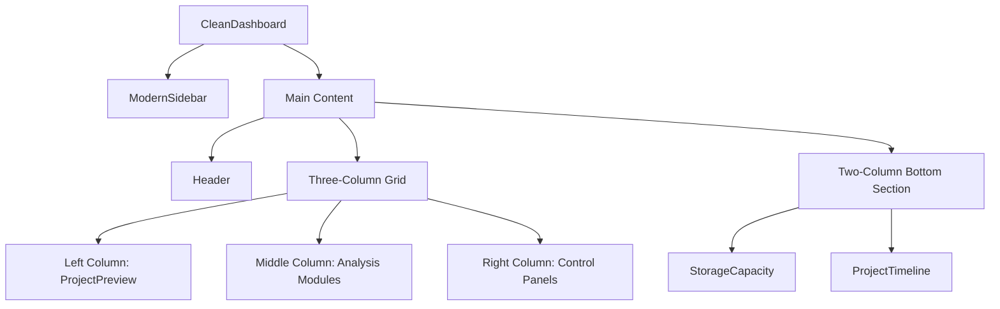
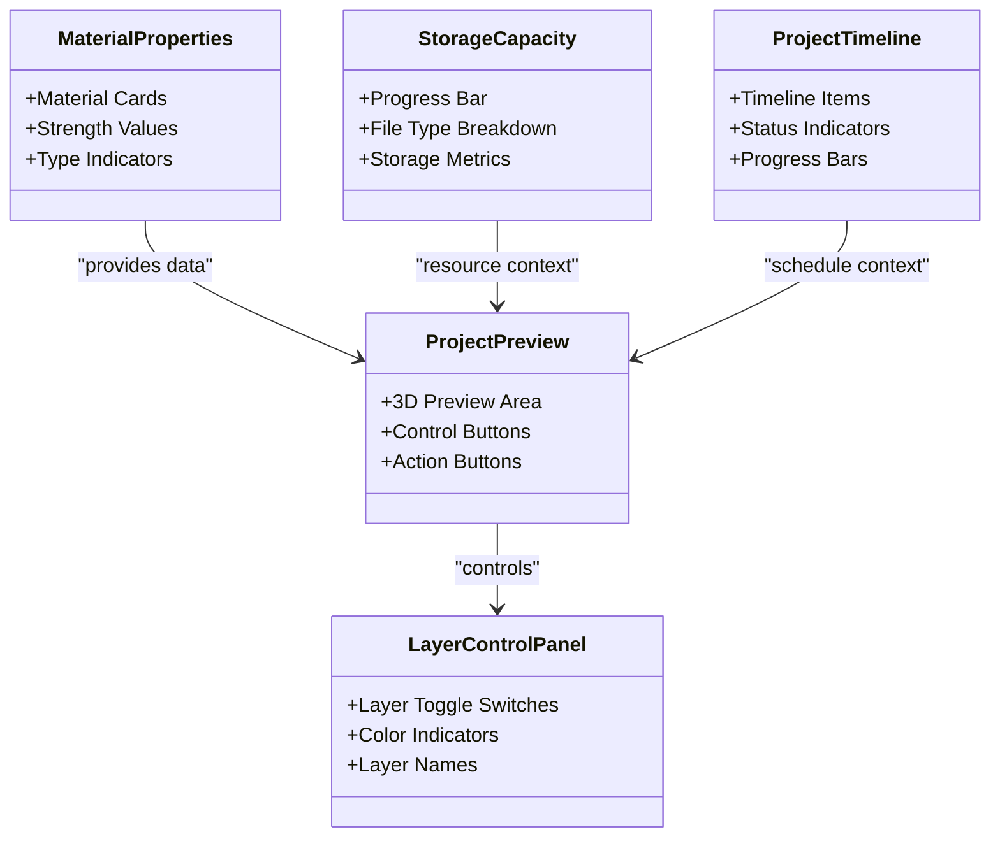
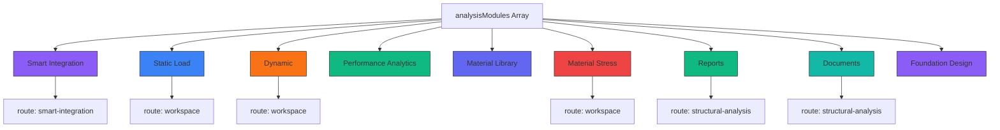
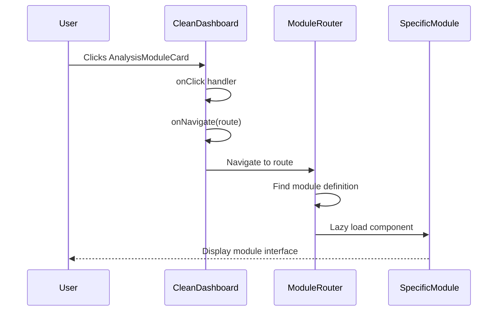

<docs>
# Clean Dashboard

<cite>
**Referenced Files in This Document**   
- [CleanDashboard.tsx](file://src/components/CleanDashboard.tsx) - *Updated in recent commit*
- [ModernDashboard.tsx](file://src/components/ModernDashboard.tsx)
- [ModuleRouter.tsx](file://src/components/routing/ModuleRouter.tsx)
- [SmartIntegrationDashboard.tsx](file://src/components/SmartIntegrationDashboard.tsx) - *New feature implementation*
- [PerformanceAnalyticsDashboard.tsx](file://src/components/PerformanceAnalyticsDashboard.tsx) - *New feature implementation*
- [AdvancedMaterialLibrary.tsx](file://src/components/AdvancedMaterialLibrary.tsx) - *New feature implementation*
</cite>

## Update Summary
**Changes Made**   
- Updated documentation to reflect the professional styling and enhanced UI components introduced in the recent commit
- Added detailed explanations of new analysis modules: Smart Integration, Performance Analytics, and Material Library
- Enhanced navigation system documentation with route mapping details for new modules
- Updated component integration examples with concrete implementations from the codebase
- Added guidance on dashboard customization and extension based on the modular configuration
- Improved comparison with ModernDashboard to highlight design philosophy differences

## Table of Contents
1. [Introduction](#introduction)
2. [Layout Structure](#layout-structure)
3. [Core Components](#core-components)
4. [Analysis Modules Configuration](#analysis-modules-configuration)
5. [Navigation System](#navigation-system)
6. [Responsive Design](#responsive-design)
7. [Header Functionality](#header-functionality)
8. [Customization and Extension](#customization-and-extension)
9. [Comparison with ModernDashboard](#comparison-with-moderndashboard)
10. [Conclusion](#conclusion)

## Introduction

The CleanDashboard component represents a minimalist, sidebar-based interface for structural analysis applications. Designed with a clean aesthetic and intuitive navigation, this dashboard provides users with immediate access to key analysis modules and project information. The implementation focuses on simplicity and efficiency, making it ideal for users who prefer a straightforward interface without the visual complexity of glassmorphism or gradient effects.

The CleanDashboard serves as an entry point to various structural analysis functionalities, organizing them into easily accessible modules while maintaining a professional appearance. Its design philosophy emphasizes clarity and direct access to tools, reducing cognitive load for engineers and analysts who need to quickly navigate between different analysis types. The recent redesign enhances the professional styling with improved UI components while preserving the minimalist approach.

**Section sources**
- [CleanDashboard.tsx](file://src/components/CleanDashboard.tsx#L375-L528) - *Updated in recent commit*

## Layout Structure

The CleanDashboard employs a three-column grid system that optimizes screen real estate while maintaining visual hierarchy. The layout is built around a fixed-width sidebar on the left, with the main content area occupying the remaining space. This structure ensures consistent navigation while allowing flexible content organization in the primary workspace.

The main grid layout divides the content area into three equal columns on large screens (using `lg:grid-cols-3`), creating a balanced distribution of information. On smaller screens, the layout collapses to a single column to maintain usability on mobile devices. The left column contains the ProjectPreview component, which displays 3D model visualization and control options. The middle column houses the analysis modules as interactive cards, providing quick access to different analysis types. The right column contains supplementary information panels including LayerControlPanel and MaterialProperties.

Below the main grid, a secondary two-column layout displays StorageCapacity and ProjectTimeline components, providing additional project metadata and resource information. This hierarchical organization groups related functionality together while maintaining visual separation between primary controls and secondary information.

**Diagram sources**
- [CleanDashboard.tsx](file://src/components/CleanDashboard.tsx#L375-L528) - *Updated in recent commit*

**Section sources**
- [CleanDashboard.tsx](file://src/components/CleanDashboard.tsx#L375-L528) - *Updated in recent commit*

## Core Components

The CleanDashboard integrates several specialized components that work together to provide a comprehensive structural analysis interface. Each component serves a specific purpose in the workflow, from project visualization to material management.

The ProjectPreview component provides a dedicated space for 3D model visualization, featuring a large preview area with control buttons for playback and grid display. It includes action buttons for adding new elements and maximizing the view, allowing users to interact with the structural model directly from the dashboard.

The LayerControlPanel component enables users to manage visibility of different structural layers such as steel, concrete, HVAC, and electrical systems. Each layer is represented with a toggle switch and color indicator, allowing quick on/off control of specific building systems. This functionality is essential for analyzing individual components within complex structural assemblies.

The MaterialProperties component displays key material characteristics including strength values and material types. It presents information in a card-based format with visual indicators for different material categories, making it easy to identify and compare material specifications at a glance.

Additional components include StorageCapacity, which shows current storage usage with a progress bar and file type breakdown, and ProjectTimeline, which visualizes project milestones with completion status indicators. These components provide contextual information about the project's progress and resource utilization.

**Diagram sources**
- [CleanDashboard.tsx](file://src/components/CleanDashboard.tsx#L135-L372) - *Updated in recent commit*

**Section sources**
- [CleanDashboard.tsx](file://src/components/CleanDashboard.tsx#L135-L372) - *Updated in recent commit*

## Analysis Modules Configuration

The analysisModules configuration in CleanDashboard defines a collection of nine distinct analysis capabilities accessible from the main interface. Each module is represented as an object containing properties for title, icon, color, description, and route mapping. This configuration drives the dynamic rendering of AnalysisModuleCard components in the middle column of the dashboard.

The modules include Smart Integration (AI + BIM + Advanced Analysis), Static Load analysis, Dynamic analysis, Performance Analytics, Material Library, Material Stress analysis, Reports, Documents management, and Foundation Design. Each module is assigned a unique color class from Tailwind's palette (e.g., bg-purple-500, bg-blue-500) that provides visual differentiation while maintaining a cohesive design language.

The configuration serves as both a navigation menu and an overview of available capabilities, allowing users to quickly identify and access different analysis types. The route property determines where each module navigates when clicked, typically mapping to specific workspace views or analysis systems. For example, Static Load, Dynamic, and Material Stress modules all route to the 'workspace' view, indicating they share the same underlying workspace implementation.

This modular configuration approach enables easy extension or modification of available analysis types without requiring changes to the core dashboard structure. New modules can be added by simply extending the array with appropriate configuration objects, following the established pattern.

**Diagram sources**
- [CleanDashboard.tsx](file://src/components/CleanDashboard.tsx#L375-L528) - *Updated in recent commit*

**Section sources**
- [CleanDashboard.tsx](file://src/components/CleanDashboard.tsx#L375-L528) - *Updated in recent commit*

## Navigation System

The CleanDashboard implements a dual-layer navigation system consisting of a persistent sidebar and dynamic module routing. The navigation is controlled through the onNavigate callback function passed as a prop, which enables communication between the dashboard and parent routing components.

The ModernSidebar component provides primary navigation with six fixed items: dashboard, structural-analysis, 3d-viewer, calculator, reports, and settings. Each sidebar item corresponds to a specific view within the application, allowing users to switch between major sections. The sidebar uses visual indicators to show the active view, with the current selection highlighted in white against a dark background.

The analysis modules in the main content area provide secondary navigation to specific analysis capabilities. When a user clicks on an AnalysisModuleCard, the onClick handler invokes the onNavigate function with the module's route value. This routes the application to the appropriate workspace or analysis system, such as 'workspace' for structural analysis modules or 'structural-analysis' for reporting functions.

The navigation system is integrated with the ModuleRouter component, which maps route strings to specific React components using lazy loading. This ensures efficient loading of modules only when needed, improving application performance. The routing configuration in ModuleRouter.tsx defines the complete set of available modules and their corresponding components, serving as the central navigation registry for the entire application.

**Diagram sources**
- [CleanDashboard.tsx](file://src/components/CleanDashboard.tsx#L375-L528) - *Updated in recent commit*
- [ModuleRouter.tsx](file://src/components/routing/ModuleRouter.tsx#L9-L409)

**Section sources**
- [CleanDashboard.tsx](file://src/components/CleanDashboard.tsx#L375-L528) - *Updated in recent commit*
- [ModuleRouter.tsx](file://src/components/routing/ModuleRouter.tsx#L9-L409)

## Responsive Design

The CleanDashboard implements responsive design principles through Tailwind CSS's responsive utility classes, ensuring optimal display across different screen sizes. The layout adapts to viewport dimensions by modifying the grid structure and element sizing at specific breakpoints.

On large screens (lg breakpoint and above), the main content area uses a three-column grid layout (`lg:grid-cols-3`) to display the ProjectPreview, analysis modules, and control panels side by side. This maximizes screen real estate and allows users to view multiple components simultaneously. On smaller screens, the grid collapses to a single column (`grid-cols-1`), stacking the components vertically for better mobile usability.

The bottom section follows a similar pattern, using a two-column layout on large screens (`lg:grid-cols-2`) that collapses to a single column on smaller devices. This ensures that the StorageCapacity and ProjectTimeline components remain accessible and properly formatted regardless of screen size.

The sidebar