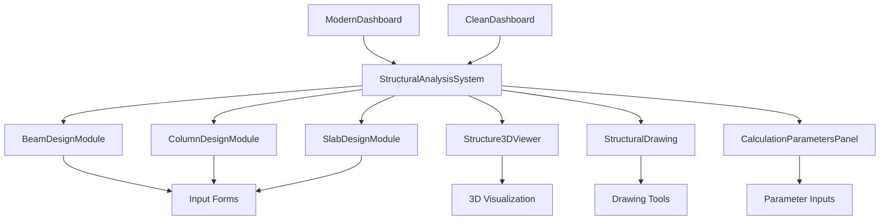
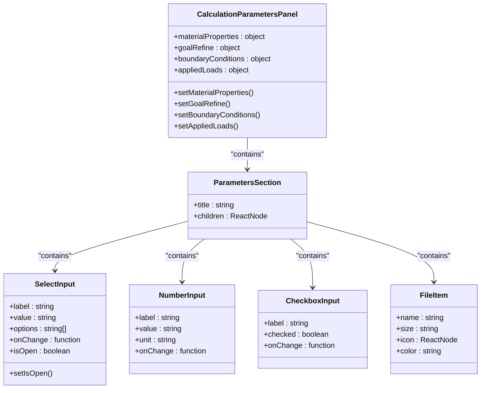
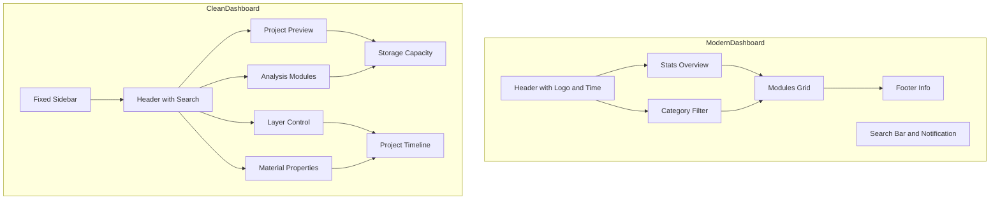
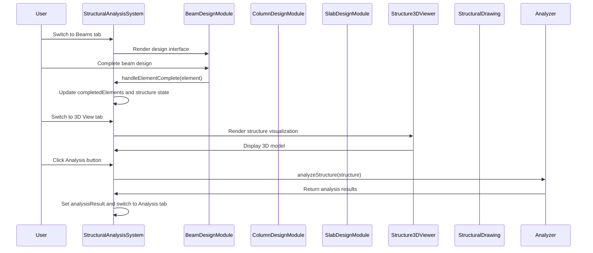
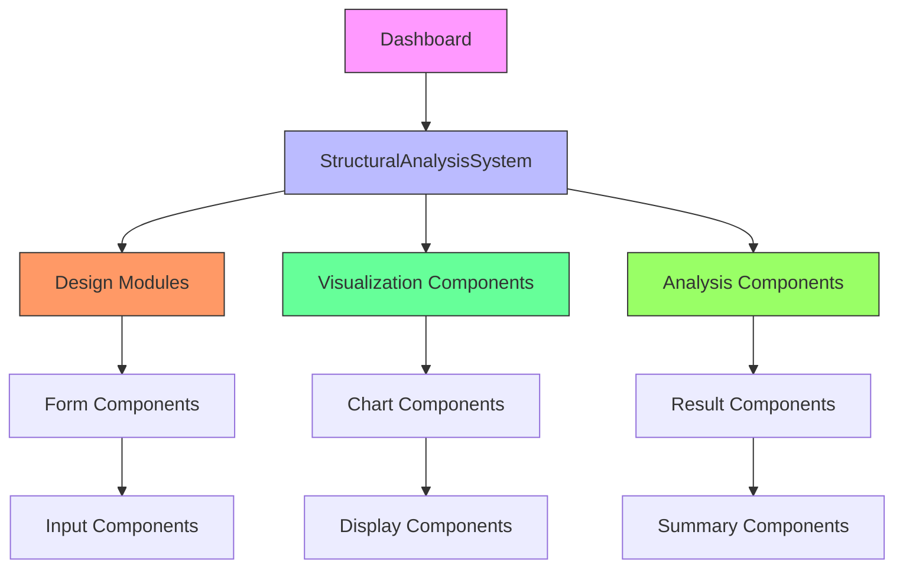

# Component Organization

<cite>
**Referenced Files in This Document**   
- [CalculationParametersPanel.tsx](file://src\components\CalculationParametersPanel.tsx)
- [ModernDashboard.tsx](file://src\components\ModernDashboard.tsx)
- [CleanDashboard.tsx](file://src\components\CleanDashboard.tsx)
- [StructuralAnalysisSystem.tsx](file://src\structural-analysis\StructuralAnalysisSystem.tsx)
</cite>

## Update Summary
**Changes Made**   
- Updated documentation to reflect the professional redesign of dashboard and panel components
- Enhanced descriptions of ModernDashboard's glassmorphism design and comprehensive module integration
- Updated CleanDashboard description with accurate sidebar navigation and three-column layout details
- Improved CalculationParametersPanel documentation with correct section titles and input types
- Added missing callback function documentation in Props Flow section
- Updated architectural diagrams to reflect current component relationships

## Table of Contents
1. [Introduction](#introduction)
2. [Component Architecture Overview](#component-architecture-overview)
3. [Presentational and Container Components](#presentational-and-container-components)
4. [Calculation Parameters Panel](#calculation-parameters-panel)
5. [Dashboard Implementations](#dashboard-implementations)
6. [Structural Analysis System](#structural-analysis-system)
7. [Component Composition Patterns](#component-composition-patterns)
8. [Props Flow and Data Management](#props-flow-and-data-management)
9. [File Structure and Naming Conventions](#file-structure-and-naming-conventions)
10. [Best Practices for Component Organization](#best-practices-for-component-organization)

## Introduction

The APP-STRUKTUR-BLACKBOX codebase implements a sophisticated component organization strategy that separates concerns between presentational and container components while maintaining a clear hierarchy for structural analysis workflows. This documentation details the architectural approach to component organization, focusing on the separation of input logic, data visualization, and UI shell implementations. The system demonstrates a well-structured composition pattern where high-level components orchestrate specialized subcomponents for forms, charts, and controls, with a consistent approach to props passing and state management.

**Section sources**
- [StructuralAnalysisSystem.tsx](file://src\structural-analysis\StructuralAnalysisSystem.tsx#L1-L50)

## Component Architecture Overview

The application follows a component-based architecture with a clear separation between UI presentation and business logic. The core organizational principle revolves around container components that manage state and data flow, and presentational components that focus on rendering UI elements. This separation enables reusability, testability, and maintainability across the codebase.

The architecture features multiple dashboard implementations that serve as alternative UI shells for different user workflows, with ModernDashboard providing a glassmorphism design and CleanDashboard offering a minimalist interface. These dashboards act as entry points to the structural analysis system, which encapsulates the core functionality for designing and analyzing structural elements.

The component hierarchy follows a top-down approach where the StructuralAnalysisSystem component serves as the central orchestrator, coordinating specialized subcomponents for beams, columns, slabs, 3D visualization, and structural drawing. This composition pattern allows for modular development and easy extension of functionality.

**Diagram sources**
- [ModernDashboard.tsx](file://src\components\ModernDashboard.tsx#L40-L289)
- [CleanDashboard.tsx](file://src\components\CleanDashboard.tsx#L375-L528)
- [StructuralAnalysisSystem.tsx](file://src\structural-analysis\StructuralAnalysisSystem.tsx#L142-L524)

## Presentational and Container Components

The codebase implements a clear distinction between presentational and container components, following React best practices for component organization. Presentational components are primarily concerned with how things look, while container components manage how things work by handling data fetching, state management, and business logic.

Container components like StructuralAnalysisSystem serve as the orchestrators of the application, managing the state of structural elements, handling analysis operations, and coordinating communication between different parts of the system. These components maintain state for completed elements, analysis results, and dynamic analysis status, providing a centralized data source for child components.

Presentational components such as CalculationParametersPanel focus exclusively on rendering UI elements and responding to user interactions. They receive data and callbacks as props from container components and are designed to be reusable and easily testable. This separation allows for independent development and testing of UI components without dependencies on the application's business logic.

The dashboard implementations (ModernDashboard and CleanDashboard) represent a hybrid approach, containing both presentational elements and some container-like responsibilities for navigation and state management. They serve as high-level containers that coordinate access to different analysis modules while maintaining a consistent user experience across different interface styles.

**Section sources**
- [StructuralAnalysisSystem.tsx](file://src\structural-analysis\StructuralAnalysisSystem.tsx#L142-L524)
- [CalculationParametersPanel.tsx](file://src\components\CalculationParametersPanel.tsx#L127-L270)

## Calculation Parameters Panel

The CalculationParametersPanel component encapsulates input logic for structural analysis parameters, providing a focused interface for users to configure calculation settings. This presentational component is organized into distinct sections for calculation parameters, boundary conditions, and applied loads, each with specialized input controls.

The component implements a modular design with reusable subcomponents for different input types:
- SelectInput for dropdown selections with custom styling and open/close state management
- NumberInput for numeric values with optional unit display
- CheckboxInput for boolean options
- FileItem for displaying file information with colored icons

These subcomponents are composed within ParametersSection containers that provide consistent styling and layout for related parameter groups. The panel maintains internal state for material properties, goal refinement settings, boundary conditions, and applied loads, updating these values through callback functions passed as props.

The component's design emphasizes usability with visual feedback for user interactions, including hover effects, focus states, and copy-to-clipboard functionality for boundary condition values. The "Jalankan Analisis" (Run Analysis) button at the bottom provides a clear call-to-action for initiating the analysis process after parameter configuration.

**Diagram sources**
- [CalculationParametersPanel.tsx](file://src\components\CalculationParametersPanel.tsx#L127-L270)

## Dashboard Implementations

The application provides two distinct dashboard implementations—ModernDashboard and CleanDashboard—that serve as alternative UI shells for different user workflows and preferences. These dashboards represent different design philosophies while providing access to the same underlying structural analysis functionality.

### ModernDashboard

The ModernDashboard implements a glassmorphism design aesthetic with translucent elements, subtle shadows, and gradient backgrounds. It features a comprehensive module integration system that displays analysis modules in a grid layout with category filtering. Key characteristics include:

- Professional glassmorphism design with translucent cards and subtle shadows
- Comprehensive module integration with categorized display
- Real-time clock display and search functionality
- Statistics overview with trend indicators
- Category-based filtering of modules
- Responsive grid layout that adapts to different screen sizes

The dashboard organizes modules by category (analysis, 3D visualization, design tools, AI & analytics) and provides quick stats for each category. Users can filter modules by category or search query, with results displayed in a responsive grid that supports hover effects and smooth transitions.

### CleanDashboard

The CleanDashboard offers a minimalist interface with a fixed sidebar navigation and clean white card-based layout. It emphasizes simplicity and intuitive navigation with the following features:

- Fixed sidebar with icon-based navigation and tooltips
- Clean white card-based layout with subtle shadows
- Project preview with 3D model visualization
- Layer control panel for managing visualization layers
- Material properties display with add functionality
- Storage capacity monitoring with progress bar
- Project timeline with completion status

The dashboard uses a three-column layout for the main content area, with project preview on the left, analysis modules in the center, and control panels on the right. The bottom section displays storage capacity and project timeline information, providing users with comprehensive project status at a glance.

Both dashboard implementations serve as entry points to the same structural analysis system, demonstrating the application's flexibility in supporting different user interface preferences while maintaining consistent core functionality.

**Diagram sources**
- [ModernDashboard.tsx](file://src\components\ModernDashboard.tsx#L40-L289)
- [CleanDashboard.tsx](file://src\components\CleanDashboard.tsx#L375-L528)

## Structural Analysis System

The StructuralAnalysisSystem component serves as the central orchestrator for structural analysis workflows, coordinating specialized subcomponents for different aspects of structural design and analysis. This container component manages the state of the structural model, handles analysis operations, and provides a unified interface for users to design and analyze structural elements.

The system implements a tab-based navigation interface that allows users to switch between different design modules (beams, columns, slabs), visualization modes (3D view, drawing), and analysis results. Each tab activates a specific subcomponent that handles the specialized functionality for that aspect of structural analysis.

Key responsibilities of the StructuralAnalysisSystem include:
- Managing state for structural elements, nodes, loads, materials, and sections
- Handling element completion events from design modules
- Generating structure data for visualization
- Performing structural analysis and storing results
- Managing dynamic analysis operations
- Coordinating navigation between different analysis modes

The component receives completed elements from design modules through the handleElementComplete callback, which updates both the completed elements counter and the overall structure state. This ensures that all design work is incorporated into the structural model for subsequent analysis.

When users initiate analysis, the system generates a complete structure object and passes it to the analyzeStructure function, storing the results for display in the analysis tab. Similarly, dynamic analysis operations are coordinated through the performDynamicAnalysis function, which manages loading states and result display.

**Diagram sources**
- [StructuralAnalysisSystem.tsx](file://src\structural-analysis\StructuralAnalysisSystem.tsx#L142-L524)

## Component Composition Patterns

The application employs a sophisticated composition pattern where high-level components orchestrate specialized subcomponents for forms, charts, and controls. This approach enables modular development, reusability, and maintainability across the codebase.

### Hierarchical Composition

The component hierarchy follows a top-down approach with clear parent-child relationships:
- Dashboard components (ModernDashboard, CleanDashboard) serve as top-level containers
- StructuralAnalysisSystem acts as the central orchestrator for analysis workflows
- Specialized design modules (BeamDesignModule, ColumnDesignModule, SlabDesignModule) handle specific element types
- Visualization components (Structure3DViewer, StructuralDrawing) provide different views of the structural model
- Input components (CalculationParametersPanel) manage parameter configuration

This hierarchical structure allows for clear separation of concerns, with each component responsible for a specific aspect of the application's functionality.

### Reusable UI Components

The codebase includes several reusable UI components that are composed across different parts of the application:
- Card, CardHeader, CardTitle, and CardContent for consistent content containers
- Button with variants for different visual styles
- Select with trigger, value, content, and item components for dropdown functionality
- Icon components (Building, Beams, Columns, Slab, Eye, Drawing, Calculator) for consistent visual representation

These components follow a consistent API and styling approach, making them easy to use and maintain across the application.

### State Management Pattern

The application implements a unidirectional data flow pattern where state is managed at the appropriate level and passed down through props:
- StructuralAnalysisSystem manages the primary application state
- State is passed down to child components as props
- Child components communicate state changes through callback functions
- Callbacks are implemented as props that update the parent component's state

This pattern ensures that state changes are predictable and traceable, making the application easier to debug and maintain.

**Diagram sources**
- [StructuralAnalysisSystem.tsx](file://src\structural-analysis\StructuralAnalysisSystem.tsx#L142-L524)
- [CalculationParametersPanel.tsx](file://src\components\CalculationParametersPanel.tsx#L127-L270)

## Props Flow and Data Management

The application implements a well-structured props flow pattern where data and callbacks are passed down from the StructuralAnalysisSystem component to specific UI elements. This unidirectional data flow ensures predictable state management and makes the application easier to debug and maintain.

### Props Passing Strategy

The primary data flow follows this pattern:
1. StructuralAnalysisSystem maintains the central state for the structural model
2. State is passed down to child components as props
3. Child components use callback functions (passed as props) to communicate state changes
4. Parent components update their state and re-render child components with new props

Key props passed down from StructuralAnalysisSystem include:
- activeTab: Controls which module is currently displayed
- structure: The current structural model data
- completedElements: Count and details of designed elements
- analysisResult: Results from structural analysis
- dynamicAnalysisResult: Results from dynamic analysis
- isDynamicAnalyzing: Loading state for dynamic analysis

### Callback Functions

The component implements several callback functions that are passed down to child components:
- handleElementComplete: Callback