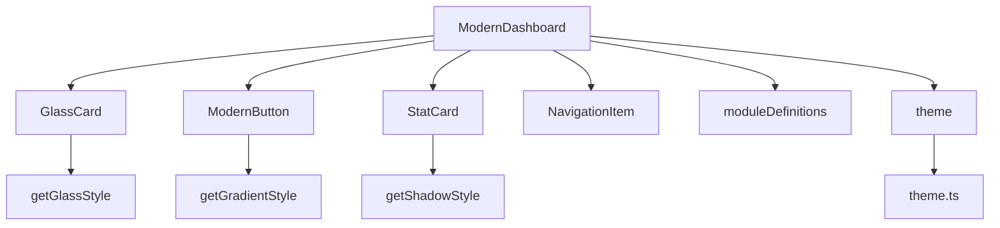
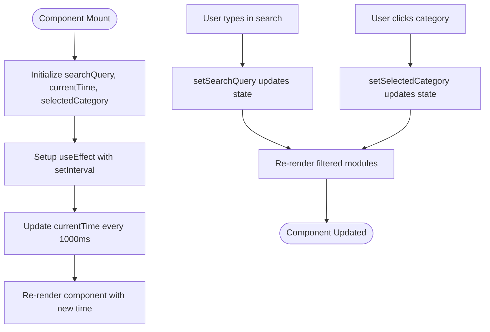
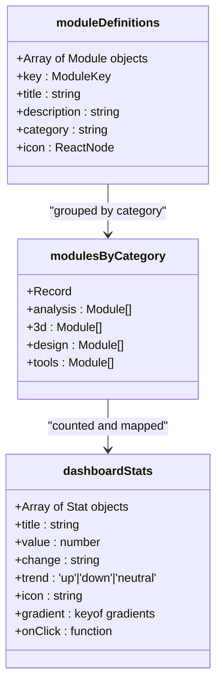
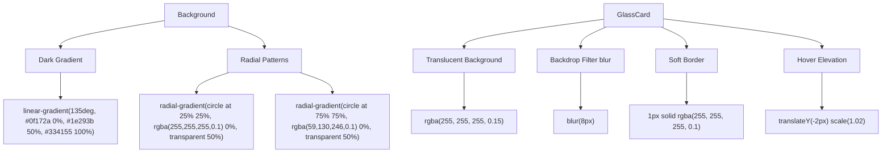
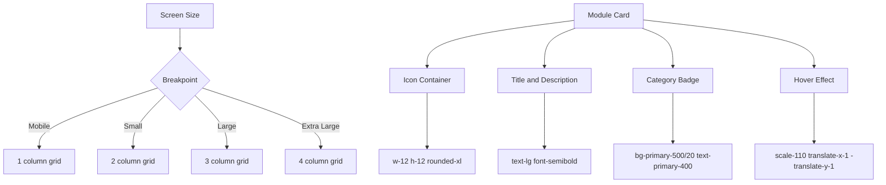
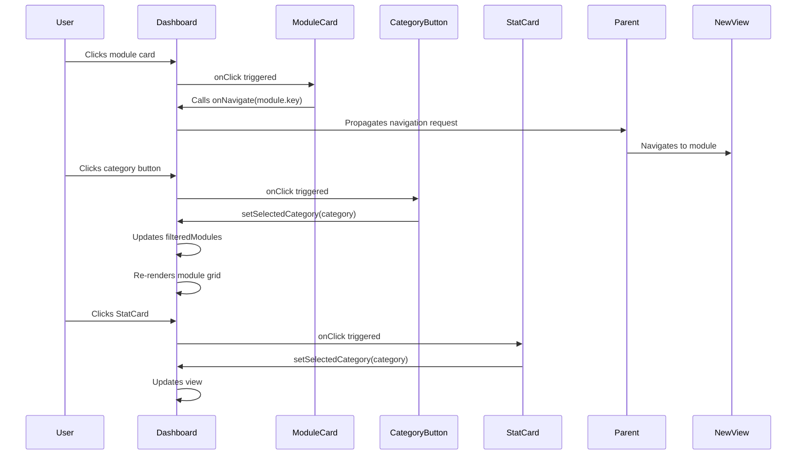

# Modern Dashboard

<cite>
**Referenced Files in This Document**   
- [ModernDashboard.tsx](file://src\components\ModernDashboard.tsx) - *Updated in recent commit*
- [ProfessionalUI.tsx](file://src\components\ui\ProfessionalUI.tsx) - *Updated in recent commit*
- [theme.ts](file://src\styles\theme.ts) - *Updated in recent commit*
- [ModuleRouter.tsx](file://src\components\routing\ModuleRouter.tsx) - *Updated in recent commit*
</cite>

## Update Summary
**Changes Made**   
- Updated all sections to reflect the complete redesign of the ModernDashboard component with professional styling and glassmorphism effects
- Added detailed analysis of the new visual design elements including gradients, shadows, and interactive effects
- Enhanced documentation of state management, data transformation, and navigation systems
- Updated code examples and diagrams to match current implementation
- Added comprehensive analysis of dependencies and theme integration

## Table of Contents
1. [Introduction](#introduction)
2. [Core Components and Architecture](#core-components-and-architecture)
3. [State Management and React Hooks](#state-management-and-react-hooks)
4. [Data Transformation and Module Organization](#data-transformation-and-module-organization)
5. [Visual Design and Glassmorphism Effects](#visual-design-and-glassmorphism-effects)
6. [Responsive Grid Layout and UI Components](#responsive-grid-layout-and-ui-components)
7. [Navigation and Interaction System](#navigation-and-interaction-system)
8. [Real-Time Clock and Dynamic Updates](#real-time-clock-and-dynamic-updates)
9. [Search Functionality and Filtering](#search-functionality-and-filtering)
10. [Customization and Extensibility](#customization-and-extensibility)

## Introduction

The ModernDashboard component is a feature-rich, professional-grade dashboard interface designed for the StructureAI Platform. It provides a centralized hub for accessing various structural analysis, design, visualization, and AI-powered tools. Built with React and styled using a sophisticated glassmorphism design system, the dashboard offers an intuitive, visually appealing, and highly interactive user experience.

It features dynamic module organization, real-time clock updates, search functionality, and responsive layout adaptation across device sizes. The component leverages React hooks for efficient state management and integrates seamlessly with the platform's routing and theme systems.

**Section sources**
- [ModernDashboard.tsx](file://src\components\ModernDashboard.tsx#L40-L289)

## Core Components and Architecture

The ModernDashboard is structured around several key UI components defined in the ProfessionalUI system: GlassCard, ModernButton, StatCard, and NavigationItem. These components are theme-aware and consistently apply the platform's visual language, including gradients, shadows, and glassmorphism effects.

The dashboard's architecture follows a modular design pattern, where functionality is separated into distinct concerns: state management, data transformation, visual presentation, and user interaction. It consumes module definitions from the routing system and dynamically renders them based on user input and selection.



**Diagram sources**
- [ModernDashboard.tsx](file://src\components\ModernDashboard.tsx#L40-L289)
- [ProfessionalUI.tsx](file://src\components\ui\ProfessionalUI.tsx#L1-L397)
- [theme.ts](file://src\styles\theme.ts#L1-L201)

**Section sources**
- [ModernDashboard.tsx](file://src\components\ModernDashboard.tsx#L40-L289)
- [ProfessionalUI.tsx](file://src\components\ui\ProfessionalUI.tsx#L1-L397)

## State Management and React Hooks

The ModernDashboard utilizes React's `useState` and `useEffect` hooks to manage dynamic state and side effects. Three primary state variables are maintained:

- **searchQuery**: Tracks user input in the search bar for real-time filtering.
- **currentTime**: Maintains the current time for the real-time clock display.
- **selectedCategory**: Stores the currently selected module category for filtering.

The `useEffect` hook initializes a one-second interval timer to update the `currentTime` state, ensuring the displayed time remains accurate. This effect is properly cleaned up on component unmount to prevent memory leaks.



**Diagram sources**
- [ModernDashboard.tsx](file://src\components\ModernDashboard.tsx#L45-L55)

**Section sources**
- [ModernDashboard.tsx](file://src\components\ModernDashboard.tsx#L45-L55)

## Data Transformation and Module Organization

The dashboard dynamically organizes modules by category using the `reduce` method on the `moduleDefinitions` array. This transformation creates a dictionary (`modulesByCategory`) where keys are category names and values are arrays of modules belonging to that category.

This grouped data powers both the category filter buttons and the statistical overview cards. The `dashboardStats` array is programmatically generated, counting modules per category and providing quick access to category-specific views through click handlers.



**Diagram sources**
- [ModernDashboard.tsx](file://src\components\ModernDashboard.tsx#L65-L115)

**Section sources**
- [ModernDashboard.tsx](file://src\components\ModernDashboard.tsx#L65-L115)

## Visual Design and Glassmorphism Effects

The dashboard employs a modern glassmorphism design language characterized by translucent surfaces, soft blur effects, and subtle gradients. The background uses a dark gradient (`theme.gradients.dark`) with radial patterns creating depth and visual interest.

UI components like GlassCard apply layered styling including:
- Semi-transparent backgrounds with backdrop filters
- Subtle borders
- Smooth hover transitions
- Dynamic shadows that elevate on interaction

The color palette is based on a blue-purple gradient scheme, with accent colors used for status indicators and interactive elements. Typography follows a clean, professional hierarchy with appropriate spacing and font weights.



**Diagram sources**
- [ModernDashboard.tsx](file://src\components\ModernDashboard.tsx#L130-L145)
- [ProfessionalUI.tsx](file://src\components\ui\ProfessionalUI.tsx#L10-L50)
- [theme.ts](file://src\styles\theme.ts#L50-L150)

**Section sources**
- [ModernDashboard.tsx](file://src\components\ModernDashboard.tsx#L130-L145)
- [ProfessionalUI.tsx](file://src\components\ui\ProfessionalUI.tsx#L10-L50)
- [theme.ts](file://src\styles\theme.ts#L50-L150)

## Responsive Grid Layout and UI Components

The dashboard implements a responsive grid layout that adapts to different screen sizes:
- 1 column on mobile
- 2 columns on small screens
- 3 columns on large screens
- 4 columns on extra-large screens

Module cards are rendered using the GlassCard component and arranged in a flexible grid. Each card displays the module's icon, title, description, category badge, and interactive hover effects. The footer section provides platform information with additional GlassCard usage.

The layout ensures optimal use of screen space while maintaining readability and touch-friendly tap targets across devices.



**Diagram sources**
- [ModernDashboard.tsx](file://src\components\ModernDashboard.tsx#L250-L280)

**Section sources**
- [ModernDashboard.tsx](file://src\components\ModernDashboard.tsx#L250-L280)

## Navigation and Interaction System

The dashboard features a comprehensive navigation system powered by the `onNavigate` callback prop. Clicking any module card triggers navigation to the corresponding view via this callback.

Category filtering is implemented through a set of ModernButton components that update the `selectedCategory` state. The "All Modules" button resets filtering. Each StatCard also functions as a navigation shortcut to its respective category.

Interactive elements provide visual feedback through hover effects, color changes, and smooth transitions, enhancing user experience and discoverability.



**Diagram sources**
- [ModernDashboard.tsx](file://src\components\ModernDashboard.tsx#L230-L250)

**Section sources**
- [ModernDashboard.tsx](file://src\components\ModernDashboard.tsx#L230-L250)

## Real-Time Clock and Dynamic Updates

The dashboard includes a real-time clock display in the header, showing the current time in Indonesian format (`id-ID`). This is achieved through a `useEffect` hook that sets up a one-second interval timer using `setInterval`.

The `currentTime` state is updated every second, triggering a re-render of the time display. The component properly cleans up the interval on unmount to prevent memory leaks and unnecessary updates.

This feature provides users with immediate feedback on system activity and enhances the professional appearance of the interface.

```mermaid
flowchart TD
A[Component Mount] --> B[Initialize currentTime]
B --> C[Setup useEffect]
C --> D[setInterval every 1000ms]
D --> E[Update currentTime with new Date()]
E --> F[Trigger re-render]
F --> G[Display updated time]
G --> D
H[Component Unmount] --> I[clearInterval]
I --> J[Timer stopped]
```

**Diagram sources**
- [ModernDashboard.tsx](file://src\components\ModernDashboard.tsx#L50-L55)

**Section sources**
- [ModernDashboard.tsx](file://src\components\ModernDashboard.tsx#L50-L55)

## Search Functionality and Filtering

The dashboard implements a two-level filtering system:
1. **Category filtering** via button selection
2. **Text-based search** via the search input field

The search functionality filters modules by both title and description, performing case-insensitive matching against the `searchQuery` state. The filtering is applied after category selection, allowing users to first narrow by category and then search within that subset.

The search bar uses the GlassCard component and includes a Search icon for visual clarity. Input changes are handled in real-time, providing immediate feedback as users type.

```mermaid
flowchart TD
A[User Input] --> B[Update searchQuery]
B --> C[Apply search filter]
C --> D[Filter modules by title/description]
D --> E[Case-insensitive includes check]
E --> F[Return matching modules]
G[Category Selection] --> H[Update selectedCategory]
H --> I[Filter by category]
I --> J[Get modulesByCategory[selectedCategory]]
J --> K[Apply search filter on category subset]
K --> L[Render final module list]
```

**Diagram sources**
- [ModernDashboard.tsx](file://src\components\ModernDashboard.tsx#L120-L130)

**Section sources**
- [ModernDashboard.tsx](file://src\components\ModernDashboard.tsx#L120-L130)

## Customization and Extensibility

The ModernDashboard is designed for easy customization and extension:

**Adding New Module Categories**:
1. Add new modules to `moduleDefinitions` with the desired category
2. The dashboard automatically groups and displays them
3. No code changes required in the dashboard component

**Customizing Visual Theme**:
- Modify the `theme.ts` file to change colors, gradients, and spacing
- Update `theme.gradients` for new color schemes
- Adjust `theme.glass` opacity levels for different translucency

**Integrating New Features**:
- Pass additional props to support new functionality
- Extend the `DashboardProps` interface
- Utilize the existing `onNavigate` system for new views
- Add new StatCard entries for important metrics

The component's modular design and separation of concerns make it highly maintainable and adaptable to future platform enhancements.

**Section sources**
- [ModernDashboard.tsx](file://src\components\ModernDashboard.tsx#L40-L289)
- [ProfessionalUI.tsx](file://src\components\ui\ProfessionalUI.tsx#L1-L397)
- [theme.ts](file://src\styles\theme.ts#L1-L201)