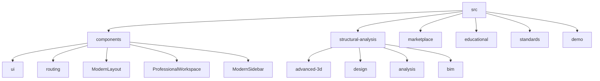
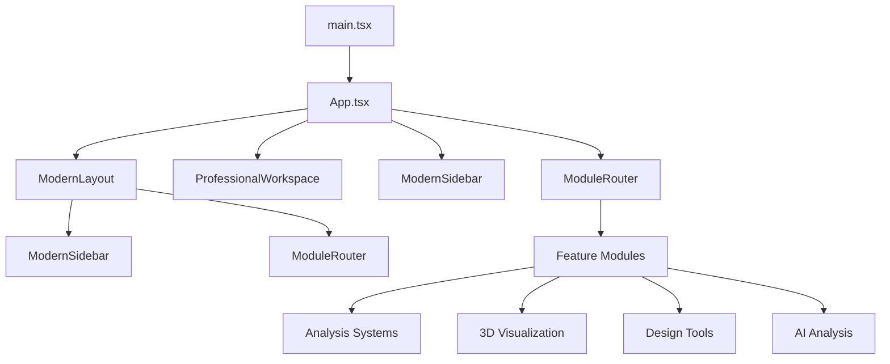
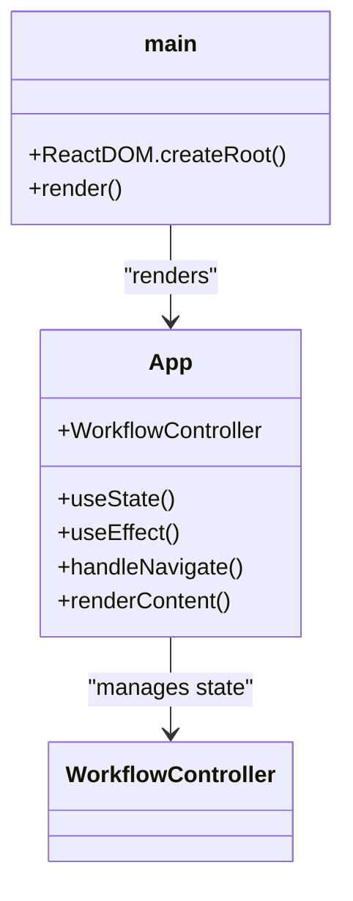
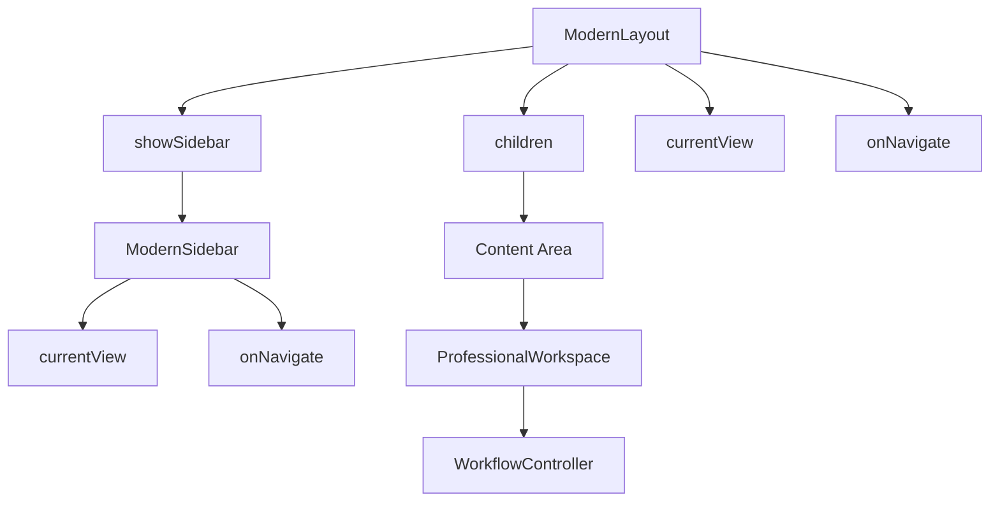
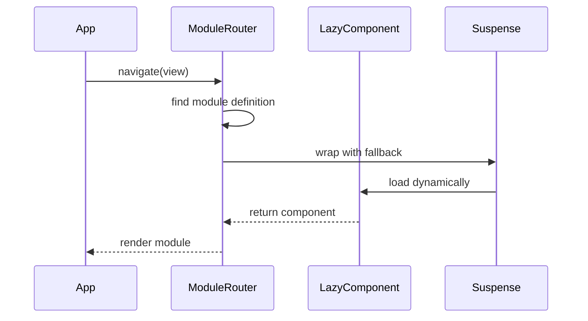
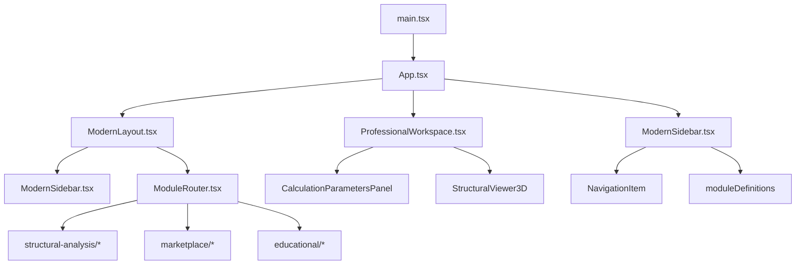

# Core Architecture

<cite>
**Referenced Files in This Document**   
- [main.tsx](file://src\main.tsx)
- [App.tsx](file://src\App.tsx) - *Updated in recent commit*
- [ModernLayout.tsx](file://src\components\ModernLayout.tsx) - *Updated in recent commit*
- [ProfessionalWorkspace.tsx](file://src\components\ProfessionalWorkspace.tsx) - *Updated in recent commit*
- [ModernSidebar.tsx](file://src\components\ModernSidebar.tsx) - *Updated in recent commit*
- [ModuleRouter.tsx](file://src\components\routing\ModuleRouter.tsx) - *Updated in recent commit*
- [theme.ts](file://src\styles\theme.ts)
- [WorkflowController.ts](file://src\core\WorkflowController.ts)
</cite>

## Update Summary
**Changes Made**   
- Updated documentation to reflect the complete redesign of the application layout and navigation system
- Added detailed analysis of the new unified sidebar navigation implementation
- Updated component hierarchy and architecture overview to reflect current structure
- Enhanced description of the ProfessionalWorkspace component and its integration
- Updated ModuleRouter implementation details with new navigation patterns
- Added information about the WorkflowController state management system
- Revised performance considerations to reflect current code splitting and lazy loading strategy

## Table of Contents
1. [Introduction](#introduction)
2. [Project Structure](#project-structure)
3. [Core Components](#core-components)
4. [Architecture Overview](#architecture-overview)
5. [Detailed Component Analysis](#detailed-component-analysis)
6. [Dependency Analysis](#dependency-analysis)
7. [Performance Considerations](#performance-considerations)
8. [Troubleshooting Guide](#troubleshooting-guide)
9. [Conclusion](#conclusion)

## Introduction
The APP-STRUKTUR-BLACKBOX application implements a component-based React architecture with modular organization by feature domains. This documentation provides a comprehensive overview of the core application structure, focusing on the entry points, routing mechanism, UI framework components, and architectural patterns that enable a scalable and maintainable codebase for structural analysis systems. The recent redesign has introduced a unified sidebar navigation system and enhanced professional workspace components, significantly improving the user experience and workflow integration.

## Project Structure

The application follows a feature-based modular organization with clear separation of concerns. The src directory contains components, feature modules, and shared utilities organized in a domain-driven structure.

**Diagram sources**
- [src](file://src)
- [src/components](file://src\components)
- [src/structural-analysis](file://src\structural-analysis)

**Section sources**
- [src](file://src)

## Core Components

The application's core components establish the foundation for the user interface and navigation system. These components include the entry points, layout containers, and routing mechanism that orchestrate the overall application behavior. The recent redesign has introduced a unified sidebar navigation system and enhanced professional workspace components, replacing the previous layout approach.

**Section sources**
- [main.tsx](file://src\main.tsx)
- [App.tsx](file://src\App.tsx) - *Updated in recent commit*
- [ModernLayout.tsx](file://src\components\ModernLayout.tsx) - *Updated in recent commit*
- [ProfessionalWorkspace.tsx](file://src\components\ProfessionalWorkspace.tsx) - *Updated in recent commit*
- [ModernSidebar.tsx](file://src\components\ModernSidebar.tsx) - *Updated in recent commit*

## Architecture Overview

The application architecture follows a component-based React pattern with modular organization by feature domains. The system implements a hierarchical component structure with clear separation between presentation and business logic. The recent redesign has introduced a unified sidebar navigation system that provides consistent access to all application modules.

**Diagram sources**
- [main.tsx](file://src\main.tsx#L1-L10)
- [App.tsx](file://src\App.tsx#L1-L607) - *Updated in recent commit*
- [ModernLayout.tsx](file://src\components\ModernLayout.tsx#L1-L34) - *Updated in recent commit*

## Detailed Component Analysis

### Application Entry Points

The application entry points establish the rendering setup and initial component hierarchy. The main.tsx file serves as the root entry point, while App.tsx manages the application state and routing. The App component now implements a comprehensive workflow management system using the WorkflowController class.

#### Entry Point Analysis

**Diagram sources**
- [main.tsx](file://src\main.tsx#L1-L10)
- [App.tsx](file://src\App.tsx#L1-L607) - *Updated in recent commit*
- [WorkflowController.ts](file://src\core\WorkflowController.ts#L1-L401)

**Section sources**
- [main.tsx](file://src\main.tsx#L1-L10)
- [App.tsx](file://src\App.tsx#L1-L607) - *Updated in recent commit*
- [WorkflowController.ts](file://src\core\WorkflowController.ts#L1-L401)

### ModernLayout and ProfessionalWorkspace Components

The ModernLayout and ProfessionalWorkspace components provide the application shell and user interface framework. These components establish the visual hierarchy and navigation patterns for the application. The recent redesign has enhanced these components with improved glassmorphism effects and a more intuitive navigation system.

#### Layout Component Analysis

**Diagram sources**
- [ModernLayout.tsx](file://src\components\ModernLayout.tsx#L1-L34) - *Updated in recent commit*
- [ProfessionalWorkspace.tsx](file://src\components\ProfessionalWorkspace.tsx#L1-L348) - *Updated in recent commit*
- [ModernSidebar.tsx](file://src\components\ModernSidebar.tsx#L1-L316) - *Updated in recent commit*

**Section sources**
- [ModernLayout.tsx](file://src\components\ModernLayout.tsx#L1-L34) - *Updated in recent commit*
- [ProfessionalWorkspace.tsx](file://src\components\ProfessionalWorkspace.tsx#L1-L348) - *Updated in recent commit*
- [ModernSidebar.tsx](file://src\components\ModernSidebar.tsx#L1-L316) - *Updated in recent commit*

### ModuleRouter Implementation

The ModuleRouter component implements feature navigation and component orchestration through lazy loading and dynamic import patterns. It serves as the central routing mechanism for the application's modular architecture. The component now supports a comprehensive set of modules with enhanced error handling and loading states.

#### Routing System Analysis

**Diagram sources**
- [ModuleRouter.tsx](file://src\components\routing\ModuleRouter.tsx#L1-L409) - *Updated in recent commit*

**Section sources**
- [ModuleRouter.tsx](file://src\components\routing\ModuleRouter.tsx#L1-L409) - *Updated in recent commit*

## Dependency Analysis

The application's dependency structure reveals a well-organized component hierarchy with clear separation between UI presentation and business logic. The architecture leverages React's component composition model to create a maintainable codebase. The recent redesign has improved the dependency structure by centralizing navigation logic in the ModernSidebar component.

**Diagram sources**
- [package.json](file://package.json)
- [src](file://src)

**Section sources**
- [package.json](file://package.json)
- [src](file://src)

## Performance Considerations

The application implements several performance optimization strategies to ensure responsive user experience and efficient resource utilization. These optimizations are critical for handling complex structural analysis computations and 3D visualizations.

### Code Splitting and Lazy Loading
The application leverages React's lazy loading and Suspense features to implement code splitting, reducing initial bundle size and improving load times. The ModuleRouter component uses dynamic imports to load feature modules on demand, with a custom loading spinner and error handling.

### State Management Approach
The application uses a hybrid state management approach combining React hooks for local component state and a centralized WorkflowController class for global application state. This approach provides a predictable state management solution that supports complex workflow patterns and validation gates.

### Component Optimization
The architecture separates UI presentation components from business logic, enabling better reusability and testability. Presentation components are designed to be pure functions of their props, while container components manage state and data fetching. The use of React.memo and useCallback is recommended for frequently rendered components to prevent unnecessary re-renders.

**Section sources**
- [CompleteStructuralAnalysisSystem.clean.tsx](file://src\structural-analysis\CompleteStructuralAnalysisSystem.clean.tsx#L264-L288)
- [ModuleRouter.tsx](file://src\components\routing\ModuleRouter.tsx#L1-L409) - *Updated in recent commit*
- [WorkflowController.ts](file://src\core\WorkflowController.ts#L1-L401)

## Troubleshooting Guide

When encountering issues with the application architecture, consider the following common problems and solutions:

1. **Module loading failures**: Verify that the module key in ModuleRouter matches the defined ModuleKey type and that the lazy import path is correct. Check that the component is properly exported from its module.

2. **Layout rendering issues**: Check that the ModernLayout component receives the required props (children, currentView, onNavigate) and that the showSidebar prop is properly set. Ensure that the ModernSidebar component is correctly integrated.

3. **State synchronization problems**: Ensure that navigation callbacks are properly passed through component hierarchies and that state updates are handled with the appropriate React hooks. Verify that the WorkflowController subscriptions are properly managed to prevent memory leaks.

4. **Performance bottlenecks**: Monitor bundle sizes and implement additional code splitting for large feature modules. Consider implementing React.memo for frequently rendered components and optimize expensive calculations in the WorkflowController.

**Section sources**
- [ModuleRouter.tsx](file://src\components\routing\ModuleRouter.tsx#L1-L409) - *Updated in recent commit*
- [App.tsx](file://src\App.tsx#L1-L607) - *Updated in recent commit*
- [ProfessionalWorkspace.tsx](file://src\components\ProfessionalWorkspace.tsx#L1-L348) - *Updated in recent commit*

## Conclusion

The APP-STRUKTUR-BLACKBOX application implements a robust component-based React architecture with modular organization by feature domains. The recent redesign has significantly enhanced the application's layout and navigation system with a unified sidebar approach, improving usability and workflow integration. The design effectively balances the need for a comprehensive structural analysis platform with maintainable code organization. The architecture leverages React's strengths in component composition, state management, and performance optimization to create a scalable foundation for engineering applications. The separation between UI presentation and business logic, combined with lazy loading and code splitting, enables efficient development and deployment of complex features while maintaining good performance characteristics. The introduction of the WorkflowController class provides a centralized state management solution that supports complex validation workflows and progressive data enhancement.