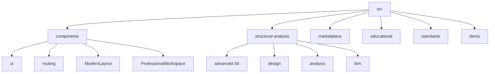
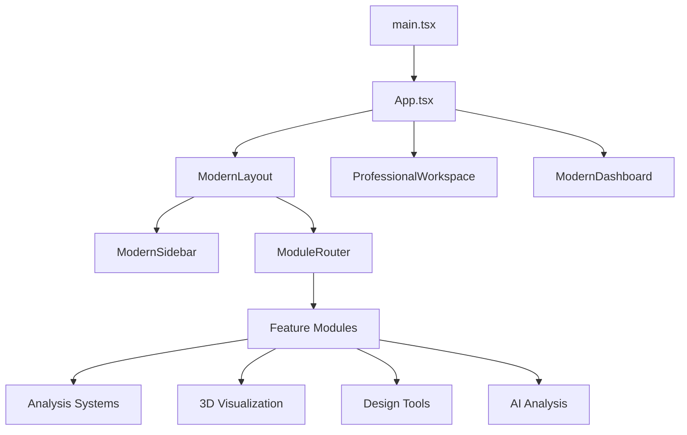
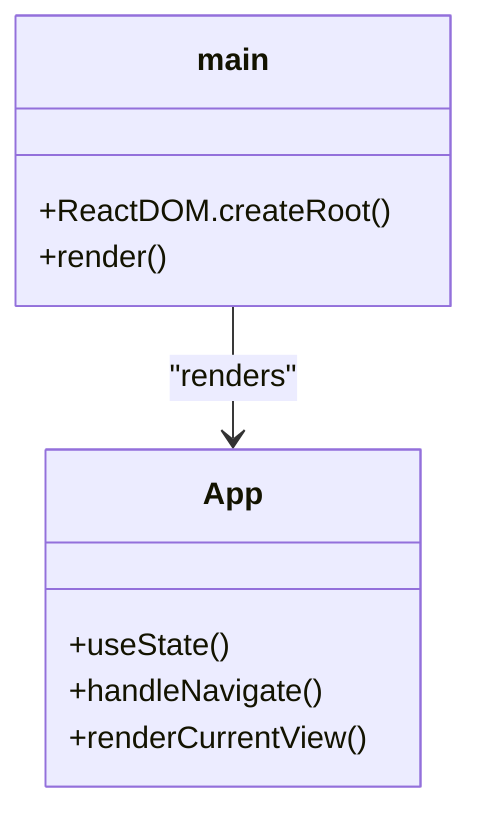
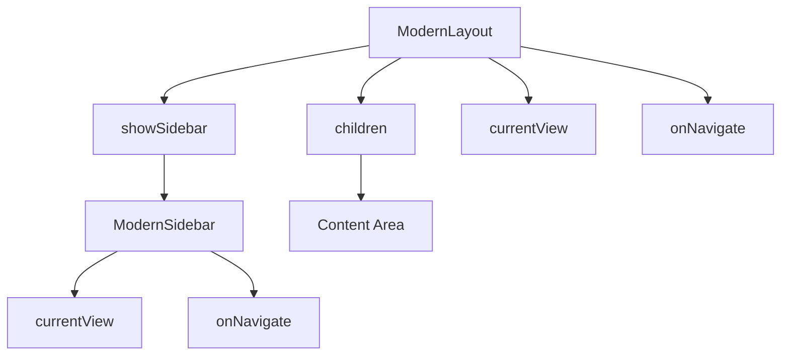
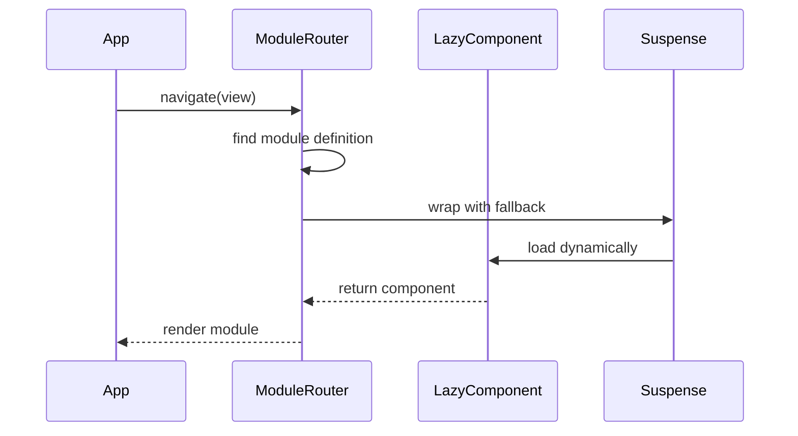
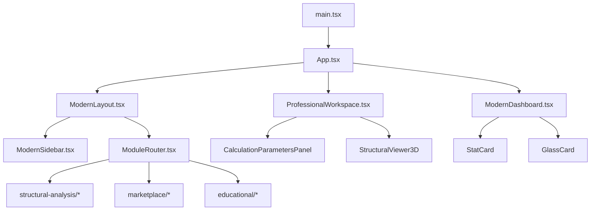

# Core Architecture

<cite>
**Referenced Files in This Document**   
- [main.tsx](file://src/main.tsx)
- [App.tsx](file://src/App.tsx)
- [ModernLayout.tsx](file://src/components/ModernLayout.tsx)
- [ProfessionalWorkspace.tsx](file://src/components/ProfessionalWorkspace.tsx)
- [ModuleRouter.tsx](file://src/components/routing/ModuleRouter.tsx)
- [ModernDashboard.tsx](file://src/components/ModernDashboard.tsx)
- [ModernSidebar.tsx](file://src/components/ModernSidebar.tsx)
- [ProfessionalUI.tsx](file://src/components/ui/ProfessionalUI.tsx)
- [theme.ts](file://src/styles/theme.ts)
</cite>

## Table of Contents
1. [Introduction](#introduction)
2. [Project Structure](#project-structure)
3. [Core Components](#core-components)
4. [Architecture Overview](#architecture-overview)
5. [Detailed Component Analysis](#detailed-component-analysis)
6. [Dependency Analysis](#dependency-analysis)
7. [Performance Considerations](#performance-considerations)
8. [Troubleshooting Guide](#troubleshooting-guide)
9. [Conclusion](#conclusion)

## Introduction
The APP-STRUKTUR-BLACKBOX application implements a component-based React architecture with modular organization by feature domains. This documentation provides a comprehensive overview of the core application structure, focusing on the entry points, routing mechanism, UI framework components, and architectural patterns that enable a scalable and maintainable codebase for structural analysis systems.

## Project Structure

The application follows a feature-based modular organization with clear separation of concerns. The src directory contains components, feature modules, and shared utilities organized in a domain-driven structure.

**Diagram sources**
- [src](file://src)
- [src/components](file://src/components)
- [src/structural-analysis](file://src/structural-analysis)

**Section sources**
- [src](file://src)

## Core Components

The application's core components establish the foundation for the user interface and navigation system. These components include the entry points, layout containers, and routing mechanism that orchestrate the overall application behavior.

**Section sources**
- [main.tsx](file://src/main.tsx)
- [App.tsx](file://src/App.tsx)
- [ModernLayout.tsx](file://src/components/ModernLayout.tsx)
- [ProfessionalWorkspace.tsx](file://src/components/ProfessionalWorkspace.tsx)

## Architecture Overview

The application architecture follows a component-based React pattern with modular organization by feature domains. The system implements a hierarchical component structure with clear separation between presentation and business logic.

**Diagram sources**
- [main.tsx](file://src/main.tsx#L1-L10)
- [App.tsx](file://src/App.tsx#L1-L57)
- [ModernLayout.tsx](file://src/components/ModernLayout.tsx#L1-L34)

## Detailed Component Analysis

### Application Entry Points

The application entry points establish the rendering setup and initial component hierarchy. The main.tsx file serves as the root entry point, while App.tsx manages the application state and routing.

#### Entry Point Analysis

**Diagram sources**
- [main.tsx](file://src/main.tsx#L1-L10)
- [App.tsx](file://src/App.tsx#L1-L57)

**Section sources**
- [main.tsx](file://src/main.tsx#L1-L10)
- [App.tsx](file://src/App.tsx#L1-L57)

### ModernLayout and ProfessionalWorkspace Components

The ModernLayout and ProfessionalWorkspace components provide the application shell and user interface framework. These components establish the visual hierarchy and navigation patterns for the application.

#### Layout Component Analysis

**Diagram sources**
- [ModernLayout.tsx](file://src/components/ModernLayout.tsx#L1-L34)
- [ProfessionalWorkspace.tsx](file://src/components/ProfessionalWorkspace.tsx#L1-L348)

**Section sources**
- [ModernLayout.tsx](file://src/components/ModernLayout.tsx#L1-L34)
- [ProfessionalWorkspace.tsx](file://src/components/ProfessionalWorkspace.tsx#L1-L348)

### ModuleRouter Implementation

The ModuleRouter component implements feature navigation and component orchestration through lazy loading and dynamic import patterns. It serves as the central routing mechanism for the application's modular architecture.

#### Routing System Analysis

**Diagram sources**
- [ModuleRouter.tsx](file://src/components/routing/ModuleRouter.tsx#L1-L372)

**Section sources**
- [ModuleRouter.tsx](file://src/components/routing/ModuleRouter.tsx#L1-L372)

## Dependency Analysis

The application's dependency structure reveals a well-organized component hierarchy with clear separation between UI presentation and business logic. The architecture leverages React's component composition model to create a maintainable codebase.

**Diagram sources**
- [package.json](file://package.json)
- [src](file://src)

**Section sources**
- [package.json](file://package.json)
- [src](file://src)

## Performance Considerations

The application implements several performance optimization strategies to ensure responsive user experience and efficient resource utilization. These optimizations are critical for handling complex structural analysis computations and 3D visualizations.

### Code Splitting and Lazy Loading
The application leverages React's lazy loading and Suspense features to implement code splitting, reducing initial bundle size and improving load times. The ModuleRouter component uses dynamic imports to load feature modules on demand.

### State Management Approach
The application uses React hooks for state management, with useState for local component state and context for shared state across component hierarchies. This approach provides a lightweight and predictable state management solution without requiring external libraries.

### Component Optimization
The architecture separates UI presentation components from business logic, enabling better reusability and testability. Presentation components are designed to be pure functions of their props, while container components manage state and data fetching.

**Section sources**
- [CompleteStructuralAnalysisSystem.clean.tsx](file://src/structural-analysis/CompleteStructuralAnalysisSystem.clean.tsx#L264-L288)
- [ModuleRouter.tsx](file://src/components/routing/ModuleRouter.tsx#L1-L372)

## Troubleshooting Guide

When encountering issues with the application architecture, consider the following common problems and solutions:

1. **Module loading failures**: Verify that the module key in ModuleRouter matches the defined ModuleKey type and that the lazy import path is correct.

2. **Layout rendering issues**: Check that the ModernLayout component receives the required props (children, currentView, onNavigate) and that the showSidebar prop is properly set.

3. **State synchronization problems**: Ensure that navigation callbacks are properly passed through component hierarchies and that state updates are handled with the appropriate React hooks.

4. **Performance bottlenecks**: Monitor bundle sizes and implement additional code splitting for large feature modules. Consider implementing React.memo for frequently rendered components.

**Section sources**
- [ModuleRouter.tsx](file://src/components/routing/ModuleRouter.tsx#L1-L372)
- [App.tsx](file://src/App.tsx#L1-L57)
- [ProfessionalWorkspace.tsx](file://src/components/ProfessionalWorkspace.tsx#L1-L348)

## Conclusion

The APP-STRUKTUR-BLACKBOX application implements a robust component-based React architecture with modular organization by feature domains. The design effectively balances the need for a comprehensive structural analysis platform with maintainable code organization. The architecture leverages React's strengths in component composition, state management, and performance optimization to create a scalable foundation for engineering applications. The separation between UI presentation and business logic, combined with lazy loading and code splitting, enables efficient development and deployment of complex features while maintaining good performance characteristics.