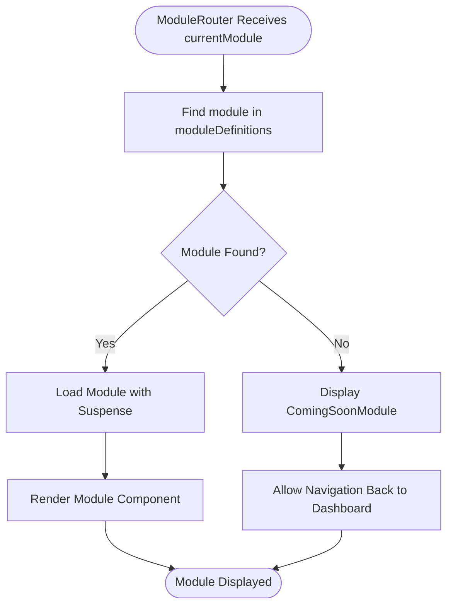
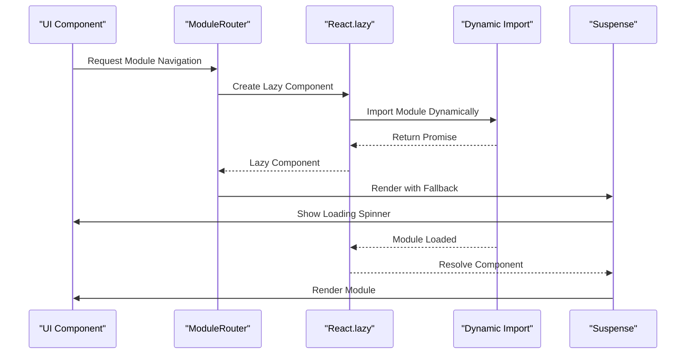
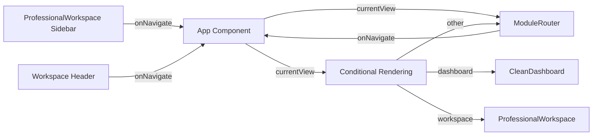
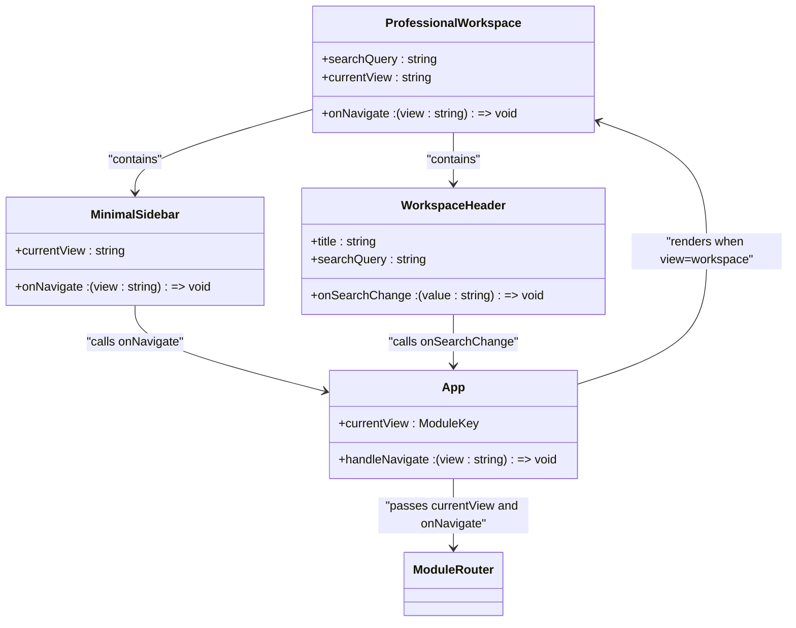

<docs>
# Routing Mechanism

<cite>
**Referenced Files in This Document**   
- [ModuleRouter.tsx](file://src\components\routing\ModuleRouter.tsx) - *Updated in recent commit*
- [ProfessionalWorkspace.tsx](file://src\components\ProfessionalWorkspace.tsx) - *Updated in recent commit*
- [App.tsx](file://src\App.tsx) - *Modified in recent commit*
</cite>

## Update Summary
**Changes Made**   
- Updated documentation to reflect the redesigned main layout with professional dashboard and sidebar navigation
- Enhanced section on integration with ProfessionalWorkspace to include new navigation patterns
- Updated route configuration details to reflect new module definitions
- Added details about the updated navigation flow between components
- Refreshed source tracking annotations to reflect recent changes

## Table of Contents
1. [Introduction](#introduction)
2. [Module Router Implementation](#module-router-implementation)
3. [Route Configuration](#route-configuration)
4. [Dynamic Import and Lazy Loading](#dynamic-import-and-lazy-loading)
5. [State Management During Navigation](#state-management-during-navigation)
6. [Integration with ProfessionalWorkspace](#integration-with-professionalworkspace)
7. [Navigation Triggers and UI Integration](#navigation-triggers-and-ui-integration)
8. [Error Handling for Invalid Routes](#error-handling-for-invalid-routes)
9. [Accessibility Considerations](#accessibility-considerations)

## Introduction
The ModuleRouter component serves as the central navigation system for APP-STRUKTUR-BLACKBOX, enabling seamless switching between various structural engineering modules including design, analysis, visualization, and educational components. Unlike traditional React Router implementations, this custom routing solution uses a module-based approach with dynamic imports and lazy loading to optimize performance. The router integrates with the application's state management to maintain context during navigation and supports parameterized routes for complex workflows.

**Section sources**
- [ModuleRouter.tsx](file://src\components\routing\ModuleRouter.tsx#L1-L409) - *Updated in recent commit*

## Module Router Implementation
The ModuleRouter component implements a custom routing mechanism that determines which module to render based on the currentModule prop. It uses React's Suspense component to handle asynchronous loading of modules, providing a fallback loading state during module initialization. The router first attempts to find the requested module in the moduleDefinitions array, and if not found, displays a "Coming Soon" placeholder with navigation options.

**Diagram sources**
- [ModuleRouter.tsx](file://src\components\routing\ModuleRouter.tsx#L372-L407) - *Updated in recent commit*

**Section sources**
- [ModuleRouter.tsx](file://src\components\routing\ModuleRouter.tsx#L372-L407) - *Updated in recent commit*

## Route Configuration
The routing system is configured through the moduleDefinitions array, which contains metadata and component references for all available modules. Each module definition includes a unique key, title, description, icon, category, and the component to render. The ModuleKey type defines all possible route values, ensuring type safety throughout the application. Routes are organized by functional categories including analysis, design, 3D visualization, tools, and utilities. Recent updates have expanded the module definitions to include new features such as smart integration, performance analytics, and advanced material library.

**Section sources**
- [ModuleRouter.tsx](file://src\components\routing\ModuleRouter.tsx#L50-L370) - *Updated in recent commit*

## Dynamic Import and Lazy Loading
The routing system implements performance optimization through dynamic imports and lazy loading. All module components are imported using React's lazy function, which enables code splitting and loads modules only when needed. This approach significantly reduces initial bundle size and improves application startup time. The Suspense component wraps the dynamically loaded modules, providing a consistent loading experience with the ModuleLoadingSpinner component.

**Diagram sources**
- [ModuleRouter.tsx](file://src\components\routing\ModuleRouter.tsx#L10-L50) - *Updated in recent commit*

**Section sources**
- [ModuleRouter.tsx](file://src\components\routing\ModuleRouter.tsx#L10-L50) - *Updated in recent commit*

## State Management During Navigation
The ModuleRouter maintains application state during navigation through the onNavigate callback function passed as a prop. This function updates the current view in the App component's state, which then re-renders the appropriate module. The router preserves the marketplaceEngine instance when navigating to the marketplace module, ensuring continuity of data and functionality. For other modules, the router passes any defined props from the module definition, allowing for consistent configuration across navigations.

**Diagram sources**
- [App.tsx](file://src\App.tsx#L14-L77) - *Modified in recent commit*
- [ProfessionalWorkspace.tsx](file://src\components\ProfessionalWorkspace.tsx#L260-L348) - *Updated in recent commit*

**Section sources**
- [App.tsx](file://src\App.tsx#L14-L77) - *Modified in recent commit*
- [ProfessionalWorkspace.tsx](file://src\components\ProfessionalWorkspace.tsx#L260-L348) - *Updated in recent commit*

## Integration with ProfessionalWorkspace
The ModuleRouter integrates seamlessly with the ProfessionalWorkspace component, which serves as one of the primary navigation interfaces. The ProfessionalWorkspace includes a minimal sidebar with navigation buttons that trigger the onNavigate callback, changing the current view in the parent App component. When the current view is set to 'workspace', the App component directly renders the ProfessionalWorkspace, creating a cohesive user experience with consistent layout and navigation patterns. The recent redesign has enhanced the sidebar navigation system, providing a more professional dashboard experience with improved user interface elements.

**Diagram sources**
- [App.tsx](file://src\App.tsx#L14-L77) - *Modified in recent commit*
- [ProfessionalWorkspace.tsx](file://src\components\ProfessionalWorkspace.tsx#L260-L348) - *Updated in recent commit*

**Section sources**
- [App.tsx](file://src\App.tsx#L14-L77) - *Modified in recent commit*
- [ProfessionalWorkspace.tsx](file://src\components\ProfessionalWorkspace.tsx#L260-L348) - *Updated in recent commit*

## Navigation Triggers and UI Integration
Navigation is triggered from various UI components