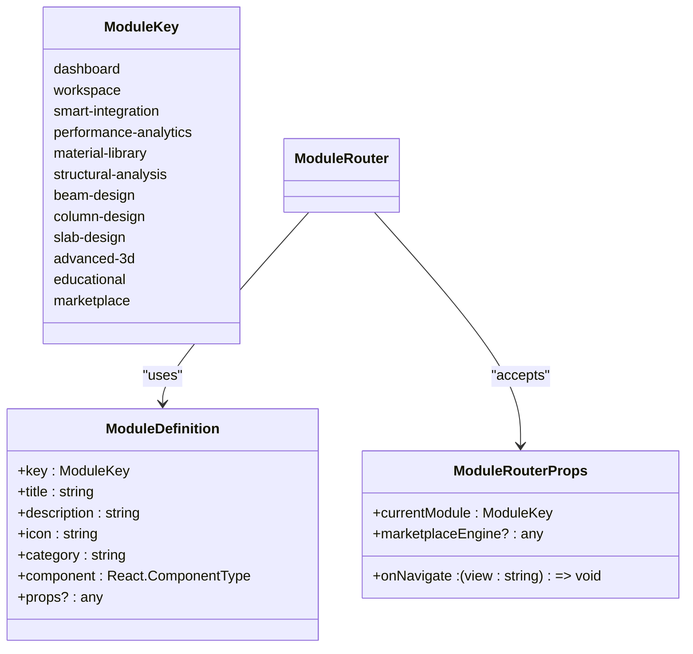
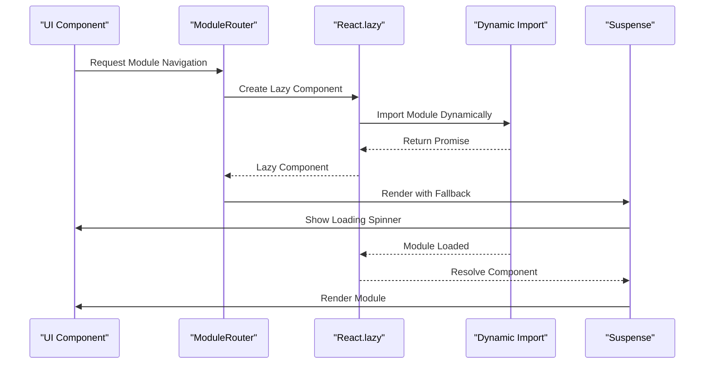
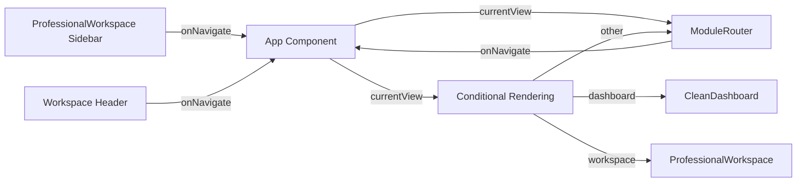
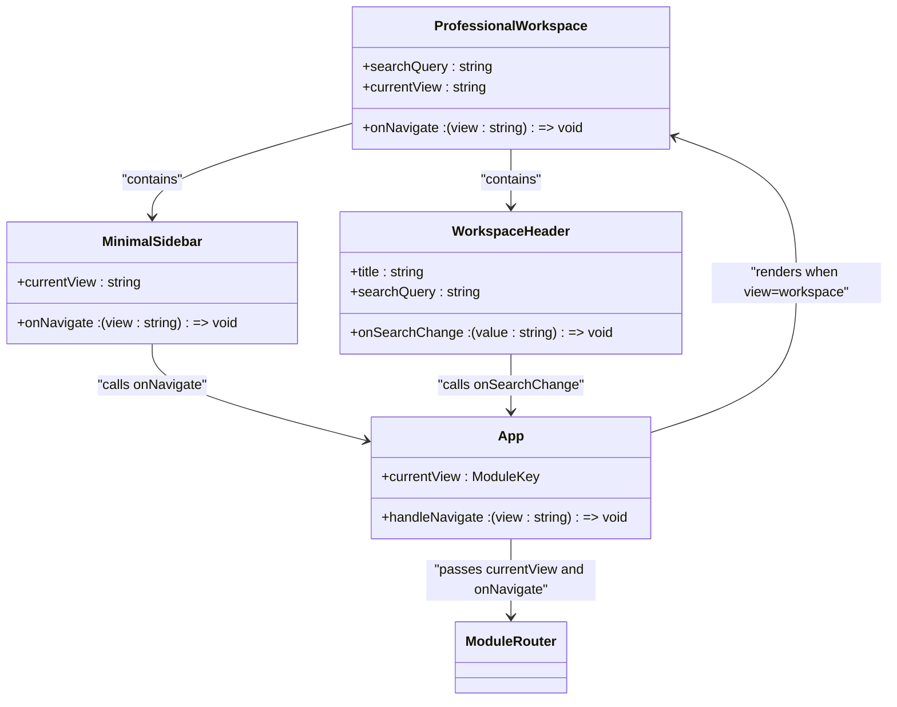
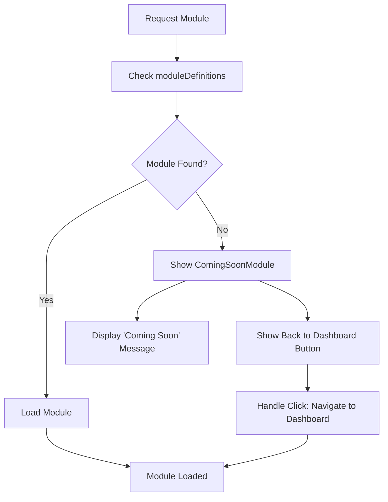

# Routing Mechanism

<cite>
**Referenced Files in This Document**   
- [ModuleRouter.tsx](file://src/components/routing/ModuleRouter.tsx)
- [ProfessionalWorkspace.tsx](file://src/components/ProfessionalWorkspace.tsx)
- [App.tsx](file://src/App.tsx)
</cite>

## Table of Contents
1. [Introduction](#introduction)
2. [Module Router Implementation](#module-router-implementation)
3. [Route Configuration](#route-configuration)
4. [Dynamic Import and Lazy Loading](#dynamic-import-and-lazy-loading)
5. [State Management During Navigation](#state-management-during-navigation)
6. [Integration with ProfessionalWorkspace](#integration-with-professionalworkspace)
7. [Navigation Triggers and UI Integration](#navigation-triggers-and-ui-integration)
8. [Error Handling for Invalid Routes](#error-handling-for-invalid-routes)
9. [Accessibility Considerations](#accessibility-considerations)

## Introduction
The ModuleRouter component serves as the central navigation system for APP-STRUKTUR-BLACKBOX, enabling seamless switching between various structural engineering modules including design, analysis, visualization, and educational components. Unlike traditional React Router implementations, this custom routing solution uses a module-based approach with dynamic imports and lazy loading to optimize performance. The router integrates with the application's state management to maintain context during navigation and supports parameterized routes for complex workflows.

**Section sources**
- [ModuleRouter.tsx](file://src/components/routing/ModuleRouter.tsx#L1-L409)

## Module Router Implementation
The ModuleRouter component implements a custom routing mechanism that determines which module to render based on the currentModule prop. It uses React's Suspense component to handle asynchronous loading of modules, providing a fallback loading state during module initialization. The router first attempts to find the requested module in the moduleDefinitions array, and if not found, displays a "Coming Soon" placeholder with navigation options.

**Diagram sources**
- [ModuleRouter.tsx](file://src/components/routing/ModuleRouter.tsx#L372-L407)

**Section sources**
- [ModuleRouter.tsx](file://src/components/routing/ModuleRouter.tsx#L372-L407)

## Route Configuration
The routing system is configured through the moduleDefinitions array, which contains metadata and component references for all available modules. Each module definition includes a unique key, title, description, icon, category, and the component to render. The ModuleKey type defines all possible route values, ensuring type safety throughout the application. Routes are organized by functional categories including analysis, design, 3D visualization, tools, and utilities.

**Diagram sources**
- [ModuleRouter.tsx](file://src/components/routing/ModuleRouter.tsx#L50-L370)

**Section sources**
- [ModuleRouter.tsx](file://src/components/routing/ModuleRouter.tsx#L50-L370)

## Dynamic Import and Lazy Loading
The routing system implements performance optimization through dynamic imports and lazy loading. All module components are imported using React's lazy function, which enables code splitting and loads modules only when needed. This approach significantly reduces initial bundle size and improves application startup time. The Suspense component wraps the dynamically loaded modules, providing a consistent loading experience with the ModuleLoadingSpinner component.

**Diagram sources**
- [ModuleRouter.tsx](file://src/components/routing/ModuleRouter.tsx#L10-L50)

**Section sources**
- [ModuleRouter.tsx](file://src/components/routing/ModuleRouter.tsx#L10-L50)

## State Management During Navigation
The ModuleRouter maintains application state during navigation through the onNavigate callback function passed as a prop. This function updates the current view in the App component's state, which then re-renders the appropriate module. The router preserves the marketplaceEngine instance when navigating to the marketplace module, ensuring continuity of data and functionality. For other modules, the router passes any defined props from the module definition, allowing for consistent configuration across navigations.

**Diagram sources**
- [App.tsx](file://src/App.tsx#L14-L77)
- [ProfessionalWorkspace.tsx](file://src/components/ProfessionalWorkspace.tsx#L260-L348)

**Section sources**
- [App.tsx](file://src/App.tsx#L14-L77)
- [ProfessionalWorkspace.tsx](file://src/components/ProfessionalWorkspace.tsx#L260-L348)

## Integration with ProfessionalWorkspace
The ModuleRouter integrates seamlessly with the ProfessionalWorkspace component, which serves as one of the primary navigation interfaces. The ProfessionalWorkspace includes a minimal sidebar with navigation buttons that trigger the onNavigate callback, changing the current view in the parent App component. When the current view is set to 'workspace', the App component directly renders the ProfessionalWorkspace, creating a cohesive user experience with consistent layout and navigation patterns.

**Diagram sources**
- [App.tsx](file://src/App.tsx#L14-L77)
- [ProfessionalWorkspace.tsx](file://src/components/ProfessionalWorkspace.tsx#L260-L348)

**Section sources**
- [App.tsx](file://src/App.tsx#L14-L77)
- [ProfessionalWorkspace.tsx](file://src/components/ProfessionalWorkspace.tsx#L260-L348)

## Navigation Triggers and UI Integration
Navigation is triggered from various UI components throughout the application, primarily through the onNavigate callback function. The ProfessionalWorkspace component contains a sidebar with navigation buttons for different views, while the App component handles the routing logic. When a navigation action occurs, the handleNavigate function in the App component updates the currentView state, causing a re-render with the appropriate module. The router supports both direct navigation to specialized modules and fallback routing for undefined routes.

**Section sources**
- [App.tsx](file://src/App.tsx#L14-L77)
- [ProfessionalWorkspace.tsx](file://src/components/ProfessionalWorkspace.tsx#L260-L348)

## Error Handling for Invalid Routes
The ModuleRouter implements robust error handling for invalid routes by checking if a requested module exists in the moduleDefinitions array. When a module is not found, the router displays a ComingSoonModule component with a descriptive message and a button to navigate back to the dashboard. This graceful degradation ensures that users always have a clear path forward even when accessing incomplete or experimental features. The error handling is integrated directly into the component's render logic, making it an inherent part of the routing process.

**Diagram sources**
- [ModuleRouter.tsx](file://src/components/routing/ModuleRouter.tsx#L372-L407)

**Section sources**
- [ModuleRouter.tsx](file://src/components/routing/ModuleRouter.tsx#L372-L407)

## Accessibility Considerations
The routing system incorporates several accessibility features to ensure usability for all users. Navigation elements in the ProfessionalWorkspace sidebar use semantic HTML and ARIA attributes to support screen readers. The loading states provide visual feedback for users with cognitive disabilities, while the consistent layout and predictable navigation patterns benefit users with learning disabilities. Keyboard navigation is supported through standard button elements with proper focus management, allowing users to navigate the application without a mouse.

**Section sources**
- [ProfessionalWorkspace.tsx](file://src/components/ProfessionalWorkspace.tsx#L260-L348)
- [ModuleRouter.tsx](file://src/components/routing/ModuleRouter.tsx#L372-L407)