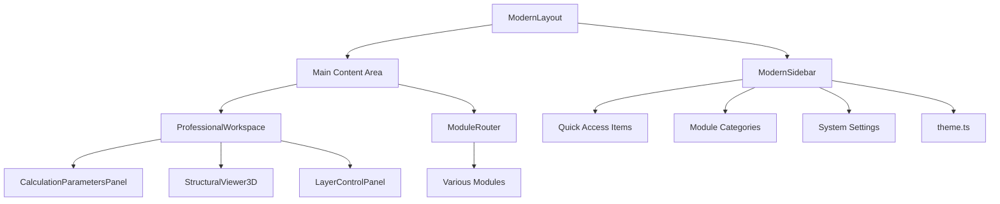
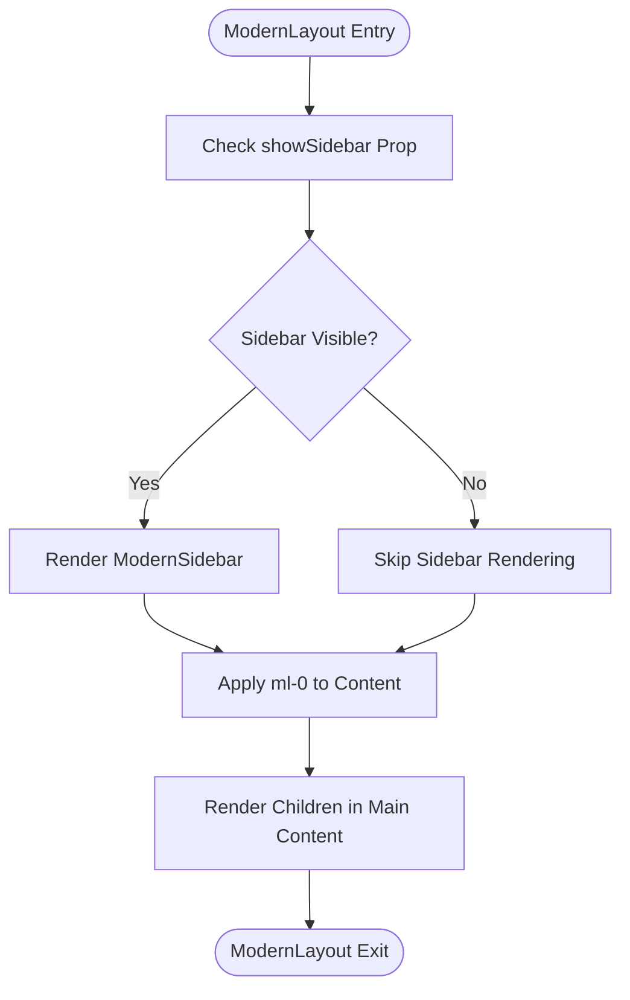
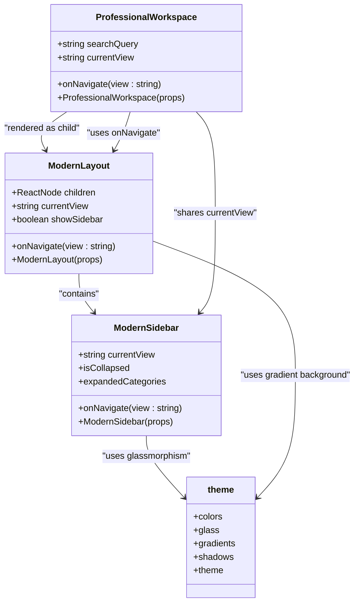
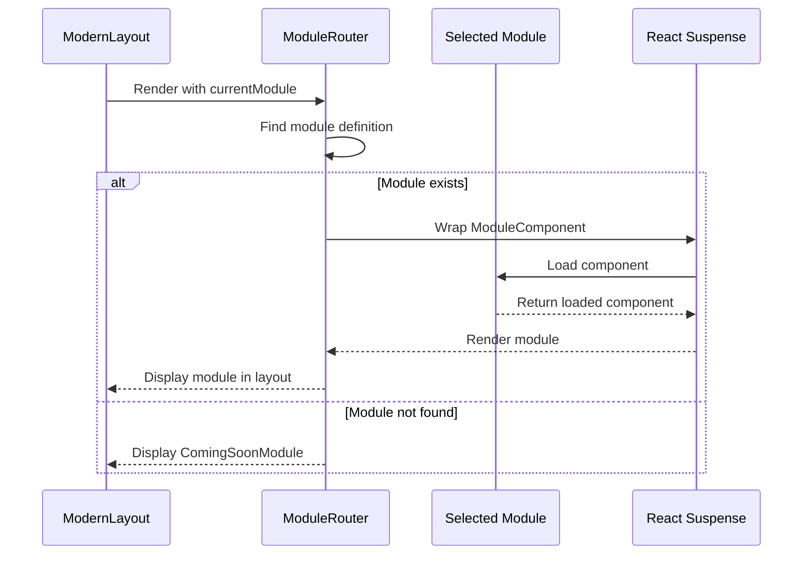

# Layout Container

<cite>
**Referenced Files in This Document**   
- [ModernLayout.tsx](file://src\components\ModernLayout.tsx) - *Updated in recent commit with professional redesign*
- [ModernSidebar.tsx](file://src\components\ModernSidebar.tsx) - *Updated in recent commit with glassmorphism effects*
- [ProfessionalWorkspace.tsx](file://src\components\ProfessionalWorkspace.tsx) - *Integrated with new layout system*
- [ModuleRouter.tsx](file://src\components\routing\ModuleRouter.tsx) - *Updated to support new layout components*
- [theme.ts](file://src\styles\theme.ts) - *Theme system for glassmorphism and styling*
</cite>

## Update Summary
**Changes Made**   
- Updated documentation to reflect the complete redesign of the main layout with professional styling and glassmorphism effects
- Enhanced architectural diagrams to accurately represent the new component relationships
- Added detailed information about the glassmorphism design system and theme integration
- Updated performance considerations to include new lazy loading patterns
- Revised troubleshooting guide to address issues specific to the redesigned layout

## Table of Contents
1. [Introduction](#introduction)
2. [Core Components](#core-components)
3. [Architecture Overview](#architecture-overview)
4. [Detailed Component Analysis](#detailed-component-analysis)
5. [Performance Considerations](#performance-considerations)
6. [Troubleshooting Guide](#troubleshooting-guide)

## Introduction

The ModernLayout component serves as the primary layout container for the structural analysis application, orchestrating the overall page structure through a sophisticated composition of header, sidebar, and main content areas. This documentation provides comprehensive insight into its implementation, integration with other components, and performance optimization strategies.

The layout system is designed to provide a professional, responsive interface that supports complex structural analysis workflows while maintaining optimal performance through modern React patterns and Tailwind CSS styling. The recent redesign introduces glassmorphism effects, improved responsive design features, and a more intuitive navigation experience.

**Section sources**
- [ModernLayout.tsx](file://src\components\ModernLayout.tsx#L1-L34)

## Core Components

The ModernLayout component is implemented as a React functional component that manages the primary application layout through composition and state management. It accepts children via React's children composition pattern, allowing flexible rendering of nested components within its structure.

The component integrates with the ModernSidebar component to provide navigation functionality and uses Tailwind CSS for responsive grid layout and spacing management. It supports collapsible sidebar functionality through the showSidebar prop and maintains theme consistency across the application.

The layout handles viewport height management through the min-h-screen class and manages overflow through proper container configuration. It works in conjunction with the ModuleRouter to render different application modules within its structure. The redesign introduces glassmorphism effects using backdrop-blur and custom theme styling from the theme.ts file.

**Section sources**
- [ModernLayout.tsx](file://src\components\ModernLayout.tsx#L1-L34)
- [ModernSidebar.tsx](file://src\components\ModernSidebar.tsx#L1-L316)
- [theme.ts](file://src\styles\theme.ts#L5-L162)

## Architecture Overview

The ModernLayout component forms the foundation of the application's UI architecture, serving as the primary container that orchestrates the relationship between navigation, content, and functionality. The architecture follows a hierarchical composition pattern where the layout component wraps and coordinates multiple specialized components.

**Diagram sources **
- [ModernLayout.tsx](file://src\components\ModernLayout.tsx#L1-L34)
- [ProfessionalWorkspace.tsx](file://src\components\ProfessionalWorkspace.tsx#L1-L348)
- [ModuleRouter.tsx](file://src\components\routing\ModuleRouter.tsx#L1-L409)
- [theme.ts](file://src\styles\theme.ts#L5-L162)

## Detailed Component Analysis

### ModernLayout Component Analysis

The ModernLayout component implements a responsive layout system using Tailwind CSS classes for styling and spacing. It uses a gradient background that spans from slate to blue to indigo, creating a professional visual foundation for the application.

The component manages the sidebar visibility through the showSidebar prop, which controls both the rendering of the ModernSidebar component and the margin adjustment of the main content area. When the sidebar is visible, the content area has a left margin of 64 units (ml-64), which transitions smoothly when the sidebar state changes.

The redesign introduces glassmorphism effects through the backdrop-blur-xl class and custom styling from the theme system, creating a modern, professional appearance with depth and visual hierarchy.

**Diagram sources **
- [ModernLayout.tsx](file://src\components\ModernLayout.tsx#L15-L34)

**Section sources**
- [ModernLayout.tsx](file://src\components\ModernLayout.tsx#L1-L34)

### ProfessionalWorkspace Integration

The ProfessionalWorkspace component is rendered within the ModernLayout structure and represents a comprehensive workspace for structural analysis. It implements a three-column grid layout with calculation parameters on the left, a 3D viewer in the center, and layer controls on the right.

The workspace integrates with the layout's navigation system through the onNavigate callback, allowing users to switch between different views such as analysis, 3D visualization, and settings. It maintains its own state for search queries and current view, which it synchronizes with the parent layout component.

**Diagram sources **
- [ProfessionalWorkspace.tsx](file://src\components\ProfessionalWorkspace.tsx#L260-L348)
- [ModernLayout.tsx](file://src\components\ModernLayout.tsx#L1-L34)
- [ModernSidebar.tsx](file://src\components\ModernSidebar.tsx#L1-L316)
- [theme.ts](file://src\styles\theme.ts#L5-L162)

**Section sources**
- [ProfessionalWorkspace.tsx](file://src\components\ProfessionalWorkspace.tsx#L1-L348)

### ModuleRouter Integration

The ModuleRouter component serves as the routing mechanism that determines which module to render within the ModernLayout container. It uses React's Suspense feature for lazy loading of modules, improving initial load performance by only loading components when they are needed.

The router maintains a definition of all available modules, including their keys, titles, descriptions, and associated components. When a module is selected, the router renders it within the layout structure, providing a consistent user experience across different application sections.

**Diagram sources **
- [ModuleRouter.tsx](file://src\components\routing\ModuleRouter.tsx#L372-L407)

**Section sources**
- [ModuleRouter.tsx](file://src\components\routing\ModuleRouter.tsx#L1-L409)

## Performance Considerations

The layout system incorporates several performance optimization strategies to ensure smooth operation even with complex structural analysis modules. The primary performance considerations include lazy loading of layout sections and efficient re-renders using React.memo.

### Lazy Loading Implementation

The application implements lazy loading through React's lazy and Suspense features, which are orchestrated by the ModuleRouter component. This approach ensures that heavy modules such as 3D viewers and analysis systems are only loaded when they are actually needed, significantly reducing the initial bundle size and improving load times.

The ModuleRouter uses dynamic imports with code splitting to load modules on demand, wrapping each module in a Suspense boundary with a loading spinner as fallback. This prevents the interface from blocking during module loading and provides visual feedback to users.

**Section sources**
- [ModuleRouter.tsx](file://src\components\routing\ModuleRouter.tsx#L372-L407)

### Efficient Re-renders with React.memo

While the ModernLayout component itself does not explicitly use React.memo, the application employs memoization patterns in related components to prevent unnecessary re-renders. The ProfessionalWorkspace and other complex components benefit from React.memo to optimize performance when props haven't changed.

The layout system also uses useCallback for event handlers and useMemo for expensive calculations, ensuring that child components only re-render when their actual dependencies change. This optimization is particularly important for the 3D visualization components that can be computationally intensive.

**Section sources**
- [ProfessionalWorkspace.tsx](file://src\components\ProfessionalWorkspace.tsx#L1-L348)

## Troubleshooting Guide

### Overflow Handling

Common overflow issues in the layout typically occur when content exceeds the available space, particularly in the 3D viewer or results display areas. To address overflow issues:

1. Ensure that parent containers have appropriate height constraints using Tailwind's min-h-screen or h-full classes
2. Use overflow-auto or overflow-hidden on containers that may contain large content
3. Verify that the ModernLayout's main content div has proper styling to handle dynamic content

The ModernLayout component already includes overflow-hidden on its container div to prevent content from spilling outside the designated area.

**Section sources**
- [ModernLayout.tsx](file://src\components\ModernLayout.tsx#L1-L34)

### Z-Index Conflicts

Z-index conflicts can occur when multiple absolutely positioned elements overlap, such as the sidebar, dropdown menus, and modal dialogs. The layout system addresses this through a consistent z-index hierarchy:

1. The ModernSidebar uses z-50 to ensure it appears above most content
2. Modal dialogs and tooltips should use higher z-index values (z-60 or above)
3. Background elements should use lower z-index values

When implementing new components that use absolute positioning, ensure they are assigned appropriate z-index values that respect the existing hierarchy.

**Section sources**
- [ModernSidebar.tsx](file://src\components\ModernSidebar.tsx#L1-L316)

### Viewport Height Management

Viewport height issues can manifest as content being cut off or scrollbars appearing unexpectedly. The ModernLayout component addresses this by:

1. Using min-h-screen on the root div to ensure the layout fills the viewport
2. Applying min-h-screen to the main content area to prevent content collapse
3. Using proper margin adjustments when the sidebar is toggled

For mobile devices, the layout should be tested to ensure proper viewport height calculation, particularly when the browser's address bar is visible or hidden during scrolling.

**Section sources**
- [ModernLayout.tsx](file://src\components\ModernLayout.tsx#L1-L34)