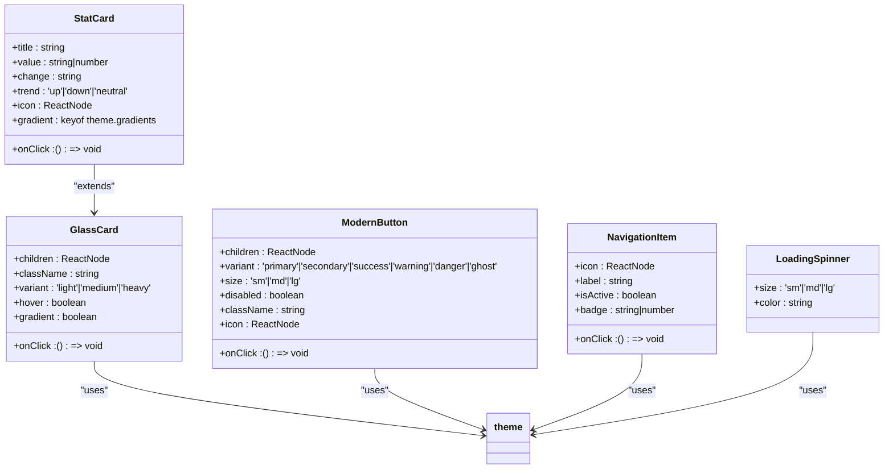
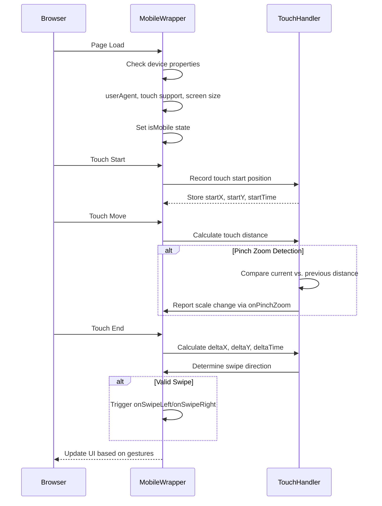
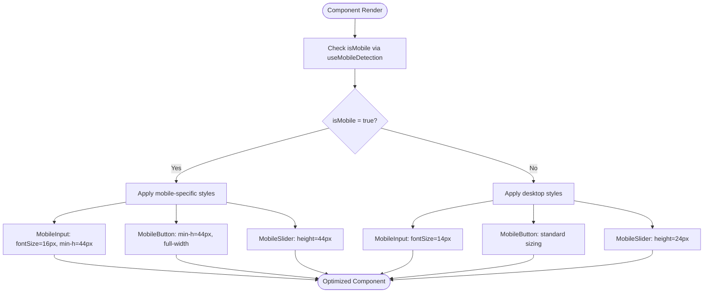
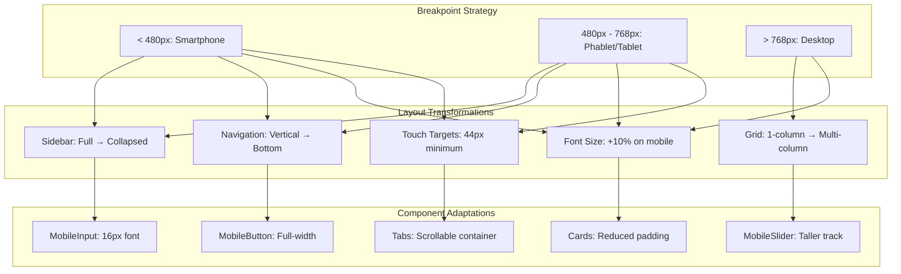
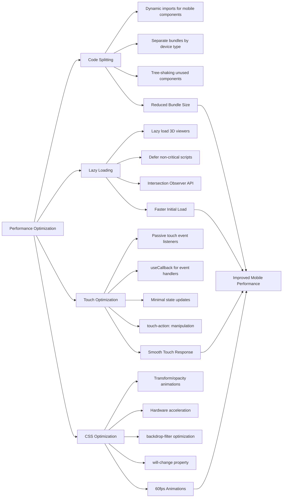

# Responsive Design & UI Wrappers

<cite>
**Referenced Files in This Document**   
- [ProfessionalUI.tsx](file://src/components/ui/ProfessionalUI.tsx)
- [MobileWrapper.tsx](file://src/components/ui/MobileWrapper.tsx)
- [MobileComponents.tsx](file://src/components/ui/MobileComponents.tsx)
- [theme.ts](file://src/styles/theme.ts)
- [tailwind.config.js](file://tailwind.config.js)
- [index.css](file://src/index.css)
</cite>

## Table of Contents
1. [Introduction](#introduction)
2. [ProfessionalUI: Consistent Styling System](#professionalui-consistent-styling-system)
3. [MobileWrapper: Responsive Layout Adaptation](#mobilewrapper-responsive-layout-adaptation)
4. [MobileComponents: Touch-Optimized Elements](#mobilecomponents-touch-optimized-elements)
5. [Responsive Design Implementation](#responsive-design-implementation)
6. [Device Detection and Media Queries](#device-detection-and-media-queries)
7. [Performance Optimization Strategies](#performance-optimization-strategies)
8. [Common Mobile Issues and Solutions](#common-mobile-issues-and-solutions)
9. [Conclusion](#conclusion)

## Introduction
The responsive design system in this application is built around three core components: ProfessionalUI, MobileWrapper, and MobileComponents. These components work together to ensure consistent styling, responsive behavior, and optimal touch interaction across devices. ProfessionalUI establishes a unified design language using Tailwind CSS and glassmorphism effects, while MobileWrapper adapts layout behavior for mobile devices, and MobileComponents provide specialized UI elements optimized for touch interfaces.

**Section sources**
- [ProfessionalUI.tsx](file://src/components/ui/ProfessionalUI.tsx#L1-L397)
- [MobileWrapper.tsx](file://src/components/ui/MobileWrapper.tsx#L1-L212)
- [MobileComponents.tsx](file://src/components/ui/MobileComponents.tsx#L1-L175)

## ProfessionalUI: Consistent Styling System
ProfessionalUI implements a comprehensive styling system that enforces consistent typography, theming, and visual hierarchy throughout the application. Built on Tailwind CSS, it leverages a custom theme configuration that defines color palettes, glassmorphism effects, gradients, shadows, and typography rules.

The system uses a blue-purple gradient as its primary color scheme, with glassmorphism effects that create a modern, translucent appearance. Components like GlassCard, ModernButton, and StatCard inherit these styling properties, ensuring visual consistency across the application. The theme system includes predefined gradients for different states (primary, success, warning, danger) and a comprehensive shadow system that enhances depth and interactivity.

Typography follows a mobile-first approach with responsive font sizes and line heights. The system uses Inter as the primary sans-serif font and JetBrains Mono for monospace text, ensuring readability across devices. Animation properties are standardized with consistent duration and easing curves, providing smooth transitions between states.



**Diagram sources**
- [ProfessionalUI.tsx](file://src/components/ui/ProfessionalUI.tsx#L1-L397)
- [theme.ts](file://src/styles/theme.ts#L1-L201)

**Section sources**
- [ProfessionalUI.tsx](file://src/components/ui/ProfessionalUI.tsx#L1-L397)
- [theme.ts](file://src/styles/theme.ts#L1-L201)

## MobileWrapper: Responsive Layout Adaptation
MobileWrapper serves as a container component that adapts the application layout for smaller screens by detecting mobile devices and enabling touch-friendly interactions. It implements responsive behavior through device detection, touch gesture handling, and conditional rendering based on screen size.

The component uses a combination of userAgent detection, touch capability checking, and screen width measurement to determine if the current device is mobile. The breakpoint threshold is set at 768px, aligning with common tablet and mobile device dimensions. When a mobile device is detected, the wrapper applies specific CSS classes and enables touch gesture functionality.

MobileWrapper supports several touch gestures including swipe navigation and pinch-to-zoom. The swipe detection system tracks touch movement, measuring distance, time, and direction to distinguish intentional swipes from regular touch interactions. Swipe gestures can trigger navigation actions when enabled through the onSwipeLeft and onSwipeRight callbacks. The pinch-to-zoom functionality calculates the distance between two touch points and reports scale changes through the onPinchZoom callback.

The component also manages touch behavior by setting appropriate CSS properties like touch-action: manipulation to optimize touch response and prevent unwanted scrolling during gestures. It includes accessibility features such as a hidden indicator for screen readers when the mobile interface is active.



**Diagram sources**
- [MobileWrapper.tsx](file://src/components/ui/MobileWrapper.tsx#L1-L212)

**Section sources**
- [MobileWrapper.tsx](file://src/components/ui/MobileWrapper.tsx#L1-L212)

## MobileComponents: Touch-Optimized Elements
MobileComponents provides a collection of UI elements specifically optimized for touch interaction on mobile devices. These components enhance usability by increasing touch target sizes, preventing unwanted zoom behavior, and implementing touch-friendly styling.

The MobileInput component adjusts its behavior based on device type, setting a minimum font size of 16px on mobile devices to prevent automatic zooming on iOS. It includes touch-friendly styling with increased minimum height and proper touch-action properties. The component also provides visual feedback for validation errors with clear error messaging.

MobileButton implements several mobile-specific optimizations including increased minimum height (40-48px) to meet touch target guidelines, full-width display on mobile screens, and touch feedback through scale transformations. The component supports loading states with animated spinners and maintains accessibility through proper ARIA attributes.

MobileSlider is designed for easy manipulation on touch screens with increased track height (44px on mobile vs. 24px on desktop). It uses a dual-input approach with both a range slider and numeric input, allowing users to precisely set values through either dragging or typing. The component prevents default touch behaviors that could interfere with slider interaction.

All mobile components leverage the useMobileDetection hook to adapt their behavior based on the current device, ensuring optimal performance and usability across different screen sizes and input methods.



**Diagram sources**
- [MobileComponents.tsx](file://src/components/ui/MobileComponents.tsx#L1-L175)
- [MobileWrapper.tsx](file://src/components/ui/MobileWrapper.tsx#L173-L211)

**Section sources**
- [MobileComponents.tsx](file://src/components/ui/MobileComponents.tsx#L1-L175)

## Responsive Design Implementation
The responsive design system implements a comprehensive approach to layout adaptation across different screen sizes. The implementation combines CSS media queries, component-level responsiveness, and device-specific optimizations to ensure optimal user experience on all devices.

The primary breakpoint strategy uses 768px as the threshold between mobile and desktop layouts, consistent with common tablet dimensions. Below this threshold, components adapt their layout, spacing, and interaction patterns for touch interfaces. The system employs a mobile-first approach, with base styles optimized for smaller screens and progressive enhancement for larger displays.

Layout transformations include sidebar behavior adjustments, where navigation elements may collapse into hamburger menus or reposition to bottom navigation on mobile devices. Font sizes are scaled appropriately, with slightly larger text on mobile to accommodate viewing distance and readability. Spacing is reduced on smaller screens to maximize content area while maintaining adequate touch targets.

The system uses Tailwind CSS for utility-based styling, allowing responsive classes to be applied directly to components. Custom CSS in index.css provides additional responsive rules for structural elements like cards, forms, and tab navigation. The MobileWrapper component enhances this with JavaScript-based device detection and touch gesture support.



**Diagram sources**
- [index.css](file://src/index.css#L1-L437)
- [MobileWrapper.tsx](file://src/components/ui/MobileWrapper.tsx#L1-L212)
- [MobileComponents.tsx](file://src/components/ui/MobileComponents.tsx#L1-L175)

**Section sources**
- [index.css](file://src/index.css#L1-L437)
- [tailwind.config.js](file://tailwind.config.js#L1-L52)

## Device Detection and Media Queries
The responsive system employs a multi-layered approach to device detection and responsive styling, combining CSS media queries with JavaScript-based detection for comprehensive coverage.

CSS media queries are implemented in index.css using the max-width property to target different screen sizes. The primary breakpoints are:
- Mobile: max-width: 768px
- Phablet: max-width: 480px
- Desktop: above 768px

These queries adjust various properties including font sizes, padding, margins, and layout structures. For example, buttons expand to full width on mobile with increased padding, while cards reduce their internal spacing to conserve screen real estate. Tab navigation becomes horizontally scrollable on smaller screens to accommodate limited width.

JavaScript-based detection in MobileWrapper provides additional capabilities beyond CSS media queries. It examines the userAgent string to identify specific mobile browsers, checks for touch event support through 'ontouchstart' in window, and monitors orientation changes. This allows for more precise device classification and enables touch-specific features like swipe gestures and pinch-to-zoom.

The useMobileDetection hook centralizes device detection logic, providing components with real-time information about device type, screen size, and orientation. This enables conditional rendering and behavior adjustments based on the current device context. The hook listens to resize and orientationchange events, ensuring accurate detection as users rotate their devices or resize browser windows.

```mermaid
erDiagram
DEVICE_DETECTION {
string userAgent PK
boolean hasTouchSupport
number screenWidth
number screenHeight
string orientation
boolean isMobile
boolean isTablet
boolean isDesktop
}
MEDIA_QUERIES {
string breakpoint PK
string cssProperty
string value
string mediaCondition
}
COMPONENT_RESPONSE {
string component PK
string behavior
string styleAdjustment
string interactionPattern
}
DEVICE_DETECTION ||--o{ COMPONENT_RESPONSE : "triggers"
MEDIA_QUERIES ||--o{ COMPONENT_RESPONSE : "applies"
DEVICE_DETECTION {
userAgent: "Android|webOS|iPhone|iPad|iPod|BlackBerry|IEMobile|Opera Mini"
hasTouchSupport: "ontouchstart in window || navigator.maxTouchPoints > 0"
screenWidth: "window.innerWidth"
screenHeight: "window.innerHeight"
orientation: "width > height ? landscape : portrait"
isMobile: "screenWidth <= 768 && hasTouchSupport"
isTablet: "screenWidth > 768 && screenWidth <= 1024"
isDesktop: "screenWidth > 1024"
}
MEDIA_QUERIES {
breakpoint: "mobile"
cssProperty: "width"
value: "100%"
mediaCondition: "@media (max-width: 768px)"
}
MEDIA_QUERIES {
breakpoint: "phablet"
cssProperty: "font-size"
value: "16px"
mediaCondition: "@media (max-width: 480px)"
}
}
```

**Diagram sources**
- [MobileWrapper.tsx](file://src/components/ui/MobileWrapper.tsx#L1-L212)
- [index.css](file://src/index.css#L1-L437)

**Section sources**
- [MobileWrapper.tsx](file://src/components/ui/MobileWrapper.tsx#L1-L212)
- [index.css](file://src/index.css#L1-L437)

## Performance Optimization Strategies
The responsive design system incorporates several performance optimization techniques to ensure smooth operation across devices, particularly on mobile hardware with limited resources.

Code splitting is implemented through dynamic imports and component-level code organization. The MobileWrapper, MobileComponents, and ProfessionalUI are separated into distinct modules, allowing for selective loading based on device type and user interaction. This reduces initial bundle size and improves load times, particularly on mobile networks.

Lazy loading is applied to non-critical components and resources. The useMobileDetection hook and touch gesture handlers are only fully initialized when needed, reducing memory usage on desktop devices where these features are less relevant. Image and 3D viewer components implement lazy loading to defer loading of heavy assets until they enter the viewport.

Touch event optimization prevents performance bottlenecks by using passive event listeners where appropriate and minimizing DOM manipulation during touch interactions. The MobileWrapper component uses React.useCallback to memoize event handlers, preventing unnecessary re-renders. Touch state is managed efficiently with minimal re-renders, updating only when significant gesture events occur.

The system also implements CSS optimization techniques such as using transform and opacity for animations (which leverage hardware acceleration), minimizing layout thrashing, and using will-change properties to hint to browsers about upcoming transformations. The glassmorphism effects in ProfessionalUI are optimized with appropriate backdrop-filter values to balance visual quality and performance.



**Diagram sources**
- [MobileWrapper.tsx](file://src/components/ui/MobileWrapper.tsx#L1-L212)
- [ProfessionalUI.tsx](file://src/components/ui/ProfessionalUI.tsx#L1-L397)
- [index.css](file://src/index.css#L1-L437)

**Section sources**
- [MobileWrapper.tsx](file://src/components/ui/MobileWrapper.tsx#L1-L212)
- [ProfessionalUI.tsx](file://src/components/ui/ProfessionalUI.tsx#L1-L397)

## Common Mobile Issues and Solutions
The responsive design system addresses several common mobile-specific issues through targeted solutions and best practices.

Viewport scaling issues are prevented by setting appropriate font sizes (16px minimum) on form inputs to avoid iOS zooming behavior. The system uses the touch-action: manipulation CSS property to optimize touch response and prevent unwanted page zooming during interactions. The viewport meta tag is properly configured to control scaling and layout on mobile browsers.

Touch event conflicts are mitigated through careful event handling and gesture recognition. The MobileWrapper component prevents default scrolling behavior during multi-touch gestures to avoid conflicts between pinch-to-zoom and page scrolling. Swipe detection includes thresholds for distance, time, and vertical movement to distinguish intentional swipes from accidental touches.

Performance bottlenecks are addressed through several strategies:
- Glassmorphism effects are optimized with appropriate blur levels to balance visual quality and rendering performance
- Touch event handlers are debounced and throttled to prevent excessive processing
- Component re-renders are minimized through proper use of React.memo and useCallback
- Heavy 3D visualization components are lazy-loaded and optimized for mobile rendering

Accessibility is