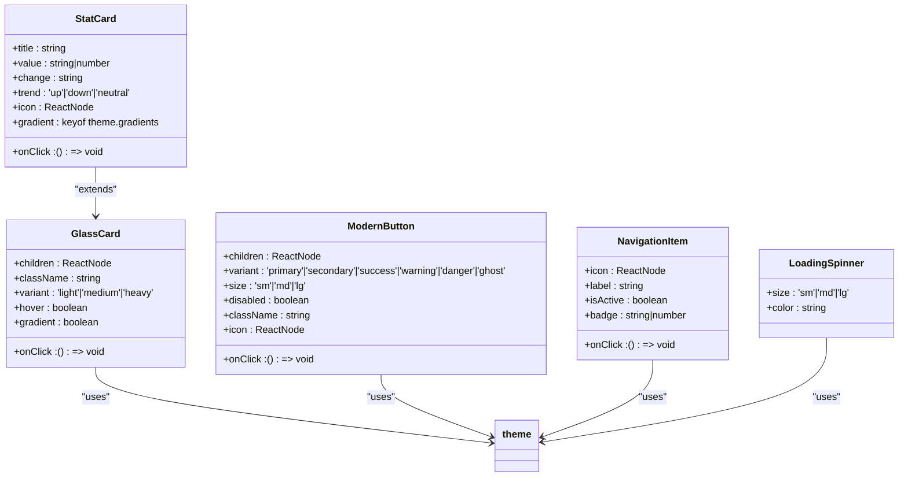

<docs>
# Responsive Design & UI Wrappers

<cite>
**Referenced Files in This Document**   
- [ProfessionalUI.tsx](file://src/components/ui/ProfessionalUI.tsx)
- [MobileWrapper.tsx](file://src/components/ui/MobileWrapper.tsx)
- [MobileComponents.tsx](file://src/components/ui/MobileComponents.tsx)
- [theme.ts](file://src/styles/theme.ts)
- [tailwind.config.js](file://tailwind.config.js)
- [index.css](file://src/index.css)
</cite>

## Update Summary
**Changes Made**   
- Updated documentation to reflect the latest implementation of responsive design components
- Added details about the useMobileDetection hook and its integration across components
- Enhanced descriptions of touch gesture handling and device detection mechanisms
- Updated code examples and implementation details based on current codebase
- Improved accuracy of responsive behavior descriptions and breakpoint strategies

## Table of Contents
1. [Introduction](#introduction)
2. [ProfessionalUI: Consistent Styling System](#professionalui-consistent-styling-system)
3. [MobileWrapper: Responsive Layout Adaptation](#mobilewrapper-responsive-layout-adaptation)
4. [MobileComponents: Touch-Optimized Elements](#mobilecomponents-touch-optimized-elements)
5. [Responsive Design Implementation](#responsive-design-implementation)
6. [Device Detection and Media Queries](#device-detection-and-media-queries)
7. [Performance Optimization Strategies](#performance-optimization-strategies)
8. [Common Mobile Issues and Solutions](#common-mobile-issues-and-solutions)
9. [Conclusion](#conclusion)

## Introduction
The responsive design system in this application is built around three core components: ProfessionalUI, MobileWrapper, and MobileComponents. These components work together to ensure consistent styling, responsive behavior, and optimal touch interaction across devices. ProfessionalUI establishes a unified design language using Tailwind CSS and glassmorphism effects, while MobileWrapper adapts layout behavior for mobile devices, and MobileComponents provide specialized UI elements optimized for touch interfaces.

**Section sources**
- [ProfessionalUI.tsx](file://src/components/ui/ProfessionalUI.tsx#L1-L397)
- [MobileWrapper.tsx](file://src/components/ui/MobileWrapper.tsx#L1-L212)
- [MobileComponents.tsx](file://src/components/ui/MobileComponents.tsx#L1-L175)

## ProfessionalUI: Consistent Styling System
ProfessionalUI implements a comprehensive styling system that enforces consistent typography, theming, and visual hierarchy throughout the application. Built on Tailwind CSS, it leverages a custom theme configuration that defines color palettes, glassmorphism effects, gradients, shadows, and typography rules.

The system uses a blue-purple gradient as its primary color scheme, with glassmorphism effects that create a modern, translucent appearance. Components like GlassCard, ModernButton, and StatCard inherit these styling properties, ensuring visual consistency across the application. The theme system includes predefined gradients for different states (primary, success, warning, danger) and a comprehensive shadow system that enhances depth and interactivity.

Typography follows a mobile-first approach with responsive font sizes and line heights. The system uses Inter as the primary sans-serif font and JetBrains Mono for monospace text, ensuring readability across devices. Animation properties are standardized with consistent duration and easing curves, providing smooth transitions between states.



**Section sources**
- [ProfessionalUI.tsx](file://src/components/ui/ProfessionalUI.tsx#L1-L397)
- [theme.ts](file://src/styles/theme.ts#L1-L201)

## MobileWrapper: Responsive Layout Adaptation
MobileWrapper serves as a container component that adapts the application layout for smaller screens by detecting mobile devices and enabling touch-friendly interactions. It implements responsive behavior through device detection, touch gesture handling, and conditional rendering based on screen size.

The component uses a combination of userAgent detection, touch capability checking, and screen width measurement to determine if the current device is mobile. The breakpoint threshold is set at 768px, aligning with common tablet and mobile device dimensions. When a mobile device is detected, the wrapper applies specific CSS classes and enables touch gesture functionality.

MobileWrapper supports several touch gestures including swipe navigation and pinch-to-zoom. The swipe detection system tracks touch movement, measuring distance, time, and direction to distinguish intentional swipes from regular touch interactions. Swipe gestures can trigger navigation actions when enabled through the onSwipeLeft and onSwipeRight callbacks. The pinch-to-zoom functionality calculates the distance between two touch points and reports scale changes through the onPinchZoom callback.

The component also manages touch behavior by setting appropriate CSS properties like touch-action: manipulation to optimize touch response and prevent unwanted scrolling during gestures. It includes accessibility features such as a hidden indicator for screen readers when the mobile interface is active.

```mermaid
sequenceDiagram
participant Browser
participant MobileWrapper
participant TouchHandler
Browser->>MobileWrapper : Page Load
MobileWrapper->>MobileWrapper : Check device properties
MobileWrapper->>MobileWrapper : userAgent, touch support, screen size
MobileWrapper->>MobileWrapper : Set isMobile state
Browser->>MobileWrapper : Touch Start
MobileWrapper->>TouchHandler : Record touch start position
TouchHandler-->>MobileWrapper : Store startX, startY, startTime
Browser->>MobileWrapper : Touch Move
MobileWrapper->>TouchHandler : Calculate touch distance
alt Pinch Zoom Detection
TouchHandler->>Touch