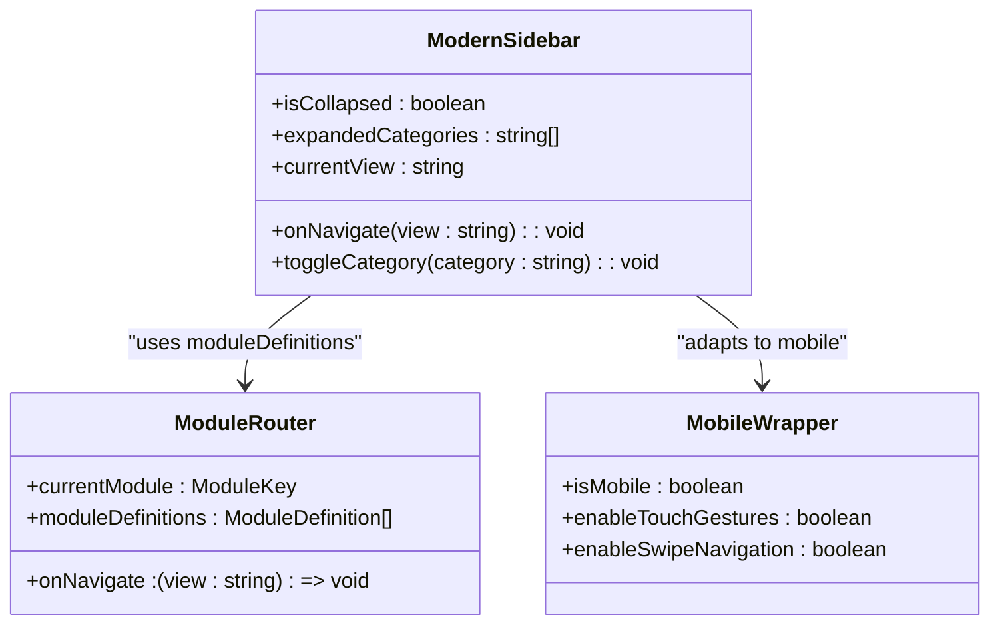
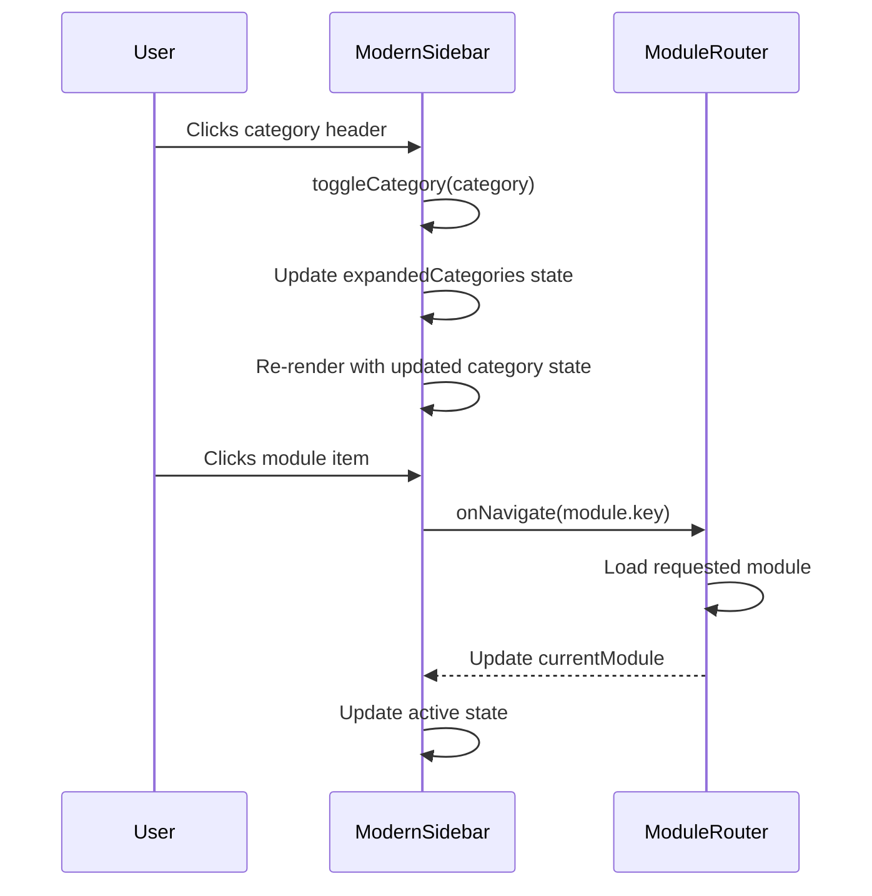
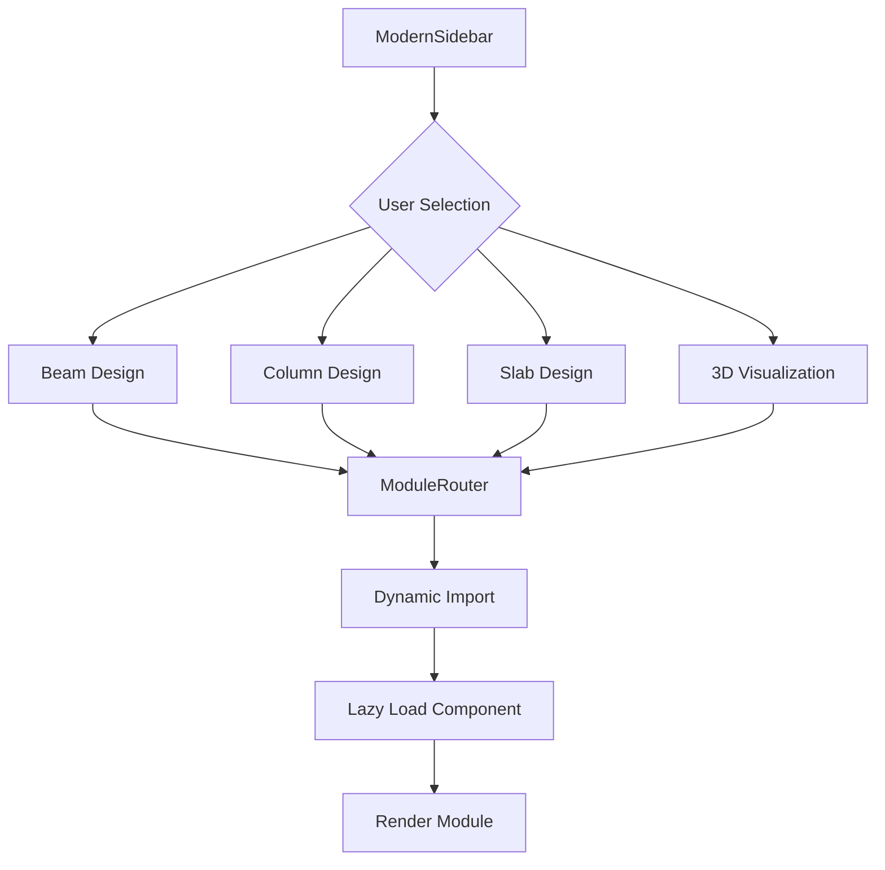

<docs>
# Sidebar Navigation

<cite>
**Referenced Files in This Document**   
- [ModernSidebar.tsx](file://src/components/ModernSidebar.tsx) - *Updated in recent commit with professional styling and glassmorphism effects*
- [ModuleRouter.tsx](file://src/components/routing/ModuleRouter.tsx) - *Contains module definitions and routing logic*
- [MobileWrapper.tsx](file://src/components/ui/MobileWrapper.tsx) - *Provides mobile responsiveness and touch gesture support*
- [BeamDesignModule.tsx](file://src/structural-analysis/design/BeamDesignModule.tsx) - *Beam design module accessible through sidebar*
- [ColumnDesignModule.tsx](file://src/structural-analysis/design/ColumnDesignModule.tsx) - *Column design module accessible through sidebar*
- [SlabDesignModule.tsx](file://src/structural-analysis/design/SlabDesignModule.tsx) - *Slab design module accessible through sidebar*
- [ProfessionalUI.tsx](file://src/components/ui/ProfessionalUI.tsx) - *Contains NavigationItem component and UI styling*
- [theme.ts](file://src/styles/theme.ts) - *Defines glassmorphism styles and theme variables*
</cite>

## Update Summary
**Changes Made**   
- Updated documentation to reflect the complete redesign of the ModernSidebar component with professional styling and glassmorphism effects
- Added details about new quick access items and their functionality
- Enhanced description of UI/UX design elements including glassmorphism, backdrop blur, and gradient effects
- Updated accessibility features to reflect current implementation
- Added information about user profile section in the sidebar
- Revised state management section to accurately describe initial expanded categories
- Updated module integration details to reflect current module definitions and categories

## Table of Contents
1. [Introduction](#introduction)
2. [Core Components](#core-components)
3. [State Management](#state-management)
4. [Module Integration](#module-integration)
5. [UI/UX Design](#uiux-design)
6. [Accessibility Features](#accessibility-features)
7. [Customization and Troubleshooting](#customization-and-troubleshooting)

## Introduction
The ModernSidebar component serves as the primary navigation interface for the structural analysis application, providing access to various design modules and analysis tools. This documentation details its implementation, integration with the ModuleRouter system, and responsive design features that ensure usability across desktop and mobile devices. The component has been redesigned with professional styling, glassmorphism effects, and enhanced interactive features to improve user experience.

**Section sources**
- [ModernSidebar.tsx](file://src/components/ModernSidebar.tsx#L1-L316)

## Core Components
The ModernSidebar component is implemented as a React functional component that manages navigation state and renders module access points. It integrates with the NavigationItem component for consistent styling of navigation elements and uses the moduleDefinitions from ModuleRouter to dynamically generate module categories.

The sidebar supports both expanded and collapsed states, adapting its layout based on user preference. In expanded mode, it displays hierarchical module categories with collapsible sections, while the collapsed mode provides quick access to primary categories through icon-only buttons. The component utilizes glassmorphism design principles with backdrop blur effects and subtle gradients to create a modern, professional appearance.

**Diagram sources**
- [ModernSidebar.tsx](file://src/components/ModernSidebar.tsx#L45-L316)
- [ModuleRouter.tsx](file://src/components/routing/ModuleRouter.tsx#L372-L407)
- [MobileWrapper.tsx](file://src/components/ui/MobileWrapper.tsx#L25-L169)

**Section sources**
- [ModernSidebar.tsx](file://src/components/ModernSidebar.tsx#L45-L316)
- [ModuleRouter.tsx](file://src/components/routing/ModuleRouter.tsx#L372-L407)

## State Management
The ModernSidebar component utilizes React's useState hook to manage two primary state variables: isCollapsed for controlling the sidebar's width and expandedCategories for tracking which module categories are currently expanded. The isCollapsed state toggles between a compact 16px width and a full 80px width, while expandedCategories maintains an array of category names that should display their module lists.

The component's state management ensures that category expansion state persists across navigation events, providing a consistent user experience. When a category header is clicked, the toggleCategory function updates the expandedCategories state by either adding or removing the category from the array. By default, the 'analysis' category is initially expanded to provide immediate access to primary analysis modules.

**Diagram sources**
- [ModernSidebar.tsx](file://src/components/ModernSidebar.tsx#L45-L316)
- [ModuleRouter.tsx](file://src/components/routing/ModuleRouter.tsx#L372-L407)

**Section sources**
- [ModernSidebar.tsx](file://src/components/ModernSidebar.tsx#L45-L316)

## Module Integration
The ModernSidebar integrates with the ModuleRouter system to enable dynamic module loading based on user selection. It accesses the moduleDefinitions array from ModuleRouter to group modules by category and render them in the sidebar interface. Each module in the system is defined with a key, title, description, icon, category, and component reference.

When a user selects a module from the sidebar, the onNavigate callback is triggered with the module's key, which the parent component passes to ModuleRouter to load the appropriate module. The ModuleRouter uses React's Suspense and lazy loading to dynamically import and render the selected module, ensuring optimal performance.

The integration supports various module categories including analysis, design, 3D visualization, and system tools, with specific modules for beam, column, and slab design accessible through the design category. The sidebar also features a quick access section with frequently used modules like Dashboard, Structural Analysis, Marketplace, and Educational resources, positioned at the top for easy access.

**Diagram sources**
- [ModernSidebar.tsx](file://src/components/ModernSidebar.tsx#L45-L316)
- [ModuleRouter.tsx](file://src/components/routing/ModuleRouter.tsx#L372-L407)

**Section sources**
- [ModernSidebar.tsx](file://src/components/ModernSidebar.tsx#L45-L316)
- [ModuleRouter.tsx](file://src/components/routing/ModuleRouter.tsx#L32-L34)
- [BeamDesignModule.tsx](file://src/structural-analysis/design/BeamDesignModule.tsx#L158-L627)
- [ColumnDesignModule.tsx](file://src/structural-analysis/design/ColumnDesignModule.tsx#L158-L611)
- [SlabDesignModule.tsx](file://src/structural-analysis/design/SlabDesignModule.tsx#L158-L584)

## UI/UX Design
The ModernSidebar implements a glassmorphism design aesthetic with backdrop blur effects and subtle gradients to create a modern, professional appearance. The UI design incorporates several key elements:

- **Icon Placement**: Icons are consistently positioned to the left of text labels in the expanded state, with appropriate spacing to ensure readability. In the collapsed state, only icons are displayed with tooltips on hover.
- **Hover Effects**: Navigation items feature smooth hover transitions with background color changes and subtle scaling effects to provide visual feedback.
- **Mobile Adaptation**: The MobileWrapper component enables touch-friendly interactions, including swipe navigation and pinch-to-zoom gestures, ensuring the sidebar remains usable on mobile devices.
- **Visual Hierarchy**: Category headers use capitalization and font weighting to distinguish them from module items, while badge indicators show the number of modules in each category.
- **Quick Access Section**: Features frequently used modules like Dashboard, Structural Analysis, Marketplace, and Educational resources for immediate access.
- **User Profile Section**: Displays user information and role in the bottom section when expanded.
- **Glassmorphism Effects**: Utilizes backdrop blur, semi-transparent backgrounds, and border gradients to create depth and visual interest.

The design also includes a professional header with the application logo and name, as well as a user profile section that displays user information and role, enhancing the overall professional appearance of the interface.

**Section sources**
- [ModernSidebar.tsx](file://src/components/ModernSidebar.tsx#L45-L316)
- [MobileWrapper.tsx](file://src/components/ui/MobileWrapper.tsx#L25-L169)
- [ProfessionalUI.tsx](file://src/components/ui/ProfessionalUI.tsx#L262-L32