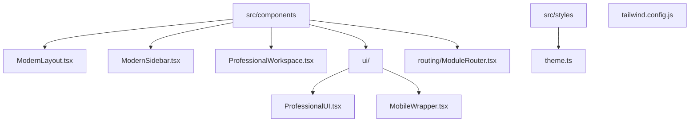
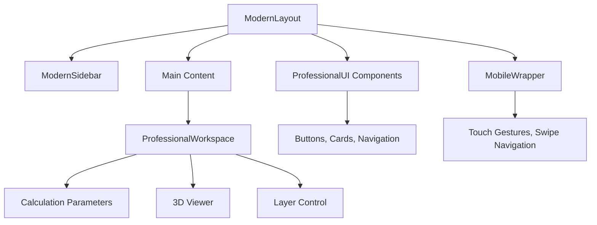
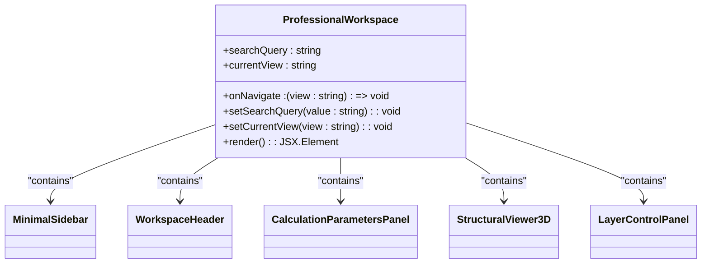
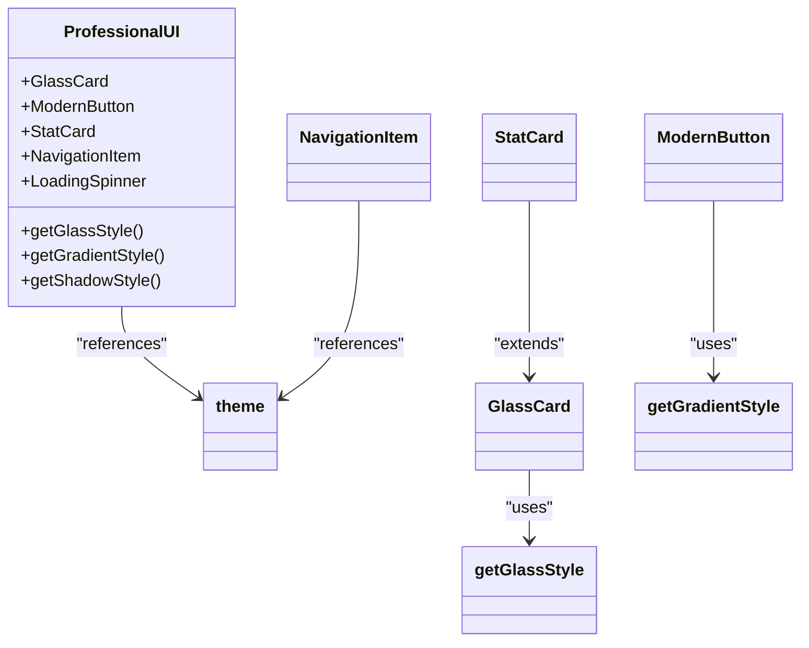
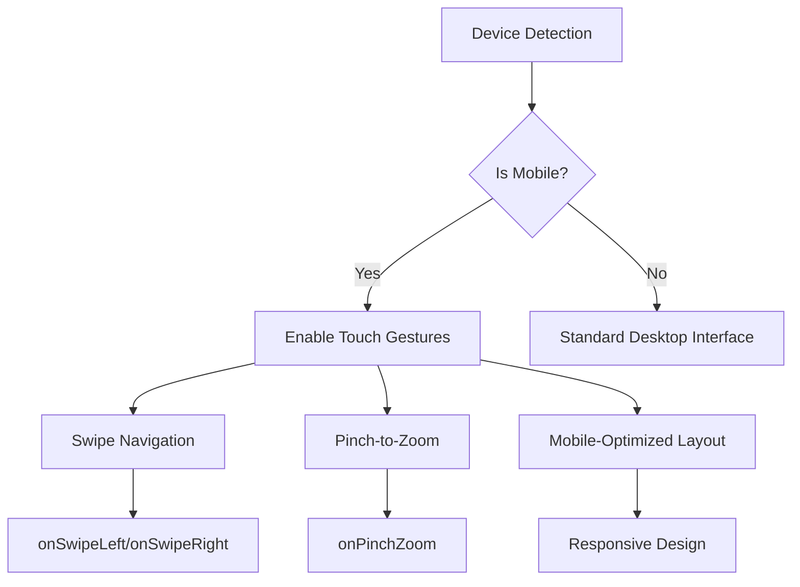
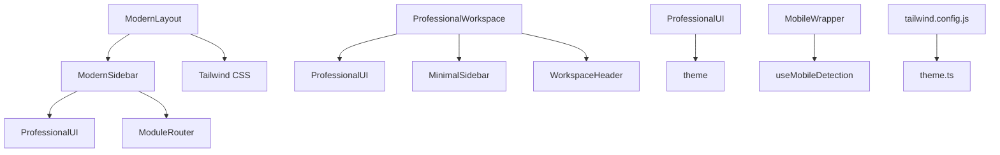

# UI Layout Structure

<cite>
**Referenced Files in This Document**   
- [ModernLayout.tsx](file://src/components/ModernLayout.tsx)
- [ModernSidebar.tsx](file://src/components/ModernSidebar.tsx)
- [ProfessionalWorkspace.tsx](file://src/components/ProfessionalWorkspace.tsx)
- [ProfessionalUI.tsx](file://src/components/ui/ProfessionalUI.tsx)
- [MobileWrapper.tsx](file://src/components/ui/MobileWrapper.tsx)
- [ModuleRouter.tsx](file://src/components/routing/ModuleRouter.tsx)
- [tailwind.config.js](file://tailwind.config.js)
- [theme.ts](file://src/styles/theme.ts)
</cite>

## Update Summary
**Changes Made**   
- Updated all component analyses to reflect the professional glassmorphism design and enhanced functionality
- Added detailed information about the collapsible sidebar with categorized module navigation
- Enhanced documentation of the ProfessionalWorkspace component's grid layout and integrated panels
- Updated ProfessionalUI component documentation with glassmorphism styling details
- Added comprehensive mobile adaptation details for touch gestures and device detection
- Updated dependency analysis to reflect the theme system integration and module routing
- Added new diagram showing the enhanced component relationships

## Table of Contents
1. [Introduction](#introduction)
2. [Project Structure](#project-structure)
3. [Core Components](#core-components)
4. [Architecture Overview](#architecture-overview)
5. [Detailed Component Analysis](#detailed-component-analysis)
6. [Dependency Analysis](#dependency-analysis)
7. [Performance Considerations](#performance-considerations)
8. [Troubleshooting Guide](#troubleshooting-guide)
9. [Conclusion](#conclusion)

## Introduction
The UI layout architecture of APP-STRUKTUR-BLACKBOX is designed to provide a professional, responsive, and accessible interface for structural analysis and engineering workflows. The system employs a modular component-based approach with a focus on glassmorphism design principles, responsive behavior across devices, and intuitive navigation. This documentation details the key layout components that form the foundation of the application's user interface, including the primary layout container, sidebar navigation, workspace organization, and mobile adaptation strategies.

## Project Structure
The UI layout components are organized within the `src/components` directory with specialized subdirectories for UI utilities and routing. The structure follows a feature-based organization with clear separation between layout components, UI primitives, and functional modules. The design system is supported by theme configuration files and Tailwind CSS integration.



**Diagram sources**
- [src/components/ModernLayout.tsx](file://src/components/ModernLayout.tsx)
- [src/components/ModernSidebar.tsx](file://src/components/ModernSidebar.tsx)
- [src/components/ProfessionalWorkspace.tsx](file://src/components/ProfessionalWorkspace.tsx)
- [src/components/ui/ProfessionalUI.tsx](file://src/components/ui/ProfessionalUI.tsx)
- [src/components/ui/MobileWrapper.tsx](file://src/components/ui/MobileWrapper.tsx)
- [src/components/routing/ModuleRouter.tsx](file://src/components/routing/ModuleRouter.tsx)
- [src/styles/theme.ts](file://src/styles/theme.ts)
- [tailwind.config.js](file://tailwind.config.js)

**Section sources**
- [src/components/ModernLayout.tsx](file://src/components/ModernLayout.tsx)
- [src/components/ModernSidebar.tsx](file://src/components/ModernSidebar.tsx)
- [src/components/ProfessionalWorkspace.tsx](file://src/components/ProfessionalWorkspace.tsx)

## Core Components
The UI layout architecture is built around four core components that work together to create a cohesive user experience: ModernLayout as the primary container, ModernSidebar for navigation, ProfessionalWorkspace for content organization, and ProfessionalUI for consistent styling. These components are designed to work in concert with Tailwind CSS for responsive design and theming, providing a professional interface that adapts to different screen sizes and user needs.

**Section sources**
- [src/components/ModernLayout.tsx](file://src/components/ModernLayout.tsx)
- [src/components/ModernSidebar.tsx](file://src/components/ModernSidebar.tsx)
- [src/components/ProfessionalWorkspace.tsx](file://src/components/ProfessionalWorkspace.tsx)
- [src/components/ui/ProfessionalUI.tsx](file://src/components/ui/ProfessionalUI.tsx)

## Architecture Overview
The UI layout architecture follows a hierarchical composition pattern where the ModernLayout component serves as the root container, wrapping the ModernSidebar and main content area. The ProfessionalWorkspace component provides a specialized layout for analysis modules, while the ProfessionalUI components ensure consistent styling across the application. Mobile adaptation is handled by the MobileWrapper component, which detects device characteristics and applies appropriate touch interactions.



**Diagram sources**
- [src/components/ModernLayout.tsx](file://src/components/ModernLayout.tsx)
- [src/components/ModernSidebar.tsx](file://src/components/ModernSidebar.tsx)
- [src/components/ProfessionalWorkspace.tsx](file://src/components/ProfessionalWorkspace.tsx)
- [src/components/ui/ProfessionalUI.tsx](file://src/components/ui/ProfessionalUI.tsx)
- [src/components/ui/MobileWrapper.tsx](file://src/components/ui/MobileWrapper.tsx)

## Detailed Component Analysis

### ModernLayout Component Analysis
The ModernLayout component serves as the primary layout container for the application, managing the overall page structure including header, sidebar, and content area. It implements a responsive design pattern that adjusts the content positioning based on sidebar visibility, using CSS transitions for smooth state changes. The component leverages Tailwind CSS utility classes for styling and integrates with the application's theme system to provide a consistent visual experience.

```mermaid
classDiagram
class ModernLayout {
+children : ReactNode
+currentView : string
+onNavigate : (view : string) => void
+showSidebar : boolean
+render() : JSX.Element
}
ModernLayout --> ModernSidebar : "contains"
ModernLayout --> "main content" : "wraps"
```

**Diagram sources**
- [src/components/ModernLayout.tsx](file://src/components/ModernLayout.tsx)

**Section sources**
- [src/components/ModernLayout.tsx](file://src/components/ModernLayout.tsx)

### ModernSidebar Component Analysis
The ModernSidebar component provides comprehensive navigation and tool access within the application. It features a collapsible design with quick access items and categorized module navigation, supporting both expanded and collapsed states. The sidebar implements glassmorphism effects with backdrop blur and gradient backgrounds, creating a modern, professional appearance. It organizes modules by category with visual indicators for active states and supports keyboard navigation for accessibility.

The sidebar includes a header with platform branding and a collapse/expand toggle. Quick access items are always visible and include Dashboard, Structural Analysis, Marketplace, and Educational modules. Module categories are expandable and include Analysis, Design, 3D Visualization, Visualization, Tools, Utilities, and System modules. Each category displays the number of available modules and can be expanded to show individual module navigation items.

```mermaid
classDiagram
class ModernSidebar {
+currentView : string
+onNavigate : (view : string) => void
+isCollapsed : boolean
+expandedCategories : string[]
+toggleCategory(category : string) : void
+render() : JSX.Element
}
ModernSidebar --> NavigationItem : "uses"
ModernSidebar --> moduleDefinitions : "references"
NavigationItem --> "icons" : "displays"
```

**Diagram sources**
- [src/components/ModernSidebar.tsx](file://src/components/ModernSidebar.tsx)
- [src/components/ui/ProfessionalUI.tsx](file://src/components/ui/ProfessionalUI.tsx)
- [src/components/routing/ModuleRouter.tsx](file://src/components/routing/ModuleRouter.tsx)

**Section sources**
- [src/components/ModernSidebar.tsx](file://src/components/ModernSidebar.tsx)

### ProfessionalWorkspace Component Analysis
The ProfessionalWorkspace component organizes analysis modules and maintains workspace state through a structured grid layout. It divides the content area into three primary sections: calculation parameters, 3D viewer, and layer control, providing a comprehensive environment for structural analysis. The component includes a minimal sidebar for navigation and a header with search functionality, creating a professional dashboard-like interface. It manages state for the current view and search queries, coordinating navigation with the parent layout.

The workspace features a calculation parameters panel on the left (3-column width), a 3D viewer in the center (6-column width), and a layer control panel on the right (3-column width). The 3D viewer includes controls for play/pause, reset, and fullscreen, as well as a color scale for stress visualization. The layer control panel allows users to toggle visibility of structural steel, concrete floors, HVAC systems, and electrical systems. Additional information cards display analysis status and model accuracy.



**Diagram sources**
- [src/components/ProfessionalWorkspace.tsx](file://src/components/ProfessionalWorkspace.tsx)

**Section sources**
- [src/components/ProfessionalWorkspace.tsx](file://src/components/ProfessionalWorkspace.tsx)

### ProfessionalUI Component Analysis
The ProfessionalUI component library provides a collection of consistent, themed UI elements that ensure visual harmony across the application. It includes components such as GlassCard, ModernButton, StatCard, and NavigationItem, all styled with the application's glassmorphism theme. These components leverage the theme system for colors, gradients, and shadows, providing a cohesive look and feel. The library also includes utility functions for generating CSS styles based on the theme configuration.

The GlassCard component implements glassmorphism with backdrop blur, gradient borders, and hover effects. ModernButton provides various variants (primary, secondary, success, warning, danger, ghost) with gradient backgrounds and shadow effects. StatCard displays key metrics with icons and trend indicators. NavigationItem provides styled navigation items with active state indicators and badge support. The component library also includes a LoadingSpinner with customizable size and color.



**Diagram sources**
- [src/components/ui/ProfessionalUI.tsx](file://src/components/ui/ProfessionalUI.tsx)
- [src/styles/theme.ts](file://src/styles/theme.ts)

**Section sources**
- [src/components/ui/ProfessionalUI.tsx](file://src/components/ui/ProfessionalUI.tsx)

### Mobile Adaptation Analysis
The mobile adaptation strategy is implemented through the MobileWrapper component, which detects mobile devices and applies touch-friendly interactions. The component supports touch gestures including swipe navigation and pinch-to-zoom, enhancing usability on touch devices. It dynamically adjusts the interface based on device characteristics, ensuring optimal user experience across different screen sizes. The mobile detection logic considers user agent, touch capabilities, and screen dimensions to determine the appropriate interface mode.

The MobileWrapper component provides configurable touch gesture support through props like enableTouchGestures, enableSwipeNavigation, onSwipeLeft, onSwipeRight, and onPinchZoom. It uses a combination of touch event handlers (onTouchStart, onTouchMove, onTouchEnd) to detect and respond to user interactions. The component also includes a useMobileDetection hook that provides real-time information about device type, screen size, and orientation.



**Diagram sources**
- [src/components/ui/MobileWrapper.tsx](file://src/components/ui/MobileWrapper.tsx)

**Section sources**
- [src/components/ui/MobileWrapper.tsx](file://src/components/ui/MobileWrapper.tsx)

## Dependency Analysis
The UI layout components have a well-defined dependency hierarchy with clear relationships between components. The ModernLayout depends on ModernSidebar for navigation, while ProfessionalWorkspace uses various UI components from the ProfessionalUI library. The theme system is a central dependency for styling, with components importing theme values for colors, gradients, and shadows. Tailwind CSS is configured to work with the application's design tokens, ensuring consistency between utility classes and custom components.



**Diagram sources**
- [src/components/ModernLayout.tsx](file://src/components/ModernLayout.tsx)
- [src/components/ModernSidebar.tsx](file://src/components/ModernSidebar.tsx)
- [src/components/ProfessionalWorkspace.tsx](file://src/components/ProfessionalWorkspace.tsx)
- [src/components/ui/ProfessionalUI.tsx](file://src/components/ui/ProfessionalUI.tsx)
- [src/components/ui/MobileWrapper.tsx](file://src/components/ui/MobileWrapper.tsx)
- [src/components/routing/ModuleRouter.tsx](file://src/components/routing/ModuleRouter.tsx)
- [src/styles/theme.ts](file://src/styles/theme.ts)
- [tailwind.config.js](file://tailwind.config.js)

**Section sources**
- [src/components/ModernLayout.tsx](file://src/components/ModernLayout.tsx)
- [src/components/ModernSidebar.tsx](file://src/components/ModernSidebar.tsx)
- [src/components/ProfessionalWorkspace.tsx](file://src/components/ProfessionalWorkspace.tsx)
- [src/components/ui/ProfessionalUI.tsx](file://src/components/ui/ProfessionalUI.tsx)
- [src/components/ui/MobileWrapper.tsx](file://src/components/ui/MobileWrapper.tsx)
- [src/components/routing/ModuleRouter.tsx](file://src/components/routing/ModuleRouter.tsx)
- [src/styles/theme.ts](file://src/styles/theme.ts)
- [tailwind.config.js](file://tailwind.config.js)

## Performance Considerations
The UI layout architecture is designed with performance in mind, utilizing React's component-based structure to minimize re-renders and optimize rendering efficiency. The use of lazy loading for modules through React.lazy and Suspense reduces initial bundle size, while the MobileWrapper component ensures that touch gesture handlers are only active on appropriate devices. The theme system's utility functions are memoized to prevent unnecessary style recalculations, and CSS variables are used to enable efficient theme switching without re-rendering components.

## Troubleshooting Guide
Common issues with the UI layout components typically relate to responsive behavior, theme integration, or mobile adaptation. Issues with sidebar rendering may stem from incorrect theme values or missing CSS variables. Problems with mobile detection can occur when user agent strings are not properly recognized or when touch events are not correctly handled. Theme inconsistencies may arise from mismatched color values between the theme configuration and Tailwind CSS settings. Debugging should focus on verifying the correct propagation of props and state between components, particularly for navigation and view state management.

**Section sources**
- [src/components/ModernLayout.tsx](file://src/components/ModernLayout.tsx)
- [src/components/ModernSidebar.tsx](file://src/components/ModernSidebar.tsx)
- [src/components/ProfessionalWorkspace.tsx](file://src/components/ProfessionalWorkspace.tsx)
- [src/components/ui/ProfessionalUI.tsx](file://src/components/ui/ProfessionalUI.tsx)
- [src/components/ui/MobileWrapper.tsx](file://src/components/ui/MobileWrapper.tsx)
- [src/styles/theme.ts](file://src/styles/theme.ts)

## Conclusion
The UI layout architecture of APP-STRUKTUR-BLACKBOX demonstrates a well-structured, component-based approach to building a professional engineering application interface. The combination of ModernLayout, ModernSidebar, ProfessionalWorkspace, and ProfessionalUI components creates a cohesive and responsive user experience that adapts to different devices and user needs. The integration with Tailwind CSS and the custom theme system ensures visual consistency across the application, while the mobile adaptation strategies provide optimal usability on touch devices. This architecture supports the application's goal of providing a zero-tolerance engineering solution with a professional, intuitive interface for structural analysis workflows.