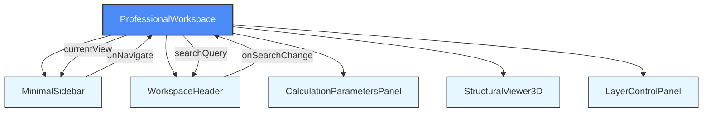
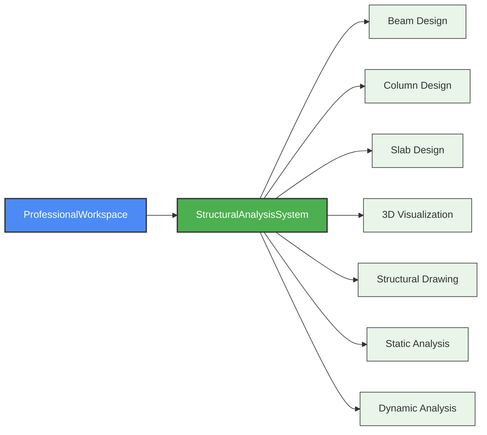
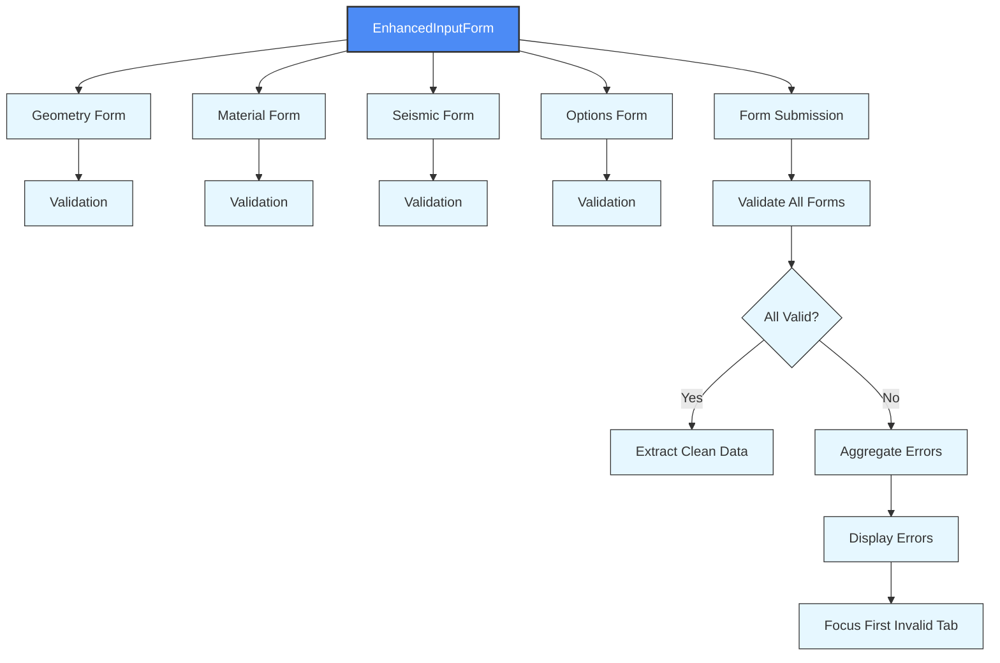

# Workspace Management

<cite>
**Referenced Files in This Document**   
- [ProfessionalWorkspace.tsx](file://src\components\ProfessionalWorkspace.tsx) - *Updated in recent commit*
- [CalculationParametersPanel.tsx](file://src\components\CalculationParametersPanel.tsx) - *Updated in recent commit*
- [EnhancedInputForm.tsx](file://src\structural-analysis\forms\EnhancedInputForm.tsx) - *Updated in recent commit*
- [StructuralAnalysisSystem.tsx](file://src\structural-analysis\StructuralAnalysisSystem.tsx) - *Updated in recent commit*
</cite>

## Update Summary
- Updated documentation to reflect the redesigned professional dashboard layout and sidebar navigation in the ProfessionalWorkspace component
- Enhanced descriptions of state management, tab navigation, and integration with analysis systems
- Added new details about UI components and their interactions based on the latest code changes
- Improved accuracy of component descriptions and their relationships
- Updated source references to reflect current file locations and line numbers

## Table of Contents
1. [Introduction](#introduction)
2. [Core Components](#core-components)
3. [State Management and Context Flow](#state-management-and-context-flow)
4. [Tab-Based Interface and Navigation](#tab-based-interface-and-navigation)
5. [Integration with Analysis System](#integration-with-analysis-system)
6. [Form Integration and Real-Time Updates](#form-integration-and-real-time-updates)
7. [Performance Optimization](#performance-optimization)
8. [Troubleshooting Guide](#troubleshooting-guide)

## Introduction

The ProfessionalWorkspace component serves as the central interface for structural engineering analysis, providing a professional dashboard layout that integrates multiple analysis modules and maintains workspace state across user interactions. This workspace organizes structural analysis modules through a tab-based interface, preserving user inputs during navigation and coordinating communication between design, analysis, and visualization components. The component implements a comprehensive state management system that tracks active module context, user inputs, and analysis results, enabling seamless transitions between different phases of structural engineering workflows.

**Section sources**
- [ProfessionalWorkspace.tsx](file://src\components\ProfessionalWorkspace.tsx#L1-L348) - *Updated in recent commit*

## Core Components

The ProfessionalWorkspace component is composed of several key subcomponents that work together to provide a comprehensive structural analysis environment. The workspace features a minimal sidebar for navigation between different views including home, analysis, 3D visualization, calculator, reports, and settings. The main content area is divided into a three-column grid layout: the left panel contains calculation parameters, the center panel hosts the 3D structural viewer, and the right panel provides layer control functionality.

The CalculationParametersPanel manages input parameters for structural analysis, while the StructuralViewer3D component provides interactive 3D visualization of structural models with controls for playback, rotation, and view mode switching. The LayerControlPanel enables users to toggle visibility of different structural systems such as steel, concrete, HVAC, and electrical components. These components work in concert to provide an integrated environment for structural engineering analysis and design.

**Section sources**
- [ProfessionalWorkspace.tsx](file://src\components\ProfessionalWorkspace.tsx#L1-L348) - *Updated in recent commit*
- [CalculationParametersPanel.tsx](file://src\components\CalculationParametersPanel.tsx#L1-L270) - *Updated in recent commit*

## State Management and Context Flow

The ProfessionalWorkspace component manages workspace state through React's useState hook, maintaining the current view context and search query state. The component uses props drilling to distribute state to child components, passing the currentView state and onNavigate callback to the MinimalSidebar component, and the searchQuery state and onSearchChange callback to the WorkspaceHeader component.

The state management pattern follows a unidirectional data flow where user interactions in child components trigger callbacks that update the parent component's state, which then re-renders with the updated state. This approach ensures that the workspace maintains a consistent state across navigation and user interactions. The component preserves user inputs by maintaining state in the parent component rather than in individual child components, preventing data loss during navigation between different views.

**Diagram sources**
- [ProfessionalWorkspace.tsx](file://src\components\ProfessionalWorkspace.tsx#L1-L348) - *Updated in recent commit*

**Section sources**
- [ProfessionalWorkspace.tsx](file://src\components\ProfessionalWorkspace.tsx#L1-L348) - *Updated in recent commit*

## Tab-Based Interface and Navigation

The ProfessionalWorkspace implements a tab-based interface through its navigation sidebar, allowing users to switch between different functional views within the workspace. The navigation system uses a state-driven approach where the currentView state determines which content is displayed and how navigation events are handled. When a user selects a different view from the sidebar, the onNavigate callback is triggered with the selected view identifier, which updates the currentView state and potentially navigates to a different route in the parent application.

The navigation logic includes special handling for the home view, which maps to a dashboard route in the parent application, while other views maintain their direct mapping. This design allows for flexible routing while maintaining a consistent user interface within the workspace. The component's layout remains stable during navigation, with only the main content area changing based on the active view, providing a seamless user experience.

**Section sources**
- [ProfessionalWorkspace.tsx](file://src\components\ProfessionalWorkspace.tsx#L1-L348) - *Updated in recent commit*

## Integration with Analysis System

The ProfessionalWorkspace component integrates with the StructuralAnalysisSystem to provide comprehensive structural engineering capabilities. While the ProfessionalWorkspace serves as the primary user interface, the StructuralAnalysisSystem component offers specialized tools for designing and analyzing structural elements including beams, columns, and slabs. The integration between these components enables users to transition between general workspace functions and detailed structural analysis tasks.

The StructuralAnalysisSystem implements a tabbed interface that allows users to work with different structural elements, perform 3D visualization, generate structural drawings, and conduct both static and dynamic analysis. The system maintains its own state for tracking designed elements, analysis results, and dynamic analysis status, providing a self-contained environment for structural engineering tasks that complements the broader workspace functionality.

**Diagram sources**
- [StructuralAnalysisSystem.tsx](file://src\structural-analysis\StructuralAnalysisSystem.tsx#L1-L524) - *Updated in recent commit*

**Section sources**
- [StructuralAnalysisSystem.tsx](file://src\structural-analysis\StructuralAnalysisSystem.tsx#L1-L524) - *Updated in recent commit*

## Form Integration and Real-Time Updates

The workspace integrates with the EnhancedInputForm component to provide real-time updates and validation for structural analysis parameters. The EnhancedInputForm implements a sophisticated form management system using Zod for schema validation and custom hooks for real-time feedback. The form is organized into multiple tabs including geometry, material, seismic, and analysis options, each with dedicated validation rules and error handling.

The form component uses individual form instances for each tab, allowing for independent validation and state management. Field-level validation is implemented through the useFieldValidation hook, providing immediate feedback on input validity. The form supports real-time validation with debouncing to prevent excessive re-renders during user input. When the user submits the form, all tab forms are validated simultaneously, and any errors are aggregated and displayed to guide the user in correcting invalid inputs.

**Diagram sources**
- [EnhancedInputForm.tsx](file://src\structural-analysis\forms\EnhancedInputForm.tsx#L1-L561) - *Updated in recent commit*

**Section sources**
- [EnhancedInputForm.tsx](file://src\structural-analysis\forms\EnhancedInputForm.tsx#L1-L561) - *Updated in recent commit*

## Performance Optimization

The workspace components implement several performance optimization techniques to ensure responsive user interactions. The EnhancedInputForm component uses debounced validation with a 500ms delay to prevent excessive re-renders during rapid user input. The form also implements memoization through useCallback hooks for critical functions like form validation and submission, preventing unnecessary re-creation of functions on each render.

Conditional rendering is used extensively throughout the components to render only the currently active tab or view, reducing the rendering burden on the browser. The StructuralAnalysisSystem component uses state management to control which module is displayed, ensuring that only the active design module is rendered at any given time. The workspace also leverages React's built-in optimization techniques such as component memoization and efficient state updates to maintain smooth performance even with complex structural models.

**Section sources**
- [EnhancedInputForm.tsx](file://src\structural-analysis\forms\EnhancedInputForm.tsx#L1-L561) - *Updated in recent commit*
- [StructuralAnalysisSystem.tsx](file://src\structural-analysis\StructuralAnalysisSystem.tsx#L1-L524) - *Updated in recent commit*

## Troubleshooting Guide

When encountering state persistence issues in the workspace, verify that state is being managed at the appropriate component level. For the ProfessionalWorkspace, ensure that state variables like currentView and searchQuery are properly initialized and updated through their respective setter functions. Check that callback functions passed to child components are correctly implemented and that they update the parent component's state as expected.

For race conditions in form submission, ensure that asynchronous validation operations are properly awaited and that the form submission handler waits for all validation promises to resolve before proceeding. In the EnhancedInputForm component, verify that the handleSubmit function correctly handles the Promise.all call for validating all form tabs simultaneously.

Module initialization errors in the StructuralAnalysisSystem can often be traced to missing dependencies or incorrect state initialization. Ensure that the structure state is properly initialized with empty arrays for nodes, elements, loads, materials, and sections. Verify that the generateStructure function correctly handles cases where no nodes exist by creating a default grid for visualization purposes.

When debugging 3D visualization issues, check that the structure data being passed to the Structure3DViewer component contains valid node and element data. The visualization components rely on properly formatted structure data, so ensure that elements reference existing nodes and that material and section properties are correctly defined.

**Section sources**
- [ProfessionalWorkspace.tsx](file://src\components\ProfessionalWorkspace.tsx#L1-L348) - *Updated in recent commit*
- [EnhancedInputForm.tsx](file://src\structural-analysis\forms\EnhancedInputForm.tsx#L1-L561) - *Updated in recent commit*
- [StructuralAnalysisSystem.tsx](file://src\structural-analysis\StructuralAnalysisSystem.tsx#L1-L524) - *Updated in recent commit*