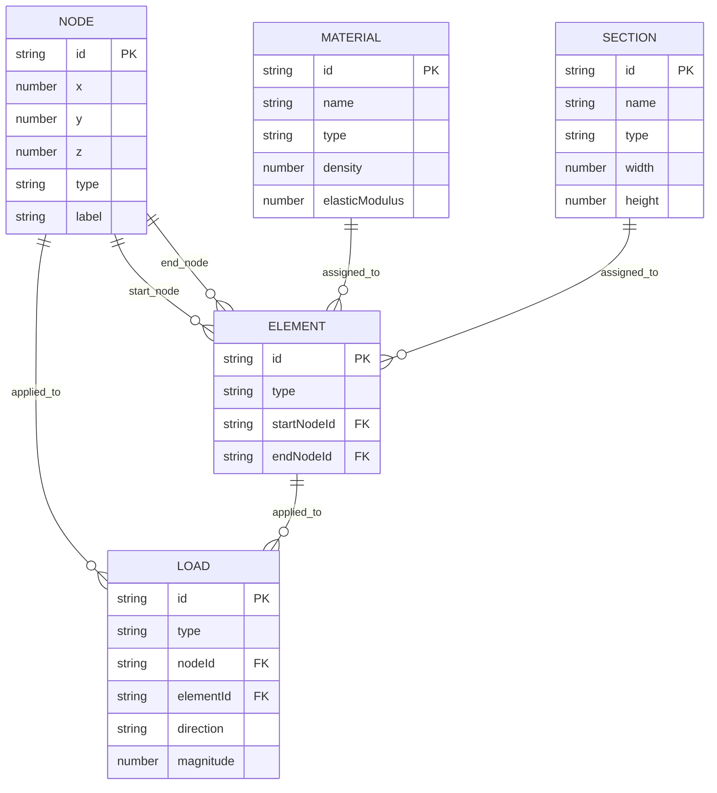
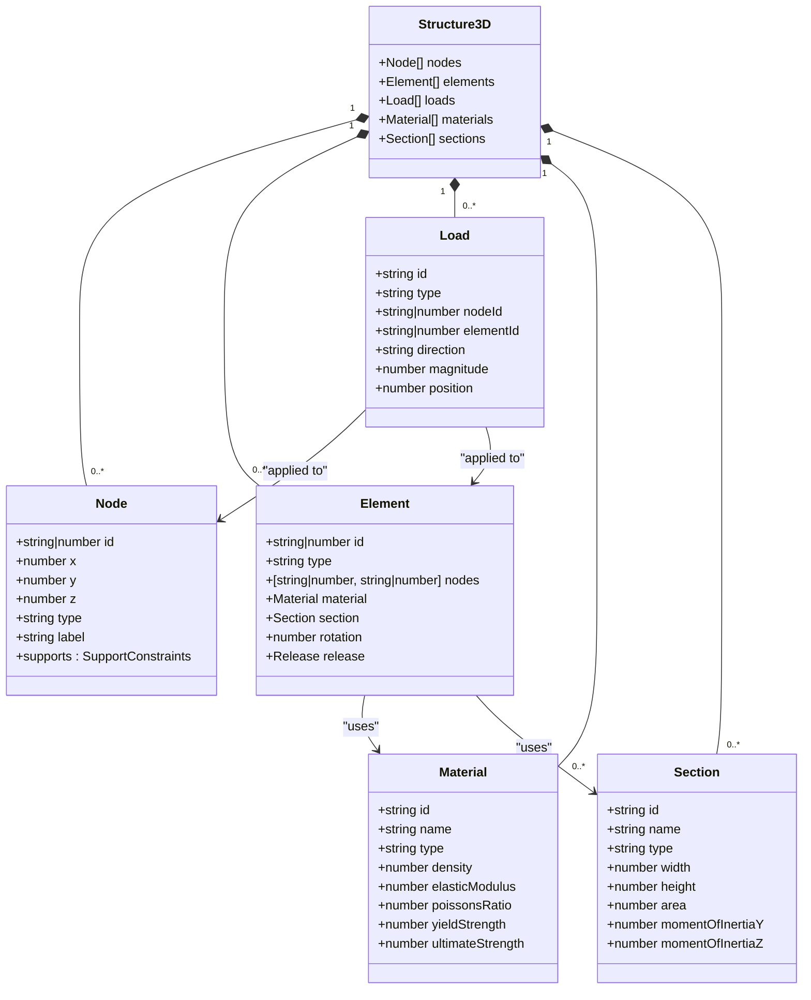
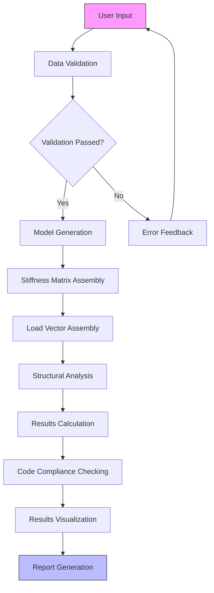

# Data Models & Type Definitions

<cite>
**Referenced Files in This Document**   
- [structural.ts](file://src/types/structural.ts)
- [UnifiedTypes.ts](file://src/structural-analysis/types/UnifiedTypes.ts)
- [sample-structures.ts](file://src/tests/sample-structures.ts)
- [AdvancedStructuralEngine.ts](file://src/structural-analysis/engines/AdvancedStructuralEngine.ts)
</cite>

## Table of Contents
1. [Introduction](#introduction)
2. [Core Structural Entities](#core-structural-entities)
3. [Entity Relationships and Data Model](#entity-relationships-and-data-model)
4. [Type Definitions and Type Safety](#type-definitions-and-type-safety)
5. [Data Lifecycle and Processing Flow](#data-lifecycle-and-processing-flow)
6. [Sample Data Structures](#sample-data-structures)
7. [Data Integrity and Business Rules](#data-integrity-and-business-rules)
8. [Performance Implications](#performance-implications)
9. [Conclusion](#conclusion)

## Introduction
The APP-STRUKTUR-BLACKBOX application implements a comprehensive structural engineering data model designed to represent complex building systems with precision and type safety. This documentation details the core data structures that define nodes, elements, materials, sections, and loads in 3D structural models. The system leverages TypeScript interfaces to ensure type safety across the application, enabling robust validation and error prevention. The data model supports the complete lifecycle from user input through structural analysis to results visualization, with special consideration for Indonesian standards (SNI) compliance. This document provides a detailed examination of the entity relationships, field definitions, validation rules, and performance characteristics of the structural data model.

## Core Structural Entities

The structural data model is built around five core entities: Node, Element, Material, Section, and Load. Each entity has specific properties that define its physical and analytical characteristics.

### Node
The Node interface represents a point in 3D space that serves as a connection point for structural elements. Each node has spatial coordinates (x, y, z) and can have support conditions that constrain movement in various degrees of freedom. Support constraints include translations (ux, uy, uz) and rotations (rx, ry, rz) along the three axes.

### Element
The Element interface represents structural members such as beams, columns, braces, slabs, walls, or trusses. Elements connect two nodes and inherit material and section properties. Each element can have end releases that modify the connectivity between the element and its nodes, allowing for more realistic modeling of actual construction conditions.

### Material
The Material interface defines the physical properties of construction materials including concrete, steel, timber, or other types. Key properties include density, elastic modulus, Poisson's ratio, yield strength, and ultimate strength. These material properties directly influence the structural behavior during analysis.

### Section
The Section interface describes the geometric properties of structural cross-sections, supporting rectangular, circular, I-section, H-section, or custom shapes. Properties include width, height, area, moment of inertia, and torsional constant, which are essential for calculating section stiffness and strength.

### Load
The Load interface represents forces applied to the structure, including point loads, distributed loads, and moments. Loads can be applied to nodes or elements in specific directions (x, y, z, or global). The magnitude and position of loads are critical inputs for structural analysis.

**Section sources**
- [structural.ts](file://src/types/structural.ts#L6-L89)

## Entity Relationships and Data Model

The structural data model follows a hierarchical relationship where nodes form the foundation, elements connect nodes, and both elements and nodes can have loads applied to them. Materials and sections are reusable components that can be referenced by multiple elements.

**Diagram sources**
- [structural.ts](file://src/types/structural.ts#L6-L89)

**Section sources**
- [structural.ts](file://src/types/structural.ts#L6-L89)

## Type Definitions and Type Safety

The application implements two complementary type systems: a core structural model and a unified analysis framework. The core structural types in `structural.ts` provide fundamental definitions for 3D structural modeling, while the unified types in `UnifiedTypes.ts` extend these with project-specific parameters and analysis configurations.

The `Structure3D` interface serves as the container for complete structural models, aggregating arrays of nodes, elements, loads, materials, and sections. This interface ensures that all components of a structural system are properly organized and accessible for analysis.

The unified type system includes comprehensive interfaces for project information, geometry, materials, loads, and seismic parameters that align with Indonesian standards (SNI). These types incorporate safety factors, load combinations, and code-specific parameters that ensure regulatory compliance.

**Diagram sources**
- [structural.ts](file://src/types/structural.ts#L92-L98)
- [structural.ts](file://src/types/structural.ts#L6-L89)

**Section sources**
- [structural.ts](file://src/types/structural.ts#L6-L98)
- [UnifiedTypes.ts](file://src/structural-analysis/types/UnifiedTypes.ts#L6-L113)

## Data Lifecycle and Processing Flow

The data lifecycle in APP-STRUKTUR-BLACKBOX follows a structured flow from user input through analysis to results visualization. The process begins with user input of project information, geometry, materials, and loads, which are validated against defined schemas.

**Diagram sources**
- [AdvancedStructuralEngine.ts](file://src/structural-analysis/engines/AdvancedStructuralEngine.ts#L143-L183)

**Section sources**
- [AdvancedStructuralEngine.ts](file://src/structural-analysis/engines/AdvancedStructuralEngine.ts#L143-L183)

## Sample Data Structures

The system includes sample data structures for testing and demonstration purposes. These examples represent common building configurations and validate the functionality of the structural analysis engine.

The simple beam structure consists of two nodes connected by a single beam element with a point load applied at the free end. This basic configuration tests fundamental bending behavior and support conditions.

The simple portal frame includes four nodes forming a rectangular frame with fixed supports at the base. This 2D structure tests moment connections and frame behavior under vertical loading.

The simple 3D frame extends the portal concept to three dimensions, allowing for more complex load paths and torsional effects. These sample structures serve as benchmarks for verifying analysis accuracy and performance.

**Section sources**
- [sample-structures.ts](file://src/tests/sample-structures.ts#L189-L221)

## Data Integrity and Business Rules

The data model enforces several integrity constraints and business rules to ensure valid structural models. The AdvancedStructuralEngine validates that all elements reference existing nodes, preventing orphaned elements in the model.

Material and section properties must be physically plausible, with positive values for density, elastic modulus, and geometric dimensions. Load magnitudes must be non-zero to prevent meaningless analysis cases.

The system implements SNI-compliant load combinations and safety factors, ensuring that design results meet Indonesian regulatory requirements. Seismic parameters are validated against site classification and structural system type to prevent incompatible combinations.

Analysis status tracking ensures that the system progresses through defined stages (validating, generating model, assembling matrix, solving system, etc.), providing clear feedback on processing progress and preventing premature result interpretation.

**Section sources**
- [AdvancedStructuralEngine.ts](file://src/structural-analysis/engines/AdvancedStructuralEngine.ts#L417-L456)
- [UnifiedTypes.ts](file://src/structural-analysis/types/UnifiedTypes.ts#L68-L88)

## Performance Implications

The data model design has significant performance implications for large structural systems. The stiffness matrix assembly process scales with the square of the number of degrees of freedom, making efficient data structures critical for performance.

The use of Map objects for node and element storage in the AdvancedStructuralEngine enables O(1) lookup times, optimizing the matrix assembly process. However, the global stiffness matrix becomes sparse for large models, suggesting potential optimization through sparse matrix storage formats.

Memory usage scales linearly with the number of nodes and elements, while computation time increases non-linearly due to matrix operations. The system implements progress tracking to provide feedback during long-running analyses, improving user experience for complex models.

The type-safe design reduces runtime errors and validation overhead, contributing to overall system reliability and performance. However, extensive type checking during development may increase compilation time for large projects.

**Section sources**
- [AdvancedStructuralEngine.ts](file://src/structural-analysis/engines/AdvancedStructuralEngine.ts#L143-L183)

## Conclusion
The structural data model in APP-STRUKTUR-BLACKBOX provides a comprehensive, type-safe framework for representing and analyzing building structures. By defining clear relationships between nodes, elements, materials, sections, and loads, the system enables accurate modeling of complex structural systems. The integration of SNI standards into the unified type system ensures regulatory compliance while maintaining flexibility for various building types and loading conditions. The data lifecycle is carefully orchestrated from input validation through analysis to results visualization, with appropriate feedback at each stage. While the current design performs well for typical structural models, opportunities exist for optimization through sparse matrix techniques and parallel processing for very large systems.