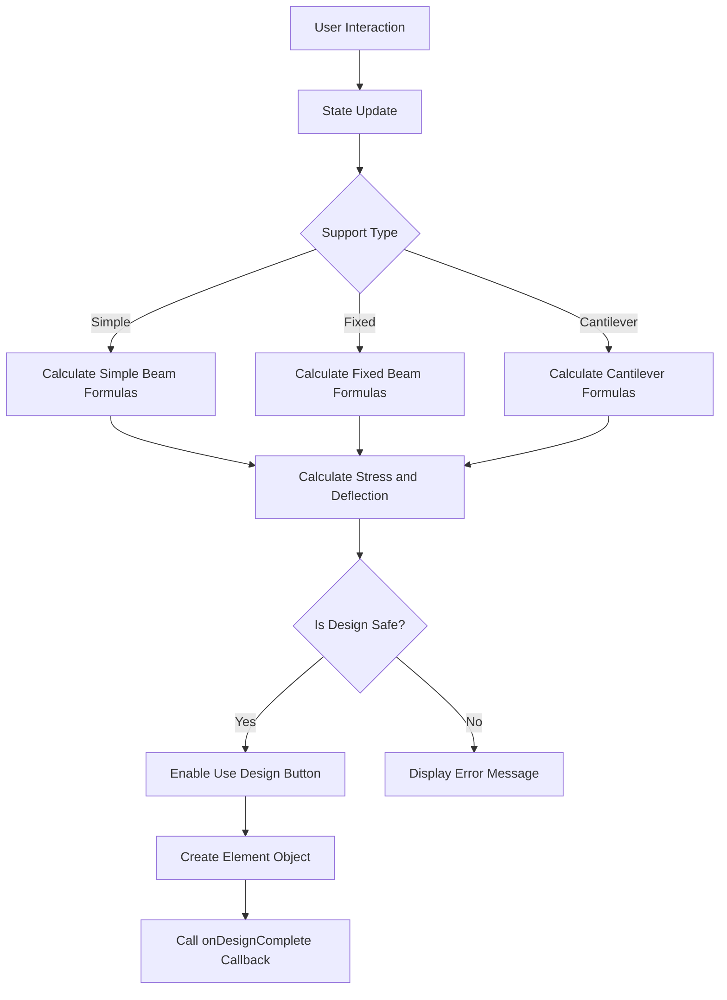
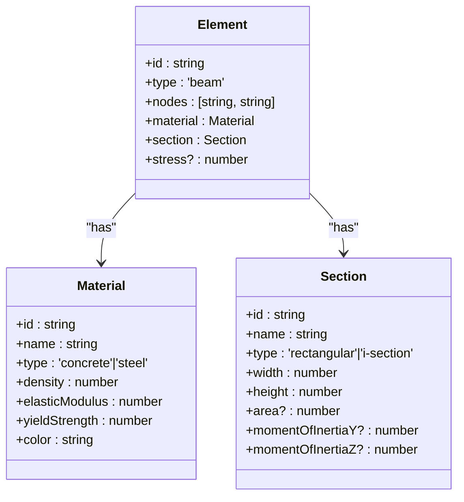
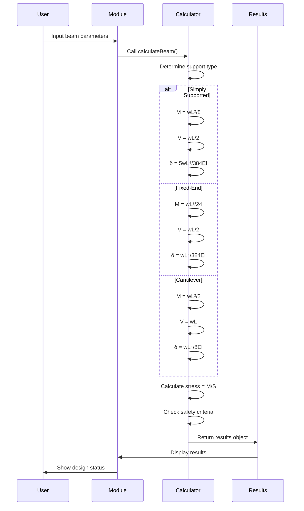
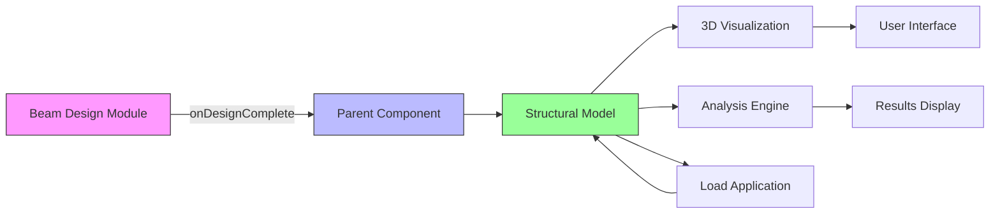
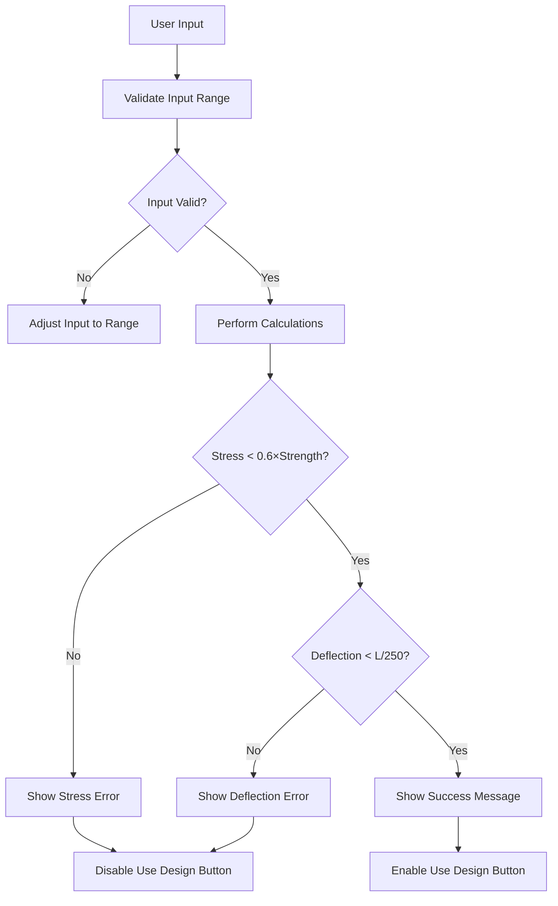
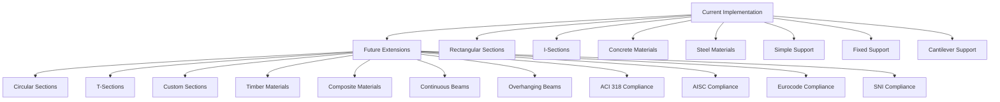

# Beam Design Module

<cite>
**Referenced Files in This Document**   
- [BeamDesignModule.tsx](file://src/structural-analysis/design/BeamDesignModule.tsx)
- [structural.ts](file://src/types/structural.ts)
- [BeamProperties.ts](file://src/structural-analysis/design/BeamProperties.ts)
</cite>

## Table of Contents
1. [Introduction](#introduction)
2. [Core Components](#core-components)
3. [Material and Section Properties](#material-and-section-properties)
4. [Section Property Calculations](#section-property-calculations)
5. [Stress and Deflection Calculations](#stress-and-deflection-calculations)
6. [Integration with Structural Analysis System](#integration-with-structural-analysis-system)
7. [Form Validation and Error Handling](#form-validation-and-error-handling)
8. [Extensibility and Standards Compliance](#extensibility-and-standards-compliance)

## Introduction

The Beam Design Module in APP-STRUKTUR-BLACKBOX provides a comprehensive beam calculator for structural engineers. This module enables users to design beams with different support types (simple, fixed, cantilever), material types (concrete, steel), and section geometries (rectangular, I-section). The module integrates engineering calculations with an intuitive user interface, providing immediate feedback on design safety through stress and deflection analysis. The implementation follows a component-based architecture with clear separation between UI presentation, state management, and calculation logic.

## Core Components

The Beam Design Module is implemented as a React functional component that manages its state through React hooks. The component provides a user interface for inputting beam parameters and displays calculated results with visual feedback on design safety. The module's architecture follows a clear pattern of state management, calculation logic, and UI rendering.

The component accepts a callback function `onDesignComplete` as a prop, which is invoked when a safe design is completed. This integration point allows the beam design to be incorporated into the larger structural analysis workflow. The module maintains state for beam properties including length, load, support type, material type, section type, and section dimensions.

Key functions within the module include `calculateBeam` for performing the engineering calculations, `createBeamElement` for generating a standardized element object, and `calculateSectionProperties` for determining geometric properties of the beam cross-section. The UI is organized into logical sections for basic parameters, material and section selection, and advanced options, with responsive layout that adapts to different screen sizes.



**Section sources**
- [BeamDesignModule.tsx](file://src/structural-analysis/design/BeamDesignModule.tsx#L145-L176)
- [BeamDesignModule.tsx](file://src/structural-analysis/design/BeamDesignModule.tsx#L192-L211)

## Material and Section Properties

The Beam Design Module supports two primary material types: concrete and steel, with predefined material properties that align with standard engineering specifications. For concrete, the module uses a strength of 25 MPa with an elastic modulus of 25,000 MPa, while steel is defined with a strength of 250 MPa and an elastic modulus of 200,000 MPa. These material properties are used in the stress and deflection calculations to determine the structural behavior of the beam.

The module supports two section types: rectangular and I-section. For rectangular sections, users can specify width and height dimensions directly. For I-sections, additional parameters include flange width, flange thickness, web thickness, and overall height. These section types represent common structural elements used in building construction, with rectangular sections typically used for concrete beams and I-sections for steel beams.

The material and section properties are defined in the structural type definitions and are consistent across the application. The module uses safety factors of 0.6 for both concrete and steel materials, which represents a conservative approach to design by using 60% of the material's ultimate strength as the allowable stress. This safety factor accounts for uncertainties in material properties, construction quality, and load variations.



**Diagram sources**
- [structural.ts](file://src/types/structural.ts#L20-L129)
- [BeamProperties.ts](file://src/structural-analysis/design/BeamProperties.ts#L4-L49)

## Section Property Calculations

The module implements precise calculations for section properties based on the selected section geometry. For rectangular sections, the area is calculated as the product of width and height. The moment of inertia is calculated using the standard formula bh³/12, where b is the width and h is the height. The section modulus is derived from the moment of inertia divided by the distance to the extreme fiber (height/2).

For I-sections, the calculations are more complex due to the composite nature of the cross-section. The area is calculated as the sum of the web area and flange areas. The web area is determined by multiplying the web thickness by the height minus twice the flange thickness. Each flange area is calculated by multiplying the flange width by the flange thickness, with two flanges total. The moment of inertia for I-sections uses the parallel axis theorem, calculating the difference between the outer rectangle and the inner rectangle representing the web opening.

The section modulus for both section types is calculated as the moment of inertia divided by the distance to the extreme fiber (height/2). These geometric properties are fundamental to beam design, as they directly influence the beam's resistance to bending and deflection. The calculations are performed in the `calculateSectionProperties` function, which returns an object containing the area, moment of inertia, and section modulus for use in subsequent stress and deflection calculations.

```mermaid
flowchart TD
A[Section Type] --> B{Rectangular?}
B --> |Yes| C[Area = width × height]
B --> |No| D[Web Area = webThickness × (height - 2×flangeThickness)]
D --> E[Flange Area = 2 × flangeWidth × flangeThickness]
E --> F[Total Area = Web Area + Flange Area]
C --> G[Moment of Inertia = (width × height³)/12]
F --> H[Moment of Inertia = (flangeWidth × height³ - (flangeWidth - webThickness) × (height - 2×flangeThickness)³)/12]
G --> I[Section Modulus = Moment of Inertia / (height/2)]
H --> I
I --> J[Return Properties]
```

**Section sources**
- [BeamDesignModule.tsx](file://src/structural-analysis/design/BeamDesignModule.tsx#L192-L211)
- [BeamProperties.ts](file://src/structural-analysis/design/BeamProperties.ts#L148-L162)

## Stress and Deflection Calculations

The beam design calculations are based on fundamental engineering principles for beam behavior under uniform loading. The maximum moment, shear force, and deflection are calculated differently depending on the support type, reflecting the different boundary conditions and load distributions for each configuration.

For simply supported beams, the maximum moment occurs at midspan and is calculated as wL²/8, where w is the uniform load and L is the beam length. The maximum shear occurs at the supports and equals wL/2. The maximum deflection is calculated using the formula 5wL⁴/384EI, where E is the elastic modulus and I is the moment of inertia.

For fixed-end beams, the maximum moment occurs at the supports and is calculated as wL²/24, which is significantly less than for simply supported beams due to the restraint at both ends. The maximum shear remains wL/2, and the maximum deflection is wL⁴/384EI, which is one-fifth of the deflection for a simply supported beam.

For cantilever beams, the maximum moment occurs at the fixed end and is calculated as wL²/2, which is four times greater than for a simply supported beam of the same span. The maximum shear is wL, and the maximum deflection is wL⁴/8EI, which is 48 times greater than for a simply supported beam.

The maximum stress is calculated as M/S, where M is the maximum moment and S is the section modulus. The design is considered safe if the maximum stress is below 60% of the material's strength and the maximum deflection is below L/250. These criteria ensure both strength and serviceability requirements are met.



**Section sources**
- [BeamDesignModule.tsx](file://src/structural-analysis/design/BeamDesignModule.tsx#L210-L243)
- [BeamDesignModule.tsx](file://src/structural-analysis/design/BeamDesignModule.tsx#L244-L288)

## Integration with Structural Analysis System

The Beam Design Module integrates with the main structural analysis system through the `onDesignComplete` callback function. When a user completes a beam design that passes safety checks, they can click the "Use This Design" button, which triggers the creation of a standardized Element object and passes it to the parent component via the callback. This integration pattern allows the beam design functionality to be embedded within larger structural modeling workflows.

The `createBeamElement` function constructs an Element object that conforms to the application's structural data model. This object includes the beam's material properties with appropriate unit conversions (elastic modulus from MPa to Pa, yield strength from MPa to Pa), section properties, and stress information from the design calculations. The element is assigned a default ID and node references, which can be updated by the parent system as the structural model is developed.

This integration approach follows a controlled data flow pattern where the Beam Design Module manages its internal state and calculations but defers to the parent component for incorporating the design into the broader structural model. This separation of concerns allows the beam design functionality to be reused in different contexts within the application while maintaining data consistency across the system.

The Element interface is defined in the structural types module and includes properties for identification, geometry, material, section, and analysis results. This standardized data structure ensures compatibility between the beam design module and other components of the structural analysis system, such as 3D visualization, load application, and structural analysis engines.



**Section sources**
- [BeamDesignModule.tsx](file://src/structural-analysis/design/BeamDesignModule.tsx#L289-L340)
- [structural.ts](file://src/types/structural.ts#L50-L88)

## Form Validation and Error Handling

The Beam Design Module implements comprehensive form validation and error handling to guide users toward safe and feasible designs. The validation occurs at multiple levels: input validation, design safety checking, and user feedback.

Input validation is handled through the UI components, which constrain user inputs to reasonable ranges. The beam length is limited to 1-20 meters, and the uniform load is constrained to 1-100 kN/m. These ranges represent typical values encountered in structural engineering practice and prevent users from entering physically unrealistic parameters that could lead to numerical issues or misleading results.

Design safety checking is performed after calculations are complete and evaluates two primary criteria: stress and deflection. The stress check compares the maximum calculated stress to 60% of the material's strength, providing a safety factor. The deflection check ensures the maximum deflection does not exceed L/250, which is a common serviceability limit for beams. When either criterion is violated, the module provides specific error messages explaining the failure mode and suggesting remedial actions.

The error messaging is designed to be informative and constructive, helping users understand why their design is unsafe and how to improve it. For stress failures, the message suggests increasing the section size or using a stronger material. For deflection failures, the recommendation is to increase section stiffness. This guidance helps users iterate toward a safe design without requiring deep expertise in structural engineering principles.

Visual feedback is provided through color-coded alerts: green for safe designs and red for unsafe designs. The "Use This Design" button is only enabled when the design is safe, preventing users from proceeding with inadequate designs. The reset functionality allows users to quickly return to default values and start a new design iteration.



**Section sources**
- [BeamDesignModule.tsx](file://src/structural-analysis/design/BeamDesignModule.tsx#L264-L288)
- [BeamDesignModule.tsx](file://src/structural-analysis/design/BeamDesignModule.tsx#L341-L348)

## Extensibility and Standards Compliance

The Beam Design Module is designed with extensibility in mind, allowing for future enhancements to support additional section types, material standards, and design codes. The current implementation supports rectangular and I-sections for concrete and steel materials, but the modular architecture makes it straightforward to add new section types such as circular, T-section, or custom geometries.

The module includes a placeholder for advanced options that could be expanded to support different code standards such as ACI 318, AISC, Eurocode, or SNI 2847. Currently, the advanced options section includes a dropdown for code standard selection, indicating the intention to implement code-specific design rules and safety factors in future versions. This would allow the module to automatically adjust its calculations and safety criteria based on the selected design code, making it compliant with regional regulations and standards.

Material properties are currently hardcoded but could be extended to support a wider range of concrete and steel grades, as well as other materials like timber or composite sections. The `beamMaterials` and `beamSections` constants in the BeamProperties module provide a foundation for standard material and section libraries that could be expanded or made user-configurable.

The calculation logic is encapsulated in reusable functions that could be adapted for different loading conditions beyond uniform loads, such as point loads, triangular loads, or combined loading scenarios. The support types could also be extended to include more complex configurations like continuous beams with multiple spans.

This extensibility ensures that the Beam Design Module can evolve to meet the needs of different engineering disciplines and regulatory environments while maintaining a consistent user experience and integration pattern within the APP-STRUKTUR-BLACKBOX ecosystem.



**Section sources**
- [BeamProperties.ts](file://src/structural-analysis/design/BeamProperties.ts#L4-L147)
- [BeamDesignModule.tsx](file://src/structural-analysis/design/BeamDesignModule.tsx#L130-L144)