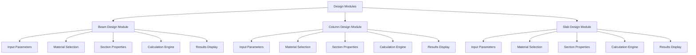
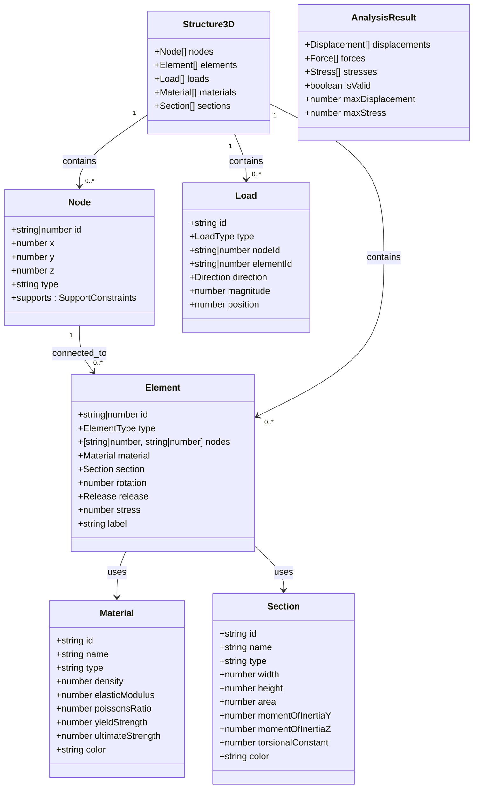
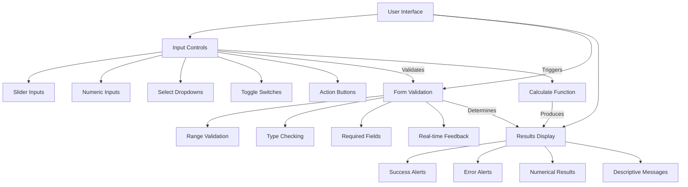
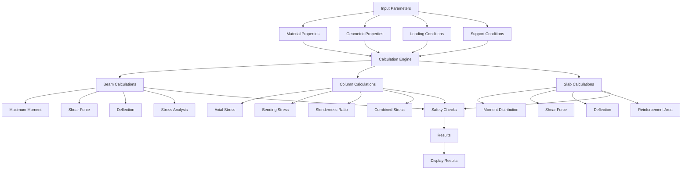

# Design Modules

<cite>
**Referenced Files in This Document**   
- [BeamDesignModule.tsx](file://src/structural-analysis/design/BeamDesignModule.tsx)
- [ColumnDesignModule.tsx](file://src/structural-analysis/design/ColumnDesignModule.tsx)
- [SlabDesignModule.tsx](file://src/structural-analysis/design/SlabDesignModule.tsx)
- [BeamProperties.ts](file://src/structural-analysis/design/BeamProperties.ts)
- [ColumnProperties.ts](file://src/structural-analysis/design/ColumnProperties.ts)
- [SlabProperties.ts](file://src/structural-analysis/design/SlabProperties.ts)
- [structural.ts](file://src/types/structural.ts)
- [StandardIntegration.tsx](file://src/standards/StandardIntegration.tsx)
</cite>

## Table of Contents
1. [Introduction](#introduction)
2. [Core Design Modules](#core-design-modules)
3. [Structural Element Data Models](#structural-element-data-models)
4. [User Interface Components and Form Validation](#user-interface-components-and-form-validation)
5. [Calculation Logic and Engineering Principles](#calculation-logic-and-engineering-principles)
6. [Material Selection and Section Properties](#material-selection-and-section-properties)
7. [Standards Compliance Checking](#standards-compliance-checking)
8. [Error Handling and Boundary Conditions](#error-handling-and-boundary-conditions)
9. [Extensibility of Design Module System](#extensibility-of-design-module-system)
10. [Integration with Main Analysis System](#integration-with-main-analysis-system)
11. [Conclusion](#conclusion)

## Introduction

The Design Modules in APP-STRUKTUR-BLACKBOX provide a comprehensive suite of tools for structural engineers to design and analyze key structural elements including beams, columns, and slabs. These modules implement engineering principles and calculation methodologies to ensure structural integrity and code compliance. The system is designed with modularity, type safety, and separation of concerns as core principles, enabling both standalone use of individual modules and integration within the larger structural analysis framework. This documentation details the implementation of these design calculators, their user interface components, calculation logic, and integration with standards compliance checking.

**Section sources**
- [BeamDesignModule.tsx](file://src/structural-analysis/design/BeamDesignModule.tsx#L1-L627)
- [ColumnDesignModule.tsx](file://src/structural-analysis/design/ColumnDesignModule.tsx#L1-L611)
- [SlabDesignModule.tsx](file://src/structural-analysis/design/SlabDesignModule.tsx#L1-L584)

## Core Design Modules

The APP-STRUKTUR-BLACKBOX application implements three primary structural design modules: Beam Design, Column Design, and Slab Design. Each module follows a consistent React functional component pattern with state management for user inputs, calculation functions, and result visualization. The modules are designed as independent, reusable components that can be integrated into the main application through lazy loading, as evidenced by the ModuleRouter implementation. Each design module accepts a callback function `onDesignComplete` that returns a properly formatted structural element to the parent component, enabling seamless integration with the main analysis system.

The design modules share a common architectural pattern with distinct sections for basic parameters, material and section selection, advanced options, and action buttons. They utilize a consistent set of UI components (Card, Input, Select, Slider, Button) to maintain a uniform user experience across all modules. The modular design allows for easy extension to additional structural elements while maintaining consistency in user interaction patterns and calculation methodologies.

**Diagram sources**
- [BeamDesignModule.tsx](file://src/structural-analysis/design/BeamDesignModule.tsx#L1-L627)
- [ColumnDesignModule.tsx](file://src/structural-analysis/design/ColumnDesignModule.tsx#L1-L611)
- [SlabDesignModule.tsx](file://src/structural-analysis/design/SlabDesignModule.tsx#L1-L584)

**Section sources**
- [BeamDesignModule.tsx](file://src/structural-analysis/design/BeamDesignModule.tsx#L1-L627)
- [ColumnDesignModule.tsx](file://src/structural-analysis/design/ColumnDesignModule.tsx#L1-L611)
- [SlabDesignModule.tsx](file://src/structural-analysis/design/SlabDesignModule.tsx#L1-L584)

## Structural Element Data Models

The structural design modules are built upon a well-defined data model that represents the fundamental components of structural analysis. The core data structures are defined in the structural.ts file and include Node, Element, Material, Section, Load, and Structure3D interfaces. These TypeScript interfaces provide strong typing and ensure data consistency across the application.

The Element interface serves as the foundation for all structural components, with a type property that distinguishes between beams, columns, slabs, and other structural elements. Each element references a Material and Section object, establishing a clear relationship between the physical properties of the structural component and its geometric characteristics. The Material interface includes essential properties such as density, elastic modulus, yield strength, and color for visualization, while the Section interface defines geometric properties like width, height, area, and moment of inertia.

This data model enables the creation of a comprehensive structural system where elements are connected through shared nodes, forming a complete structural framework that can be analyzed for safety and performance. The use of TypeScript interfaces ensures type safety and provides clear documentation of the expected data structure for each component.

**Diagram sources**
- [structural.ts](file://src/types/structural.ts#L1-L130)

**Section sources**
- [structural.ts](file://src/types/structural.ts#L1-L130)

## User Interface Components and Form Validation

The design modules employ a consistent set of user interface components that provide an intuitive and user-friendly experience for structural engineers. Each module features a card-based layout with distinct sections for input parameters, material selection, and results display. The interface incorporates various input controls including sliders for continuous parameter adjustment, numeric inputs for precise values, and select dropdowns for categorical choices.

Form validation is implemented through a combination of input constraints and real-time feedback. The modules use controlled components with React state to manage input values, ensuring that all user inputs are properly tracked and validated before calculations are performed. Input ranges are enforced through slider min/max values and input field validation, preventing users from entering physically impossible values. For example, beam length is constrained between 1-20 meters, column height between 1-10 meters, and slab thickness between 0.1-0.5 meters.

The interface also includes a reset functionality that restores all input parameters to their default values, allowing users to quickly start a new design iteration. Advanced options are hidden by default behind a toggle switch, providing a clean interface for basic calculations while allowing access to more sophisticated parameters when needed. Error states are clearly communicated through visual alerts with descriptive messages that guide users toward acceptable design parameters.

**Diagram sources**
- [BeamDesignModule.tsx](file://src/structural-analysis/design/BeamDesignModule.tsx#L1-L627)
- [ColumnDesignModule.tsx](file://src/structural-analysis/design/ColumnDesignModule.tsx#L1-L611)
- [SlabDesignModule.tsx](file://src/structural-analysis/design/SlabDesignModule.tsx#L1-L584)

**Section sources**
- [BeamDesignModule.tsx](file://src/structural-analysis/design/BeamDesignModule.tsx#L1-L627)
- [ColumnDesignModule.tsx](file://src/structural-analysis/design/ColumnDesignModule.tsx#L1-L611)
- [SlabDesignModule.tsx](file://src/structural-analysis/design/SlabDesignModule.tsx#L1-L584)

## Calculation Logic and Engineering Principles

The design modules implement fundamental engineering principles and calculation methodologies for structural analysis. Each module contains a dedicated calculation function that processes user inputs and applies appropriate formulas to determine structural performance metrics. The calculation logic follows established engineering practices for each structural element type, incorporating material properties, geometric characteristics, and loading conditions to assess safety and performance.

For beam design, the calculation considers maximum moment, shear, and deflection based on support conditions (simple, fixed, or cantilever). The module applies standard beam theory formulas to determine these values and compares them against allowable limits based on material strength and deflection criteria. Column design incorporates axial stress, bending stress, and slenderness ratio calculations, with safety checks for combined stress and buckling stability. Slab design uses coefficient methods for moment distribution based on support conditions, with calculations for deflection and required reinforcement area.

The calculation logic includes appropriate unit conversions and safety factors, with material strengths reduced by safety factors (60% for steel, 40-60% for concrete) to ensure conservative design. Deflection limits are set at L/250 for beams and slabs, while columns are checked against a slenderness ratio limit of 200. These engineering principles ensure that the designs produced by the modules meet basic safety requirements and can be further refined by practicing engineers.

**Diagram sources**
- [BeamDesignModule.tsx](file://src/structural-analysis/design/BeamDesignModule.tsx#L1-L627)
- [ColumnDesignModule.tsx](file://src/structural-analysis/design/ColumnDesignModule.tsx#L1-L611)
- [SlabDesignModule.tsx](file://src/structural-analysis/design/SlabDesign