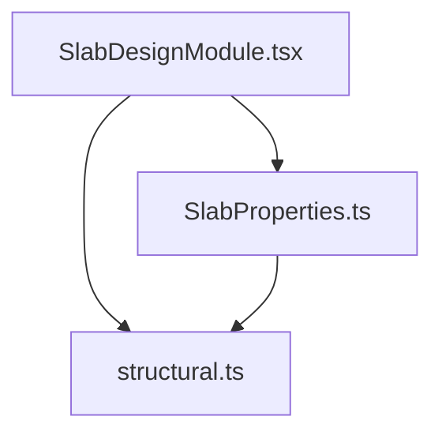
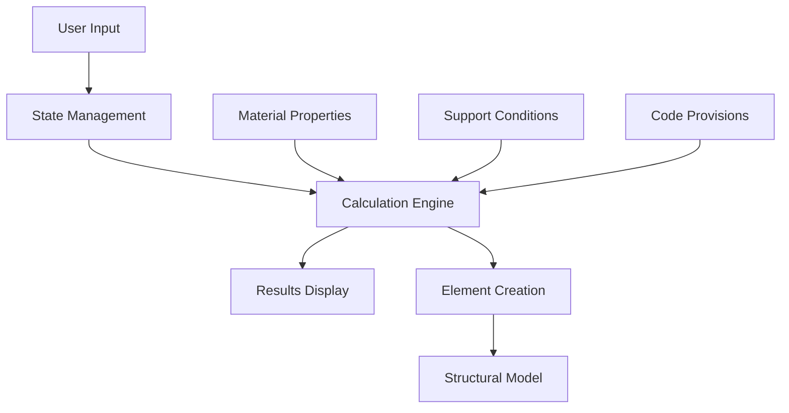
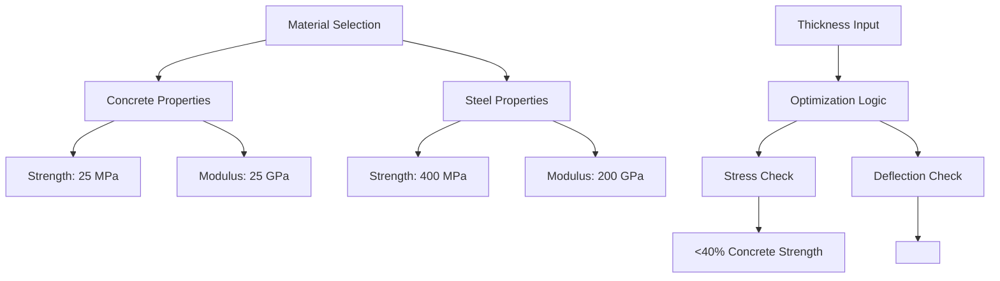
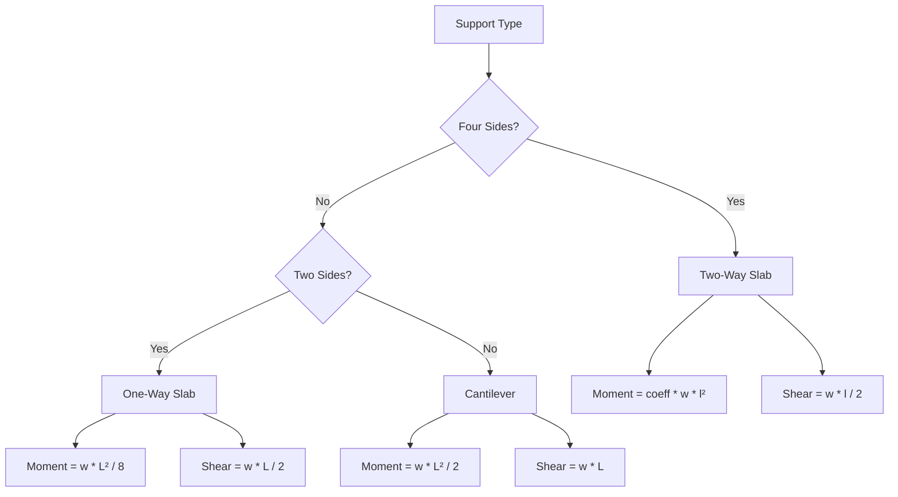
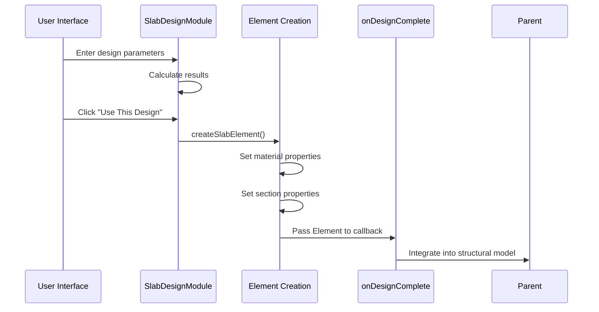
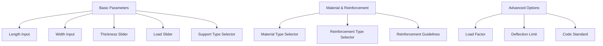
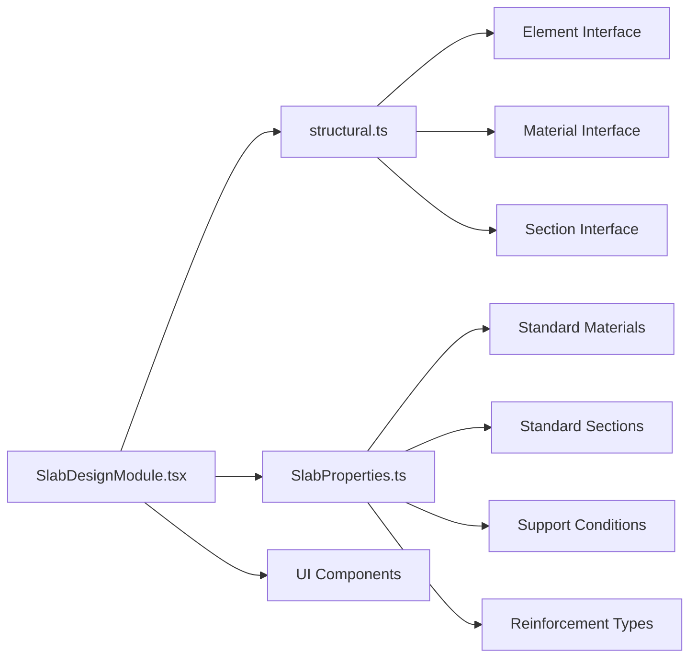

# Slab Design Module

<cite>
**Referenced Files in This Document**   
- [SlabDesignModule.tsx](file://src/structural-analysis/design/SlabDesignModule.tsx)
- [SlabProperties.ts](file://src/structural-analysis/design/SlabProperties.ts)
- [structural.ts](file://src/types/structural.ts)
</cite>

## Table of Contents
1. [Introduction](#introduction)
2. [Project Structure](#project-structure)
3. [Core Components](#core-components)
4. [Architecture Overview](#architecture-overview)
5. [Detailed Component Analysis](#detailed-component-analysis)
6. [Dependency Analysis](#dependency-analysis)
7. [Performance Considerations](#performance-considerations)
8. [Troubleshooting Guide](#troubleshooting-guide)
9. [Conclusion](#conclusion)

## Introduction
The Slab Design Module in APP-STRUKTUR-BLACKBOX is a specialized component for structural engineers to design and analyze concrete and steel slabs. This module enables users to define slab dimensions, load conditions, support configurations, and material properties to calculate critical structural parameters such as bending moments, shear forces, deflection, and required reinforcement. The module integrates with the broader structural analysis system through a callback mechanism that creates properly configured structural elements for further analysis. The user interface provides intuitive controls including sliders, selectors, and input fields to collect design parameters, with advanced options for code-specific design criteria.

## Project Structure
The Slab Design Module is organized within the structural analysis design directory of the application. It consists of three primary files that work together to provide a complete slab design solution. The main implementation is in SlabDesignModule.tsx, which contains the React component for the user interface and calculation logic. Supporting properties and standard values are defined in SlabProperties.ts, while the structural data types are defined in the shared types directory. This modular structure separates concerns between user interface, domain-specific calculations, and data modeling.



**Diagram sources**
- [SlabDesignModule.tsx](file://src/structural-analysis/design/SlabDesignModule.tsx)
- [SlabProperties.ts](file://src/structural-analysis/design/SlabProperties.ts)
- [structural.ts](file://src/types/structural.ts)

**Section sources**
- [SlabDesignModule.tsx](file://src/structural-analysis/design/SlabDesignModule.tsx)
- [SlabProperties.ts](file://src/structural-analysis/design/SlabProperties.ts)

## Core Components
The Slab Design Module consists of several core components that work together to provide a comprehensive slab design solution. The main component is the SlabDesignModule React component, which manages the user interface and state for the slab design process. This component handles user inputs for slab dimensions, load types, support configurations, and material selection. It also manages the calculation of structural parameters and displays the results in a clear format. The module uses state management to track user inputs and design results, with functions to calculate bending moments, shear forces, deflection, and required reinforcement based on the input parameters.

**Section sources**
- [SlabDesignModule.tsx](file://src/structural-analysis/design/SlabDesignModule.tsx#L158-L584)
- [SlabProperties.ts](file://src/structural-analysis/design/SlabProperties.ts#L0-L189)

## Architecture Overview
The Slab Design Module follows a component-based architecture with clear separation of concerns. The user interface is built using React components that provide a consistent look and feel with the rest of the application. The calculation logic is encapsulated within the component, using state management to track user inputs and design results. The module integrates with the structural model through the onDesignComplete callback, which creates a properly configured Element object that can be used in further structural analysis. The architecture supports both one-way and two-way slab calculations, with different formulas applied based on the support configuration selected by the user.



**Diagram sources**
- [SlabDesignModule.tsx](file://src/structural-analysis/design/SlabDesignModule.tsx#L158-L584)

## Detailed Component Analysis

### Slab Design Implementation
The Slab Design Module implements a comprehensive solution for slab design calculations. It begins by collecting user inputs for span dimensions (length and width), slab thickness, applied loads, support type, material type, and reinforcement type. These inputs are managed using React useState hooks, providing reactivity and automatic UI updates when values change. The module supports three support configurations: four sides supported (for two-way slabs), two sides supported (for one-way slabs), and cantilever slabs. Each configuration uses different formulas to calculate bending moments and shear forces based on standard structural engineering principles.

**Section sources**
- [SlabDesignModule.tsx](file://src/structural-analysis/design/SlabDesignModule.tsx#L158-L584)

#### Material Selection and Thickness Optimization
The module provides material selection between concrete and steel, with predefined properties for each material type. For concrete, the default strength is 25 MPa with an elastic modulus of 25,000 MPa, while steel has a strength of 400 MPa and elastic modulus of 200,000 MPa. The thickness optimization logic is implemented through the calculation of bending stress and deflection, comparing these values against allowable limits. The module suggests increasing slab thickness when either stress exceeds 40% of the concrete strength or deflection exceeds L/250 of the shorter span. This optimization ensures that the design meets basic safety requirements while providing guidance for improvement when the design is not safe.



**Diagram sources**
- [SlabDesignModule.tsx](file://src/structural-analysis/design/SlabDesignModule.tsx#L175-L210)
- [SlabProperties.ts](file://src/structural-analysis/design/SlabProperties.ts#L0-L50)

#### Bending Moment and Shear Force Calculations
The module calculates bending moments and shear forces differently based on the support configuration. For four sides supported slabs (two-way action), it uses a coefficient method that considers the ratio of shorter to longer spans, applying a polynomial formula to determine the moment coefficient. For two sides supported slabs (one-way action), it uses the standard beam formula of wL²/8 for maximum moment and wL/2 for maximum shear. Cantilever slabs use wL²/2 for maximum moment and wL for maximum shear. These calculations are implemented in the calculateSlab function, which determines the appropriate formula based on the selected support type.



**Diagram sources**
- [SlabDesignModule.tsx](file://src/structural-analysis/design/SlabDesignModule.tsx#L188-L259)

#### Flexural Reinforcement and Deflection Checks
The module calculates required flexural reinforcement based on the maximum bending moment, using the formula As = M / (0.87 * fy * d), where d is the effective depth (thickness minus 25mm cover). The results are displayed in cm²/m to match common engineering practice. Deflection is calculated using standard beam deflection formulas, with different coefficients for different support conditions (coefficient method for two-way slabs, 5/384 for simply supported, and 1/8 for cantilevers). The deflection check compares the calculated deflection against the L/250 limit of the shorter span, ensuring serviceability requirements are met.

```mermaid
flowchart TD
A[Calculate Required Steel] --> B[As = M / (0.87 * fy * d)]
B --> C[Convert to cm²/m]
C --> D[Display Result]
E[Calculate Deflection] --> F[Δ = (coeff * w * l⁴ * 1000) / (E * I)]
F --> G[Compare to L/250]
G --> H{Δ < L/250?}
H --> |Yes| I[Design Safe]
H --> |No| J[Increase Thickness]
```

**Diagram sources**
- [SlabDesignModule.tsx](file://src/structural-analysis/design/SlabDesignModule.tsx#L234-L276)
- [SlabProperties.ts](file://src/structural-analysis/design/SlabProperties.ts#L139-L172)

### Integration with Structural Model
The module integrates with the structural model through the onDesignComplete callback function. When a safe design is achieved, the user can click "Use This Design" to create a structural element that is passed to the parent component. The createSlabElement function constructs an Element object with appropriate material and section properties based on the current design parameters. The material properties are converted from MPa to Pa for consistency with the structural analysis system. The section is defined as rectangular with the slab thickness as width and 1.0m as height, following the convention of analyzing a 1m wide strip of slab.



**Diagram sources**
- [SlabDesignModule.tsx](file://src/structural-analysis/design/SlabDesignModule.tsx#L271-L316)

**Section sources**
- [SlabDesignModule.tsx](file://src/structural-analysis/design/SlabDesignModule.tsx#L271-L316)

### UI Components and Input Collection
The module uses a variety of UI components to collect input parameters from users. These include standard input fields for length, width, and load values, with slider controls that provide visual feedback and constrained input ranges. Select components allow users to choose from predefined options for support type, material type, and reinforcement type. An advanced options toggle reveals additional parameters such as load factors, deflection limits, and code standards. The UI is organized into logical sections with clear labels and visual hierarchy, making it easy for users to understand and complete the design process.



**Diagram sources**
- [SlabDesignModule.tsx](file://src/structural-analysis/design/SlabDesignModule.tsx#L311-L348)

**Section sources**
- [SlabDesignModule.tsx](file://src/structural-analysis/design/SlabDesignModule.tsx#L311-L348)

## Dependency Analysis
The Slab Design Module has dependencies on several key files within the application. It imports structural types from the shared types directory, ensuring consistency in data structures across the application. It uses UI components that are part of the design system, maintaining visual consistency. The module depends on the structural analysis system for element creation and integration. These dependencies are managed through standard ES6 imports, with clear separation between the module's internal logic and external interfaces. The dependency structure supports maintainability and allows for easy updates to shared components without affecting the core calculation logic.



**Diagram sources**
- [SlabDesignModule.tsx](file://src/structural-analysis/design/SlabDesignModule.tsx)
- [SlabProperties.ts](file://src/structural-analysis/design/SlabProperties.ts)
- [structural.ts](file://src/types/structural.ts)

**Section sources**
- [SlabDesignModule.tsx](file://src/structural-analysis/design/SlabDesignModule.tsx)
- [SlabProperties.ts](file://src/structural-analysis/design/SlabProperties.ts)
- [structural.ts](file://src/types/structural.ts)

## Performance Considerations
The Slab Design Module is designed with performance in mind, using efficient calculation algorithms that can be executed in real-time as users adjust input parameters. The calculations are relatively simple structural engineering formulas that do not require significant computational resources. State updates are optimized to only recalculate results when necessary, preventing unnecessary re-renders. The module uses memoization patterns implicitly through React's state management, ensuring that calculations are only performed when input values change. For larger structural models, the module's lightweight nature ensures it does not become a performance bottleneck in the overall application.

## Troubleshooting Guide
Common issues with the Slab Design Module typically relate to input validation and design safety. If the design is not safe, the module provides specific feedback indicating whether the issue is with stress exceeding allowable limits or deflection exceeding serviceability limits. Users should first check that all input values are within reasonable ranges and that the support configuration matches the actual structural condition. For stress issues, increasing slab thickness is the most effective solution. For deflection issues, increasing thickness or reducing span lengths will help meet the L/250 limit. If the module does not produce expected results, users should verify that all required fields are filled and that the material and support selections are appropriate for the design scenario.

**Section sources**
- [SlabDesignModule.tsx](file://src/structural-analysis/design/SlabDesignModule.tsx#L234-L276)

## Conclusion
The Slab Design Module in APP-STRUKTUR-BLACKBOX provides a comprehensive solution for designing concrete and steel slabs with support for various configurations and loading conditions. The module effectively combines user-friendly interface design with robust structural calculations, enabling engineers to quickly evaluate slab designs and integrate them into larger structural models. Its modular architecture, clear separation of concerns, and well-defined interfaces make it maintainable and extensible. The implementation follows best practices in React development and structural engineering, providing accurate results with intuitive feedback. Future enhancements could include support for additional slab types such as flat plates and waffle slabs, as well as integration with more detailed code provisions beyond the current SNI, ACI, and Eurocode options.