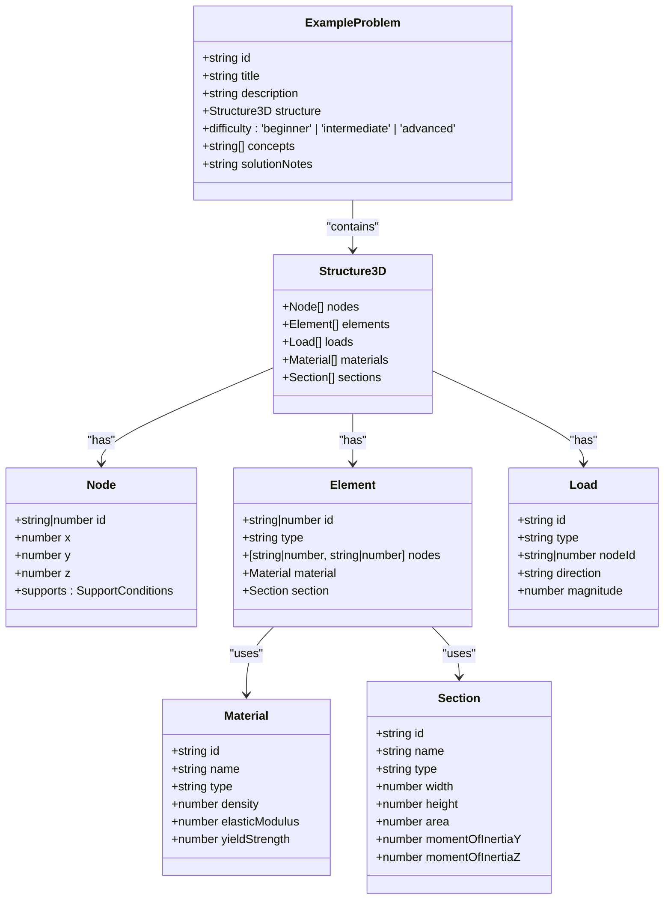
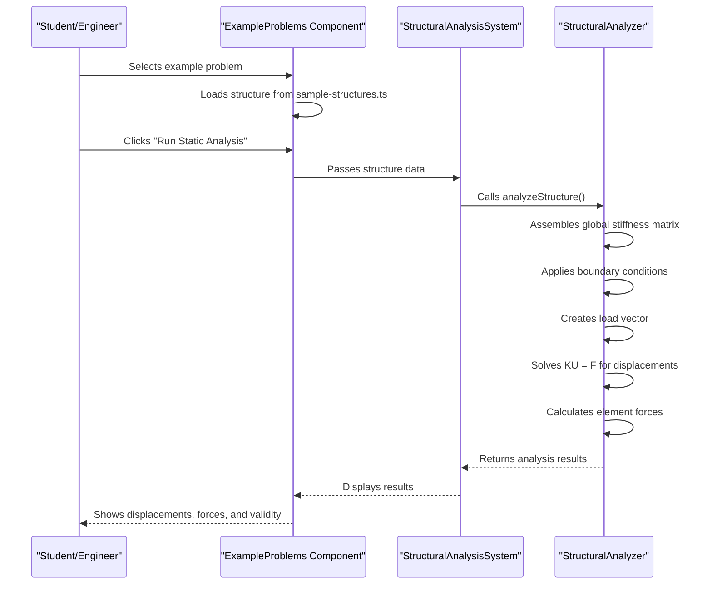

# Example Problems

<cite>
**Referenced Files in This Document**   
- [ExampleProblems.tsx](file://src/educational/ExampleProblems.tsx)
- [sample-structures.ts](file://src/tests/sample-structures.ts)
- [StructuralAnalyzer.ts](file://src/structural-analysis/analysis/StructuralAnalyzer.ts)
- [StructuralAnalysisSystem.tsx](file://src/structural-analysis/StructuralAnalysisSystem.tsx)
- [structural.ts](file://src/types/structural.ts)
- [StandardIntegration.tsx](file://src/standards/StandardIntegration.tsx)
- [SNI_1726_Gempa.ts](file://src/standards/sni/SNI_1726_Gempa.ts)
- [SNI_2847_Beton.ts](file://src/standards/sni/SNI_2847_Beton.ts)
- [SNI_1729_Baja.ts](file://src/standards/sni/SNI_1729_Baja.ts)
- [ACI_318_Beton.ts](file://src/standards/international/ACI_318_Beton.ts)
- [AISC_Baja.ts](file://src/standards/international/AISC_Baja.ts)
</cite>

## Table of Contents
1. [Introduction](#introduction)
2. [Problem Structure and Configuration](#problem-structure-and-configuration)
3. [Educational Framework and Learning Objectives](#educational-framework-and-learning-objectives)
4. [Integration with Structural Analysis Engine](#integration-with-structural-analysis-engine)
5. [Design Standards Implementation](#design-standards-implementation)
6. [Interactive Problem Solving and Assessment](#interactive-problem-solving-and-assessment)
7. [Real-World Engineering Applications](#real-world-engineering-applications)
8. [Conclusion](#conclusion)

## Introduction

The ExampleProblems component serves as a comprehensive educational tool designed to reinforce theoretical and applied knowledge in structural engineering. This component provides a curated collection of solved exercises that demonstrate fundamental structural analysis concepts across various configurations, loading conditions, and international design standards. By offering pre-built examples with detailed solutions, the component enables students and professionals to understand structural behavior through interactive analysis and visualization. The integration with the StructuralAnalysisSystem allows users to modify and re-analyze example structures, promoting active learning and deeper comprehension of engineering principles.

**Section sources**
- [ExampleProblems.tsx](file://src/educational/ExampleProblems.tsx#L1-L261)

## Problem Structure and Configuration

The ExampleProblems component implements a structured approach to presenting educational content through three primary problem types that progressively increase in complexity. The component defines an `ExampleProblem` interface that standardizes problem metadata including ID, title, description, structural configuration, difficulty level, key concepts, and solution notes. The implemented examples cover fundamental structural configurations:

1. **Simply Supported Beam**: A basic beam with uniform load that demonstrates bending moment, shear force, and deflection concepts. This beginner-level problem illustrates that maximum moment occurs at midspan (wL²/8) while maximum shear occurs at supports (wL/2).

2. **Portal Frame**: A 2D frame structure that demonstrates frame behavior and joint effects. This beginner-level problem highlights how portal frames develop moments at joints due to continuity, with column moments transferring to beams.

3. **3D Building Frame**: A multi-story 3D frame that demonstrates spatial structural behavior. This intermediate-level problem emphasizes the importance of considering all six degrees of freedom and the significance of torsion effects in three-dimensional analysis.

Each problem is associated with a specific structural configuration defined in the `sample-structures.ts` file, which contains complete definitions of nodes, elements, materials, sections, and loads. The component uses React state management to track the selected example and solution visibility, enabling an interactive learning experience.



**Diagram sources **
- [ExampleProblems.tsx](file://src/educational/ExampleProblems.tsx#L30-L259)
- [sample-structures.ts](file://src/tests/sample-structures.ts#L217-L221)
- [structural.ts](file://src/types/structural.ts#L0-L129)

## Educational Framework and Learning Objectives

The ExampleProblems component is designed with a comprehensive educational framework that aligns with pedagogical best practices in engineering education. Each example problem serves multiple educational purposes, from reinforcing fundamental concepts to developing problem-solving skills applicable to real-world scenarios. The component explicitly defines learning outcomes and professor notes for each problem, creating a structured approach to knowledge acquisition.

The educational objectives are organized into two complementary categories: learning outcomes and professor guidance. The learning outcomes focus on developing core competencies in structural engineering, including understanding structural behavior under load, applying structural analysis methods, and correctly interpreting analysis results. These outcomes are designed to build progressively from basic concepts in simple beam problems to more complex spatial behavior in 3D frame analysis.

For educators, the component provides specific teaching guidance through "Professor Notes" that suggest effective pedagogical approaches. These include using examples to demonstrate basic concepts, comparing software results with analytical solutions, and discussing assumptions and limitations of the models. This dual approach ensures that the component serves both students seeking to learn and professors looking to teach structural analysis concepts effectively.

The difficulty rating system (beginner, intermediate, advanced) provides a clear progression path for learners, allowing them to build confidence with simpler problems before tackling more complex structural configurations. The concept tags associated with each problem (such as "Bending Moment," "Shear Force," "3D Analysis," and "Torsion") enable targeted learning, allowing users to focus on specific areas of interest or curriculum requirements.

**Section sources**
- [ExampleProblems.tsx](file://src/educational/ExampleProblems.tsx#L150-L200)

## Integration with Structural Analysis Engine

The ExampleProblems component is seamlessly integrated with the StructuralAnalysisSystem, enabling users to not only view solved examples but also to modify and re-analyze structures using the full analytical capabilities of the system. This integration is facilitated through the `analyzeStructure` function in the StructuralAnalyzer module, which performs comprehensive structural analysis calculations based on the finite element method.

When a user selects an example problem, the component loads the corresponding structural configuration from the `sample-structures.ts` file. This structure data, which includes nodes, elements, materials, sections, and loads, is then passed to the analysis engine for processing. The analysis workflow follows a systematic approach:

1. **Global Stiffness Matrix Assembly**: The system assembles the global stiffness matrix by transforming local element stiffness matrices to global coordinates and combining them based on node connectivity.

2. **Boundary Condition Application**: Support conditions defined in the node properties are applied to the stiffness matrix, modifying the appropriate degrees of freedom.

3. **Load Vector Creation**: The system creates a load vector based on the applied loads in the structure, considering both point loads and their directions.

4. **System Solution**: The system solves the matrix equation KU = F using Gaussian elimination to determine nodal displacements.

5. **Force and Stress Calculation**: Element forces and stresses are calculated from the displacements using the element stiffness relationships.

The integration allows users to transition from viewing an example to actively engaging with it by clicking "Load in Designer" or running various analysis types. This hands-on approach reinforces theoretical knowledge by allowing users to experiment with modifications to the structure and immediately see the impact on analysis results.



**Diagram sources **
- [ExampleProblems.tsx](file://src/educational/ExampleProblems.tsx#L150-L259)
- [StructuralAnalysisSystem.tsx](file://src/structural-analysis/StructuralAnalysisSystem.tsx#L142-L524)
- [StructuralAnalyzer.ts](file://src/structural-analysis/analysis/StructuralAnalyzer.ts#L414-L560)

## Design Standards Implementation

The educational framework extends beyond basic structural analysis to incorporate major international and Indonesian design standards, providing students with practical experience in code-compliant design. The system implements comprehensive support for SNI (Indonesian), ACI (American), AISC (American), and Eurocode standards, allowing users to understand and apply different regulatory requirements.

The standards integration is implemented through dedicated modules in the `src/standards` directory, each containing the specific requirements and calculation methods for different codes. For SNI standards, the implementation includes:

- **SNI 1726:2019**: Seismic design requirements with seismic zone mapping, soil type classification, and building category importance factors
- **SNI 1727:2020**: Load requirements with basic and special load combinations
- **SNI 2847:2019**: Reinforced concrete design with material properties, beta factors for stress blocks, and reinforcement ratio calculations
- **SNI 1729:2020**: Structural steel design with material properties, slenderness limits, and safety factors

For international standards, the system implements:

- **ACI 318-19**: Concrete design requirements with material databases and design strength calculations
- **AISC 360-16**: Steel design specifications with slenderness limits and safety factors
- **Eurocode 2 & 3**: European standards with partial safety factors and design strength calculations

The StandardIntegration component provides a user interface for selecting and configuring these standards, calculating key parameters such as seismic coefficients, and checking compliance. This integration allows students to compare design approaches across different standards and understand the implications of code selection on structural design decisions.

```mermaid
graph TD
    A[Design Standards] --> B[SNI Standards]
    A --> C[International Standards]
    
    B --> B1[SNI 1726:2019<br>Seismic Design]
    B --> B2[SNI 1727:2020<br>Load Requirements]
    B --> B3[SNI 2847:2019<br>Concrete Design]
    B --> B4[SNI 1729:2020<br>Steel Design]
    
    C --> C1[ACI 318-19<br>Concrete Design]
    C --> C2[AISC 360-16<br>Steel Design]
    C --> C3[Eurocode 2 & 3<br>European Standards]
    C --> C4[ASCE 7-16<br>Load Requirements]
    
    B1 --> D[Seismic Zone Mapping]
    B1 --> E[Soil Type Classification]
    B1 --> F[Building Category Factors]
    B1 --> G[Seismic Coefficient Calculation]
    
    B3 --> H[Concrete Material Database]
    B3 --> I[Reinforcement Ratios]
    B3 --> J[Nominal Moment Capacity]
    
    B4 --> K[Steel Material Database]
    B4 --> L[Slenderness Limits]
    B4 --> M[Critical Buckling Stress]
    
    C1 --> N[ACI Concrete Materials]
    C1 --> O[ACI Reinforcement]
    C1 --> P[ACI Beta Factors]
    
    C2 --> Q[AISC Steel Materials]
    C2 --> R[AISC Slenderness]
    C2 --> S[AISC Buckling]
    
    style A fill:#f9f,stroke:#333
    style B fill:#bbf,stroke:#333
    style C fill:#bbf,stroke:#333
    style D fill:#dfd,stroke:#333
    style E fill:#dfd,stroke:#333
    style F fill:#dfd,stroke:#333
    style G fill:#dfd,stroke:#333
    style H fill:#dfd,stroke:#333
    style I fill:#dfd,stroke:#333
    style J fill:#dfd,stroke:#333
    style K fill:#dfd,stroke:#333
    style L fill:#dfd,stroke:#333
    style M fill:#dfd,stroke:#333
    style N fill:#dfd,stroke:#333
    style O fill:#dfd,stroke:#333
    style P fill:#dfd,stroke:#333
    style Q fill:#dfd,stroke:#333
    style R fill:#dfd,stroke:#333
