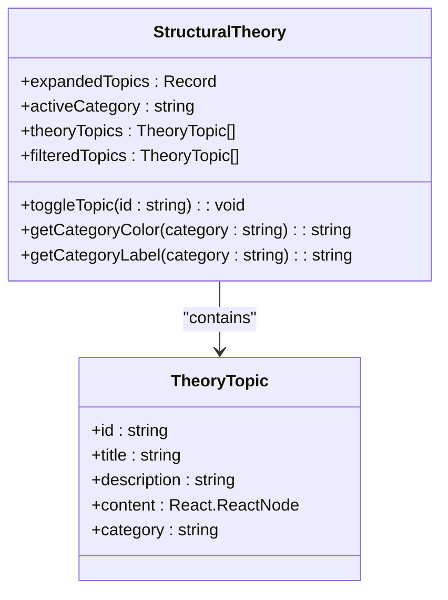

# Structural Theory

<cite>
**Referenced Files in This Document**   
- [StructuralTheory.tsx](file://src/educational/StructuralTheory.tsx)
- [EducationalPortal.tsx](file://src/educational/EducationalPortal.tsx)
- [BeamDesignModule.tsx](file://src/structural-analysis/design/BeamDesignModule.tsx)
- [ColumnDesignModule.tsx](file://src/structural-analysis/design/ColumnDesignModule.tsx)
- [SlabDesignModule.tsx](file://src/structural-analysis/design/SlabDesignModule.tsx)
- [structural.ts](file://src/types/structural.ts)
</cite>

## Table of Contents
1. [Introduction](#introduction)
2. [Core Theoretical Concepts](#core-theoretical-concepts)
3. [Implementation of Structural Theory](#implementation-of-structural-theory)
4. [Integration with Educational Portal](#integration-with-educational-portal)
5. [Relationship to Design Modules](#relationship-to-design-modules)
6. [Addressing Common Misconceptions](#addressing-common-misconceptions)
7. [Application with Analysis Engine](#application-with-analysis-engine)
8. [Conclusion](#conclusion)

## Introduction

The Structural Theory component in APP-STRUKTUR-BLACKBOX serves as a comprehensive educational resource that delivers foundational engineering knowledge to users. This component systematically presents core structural engineering principles through an interactive interface, enabling students, professors, and practicing engineers to understand the theoretical underpinnings of structural analysis. The component is designed to bridge the gap between abstract engineering concepts and their practical application in structural design, providing a solid theoretical foundation that complements the software's analytical capabilities.

**Section sources**
- [StructuralTheory.tsx](file://src/educational/StructuralTheory.tsx#L1-L356)

## Core Theoretical Concepts

The Structural Theory component covers four fundamental categories of structural engineering knowledge: static analysis, dynamic analysis, material properties, and design principles. Each category addresses essential concepts that form the foundation of structural engineering practice.

### Static Analysis

The stiffness matrix method, also known as the displacement method or matrix structural analysis, represents the fundamental approach to structural analysis in the system. This systematic method analyzes structures by establishing the relationship between nodal displacements and applied forces through the key equation [K]{u} = {F}, where [K] is the global stiffness matrix, {u} is the displacement vector, and {F} is the force vector. The implementation follows a structured six-step process: discretizing the structure into elements and nodes, determining element stiffness matrices, assembling the global stiffness matrix, applying boundary conditions, solving for displacements, and calculating element forces and stresses.

### Dynamic Analysis

Dynamic analysis concepts include modal analysis and response spectrum analysis, which are critical for understanding structural behavior under time-varying loads. Modal analysis determines the natural frequencies and mode shapes of a structure by solving the eigenvalue problem [K]{φ} = ω²[M]{φ}, where [K] is the stiffness matrix, [M] is the mass matrix, ω is the circular frequency, and {φ} is the mode shape vector. This information is essential for seismic design, wind engineering, and avoiding resonance in mechanical systems. Response spectrum analysis, a linear elastic method for estimating maximum seismic response, employs modal superposition with the SRSS (Square Root of Sum of Squares) method for combining modal responses.

### Material Properties

The component provides comprehensive information on material behavior, focusing on concrete and steel, which are the most common structural materials. For concrete, key properties include compressive strength (f'c), tensile strength (~0.1f'c), elastic modulus (~4700√f'c), and Poisson's ratio (~0.2). Steel properties include yield strength (fy), ultimate strength (fu), elastic modulus (~200,000 MPa), and Poisson's ratio (~0.3). The component emphasizes that concrete exhibits nonlinear behavior even at low stresses, while steel demonstrates linear elastic behavior up to the yield point, highlighting the different stress-strain relationships that govern material selection and design.

### Design Principles

Section properties are presented as critical factors in determining how structural elements resist various types of loads. The component identifies key properties including area (A) for axial load resistance, moment of inertia (I) for bending resistance, section modulus (S) for maximum bending stress calculation, and polar moment (J) for torsional resistance. For rectangular sections, the component provides the fundamental formulas: Area A = b × h, Moment of Inertia Iₓ = b × h³ / 12, Iᵧ = h × b³ / 12, and Section Modulus Sₓ = b × h² / 6, accompanied by practical examples to illustrate their application.

**Section sources**
- [StructuralTheory.tsx](file://src/educational/StructuralTheory.tsx#L50-L300)

## Implementation of Structural Theory

The Structural Theory component is implemented as a React functional component that organizes theoretical content into expandable topics categorized by analysis type. The implementation features an intuitive user interface with category filters that allow users to focus on specific areas of interest, including static analysis, dynamic analysis, materials, and design principles. Each theoretical topic is presented as an expandable card that reveals detailed content when selected, enabling users to explore concepts at their own pace.

The component's structure follows a consistent pattern for presenting theoretical information, beginning with a conceptual overview, followed by key equations displayed in monospace font for clarity, and concluding with practical applications or step-by-step procedures. This pedagogical approach facilitates understanding by connecting abstract mathematical formulations with their real-world engineering significance. The implementation also includes visual cues such as color-coded category badges and intuitive icons to enhance usability and information retention.

A distinctive feature of the implementation is the inclusion of educational notes specifically designed for professors, providing guidance on teaching approaches and student assignments. These notes recommend using the tool to demonstrate theoretical concepts with practical examples, starting with simple structures and gradually increasing complexity. For student assignments, the component suggests analyzing different structures and comparing analytical solutions with software results, promoting active learning and critical thinking.

**Diagram sources **
- [StructuralTheory.tsx](file://src/educational/StructuralTheory.tsx#L26-L354)

**Section sources**
- [StructuralTheory.tsx](file://src/educational/StructuralTheory.tsx#L26-L354)

## Integration with Educational Portal

The Structural Theory component is seamlessly integrated into the broader Educational Portal, which serves as the primary interface for students and professors. Within the portal's navigation system, Structural Theory is presented as a dedicated section alongside other educational resources such as the Tutorial Guide, Example Problems, Assignments, and additional Resources. This integration positions theoretical knowledge as a core component of the learning experience, easily accessible alongside practical tools and assessment materials.

The Educational Portal's architecture facilitates a comprehensive learning journey