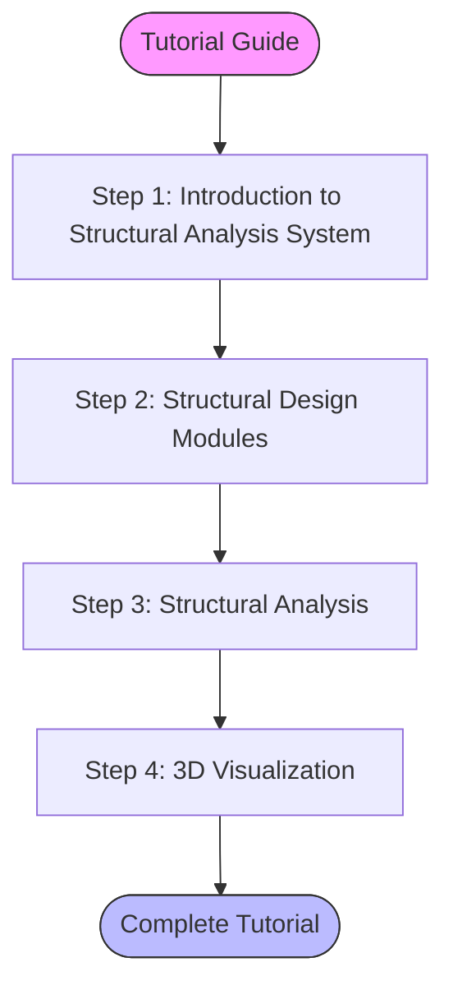
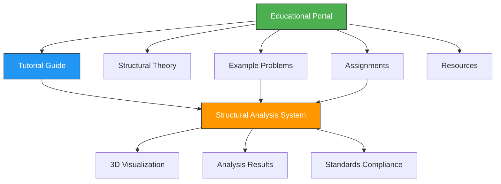
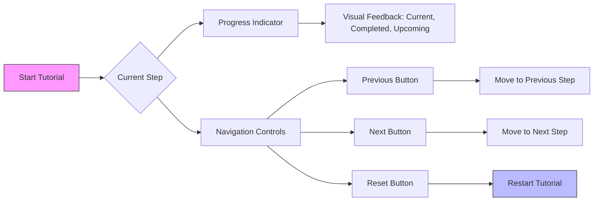
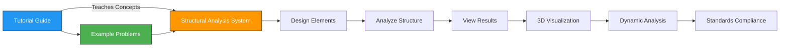
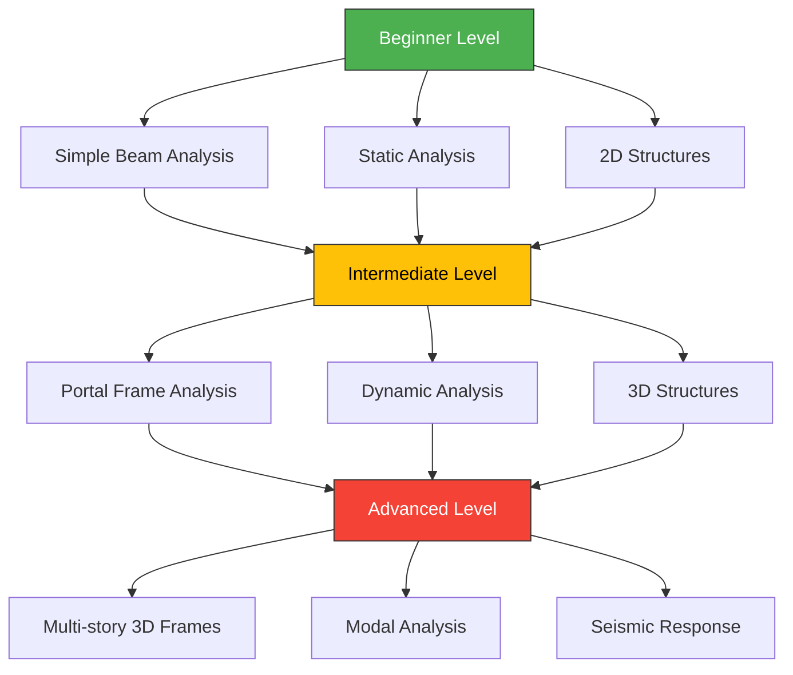

# Tutorial Guide

<cite>
**Referenced Files in This Document**   
- [TutorialGuide.tsx](file://src/educational/TutorialGuide.tsx)
- [EducationalPortal.tsx](file://src/educational/EducationalPortal.tsx)
- [StructuralAnalysisSystem.tsx](file://src/structural-analysis/StructuralAnalysisSystem.tsx)
- [ExampleProblems.tsx](file://src/educational/ExampleProblems.tsx)
- [sample-structures.ts](file://src/tests/sample-structures.ts)
</cite>

## Table of Contents
1. [Introduction](#introduction)
2. [Tutorial Guide Structure](#tutorial-guide-structure)
3. [Educational Workflow Integration](#educational-workflow-integration)
4. [Pedagogical Design Principles](#pedagogical-design-principles)
5. [Navigation and Progress Tracking](#navigation-and-progress-tracking)
6. [Integration with Structural Analysis System](#integration-with-structural-analysis-system)
7. [Scaffolding and Learning Progression](#scaffolding-and-learning-progression)
8. [Educational Resources and Support](#educational-resources-and-support)
9. [Best Practices for Educators](#best-practices-for-educators)
10. [Potential Extensions](#potential-extensions)

## Introduction

The Tutorial Guide component serves as a comprehensive educational tool within the Structural Analysis System, designed to help students and professors understand structural engineering concepts through interactive learning. This guide provides a structured approach to learning structural analysis by walking users through the complete workflow of creating structural models, performing analysis, interpreting results, and ensuring standards compliance.

The Tutorial Guide is integrated within the Educational Portal, which serves as the main interface for educational activities. It offers a step-by-step instructional experience that synchronizes with the actual application features, allowing users to learn through hands-on practice. The guide covers fundamental concepts such as static and dynamic analysis, 3D visualization, and structural design principles, making complex engineering topics accessible to learners at various levels.

**Section sources**
- [TutorialGuide.tsx](file://src/educational/TutorialGuide.tsx#L1-L297)
- [EducationalPortal.tsx](file://src/educational/EducationalPortal.tsx#L1-L282)

## Tutorial Guide Structure

The Tutorial Guide is implemented as a React functional component that presents a structured learning experience through a series of sequential steps. Each step focuses on a specific aspect of structural analysis, progressing from basic concepts to more advanced topics. The guide contains four main tutorial steps that cover the core functionality of the Structural Analysis System.

The first step introduces users to the system, highlighting the three primary capabilities: static analysis, dynamic analysis, and 3D visualization. This foundational step establishes the learning context and prepares users for the subsequent modules. The second step focuses on structural design modules, outlining the five-step design process that includes selecting element types, defining geometry, specifying material properties, applying loads, and running analysis.

The third step delves into structural analysis, explaining both static and dynamic analysis types. Static analysis covers the calculation of displacements, internal forces, and stresses under static loads, while dynamic analysis addresses natural frequencies, mode shapes, and seismic response evaluation. The final step covers 3D visualization features, including interactive viewing, element highlighting, displacement visualization, stress display, and animation of mode shapes.

**Diagram sources**
- [TutorialGuide.tsx](file://src/educational/TutorialGuide.tsx#L28-L294)

**Section sources**
- [TutorialGuide.tsx](file://src/educational/TutorialGuide.tsx#L28-L294)

## Educational Workflow Integration

The Tutorial Guide is seamlessly integrated within the Educational Portal, which serves as the central hub for all educational activities. The portal provides a navigation menu that allows users to switch between different educational components, including the Tutorial Guide, Structural Theory, Example Problems, Assignments, and Resources. This integration creates a cohesive learning environment where users can easily transition between theoretical knowledge and practical application.

The workflow begins with the Tutorial Guide as the default section, establishing it as the primary entry point for new users. After completing the tutorial, learners can access Example Problems to apply their knowledge to pre-built structural models. These examples range from beginner-level problems like simply supported beams to intermediate 3D building frames, allowing for progressive skill development.

The integration extends to the Structural Analysis System itself, where users can apply the concepts learned in the tutorial to create and analyze their own structural models. The educational portal maintains user progress across sessions, tracking completed topics and assignments. This continuity ensures that learners can pick up where they left off and build upon their previous knowledge systematically.

**Diagram sources**
- [EducationalPortal.tsx](file://src/educational/EducationalPortal.tsx#L1-L282)
- [TutorialGuide.tsx](file://src/educational/TutorialGuide.tsx#L1-L297)

**Section sources**
- [EducationalPortal.tsx](file://src/educational/EducationalPortal.tsx#L1-L282)
- [ExampleProblems.tsx](file://src/educational/ExampleProblems.tsx#L1-L262)

## Pedagogical Design Principles

The Tutorial Guide embodies several key pedagogical design principles that enhance the learning experience for both students and educators. The most prominent principle is scaffolding, where complex concepts are introduced gradually, building upon previously learned material. The guide begins with fundamental concepts like static analysis before progressing to more advanced topics such as dynamic analysis and 3D visualization.

Another important principle is active learning, which is facilitated through the integration with the Structural Analysis System. Rather than presenting information in a passive format, the tutorial encourages users to engage with the software, creating and analyzing their own structural models. This hands-on approach promotes deeper understanding and retention of engineering concepts.

The guide also incorporates feedback mechanisms through educational tips and professor notes that provide context and guidance. For example, the tutorial suggests starting with simple structures like beams and portal frames before moving to complex 3D structures, helping learners build confidence and understanding incrementally. The professor tips offer guidance on how to use the 3D visualization to demonstrate structural behavior, supporting educators in their teaching.

Additionally, the tutorial employs a multimodal approach to learning by combining textual explanations with visual representations and interactive elements. The use of icons, color-coded sections, and structured layouts enhances information processing and makes the content more accessible to different learning styles.

**Section sources**
- [TutorialGuide.tsx](file://src/educational/TutorialGuide.tsx#L28-L294)
- [ExampleProblems.tsx](file://src/educational/ExampleProblems.tsx#L1-L262)

## Navigation and Progress Tracking

The Tutorial Guide implements an intuitive navigation system that allows users to move through the learning content at their own pace. The interface includes a progress indicator that displays all tutorial steps as clickable buttons, with visual feedback showing the current step, completed steps, and upcoming steps. This design enables both sequential progression and non-linear navigation, allowing users to revisit previous sections or jump to specific topics of interest.

Users can navigate between steps using "Previous" and "Next" buttons, or directly select any step from the progress indicator. The current step is highlighted in blue, completed steps appear in green, and upcoming steps are displayed in gray, providing clear visual feedback on progress. The interface also displays the current step number and total steps, giving users a sense of their position within the overall tutorial.

A reset button allows users to restart the tutorial from the beginning, which is particularly useful for review or when users want to ensure they have understood all concepts before proceeding. This navigation system supports different learning styles and paces, accommodating both linear learners who prefer to follow the prescribed sequence and exploratory learners who may want to focus on specific areas of interest.

The progress tracking extends beyond the tutorial itself, as the Educational Portal maintains a record of completed topics and assignments across sessions. This longitudinal tracking helps both students and professors monitor learning progress and identify areas that may require additional focus.

**Diagram sources**
- [TutorialGuide.tsx](file://src/educational/TutorialGuide.tsx#L28-L294)

**Section sources**
- [TutorialGuide.tsx](file://src/educational/TutorialGuide.tsx#L28-L294)

## Integration with Structural Analysis System

The Tutorial Guide is tightly integrated with the Structural Analysis System, creating a seamless transition from learning to application. The Structural Analysis System provides a comprehensive environment for designing and analyzing structural elements, with tabs for beams, columns, slabs, 3D viewing, drawing, analysis, dynamic analysis, and standards compliance. This integration ensures that the concepts learned in the tutorial are immediately applicable in a practical context.

When users complete the tutorial, they can directly apply their knowledge to the Structural Analysis System, where they can design structural elements and analyze their behavior. The system tracks completed elements and provides a design summary, reinforcing the learning objectives covered in the tutorial. The analysis results are presented in a clear format, showing structure validity, maximum displacement, maximum stress, displacements, and element forces.

The integration also extends to dynamic analysis, where users can perform modal analysis to determine natural frequencies and mode shapes. This feature allows learners to explore the dynamic behavior of structures, a concept introduced in the tutorial. The 3D visualization component enables users to see how structures deform under loads, providing a visual representation of the analysis results.

This tight integration between the tutorial and the analysis system creates a cohesive learning experience where theoretical knowledge is immediately reinforced through practical application. Users can follow the tutorial steps and then immediately practice what they have learned, enhancing retention and understanding.

**Diagram sources**
- [StructuralAnalysisSystem.tsx](file://src/structural-analysis/StructuralAnalysisSystem.tsx#L142-L524)
- [TutorialGuide.tsx](file://src/educational/TutorialGuide.tsx#L28-L294)

**Section sources**
- [StructuralAnalysisSystem.tsx](file://src/structural-analysis/StructuralAnalysisSystem.tsx#L142-L524)
- [TutorialGuide.tsx](file://src/educational/TutorialGuide.tsx#L28-L294)

## Scaffolding and Learning Progression

The Tutorial Guide implements a carefully designed scaffolding approach that guides learners through a progressive development of structural engineering skills. The learning progression begins with foundational concepts and gradually introduces more complex topics, ensuring that users build a solid understanding before advancing to more challenging material.

The initial steps focus on basic structural elements and analysis types, such as simply supported beams and static analysis. As users progress through the tutorial, they encounter increasingly complex structures like portal frames and 3D building frames. This progression mirrors the typical curriculum in structural engineering education, where students first learn to analyze simple systems before tackling more complex, real-world structures.

The example problems component reinforces this scaffolding approach by providing pre-built models categorized by difficulty level: beginner, intermediate, and advanced. Beginner problems focus on fundamental concepts like bending moment and shear force in simple beams, while intermediate problems introduce 3D analysis and torsion effects in multi-story frames.

The tutorial also incorporates cognitive scaffolding through educational tips and professor notes that provide context and guidance. For example, the tutorial suggests starting with simple structures before moving to complex 3D structures, helping learners build confidence and understanding incrementally. This approach reduces cognitive load and prevents learners from becoming overwhelmed by too much information at once.

The integration with the Structural Analysis System further supports this learning progression by allowing users to apply concepts at their current level of understanding and gradually increase complexity as their skills develop. This hands-on practice reinforces theoretical knowledge and helps learners make connections between abstract concepts and real-world applications.

**Diagram sources**
- [ExampleProblems.tsx](file://src/educational/ExampleProblems.tsx#L1-L262)
- [sample-structures.ts](file://src/tests/sample-structures.ts#L1-L222)

**Section sources**
- [ExampleProblems.tsx](file://src/educational/ExampleProblems.tsx#L1-L262)
- [sample-structures.ts](file://src/tests/sample-structures.ts#L1-L222)

## Educational Resources and Support

The Tutorial Guide is supported by a comprehensive ecosystem of educational resources designed to enhance the learning experience for both students and professors. These resources are accessible through the Educational Portal and include theory references, example problems, assignments, and additional support materials.

The theory reference section provides access to structural analysis theory and formulas used in the calculations, allowing users to deepen their understanding of the underlying principles. This resource serves as a bridge between the practical application in the tutorial and the theoretical foundations of structural engineering.

The example problems component offers pre-built structural models that illustrate key concepts and provide practice opportunities. These examples are carefully selected to demonstrate important engineering principles and are accompanied by solution notes that explain key points and analysis steps. The problems are categorized by difficulty level and cover a range of concepts, from basic bending and shear to advanced 3D analysis and dynamic behavior.

For professors, the portal includes dedicated resources such as course management tools, grading tools, and curriculum resources. These features support educators in integrating the tutorial and analysis system into their teaching. Professor tips throughout the tutorial provide guidance on how to use the software effectively in an educational setting, such as using 3D visualization to demonstrate structural deformation.

The support system also includes a discussion forum where students and instructors can connect, share insights, and ask questions. This community aspect enhances the learning experience by