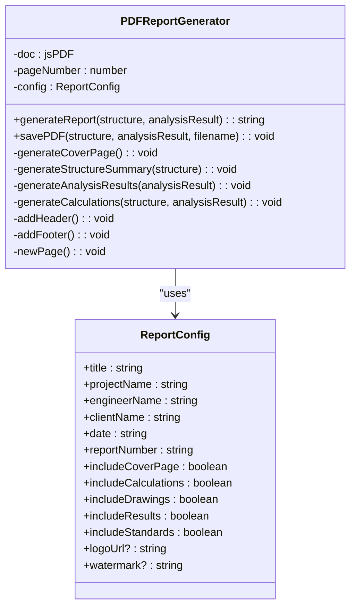
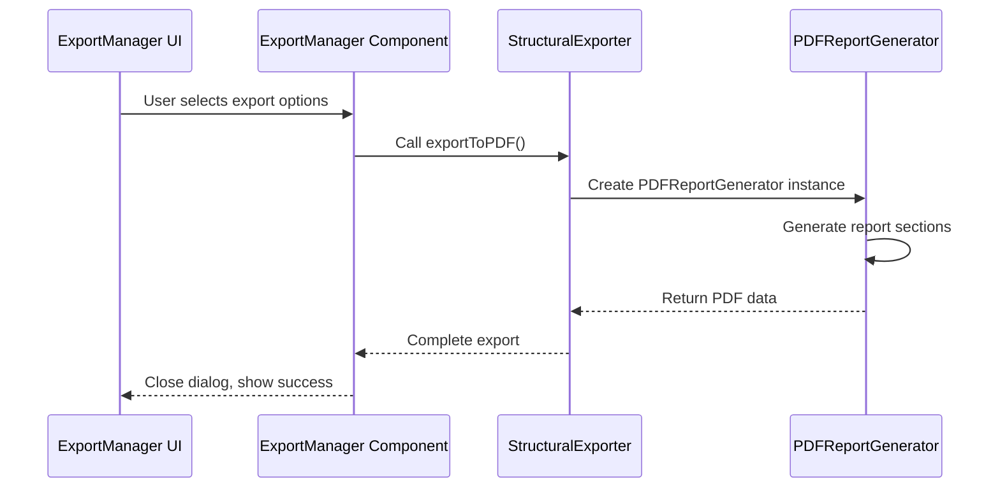
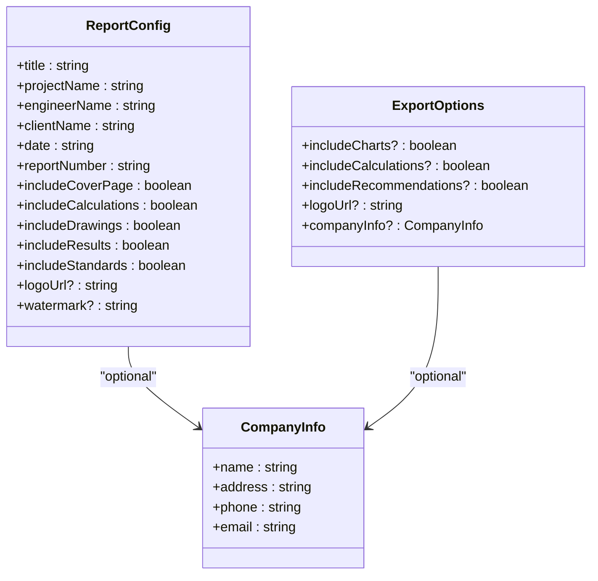

# Export & Reporting

<cite>
**Referenced Files in This Document**  
- [ExportManager.tsx](file://src/structural-analysis/ExportManager.tsx)
- [exportUtils.ts](file://src/structural-analysis/exportUtils.ts)
- [PDFReportGenerator.ts](file://src/structural-analysis/reports/PDFReportGenerator.ts)
</cite>

## Table of Contents
1. [ExportManager Implementation](#exportmanager-implementation)
2. [Data Serialization and Export Formats](#data-serialization-and-export-formats)
3. [PDF Report Generation](#pdf-report-generation)
4. [Integration with Analysis Results](#integration-with-analysis-results)
5. [File Generation Technology](#file-generation-technology)
6. [Report Customization and Branding](#report-customization-and-branding)
7. [Performance Considerations](#performance-considerations)

## ExportManager Implementation

The ExportManager component serves as the primary interface for exporting structural analysis data in APP-STRUKTUR-BLACKBOX. It provides a comprehensive UI for users to select export formats, configure options, and initiate the export process. The component supports three main export types: PDF reports, CSV data exports, and JSON project backups.

The ExportManager offers both quick export functionality for common use cases and advanced export options for customized outputs. Quick export buttons allow users to immediately generate a PDF report or CSV data with default settings, while the advanced export dialog provides granular control over the export process. The component manages state for export type selection, export progress, and configuration options, ensuring a responsive user experience during potentially lengthy export operations.

**Section sources**
- [ExportManager.tsx](file://src/structural-analysis/ExportManager.tsx#L34-L466)

## Data Serialization and Export Formats

### CSV Export Capabilities
The system supports multiple CSV export types to accommodate different user needs:
- **Summary Data**: Key project parameters and high-level results for quick overviews
- **Detailed Data**: Complete project configuration including geometry, materials, and loads
- **Member Forces**: Detailed force analysis results for structural elements

The exportUtils module handles CSV serialization using the Papa Parse library, which efficiently converts structured data into properly formatted CSV content. The system creates appropriate data structures based on the selected export type, ensuring that the output is both human-readable and compatible with spreadsheet applications for further analysis.

### JSON Project Backup
For project preservation and sharing, the system provides JSON export functionality that creates complete project backups. This includes all project settings, geometry, materials, loads, and analysis results, allowing for full restoration of the project state when imported later. The JSON export includes metadata such as export timestamp and version information to ensure compatibility across different system versions.

**Section sources**
- [exportUtils.ts](file://src/structural-analysis/exportUtils.ts#L312-L352)

## PDF Report Generation

### PDFReportGenerator Architecture
The PDFReportGenerator class is responsible for creating professional engineering reports with structural analysis results, diagrams, and compliance information. It uses the jsPDF library to generate PDF documents programmatically, with jspdf-autotable for creating formatted tables of analysis data.

The generator follows a modular approach, with separate methods for different report sections:
- Cover page generation with project metadata
- Structure summary tables showing nodes and elements
- Analysis results presentation with displacements and forces
- Design calculations with material and section properties

**Diagram sources**
- [PDFReportGenerator.ts](file://src/structural-analysis/reports/PDFReportGenerator.ts#L0-L52)

**Section sources**
- [PDFReportGenerator.ts](file://src/structural-analysis/reports/PDFReportGenerator.ts#L0-L474)

## Integration with Analysis Results

The export functionality is tightly integrated with the structural analysis results, allowing users to include comprehensive technical data in their reports. When analysis results are available, the system automatically incorporates key metrics such as maximum moment, shear forces, deflections, base shear, and fundamental period into both PDF reports and CSV exports.

The integration follows a conditional approach - if analysis results contain errors, the system displays appropriate warnings to inform users that exported reports may be incomplete. This ensures data integrity and prevents the dissemination of potentially incorrect analysis information. The export process dynamically adapts to the available data, including only relevant sections based on the success and completeness of the analysis.

**Diagram sources**
- [ExportManager.tsx](file://src/structural-analysis/ExportManager.tsx#L150-L180)
- [exportUtils.ts](file://src/structural-analysis/exportUtils.ts#L0-L474)

**Section sources**
- [ExportManager.tsx](file://src/structural-analysis/ExportManager.tsx#L150-L180)
- [exportUtils.ts](file://src/structural-analysis/exportUtils.ts#L0-L474)

## File Generation Technology

### JSZip and PDF Libraries
The system utilizes jsPDF as the primary library for PDF generation, providing robust capabilities for creating professional engineering documents. The jspdf-autotable extension enables the creation of well-formatted tables for presenting structural data, analysis results, and design calculations.

Despite the documentation objective mentioning JSZip, the codebase does not actually implement this library for file generation. Instead, the system relies on browser-native file download mechanisms using Blob objects and anchor elements with object URLs. For CSV and JSON exports, the system creates Blob objects from serialized data and triggers downloads through dynamically created anchor elements.

The package.json dependencies reveal that while JSZip is not used, the system does include pako (a zlib library) and fflate (a modern compression library) as dependencies, likely used by other libraries in the stack rather than directly for export functionality.

**Section sources**
- [exportUtils.ts](file://src/structural-analysis/exportUtils.ts#L0-L474)
- [package-lock.json](file://package-lock.json#L5805-L5844)

## Report Customization and Branding

### Template Customization Options
The PDF reporting system provides several customization options to support professional branding and client-specific requirements. Users can include company information such as name, address, phone, and email in the report header, which appears on the cover page and throughout the document.

The PDFReportGenerator supports additional branding elements through its configuration interface:
- **Logo inclusion**: Ability to add company logo to reports
- **Watermarking**: Confidential or draft watermarks can be applied
- **Custom cover pages**: Project-specific metadata including client name, engineer name, and report number
- **Document properties**: Title, author, and subject metadata embedded in the PDF

These customization options allow engineering firms to maintain their professional identity while using the system, ensuring that generated reports meet client expectations and organizational standards.

**Diagram sources**
- [PDFReportGenerator.ts](file://src/structural-analysis/reports/PDFReportGenerator.ts#L0-L52)
- [exportUtils.ts](file://src/structural-analysis/exportUtils.ts#L0-L474)

**Section sources**
- [PDFReportGenerator.ts](file://src/structural-analysis/reports/PDFReportGenerator.ts#L0-L52)
- [exportUtils.ts](file://src/structural-analysis/exportUtils.ts#L0-L474)

## Performance Considerations

### Optimization for Large Models
When exporting large structural models, the system implements several performance optimizations to ensure responsive operation and prevent browser crashes. The export process is designed to handle potentially large datasets by processing information in manageable chunks and avoiding excessive memory usage.

For CSV exports of detailed data, the system structures the output in a sectioned format rather than attempting to create extremely wide tables, which improves both generation performance and usability in spreadsheet applications. The PDF generation process includes page management logic that automatically creates new pages when content exceeds available space, preventing memory issues from attempting to render excessively long documents.

The system also provides feedback during export operations through loading indicators and progress states, maintaining user awareness during potentially lengthy processes. Error handling is implemented to catch and report any issues that occur during file generation, preventing silent failures that could result in data loss.

While the codebase does not explicitly implement streaming or pagination for very large datasets, the modular design of the export components allows for future enhancements to handle extremely large structural models more efficiently.

**Section sources**
- [exportUtils.ts](file://src/structural-analysis/exportUtils.ts#L0-L474)
- [PDFReportGenerator.ts](file://src/structural-analysis/reports/PDFReportGenerator.ts#L0-L474)