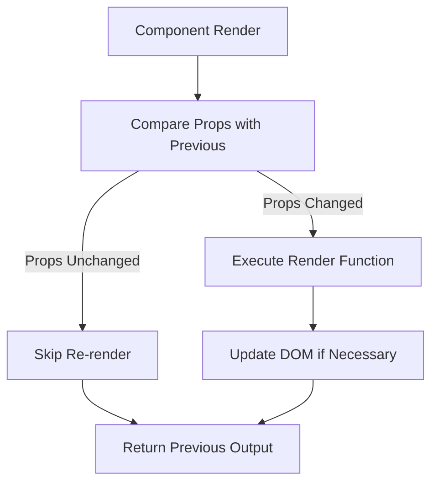
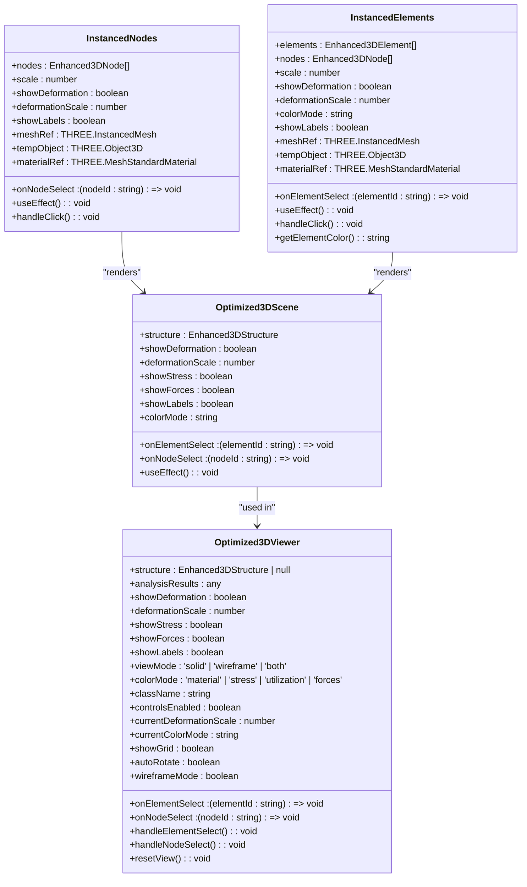
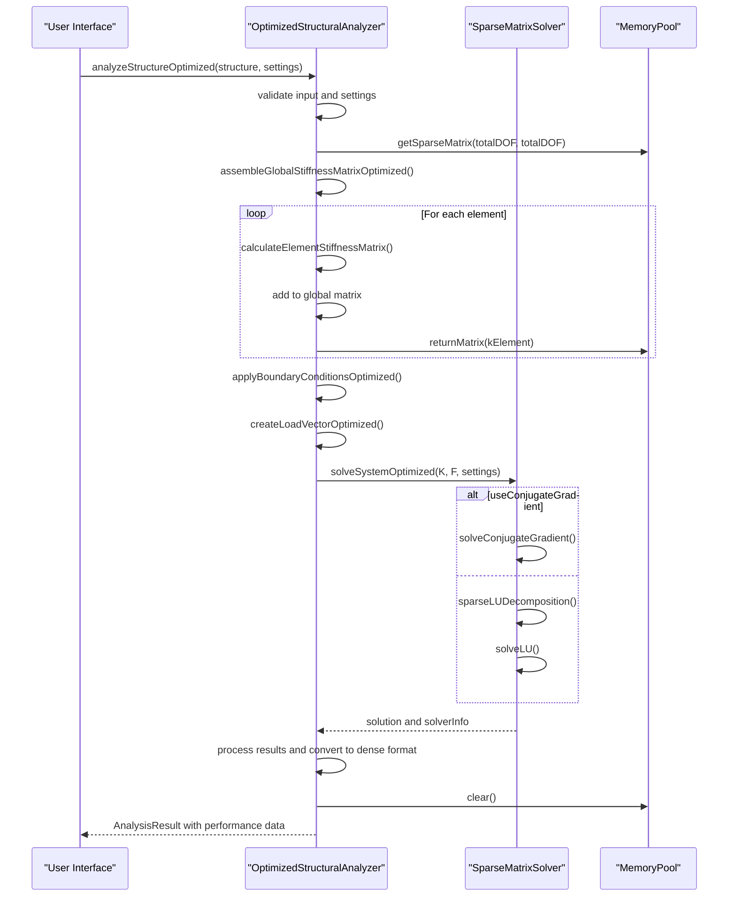
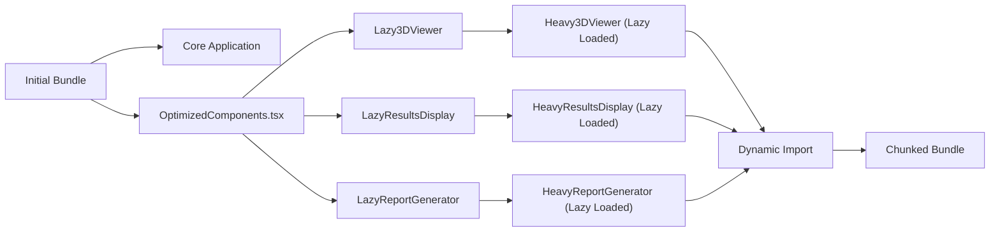
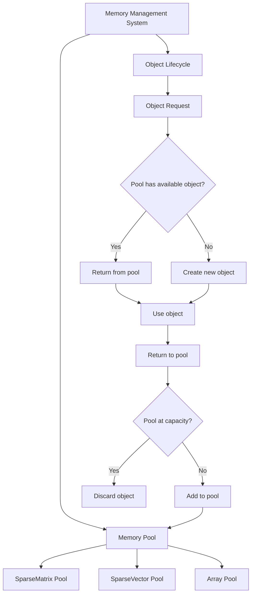

# Performance Optimization

<cite>
**Referenced Files in This Document**   
- [OptimizedComponents.tsx](file://src/structural-analysis/OptimizedComponents.tsx)
- [Optimized3DViewer.tsx](file://src/structural-analysis/advanced-3d/Optimized3DViewer.tsx)
- [OptimizedStructuralAnalyzer.ts](file://src/structural-analysis/analysis/OptimizedStructuralAnalyzer.ts)
- [PERFORMANCE-OPTIMIZATION-GUIDE.md](file://PERFORMANCE-OPTIMIZATION-GUIDE.md)
</cite>

## Table of Contents
1. [Introduction](#introduction)
2. [React.memo and Component Optimization](#reactmemo-and-component-optimization)
3. [Performance-Optimized 3D Visualization](#performance-optimized-3d-visualization)
4. [Algorithmic Optimizations in Structural Analysis](#algorithmic-optimizations-in-structural-analysis)
5. [Code Splitting and Lazy Loading](#code-splitting-and-lazy-loading)
6. [Memory Management for Large Models](#memory-management-for-large-models)
7. [Performance Benchmarks and Metrics](#performance-benchmarks-and-metrics)
8. [Profiling Methodologies and Tools](#profiling-methodologies-and-tools)
9. [Trade-offs Between Accuracy and Performance](#trade-offs-between-accuracy-and-performance)
10. [Performance Configuration Guidelines](#performance-configuration-guidelines)

## Introduction
APP-STRUKTUR-BLACKBOX implements comprehensive performance optimization strategies to ensure responsive user experience while handling complex structural analysis tasks. The application employs a multi-layered optimization approach spanning component rendering, 3D visualization, algorithmic efficiency, and memory management. This document details the implementation of React.memo and other optimization techniques in OptimizedComponents.tsx, specialized performance-optimized components for 3D visualization in Optimized3DViewer.tsx, algorithmic optimizations in OptimizedStructuralAnalyzer.ts, code splitting and lazy loading strategies, memory management techniques, performance benchmarks, profiling methodologies, and configuration guidelines for optimal performance across different deployment scenarios.

## React.memo and Component Optimization
The application implements React.memo to prevent unnecessary re-renders of performance-critical components. The OptimizedComponents.tsx file contains a suite of memoized components designed to optimize rendering performance.

The `OptimizedInputForm` component uses React.memo to wrap the entire form, preventing re-renders when parent components update but form data remains unchanged. It combines memoization with useMemo to optimize form sections and event handlers, ensuring that expensive calculations are only performed when dependencies change. The component memoizes form sections and handles section changes through memoized callback functions, minimizing re-renders during user interactions.

**Diagram sources**
- [OptimizedComponents.tsx](file://src/structural-analysis/OptimizedComponents.tsx#L25-L73)

The optimization strategy extends to other components like `OptimizedChart`, which uses useMemo to process chart data only when the data or chart type changes. The chart configuration is also memoized to prevent unnecessary re-creation of configuration objects. Animation is disabled in the chart configuration to improve rendering performance, particularly for large datasets.

**Section sources**
- [OptimizedComponents.tsx](file://src/structural-analysis/OptimizedComponents.tsx#L25-L224)

## Performance-Optimized 3D Visualization
The Optimized3DViewer.tsx component implements specialized performance optimizations for 3D structural visualization, addressing the challenges of rendering complex structural models with thousands of elements.

The component leverages InstancedMesh from Three.js to efficiently render large numbers of similar elements. Instead of creating individual mesh objects for each beam, column, or node, the viewer uses instancing to render multiple copies of the same geometry with different transformations. This approach dramatically reduces draw calls and improves rendering performance, especially for structures with repetitive elements.

**Diagram sources**
- [Optimized3DViewer.tsx](file://src/structural-analysis/advanced-3d/Optimized3DViewer.tsx#L78-L619)

The viewer implements frustum culling to avoid rendering objects outside the camera's view, reducing unnecessary GPU processing. It also uses efficient lighting with a combination of ambient, directional, and point lights that provide adequate illumination without excessive computational cost. The component includes a control panel with options to adjust visualization parameters such as deformation scale, color mode, and display options, allowing users to balance visual quality with performance.

**Section sources**
- [Optimized3DViewer.tsx](file://src/structural-analysis/advanced-3d/Optimized3DViewer.tsx#L1-L619)

## Algorithmic Optimizations in Structural Analysis
The OptimizedStructuralAnalyzer.ts implements sophisticated algorithmic optimizations to accelerate structural analysis computations while maintaining accuracy.

The analyzer uses sparse matrix techniques to efficiently handle large systems of equations. Instead of storing and processing full matrices, it represents stiffness matrices in sparse format, storing only non-zero elements. This approach dramatically reduces memory usage and computational complexity, particularly for large structures where the stiffness matrix is highly sparse.

**Diagram sources**
- [OptimizedStructuralAnalyzer.ts](file://src/structural-analysis/analysis/OptimizedStructuralAnalyzer.ts#L0-L640)

The analyzer implements a memory pool to reuse objects and reduce garbage collection overhead. The MemoryPool class maintains pools of SparseMatrix and SparseVector objects, recycling them instead of creating new instances for each analysis. This optimization is particularly beneficial for applications that perform multiple analyses in sequence, as it prevents memory allocation spikes and reduces GC pauses.

The system solver offers multiple algorithms with configurable parameters. The conjugate gradient method provides an iterative solution for very large systems, while LU decomposition offers a direct solution for smaller or well-conditioned systems. Users can configure solver parameters such as tolerance and maximum iterations to balance accuracy and performance.

**Section sources**
- [OptimizedStructuralAnalyzer.ts](file://src/structural-analysis/analysis/OptimizedStructuralAnalyzer.ts#L0-L640)

## Code Splitting and Lazy Loading
APP-STRUKTUR-BLACKBOX implements comprehensive code splitting and lazy loading strategies to optimize application startup time and reduce initial bundle size.

The OptimizedComponents.tsx file demonstrates lazy loading of heavy components using React's lazy function combined with Suspense. Components such as Heavy3DViewer, HeavyResultsDisplay, and HeavyReportGenerator are loaded asynchronously only when needed, rather than being included in the initial bundle. This approach ensures that users only download the code required for their current task.

**Diagram sources**
- [OptimizedComponents.tsx](file://src/structural-analysis/OptimizedComponents.tsx#L7-L224)

The lazy loading implementation includes a ComponentLoader component that provides visual feedback during loading, enhancing user experience. The Suspense boundary ensures that the application remains responsive while heavy components are being loaded. This strategy is particularly effective for the 3D viewer and report generator, which have significant dependencies on external libraries.

**Section sources**
- [OptimizedComponents.tsx](file://src/structural-analysis/OptimizedComponents.tsx#L7-L224)

## Memory Management for Large Models
The application implements sophisticated memory management techniques to handle large structural models efficiently, preventing memory leaks and optimizing resource usage.

The Optimized3DViewer employs instancing and efficient geometry management to minimize memory consumption. By using InstancedMesh for nodes and elements, the viewer shares geometry and material resources across multiple instances, reducing memory footprint. The component also implements proper cleanup of Three.js objects when unmounted, preventing memory leaks in long-running applications.

The OptimizedStructuralAnalyzer uses a memory pool pattern to recycle objects and reduce allocation overhead. The MemoryPool class maintains pools of sparse matrices and vectors, reusing them across multiple analysis operations instead of creating new instances. This approach significantly reduces garbage collection frequency and prevents memory fragmentation, particularly important for applications performing repeated analyses.

**Diagram sources**
- [OptimizedStructuralAnalyzer.ts](file://src/structural-analysis/analysis/OptimizedStructuralAnalyzer.ts#L52-L106)

The application also implements frustum culling and level-of-detail techniques in the 3D viewer to reduce the number of objects rendered based on camera distance and viewport visibility. This optimization ensures that only visible objects are processed by the rendering pipeline, conserving both GPU and CPU resources.

**Section sources**
- [Optimized3DViewer.tsx](file://src/structural-analysis/advanced-3d/Optimized3DViewer.tsx#L1-L619)
- [OptimizedStructuralAnalyzer.ts](file://src/structural-analysis/analysis/OptimizedStructuralAnalyzer