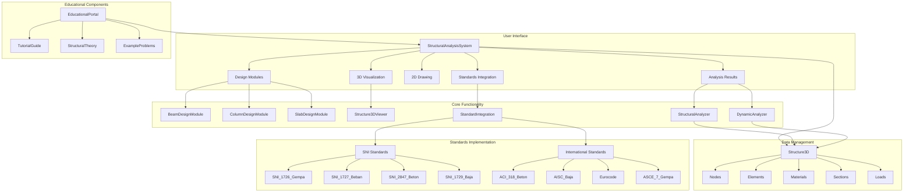
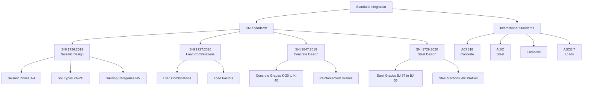

# Project Overview

<cite>
**Referenced Files in This Document**   
- [README.md](file://README.md)
- [StructuralAnalysisSystem.tsx](file://src/structural-analysis/StructuralAnalysisSystem.tsx)
- [EducationalPortal.tsx](file://src/educational/EducationalPortal.tsx)
- [StandardIntegration.tsx](file://src/standards/StandardIntegration.tsx)
- [StructuralAnalyzer.ts](file://src/structural-analysis/analysis/StructuralAnalyzer.ts)
- [DynamicAnalyzer.ts](file://src/structural-analysis/analysis/DynamicAnalyzer.ts)
- [TutorialGuide.tsx](file://src/educational/TutorialGuide.tsx)
- [ExampleProblems.tsx](file://src/educational/ExampleProblems.tsx)
- [StructuralTheory.tsx](file://src/educational/StructuralTheory.tsx)
- [SNI_1726_Gempa.ts](file://src/standards/sni/SNI_1726_Gempa.ts)
- [SNI_1727_Beban.ts](file://src/standards/sni/SNI_1727_Beban.ts)
- [SNI_2847_Beton.ts](file://src/standards/sni/SNI_2847_Beton.ts)
- [SNI_1729_Baja.ts](file://src/standards/sni/SNI_1729_Baja.ts)
</cite>

## Table of Contents
1. [Introduction](#introduction)
2. [Core Capabilities](#core-capabilities)
3. [Target Users and Use Cases](#target-users-and-use-cases)
4. [System Architecture](#system-architecture)
5. [Technical Implementation](#technical-implementation)
6. [Standards Compliance](#standards-compliance)
7. [Educational Integration](#educational-integration)
8. [Codebase Evolution](#codebase-evolution)
9. [Workflow Support](#workflow-support)

## Introduction

The APP-STRUKTUR-BLACKBOX project is a comprehensive structural engineering analysis and visualization system designed to support both professional structural design and educational applications. The application provides a complete solution for structural engineers, students, and educators to design, analyze, and visualize building structures while ensuring compliance with SNI (Indonesian National Standard) and international standards including ACI, AISC, Eurocode, and ASCE.

The system combines advanced computational capabilities with intuitive visualization tools, creating a powerful platform for both practical engineering tasks and academic instruction. By integrating educational content directly with practical analysis tools, the application bridges the gap between theoretical knowledge and real-world application, making it suitable for both professional use and classroom instruction.

The application's architecture is built on modern web technologies, leveraging React with TypeScript for a robust component-based structure, Vite for efficient build processes, and Three.js for sophisticated 3D visualization. This technological foundation enables high-performance structural analysis while maintaining a responsive and user-friendly interface.

**Section sources**
- [README.md](file://README.md#L1-L177)
- [StructuralAnalysisSystem.tsx](file://src/structural-analysis/StructuralAnalysisSystem.tsx#L1-L525)

## Core Capabilities

The APP-STRUKTUR-BLACKBOX system offers a comprehensive suite of structural engineering capabilities that encompass the entire design and analysis workflow. The application's primary functions are organized into several key modules that work together to provide a complete structural engineering solution.

### Structural Design
The system includes specialized design modules for fundamental structural elements: beams, columns, and slabs. Each module provides a guided workflow for defining geometric parameters, material properties, support conditions, and loading scenarios. The beam design calculator supports various support configurations including simply supported, fixed, and cantilever conditions, with material options for both concrete and steel. Similarly, the column design module accommodates different end conditions and section types, while the slab design module handles various support configurations and performs reinforcement calculations.

### Static and Dynamic Analysis
The application features a sophisticated analysis engine that implements the stiffness matrix method for 3D structural analysis. This engine calculates displacements, internal forces (axial, shear, moment, torsion), and stresses throughout the structure. The system also supports dynamic analysis capabilities, including modal analysis to determine natural frequencies and mode shapes, as well as response spectrum analysis for seismic evaluation. These analytical capabilities enable engineers to assess both serviceability and safety under various loading conditions.

### 3D/2D Visualization
Visualization is a core strength of the application, featuring an interactive 3D structure viewer built with Three.js and React Three Fiber. The 3D viewer provides real-time rendering of structural models with comprehensive camera controls (pan, zoom, rotate) and supports visualization of analysis results such as stress distributions, force vectors, and mode shape animations. Complementing the 3D visualization, the system also generates 2D structural drawings and plan views for documentation and presentation purposes.

### Standards Integration
The application incorporates comprehensive support for structural design standards, with particular emphasis on SNI compliance. The system implements SNI 1726:2019 for seismic design, SNI 1727:2020 for load combinations, SNI 2847:2019 for reinforced concrete design, and SNI 1729:2020 for structural steel design. Additionally, the application supports international standards including ACI 318 for concrete, AISC for steel, Eurocode, and ASCE 7 for load combinations and seismic design.

### Export Capabilities
The system provides robust export functionality to facilitate documentation and collaboration. Users can export structure data in JSON and CSV formats, analysis results in CSV format, and generate high-resolution PNG images of 3D visualizations for presentations and reports. These export features enable seamless integration with other engineering software and documentation workflows.

**Section sources**
- [README.md](file://README.md#L25-L100)
- [StructuralAnalysisSystem.tsx](file://src/structural-analysis/StructuralAnalysisSystem.tsx#L1-L525)
- [StructuralAnalyzer.ts](file://src/structural-analysis/analysis/StructuralAnalyzer.ts#L1-L762)
- [DynamicAnalyzer.ts](file://src/structural-analysis/analysis/DynamicAnalyzer.ts#L1-L205)

## Target Users and Use Cases

The APP-STRUKTUR-BLACKBOX system serves a diverse user base with varying needs and expertise levels, primarily targeting structural engineers, engineering students, and educators in the field of structural engineering.

### Structural Engineers
For practicing structural engineers, the application serves as a comprehensive analysis and design tool for real-world projects. Engineers can use the system to perform detailed structural analysis of building frames, verify code compliance with SNI and international standards, and generate visualization outputs for client presentations. The application supports both quick preliminary analysis tasks and in-depth structural design workflows, making it suitable for various stages of the design process.

### Engineering Students
Students benefit from the application's educational features, which include interactive tutorial guides, structural theory reference materials, and a library of example problems. The system allows students to experiment with different structural configurations, observe the effects of various loading conditions, and validate their understanding of structural behavior through hands-on analysis. The integration of theoretical concepts with practical application helps students bridge the gap between classroom learning and real-world engineering practice.

### Educators and Professors
Educators can leverage the application as a teaching tool in structural engineering courses. The system provides course management tools, assignment creation capabilities, and grading resources that facilitate the integration of computational analysis into the curriculum. Professors can use the 3D visualization features to demonstrate complex structural concepts, assign analysis problems to students, and assess their understanding of structural behavior.

### Common Use Cases
The application supports several common use cases across its user base:
- **Preliminary Design**: Engineers can quickly model and analyze structural systems to evaluate feasibility and optimize design parameters.
- **Code Compliance Verification**: The system automates load combination calculations and checks structural elements against SNI and international standards.
- **Educational Demonstrations**: Instructors can use the application to illustrate structural concepts such as moment distribution, buckling behavior, and dynamic response.
- **Student Assignments**: Students can complete structural analysis problems, compare their manual calculations with software results, and submit their work through the educational portal.
- **Seismic Analysis**: The dynamic analysis capabilities enable evaluation of structural performance under earthquake loading, including modal analysis and response spectrum analysis.

**Section sources**
- [README.md](file://README.md#L102-L177)
- [EducationalPortal.tsx](file://src/educational/EducationalPortal.tsx#L1-L282)
- [TutorialGuide.tsx](file://src/educational/TutorialGuide.tsx#L1-L297)
- [ExampleProblems.tsx](file://src/educational/ExampleProblems.tsx#L1-L262)

## System Architecture

The APP-STRUKTUR-BLACKBOX application follows a component-based architecture built on React with TypeScript, organized into a modular structure that separates concerns and promotes reusability. The system architecture is designed to support both the computational demands of structural analysis and the interactive requirements of educational applications.

**Diagram sources**
- [StructuralAnalysisSystem.tsx](file://src/structural-analysis/StructuralAnalysisSystem.tsx#L1-L525)
- [StructuralAnalyzer.ts](file://src/structural-analysis/analysis/StructuralAnalyzer.ts#L1-L762)
- [DynamicAnalyzer.ts](file://src/structural-analysis/analysis/DynamicAnalyzer.ts#L1-L205)
- [StandardIntegration.tsx](file://src/standards/StandardIntegration.tsx#L1-L514)

The architecture follows a clear separation between the user interface components, core analysis algorithms, data models, and educational features. The main application component (StructuralAnalysisSystem) serves as the central hub, coordinating interactions between the various modules and managing the overall application state.

The system employs a unidirectional data flow pattern, where user interactions in the design modules generate structural elements that are collected and passed to the analysis engine. The analysis results are then displayed in dedicated visualization components, creating a seamless workflow from design to analysis to visualization.

The educational components are integrated as parallel modules that can be accessed alongside the engineering tools, allowing users to switch between practical application and theoretical learning. This architectural approach supports the application's dual purpose as both a professional engineering tool and an educational platform.

**Section sources**
- [README.md](file://README.md#L10-L177)
- [StructuralAnalysisSystem.tsx](file://src/structural-analysis/StructuralAnalysisSystem.tsx#L1-L525)
- [EducationalPortal.tsx](file://src/educational/EducationalPortal.tsx#L1-L282)

## Technical Implementation

The APP-STRUKTUR-BLACKBOX application is built on a modern technology stack that combines React with TypeScript for a robust and type-safe development environment. The implementation follows component-based principles with a strong emphasis on modularity and reusability.

### Component-Based React Architecture
The application's user interface is constructed from a hierarchy of React components, each responsible for a specific aspect of functionality. The main StructuralAnalysisSystem component orchestrates the overall application flow, managing state and coordinating interactions between specialized modules for beam design, column design, slab design, 3D visualization, and analysis. Each design module encapsulates its own state and logic, exposing a clean interface for communication with the parent component.

The component architecture follows React best practices, utilizing functional components with hooks for state management. The system employs a tab-based navigation pattern that allows users to switch between different functional areas (design, visualization, analysis) while maintaining context and preserving the structural model across different views.

### TypeScript Foundation
TypeScript is used throughout the codebase to provide strong typing and enhance code reliability. The application defines comprehensive type definitions for structural elements, including nodes, elements, materials, sections, and loads. These types ensure data integrity throughout the analysis pipeline and provide excellent developer tooling support with autocompletion and error detection.

The type system includes interfaces for analysis results, capturing displacements, internal forces, stresses, and validation status. This strongly-typed approach enables robust error checking and makes the codebase more maintainable and easier to extend.

### Key Technical Decisions
Several key technical decisions shaped the implementation of the application:

1. **Vite Build Tool**: The application uses Vite for fast development server startup and efficient production builds, leveraging modern browser features for improved performance.

2. **Three.js for 3D Visualization**: The choice of Three.js provides powerful 3D rendering capabilities with excellent performance, while React Three Fiber bridges the React and Three.js ecosystems for seamless integration.

3. **Modular Standards Implementation**: Structural standards are implemented as separate modules that can be imported and used independently, allowing for easy extension and maintenance of code compliance features.

4. **State Management**: The application uses React's built-in state management (useState, useEffect) rather than external state management libraries, keeping the architecture simple and focused.

5. **Error Boundary Protection**: Critical components are wrapped in error boundaries to ensure the application remains functional even if individual components fail during complex calculations.

The implementation demonstrates a balance between computational complexity and user experience, with careful attention to performance optimization in both the analysis algorithms and the user interface rendering.

**Section sources**
- [README.md](file://README.md#L10-L177)
- [StructuralAnalysisSystem.tsx](file://src/structural-analysis/StructuralAnalysisSystem.tsx#L1-L525)
- [StructuralAnalyzer.ts](file://src/structural-analysis/analysis/StructuralAnalyzer.ts#L1-L762)
- [DynamicAnalyzer.ts](file://src/structural-analysis/analysis/DynamicAnalyzer.ts#L1-L205)

## Standards Compliance

The APP-STRUKTUR-BLACKBOX system places significant emphasis on compliance with structural design standards, particularly the Indonesian National Standards (SNI) and major international standards. The application's standards integration is implemented as a dedicated module that provides both automated code checking and educational resources on standard requirements.

### SNI Compliance
The system implements four key SNI standards for structural engineering:

- **SNI 1726:2019** - Seismic design requirements, including seismic zone mapping for Indonesia, soil type classification, and building category importance factors. The application provides tools for calculating seismic coefficients based on location-specific parameters.

- **SNI 1727:2020** - Load combinations and requirements, with implementation of basic and special load combinations for various structural types. The system automates the application of load factors for dead, live, wind, earthquake, and other load types.

- **SNI 2847:2019** - Reinforced concrete design, including material properties for different concrete strengths (K-20 to K-40), reinforcement grades (BJTP 240, BJTD 400, BJTD 500), and design checks for minimum and maximum reinforcement ratios.

- **SNI 1729:2020** - Structural steel design, with material properties for various steel grades (BJ 37, BJ 41, BJ 50, BJ 55) and standard steel sections (WF profiles). The system includes checks for slenderness limits and buckling behavior.

### International Standards
In addition to SNI compliance, the application supports several international standards:

- **ACI 318** - Concrete structure design requirements from the American Concrete Institute
- **AISC** - Steel structure design specifications from the American Institute of Steel Construction
- **Eurocode** - European design standards for structural elements
- **ASCE 7** - Load combinations and seismic design requirements from the American Society of Civil Engineers

### Standards Integration Interface
The StandardIntegration component provides a user-friendly interface for configuring and applying design standards to structural projects. Users can select the applicable design code, specify site-specific parameters (seismic zone, soil type, building category), and choose material properties. The system then calculates relevant design parameters and displays compliance status for the selected standards.

The implementation includes comprehensive data structures for standard parameters, with functions for calculating factored loads, seismic coefficients, and material strengths according to the specified standards. This approach ensures that structural designs are evaluated against the appropriate code requirements, providing engineers with confidence in the safety and compliance of their designs.

**Diagram sources**
- [StandardIntegration.tsx](file://src/standards/StandardIntegration.tsx#L1-L514)
- [SNI_1726_Gempa.ts](file://src/standards/sni/SNI_1726_Gempa.ts#L1-L135)
- [SNI_1727_Beban.ts](file://src/standards/sni/SNI_1727_Beban.ts#L1-L181)
- [SNI_2847_Beton.ts](file://src/standards/sni/SNI_2847_Beton.ts#L1-L239)
- [SNI_1729_Baja.ts](file://src/standards/sni/SNI_1729_Baja.ts#L1-L284)

**Section sources**
- [README.md](file://README.md#L102-L177)
- [StandardIntegration.tsx](file://src/standards/StandardIntegration.tsx#L1-L514)
- [SNI_1726_Gempa.ts](file://src/standards/sni/SNI_1726_Gempa.ts#L1-L135)
- [SNI_1727_Beban.ts](file://src/standards/sni/SNI_1727_Beban.ts#L1-L181)

## Educational Integration

The APP-STRUKTUR-BLACKBOX system features a comprehensive educational component that integrates theoretical knowledge with practical application, creating a powerful learning environment for structural engineering students and educators.

### Educational Portal
The EducationalPortal component serves as the central hub for educational content, providing a structured interface for accessing learning resources. The portal includes several key sections:

- **Tutorial Guide**: An interactive step-by-step guide that introduces users to the application's features and structural analysis concepts. The tutorial covers the design process, analysis types, and visualization features, with educational tips for effective learning.

- **Structural Theory**: A comprehensive reference on fundamental structural analysis concepts, including the stiffness matrix method, modal analysis, response spectrum analysis, material properties, and section properties. The content is organized into expandable topics with mathematical formulations and explanatory text.

- **Example Problems**: A library of pre-built structural analysis examples ranging from beginner to advanced levels. Each example includes problem description, structure details, educational objectives, and solution notes to guide the learning process.

### Integration with Practical Tools
The educational components are seamlessly integrated with the application's practical analysis tools, allowing students to immediately apply theoretical concepts to real structural models. This integration enables several powerful learning workflows:

1. **Theory to Practice**: Students can study a theoretical concept in the StructuralTheory component and then immediately apply it by analyzing a similar structure in the main application.

2. **Example-Based Learning**: The ExampleProblems component provides ready-to-analyze structures that illustrate specific structural behaviors, allowing students to explore the effects of different parameters and loading conditions.

3. **Verification of Manual Calculations**: Students can perform manual calculations for simple structures and then verify their results using the application's analysis engine, reinforcing their understanding of structural behavior.

4. **Progressive Learning**: The system supports a progression from simple beam analysis to complex 3D frame analysis, allowing students to build their skills incrementally.

### Features for Educators
The educational components include specific features designed for instructors and professors:

- **Course Management Tools**: Resources for organizing structural engineering courses and tracking student progress.

- **Assignment Creation**: Capabilities for creating and distributing structural analysis problems to students.

- **Grading Resources**: Tools to assist