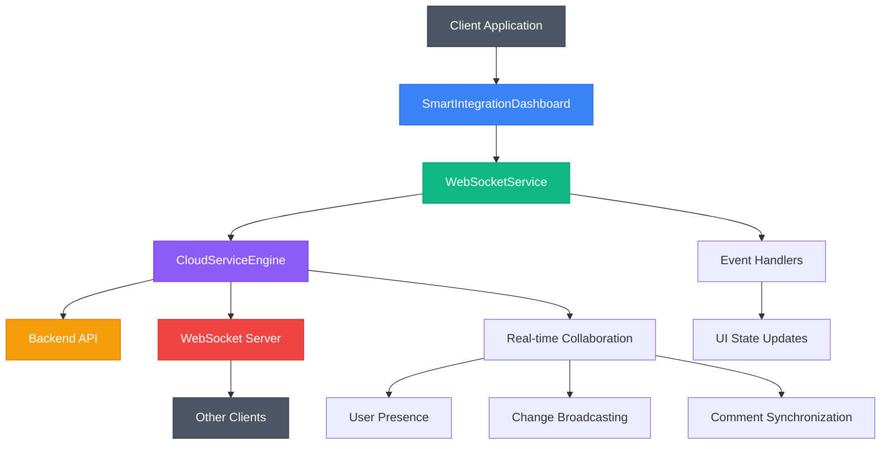
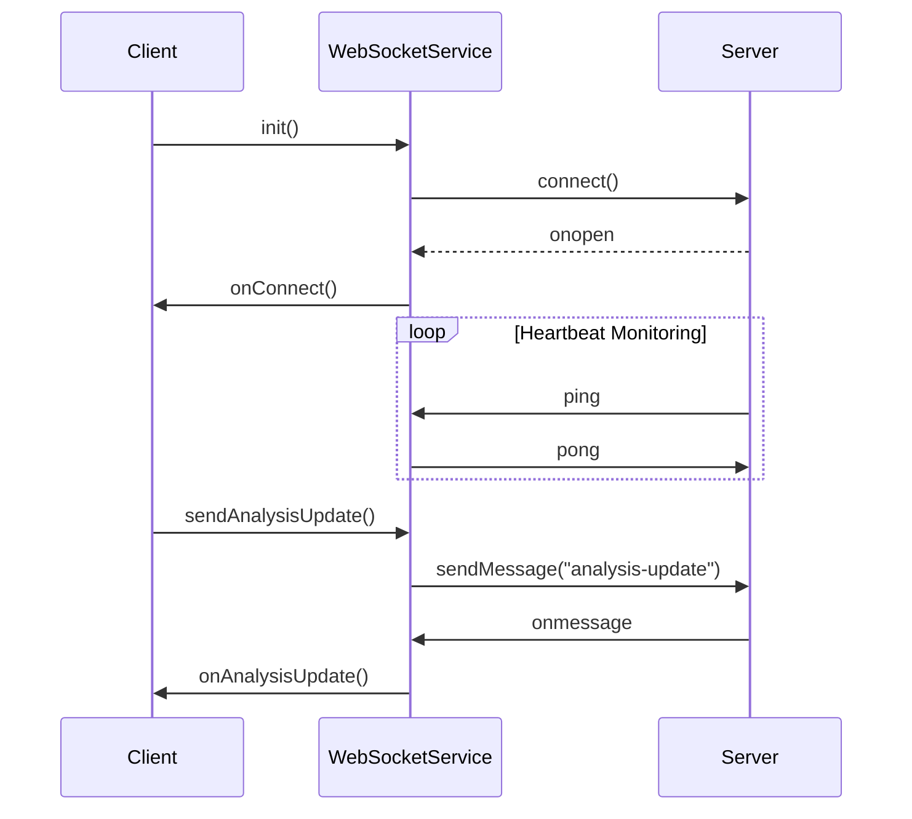
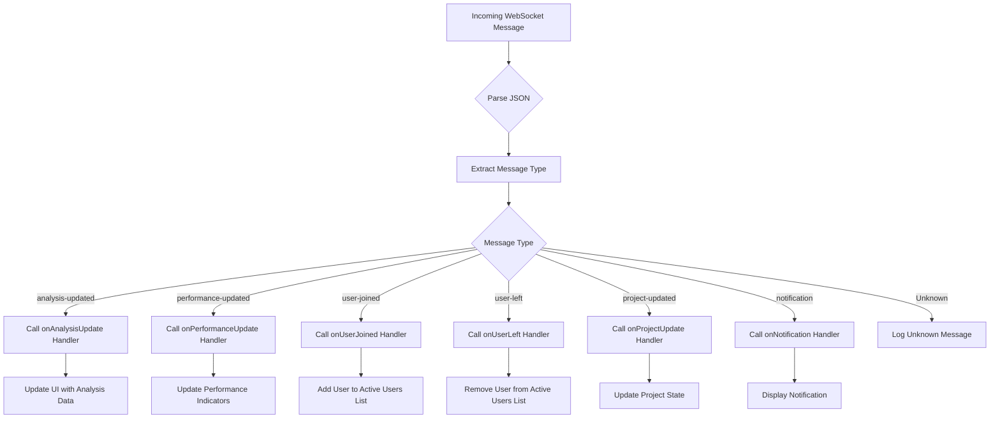
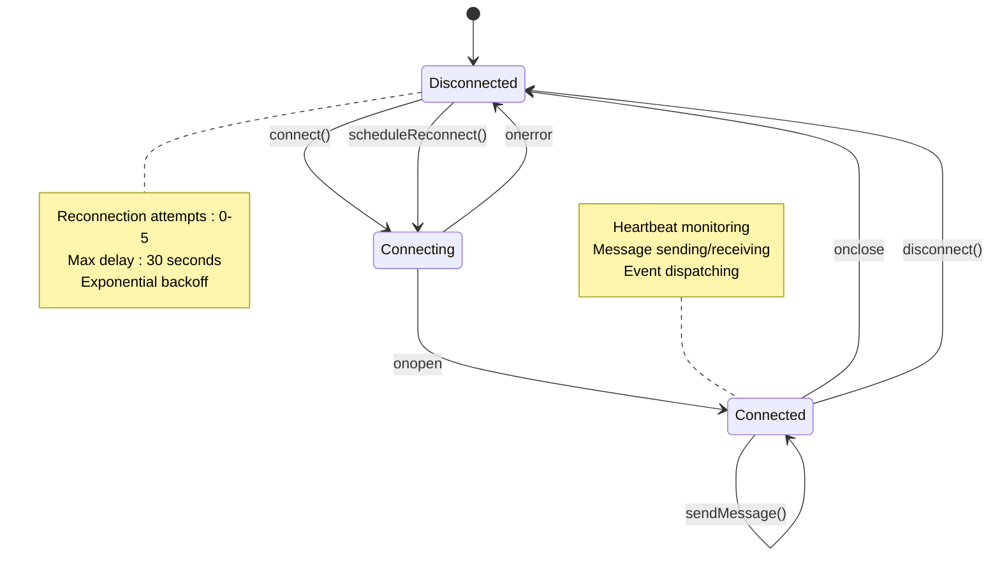
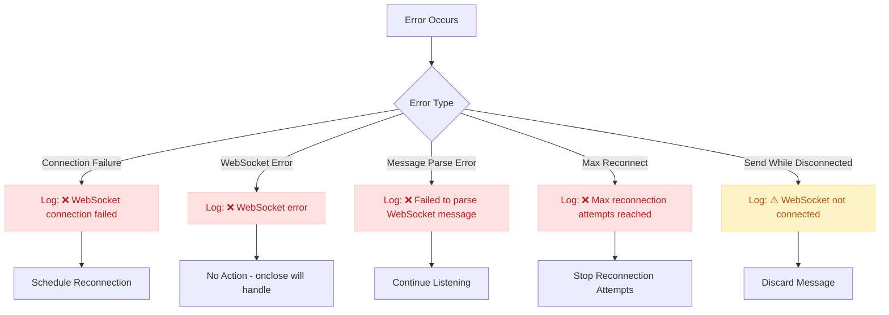
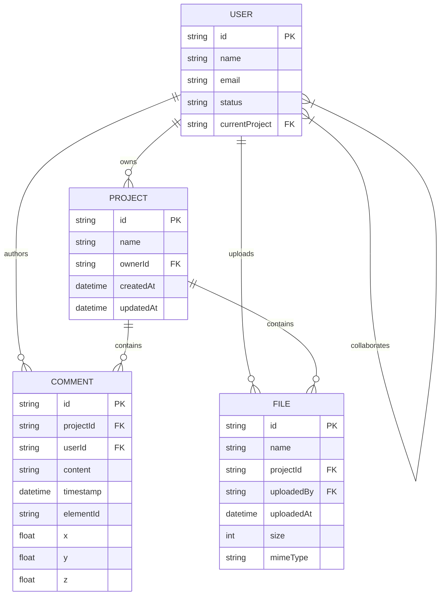
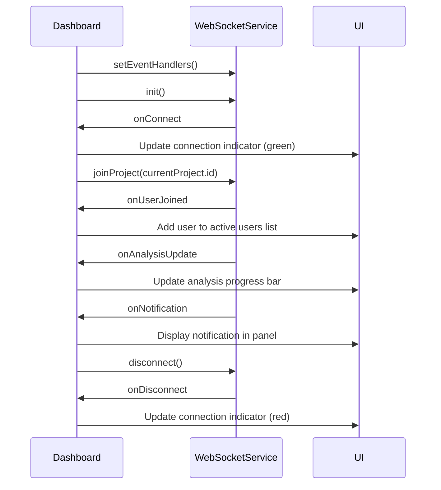

<docs>
# Real-time Collaboration System

<cite>
**Referenced Files in This Document**   
- [webSocketService.ts](file://src/services/webSocketService.ts)
- [CloudServiceEngine.ts](file://src/cloud/CloudServiceEngine.ts)
- [SmartIntegrationDashboard.tsx](file://src/components/SmartIntegrationDashboard.tsx)
</cite>

## Table of Contents
1. [Introduction](#introduction)
2. [Architecture Overview](#architecture-overview)
3. [WebSocket Implementation](#websocket-implementation)
4. [Event Handling Mechanisms](#event-handling-mechanisms)
5. [Connection Management](#connection-management)
6. [Error Handling](#error-handling)
7. [Collaboration Features](#collaboration-features)
8. [Integration with SmartIntegrationDashboard](#integration-with-smartintegrationdashboard)
9. [Conclusion](#conclusion)

## Introduction
The Real-time Collaboration System enables multiple users to work simultaneously on structural analysis projects with immediate synchronization of changes, notifications, and status updates. Built on WebSocket technology, the system provides low-latency communication between clients and server, supporting collaborative features such as real-time analysis updates, user presence tracking, and project change notifications. The system integrates seamlessly with the SmartIntegrationDashboard to provide a unified experience for AI-powered structural analysis with BIM integration.

**Section sources**
- [webSocketService.ts](file://src/services/webSocketService.ts#L0-L42)
- [CloudServiceEngine.ts](file://src/cloud/CloudServiceEngine.ts#L0-L60)

## Architecture Overview

**Diagram sources**
- [webSocketService.ts](file://src/services/webSocketService.ts#L18-L213)
- [CloudServiceEngine.ts](file://src/cloud/CloudServiceEngine.ts#L136-L725)
- [SmartIntegrationDashboard.tsx](file://src/components/SmartIntegrationDashboard.tsx#L42-L614)

## WebSocket Implementation

The WebSocket implementation consists of two main components: the client-side WebSocketService and the CloudServiceEngine's WebSocket integration. The WebSocketService provides a simplified interface for real-time communication without external dependencies like socket.io-client.

Key implementation details:
- Connection established via WebSocket protocol using environment-configurable URL
- Automatic reconnection with exponential backoff strategy
- Message parsing and routing based on message type
- Event handler registration for different message types
- Connection status monitoring and reporting

The system uses a singleton pattern with the `webSocketService` instance, ensuring a single connection per client. The CloudServiceEngine also implements its own WebSocket connection for cloud-specific collaboration features, maintaining separate connection management for cloud operations.

**Diagram sources**
- [webSocketService.ts](file://src/services/webSocketService.ts#L18-L213)
- [CloudServiceEngine.ts](file://src/cloud/CloudServiceEngine.ts#L523-L611)

**Section sources**
- [webSocketService.ts](file://src/services/webSocketService.ts#L18-L213)
- [CloudServiceEngine.ts](file://src/cloud/CloudServiceEngine.ts#L523-L611)

## Event Handling Mechanisms

The system implements a comprehensive event handling mechanism through registered callbacks for different event types. The WebSocketService supports the following event handlers:

- **onConnect**: Triggered when WebSocket connection is established
- **onDisconnect**: Triggered when connection is lost
- **onAnalysisUpdate**: Receives real-time analysis progress updates
- **onPerformanceUpdate**: Handles performance data updates
- **onUserJoined**: Notifies when another user joins the project
- **onUserLeft**: Notifies when a user leaves the project
- **onProjectUpdate**: Receives updates to project data
- **onNotification**: Handles real-time notifications
- **onError**: Catches WebSocket communication errors

Each event type corresponds to a specific message type received from the server, with the handleMessage method routing messages to appropriate handlers. The CloudServiceEngine implements similar event handling through custom events dispatched to the window object, including 'cloudSyncUpdate', 'cloudUserJoined', 'cloudUserLeft', and 'cloudCommentAdded'.

**Diagram sources**
- [webSocketService.ts](file://src/services/webSocketService.ts#L82-L127)
- [CloudServiceEngine.ts](file://src/cloud/CloudServiceEngine.ts#L565-L611)

**Section sources**
- [webSocketService.ts](file://src/services/webSocketService.ts#L82-L127)
- [CloudServiceEngine.ts](file://src/cloud/CloudServiceEngine.ts#L565-L611)

## Connection Management

The system implements robust connection management with automatic reconnection capabilities and connection status monitoring. Key features include:

- **Automatic Connection**: The WebSocketService initiates connection when initialized
- **Reconnection Strategy**: Exponential backoff with maximum retry limit (5 attempts)
- **Connection State Tracking**: Maintains isConnected flag and reconnectAttempts counter
- **Manual Control**: Provides disconnect() and reconnect() methods for explicit control
- **Status Monitoring**: getConnectionStatus() returns current connection state

The reconnection mechanism uses a delay calculation based on the number of attempts: `Math.min(1000 * Math.pow(2, attempts), 30000)` with a maximum of 30 seconds between attempts. The CloudServiceEngine implements similar connection management with automatic reconnection attempts every 5 seconds when disconnected.

**Diagram sources**
- [webSocketService.ts](file://src/services/webSocketService.ts#L165-L220)
- [CloudServiceEngine.ts](file://src/cloud/CloudServiceEngine.ts#L523-L569)

**Section sources**
- [webSocketService.ts](file://src/services/webSocketService.ts#L165-L220)
- [CloudServiceEngine.ts](file://src/cloud/CloudServiceEngine.ts#L523-L569)

## Error Handling

The system implements comprehensive error handling at multiple levels to ensure reliability and user feedback:

- **Connection Errors**: WebSocket onerror events are caught and logged
- **Message Parsing Errors**: JSON parsing failures are caught and logged
- **Max Reconnection Handling**: After 5 failed attempts, reconnection stops
- **Disconnected State Handling**: Messages are not sent when disconnected
- **Graceful Degradation**: UI updates reflect connection status

The WebSocketService logs detailed error messages with emoji indicators for quick visual identification:
- ❌ WebSocket connection failed
- ❌ WebSocket error
- ❌ Failed to parse WebSocket message
- ❌ Max reconnection attempts reached
- ⚠️ WebSocket not connected, message not sent

When sending messages while disconnected, the system logs a warning rather than throwing an exception, allowing the application to continue functioning. The CloudServiceEngine implements additional error handling for API requests and file operations, with try-catch blocks around all asynchronous operations.

**Diagram sources**
- [webSocketService.ts](file://src/services/webSocketService.ts#L38-L86)
- [CloudServiceEngine.ts](file://src/cloud/CloudServiceEngine.ts#L474-L526)

**Section sources**
- [webSocketService.ts](file://src/services/webSocketService.ts#L38-L86)
- [CloudServiceEngine.ts](file://src/cloud/CloudServiceEngine.ts#L474-L526)

## Collaboration Features

The system provides rich collaboration features through both the WebSocketService and CloudServiceEngine:

- **User Presence**: Tracks online users in real-time
- **Project Joining/Leaving**: Users can join and leave project rooms
- **Real-time Updates**: Analysis, performance, and project data synchronization
- **Notifications**: Real-time alerts for important events
- **Comments**: Collaborative commenting on projects
- **File Sharing**: Upload and download files within projects
- **User Management**: Share projects with specific roles and permissions

The CloudServiceEngine enhances collaboration with additional features:
- **Offline Support**: Changes are cached when offline and synced when reconnected
- **Network Monitoring**: Automatic detection of online/offline status
- **Data Encryption**: Project data is encrypted in transit and at rest
- **Conflict Resolution**: Sync updates include conflict resolution strategies

Collaboration events are broadcast to all users in the same project room, enabling real-time co-editing and awareness of other users' activities. The system uses a publish-subscribe pattern where users join project-specific rooms and receive only relevant updates.

**Diagram sources**
- [CloudServiceEngine.ts](file://src/cloud/CloudServiceEngine.ts#L136-L725)
- [webSocketService.ts](file://src/services/webSocketService.ts#L216-L246)

**Section sources**
- [CloudServiceEngine.ts](file://src/cloud/CloudServiceEngine.ts#L382-L437)
- [webSocketService.ts](file://src/services/webSocketService.ts#L216-L246)

## Integration with SmartIntegrationDashboard

The Real-time Collaboration System integrates tightly with the SmartIntegrationDashboard to provide a seamless user experience:

- **WebSocket Initialization**: The dashboard initializes the WebSocket connection on mount
- **Event Handler Registration**: Registers handlers for all collaboration events
- **UI State Synchronization**: Updates component state based on real-time events
- **Visual Indicators**: Shows connection status and active users
- **Real-time Analysis Updates**: Displays progress of AI and structural analysis
- **Notification System**: Shows real-time alerts in the dashboard UI

The integration is implemented through React's useEffect hook, which initializes the WebSocket service when the component mounts and cleans up by disconnecting when unmounted. The dashboard maintains a realTimeState that tracks connection status, active users, and notifications, updating the UI accordingly.

Key integration points:
- Connection status displayed with color-coded indicators (green for connected, red for offline)
- Active user count shown when collaboration is active
- Real-time analysis progress updates the progress bar
- User join/leave events update the active users list
- Project updates refresh the current project data
- Notifications appear in a dedicated panel

**Diagram sources**
- [SmartIntegrationDashboard.tsx](file://src/components/SmartIntegrationDashboard.tsx#L42-L614)
- [webSocketService.ts](file://src/services/webSocketService.ts#L124-L170)

**Section sources**
- [SmartIntegrationDashboard.tsx](file://src/components/SmartIntegrationDashboard.tsx#L115-L151)
- [webSocketService.ts](file://src/services/webSocketService.ts#L124-L170)

## Conclusion
The Real-time Collaboration System provides a robust foundation for multi-user collaboration in structural analysis applications. By leveraging WebSocket technology, the system enables real-time synchronization of project data, analysis progress, and user interactions. The integration with the SmartIntegrationDashboard creates a seamless experience where multiple engineers can collaborate on complex structural projects simultaneously.

Key strengths of the system include:
- Reliable connection management with automatic reconnection
- Comprehensive error handling and user feedback
- Rich collaboration features including presence, comments, and file sharing
- Tight integration with the main application dashboard
- Support for offline work with automatic synchronization
- Secure data transmission and storage

The system is designed to scale from small teams to large organizations, supporting complex collaboration scenarios while maintaining performance and reliability. Future enhancements could include message history, read receipts, and more sophisticated conflict resolution mechanisms.

**Section sources**
- [web