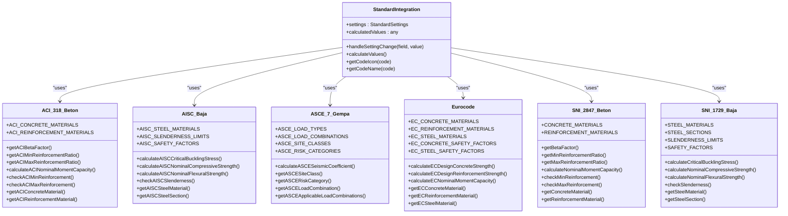

# International Standards

<cite>
**Referenced Files in This Document**   
- [StandardIntegration.tsx](file://src/standards/StandardIntegration.tsx)
- [ACI_318_Beton.ts](file://src/standards/international/ACI_318_Beton.ts)
- [AISC_Baja.ts](file://src/standards/international/AISC_Baja.ts)
- [ASCE_7_Gempa.ts](file://src/standards/international/ASCE_7_Gempa.ts)
- [Eurocode.ts](file://src/standards/international/Eurocode.ts)
- [SNI_2847_Beton.ts](file://src/standards/sni/SNI_2847_Beton.ts)
- [SNI_1729_Baja.ts](file://src/standards/sni/SNI_1729_Baja.ts)
- [SNI_1726_Gempa.ts](file://src/standards/sni/SNI_1726_Gempa.ts)
- [SNI_1727_Beban.ts](file://src/standards/sni/SNI_1727_Beban.ts)
- [index.ts](file://src/standards/index.ts)
</cite>

## Table of Contents
1. [Introduction](#introduction)
2. [International Standards Overview](#international-standards-overview)
3. [ACI 318 Concrete Design](#aci-318-concrete-design)
4. [AISC Steel Design](#aisc-steel-design)
5. [ASCE 7 Seismic Loads](#asce-7-seismic-loads)
6. [Eurocode Implementation](#eurocode-implementation)
7. [Standard Integration Architecture](#standard-integration-architecture)
8. [Cross-Standard Comparison](#cross-standard-comparison)
9. [Regional Standard Selection Guidance](#regional-standard-selection-guidance)
10. [Harmonization Challenges](#harmonization-challenges)

## Introduction

The APP-STRUKTUR-BLACKBOX application provides comprehensive support for international structural design standards, enabling engineers to work with multiple code systems within a unified interface. This document details the implementation of key international standards—ACI 318 for concrete, AISC for steel, ASCE 7 for seismic loads, and Eurocode for European compliance—and their integration with Indonesia's SNI standards. The system allows for seamless switching between standards, comparative analysis, and validation of designs across different regulatory frameworks.

**Section sources**
- [StandardIntegration.tsx](file://src/standards/StandardIntegration.tsx#L96-L511)

## International Standards Overview

The application supports four major international structural design standards alongside Indonesia's SNI standards. These standards are implemented as modular components within the `src/standards/international/` directory, each providing comprehensive coverage of material properties, design methodologies, load combinations, and safety factors. The standards are designed to coexist with SNI standards, allowing users to compare designs across different regulatory frameworks and select appropriate codes based on project location and requirements.

The international standards are organized as follows:
- **ACI_318_Beton.ts**: American Concrete Institute standard for reinforced concrete design
- **AISC_Baja.ts**: American Institute of Steel Construction standard for structural steel
- **ASCE_7_Gempa.ts**: American Society of Civil Engineers standard for minimum design loads
- **Eurocode.ts**: European standards for structural design (EN 1992 for concrete, EN 1993 for steel)

These standards are imported and re-exported through the central `index.ts` file, providing a unified interface for the entire application.

**Section sources**
- [index.ts](file://src/standards/index.ts#L1-L100)

## ACI 318 Concrete Design

The ACI 318-19 standard implementation provides comprehensive support for reinforced concrete design according to American practices. The implementation includes material properties for various concrete strengths (4000-8000 psi) and reinforcement grades (40, 60, 75), with corresponding mechanical properties such as compressive strength, modulus of elasticity, and unit weight.

Key technical features of the ACI 318 implementation include:
- **Beta factor calculation**: Variable stress block coefficient based on concrete strength, ranging from 0.85 for strengths ≤28 MPa to 0.65 for higher strengths
- **Reinforcement ratio limits**: Minimum and maximum reinforcement requirements calculated based on concrete and steel strengths
- **Nominal moment capacity**: Calculation of flexural strength for reinforced concrete sections using the equivalent rectangular stress block method
- **Code compliance checks**: Validation of minimum and maximum reinforcement requirements

The implementation follows the strength design philosophy of ACI 318, using load and resistance factor design (LRFD) with appropriate safety factors. Material strengths are reduced by safety factors (φ factors) during design calculations, though these are applied at the analysis level rather than being embedded in the material definitions.

**Section sources**
- [ACI_318_Beton.ts](file://src/standards/international/ACI_318_Beton.ts#L1-L224)

## AISC Steel Design

The AISC 360-16 specification implementation provides comprehensive support for structural steel design according to American practices. The standard covers material properties for common steel grades (A36, A572 Grade 50, A992), with detailed mechanical properties including yield strength, ultimate strength, modulus of elasticity, and shear modulus.

Key technical features of the AISC implementation include:
- **Buckling analysis**: Critical buckling stress calculation for compression members using Euler's formula with effective length factors
- **Nominal strength calculations**: Axial compressive and flexural strength determination based on member slenderness and material properties
- **Slenderness limits**: Maximum slenderness ratios for different member types (tension, compression, flexural)
- **Safety factors**: Resistance factors for different failure modes (yielding, rupture, buckling, shear)

The implementation supports both laterally supported and unsupported flexural members, with different strength calculation methodologies for each case. For compression members, the system determines whether elastic or inelastic buckling controls the design strength based on the slenderness ratio.

**Section sources**
- [AISC_Baja.ts](file://src/standards/international/AISC_Baja.ts#L1-L215)

## ASCE 7 Seismic Loads

The ASCE 7-16 standard implementation provides comprehensive support for minimum design loads and associated criteria, with particular emphasis on seismic design requirements. The standard defines load types, load combinations, and seismic parameters for structural design.

Key technical features of the ASCE 7 implementation include:
- **Load combinations**: Five basic load combinations with appropriate load factors for different load types (dead, live, wind, earthquake, snow, etc.)
- **Seismic parameters**: Site classes (A-F) based on soil properties and shear wave velocity, risk categories (I-IV) with corresponding importance factors
- **Seismic coefficient calculation**: Determination of seismic response coefficient (Cs) based on site class, risk category, and structure period
- **Site amplification**: Site coefficients (Fa, Fv) applied to spectral accelerations based on site class

The load combination system follows the ASCE 7 requirements for strength design, with different combinations applicable to structures subjected to various load types. The seismic design methodology uses a response spectrum approach with site-specific parameters to determine design forces.

**Section sources**
- [ASCE_7_Gempa.ts](file://src/standards/international/ASCE_7_Gempa.ts#L1-L241)

## Eurocode Implementation

The Eurocode implementation supports both concrete (EN 1992) and steel (EN 1993) structural design according to European practices. The implementation follows the limit state design philosophy with partial safety factors applied to both actions and material strengths.

Key technical features of the Eurocode implementation include:
- **Concrete design (EN 1992)**: Material properties for concrete classes C20/25 through C40/50, with cylinder and cube strengths, and design strength calculation using partial safety factors (γc = 1.5)
- **Reinforcement design**: Material properties for reinforcement grades B500A, B500B, and B500C, with design strength calculation using partial safety factors (γs = 1.15)
- **Steel design (EN 1993)**: Material properties for steel grades S235, S275, and S355, with partial safety factors for resistance (γM = 1.0-1.1)
- **Design methodology**: Limit state design with separate partial safety factors for materials and resistance

The Eurocode implementation uses a more systematic approach to safety factors compared to American standards, with explicit separation of material and resistance factors. The concrete design methodology uses a rectangular stress block with λ = 0.8 and αcc = 0.85, consistent with Eurocode 2 requirements.

**Section sources**
- [Eurocode.ts](file://src/standards/international/Eurocode.ts#L1-L269)

## Standard Integration Architecture

The StandardIntegration component serves as the central interface for configuring and applying structural design standards within the application. This React component provides a unified user interface for selecting design codes and configuring standard-specific parameters.

The architecture follows a modular design pattern where:
- International standards are implemented in the `international/` subdirectory
- SNI standards are implemented in the `sni/` subdirectory
- All standards are imported and re-exported through `index.ts`
- The StandardIntegration component dynamically renders configuration options based on the selected standard

The component maintains a settings state that includes:
- Design code selection (sni, aci, aisc, eurocode, asce)
- Seismic parameters (zone, soil type, building category)
- Load combination selection
- Material specifications for concrete, reinforcement, and steel

When the "Calculate Values" button is clicked, the component retrieves the selected standard parameters using getter functions (getSeismicZone, getSoilType, etc.) and calculates a seismic coefficient as an example of standard application. The results are displayed in a structured format showing the selected configuration and calculated values.

**Diagram sources**
- [StandardIntegration.tsx](file://src/standards/StandardIntegration.tsx#L96-L511)
- [ACI_318_Beton.ts](file://src/standards/international/ACI_318_Beton.ts#L1-L224)
- [AISC_Baja.ts](file://src/standards/international/AISC_Baja.ts#L1-L215)
- [ASCE_7_Gempa.ts](file://src/standards/international/ASCE_7_Gempa.ts#L1-L241)
- [Eurocode.ts](file://src/standards/international/Eurocode.ts#L1-L269)
- [SNI_2847_Beton.ts](file://src/standards/sni/SNI_2847_Beton.ts#L1-L239)
- [SNI_1729_Baja.ts](file://src/standards/sni/SNI_1729_Baja.ts#L1-L284)

**Section sources**
- [StandardIntegration.tsx](file://src/standards/StandardIntegration.tsx#L96-L511)

## Cross-Standard Comparison

The application enables direct comparison between international standards and SNI standards, highlighting key differences in design methodologies, material specifications, and safety factors. This comparative analysis is essential for projects that require compliance with multiple standards or for engineers working on international projects.

### Concrete Design Comparison (ACI vs SNI)

| Parameter | ACI 318 | SNI 2847 | Notes |
|---------|--------|--------|-------|
| Concrete strength basis | f'c (cylinder) | f'c (cube) | Different test methods |
| Beta factor (β1) | 0.85 for f'c ≤ 28 MPa | 0.85 for f'c ≤ 30 MPa | Slightly different transition point |
| Minimum reinforcement | max(0.25√f'c/fy, 1.4/fy) | max(0.25√f'c/fy, 1.4/fy) | Identical formula |
| Maximum reinforcement | 0.75ρ_bal | 0.75ρ_bal | Identical limit |
| Safety factors | φ = 0.9 (flexure) | γ = 1.6 (material) | Different design philosophies |

### Steel Design Comparison (AISC vs SNI)

| Parameter | AISC 360 | SNI 1729 | Notes |
|---------|--------|--------|-------|
| Yield strength basis | Fy | fy | Same concept, different notation |
| Safety factors | Ω = 1.67 (ASD) | γ = 1.67 | Similar values |
| Slenderness limit (compression) | 200 | 200 | Identical limit |
| Buckling formula | Euler with K-factor | Euler with K-factor | Same fundamental approach |
| Material grades | A36, A572, A992 | BJ 37, BJ 41, BJ 50 | Different naming conventions |

The application allows users to perform cross-standard validation by selecting different codes for the same structural element and comparing the resulting design parameters. This functionality is particularly valuable for international projects where designs must satisfy multiple regulatory requirements.

**Section sources**
- [ACI_318_Beton.ts](file://src/standards/international/ACI_318_Beton.ts#L1-L224)
- [SNI_2847_Beton.ts](file://src/standards/sni/SNI_2847_Beton.ts#L1-L239)
- [AISC_Baja.ts](file://src/standards/international/AISC_Baja.ts#L1-L215)
- [SNI_1729_Baja.ts](file://src/standards/sni/SNI_1729_Baja.ts#L1-L284)

## Regional Standard Selection Guidance

The application provides guidance for selecting appropriate standards based on geographic region and project type. This guidance helps engineers choose the most relevant codes for their specific projects while ensuring compliance with local regulations.

### Geographic Region Recommendations

**Indonesia and Southeast Asia:**
- Primary standard: SNI (SNI 2847, SNI 1729, SNI 1726)
- Secondary standards: ACI 318, AISC 360 (for international projects)
- Seismic considerations: High seismicity zones require SNI 1726 compliance

**North America:**
- Primary standards: ACI 318, AISC 360, ASCE 7
- Material specifications: ASTM standards for concrete and steel
- Seismic design: ASCE 7 response spectrum analysis

**Europe:**
- Primary standards: Eurocode 2 (concrete), Eurocode 3 (steel)
- Design philosophy: Limit state design with partial safety factors
- Material specifications: EN standards for concrete and steel

**Middle East and Gulf Region:**
- Common standards: ACI 318, AISC 360 (American standards)
- Local adaptations: Often based on American standards with regional modifications
- Environmental considerations: High temperature effects on materials

### Project Type Recommendations

**High-Rise Buildings:**
- Primary standards: Local building codes with international references
- Seismic design: Performance-based design approaches
- Wind loads: Detailed wind tunnel studies for tall buildings

**Industrial Facilities:**
- Primary standards: AISC for steel structures, ACI for concrete
- Special considerations: Crane loads, vibration analysis, fatigue
- Material selection: Higher strength materials for heavy loads

**Bridges and Infrastructure:**
- Primary standards: AASHTO (USA), Eurocode (Europe), local standards
- Durability requirements: Enhanced protection against environmental effects
- Inspection requirements: Regular structural health monitoring

The StandardIntegration component facilitates this selection process by providing clear visual indicators for each standard and displaying the relevant configuration options based on the selected code.

**Section sources**
- [StandardIntegration.tsx](file://src/standards/StandardIntegration.tsx#L96-L511)

