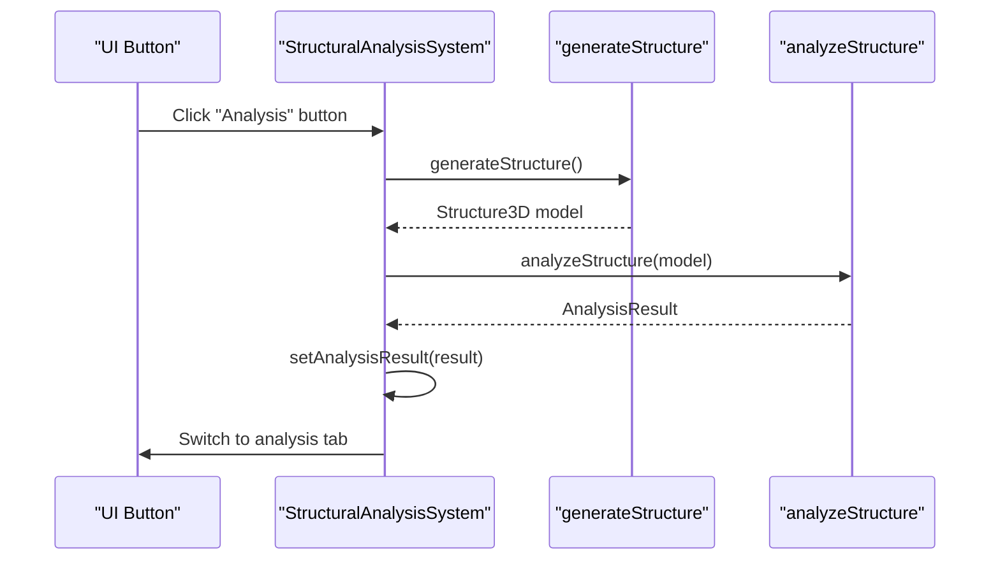
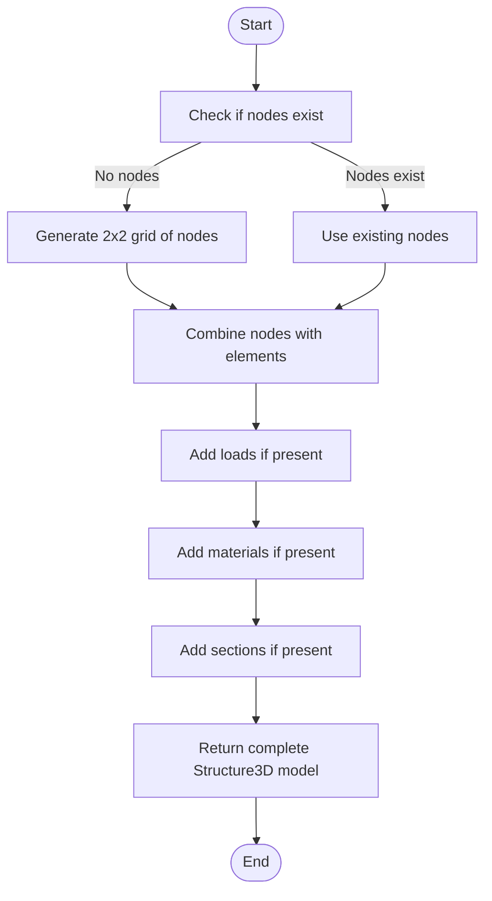
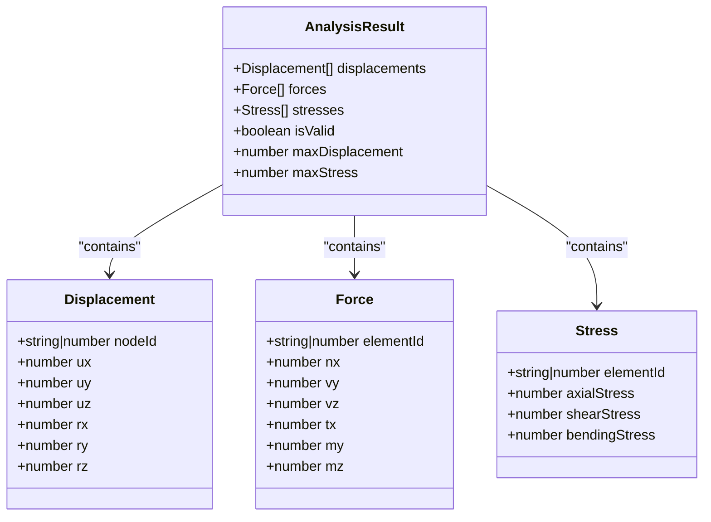
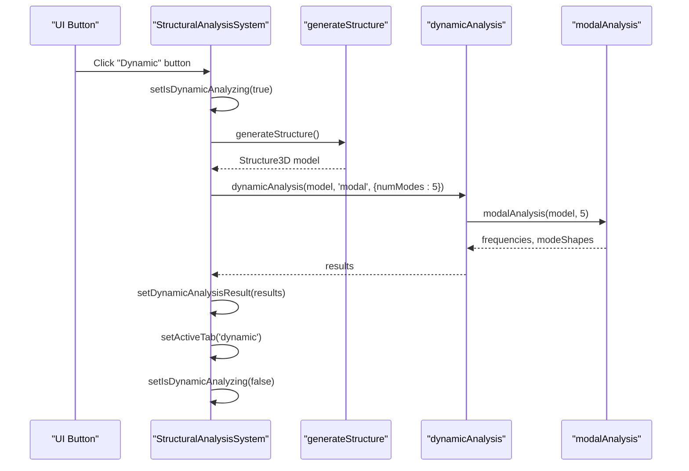
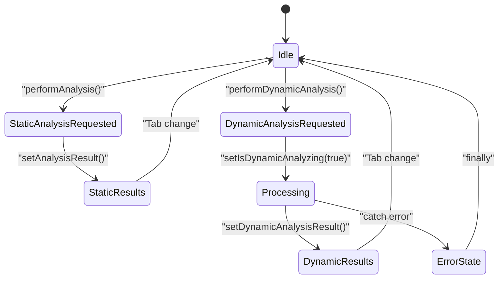
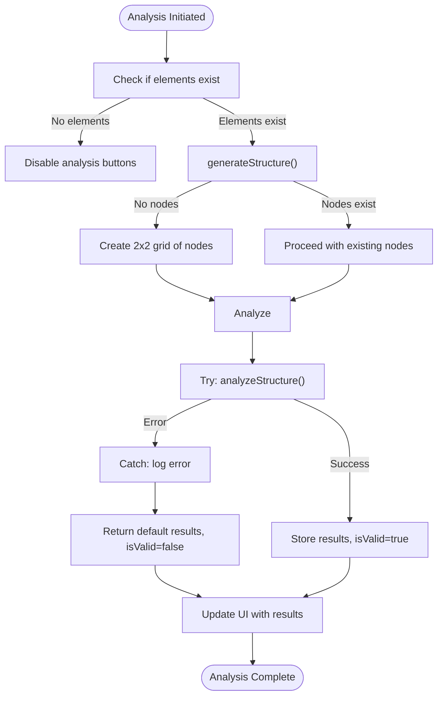

# Analysis Execution

<cite>
**Referenced Files in This Document**  
- [StructuralAnalysisSystem.tsx](file://src/structural-analysis/StructuralAnalysisSystem.tsx)
- [StructuralAnalyzer.ts](file://src/structural-analysis/analysis/StructuralAnalyzer.ts)
- [DynamicAnalyzer.ts](file://src/structural-analysis/analysis/DynamicAnalyzer.ts)
- [DynamicAnalysisResults.tsx](file://src/structural-analysis/DynamicAnalysisResults.tsx)
- [structural.ts](file://src/types/structural.ts)
</cite>

## Table of Contents
1. [Introduction](#introduction)
2. [Core Analysis Functions](#core-analysis-functions)
3. [Structure Preparation](#structure-preparation)
4. [Analysis Result Domain Model](#analysis-result-domain-model)
5. [Dynamic Analysis Implementation](#dynamic-analysis-implementation)
6. [State Management and UI Integration](#state-management-and-ui-integration)
7. [Error Handling and Edge Cases](#error-handling-and-edge-cases)
8. [Performance Considerations](#performance-considerations)
9. [Conclusion](#conclusion)

## Introduction

The Analysis Execution functionality in the Structural Analysis System provides comprehensive tools for evaluating structural integrity through both static and dynamic analysis methods. This document details the implementation of key analysis functions, their integration with the user interface, and the underlying data models that represent analysis results. The system is designed to be accessible to beginners while providing sufficient technical depth for experienced developers, with clear state management and error handling throughout the analysis workflow.

## Core Analysis Functions

The Structural Analysis System implements two primary analysis functions: `performAnalysis` for static analysis and `performDynamicAnalysis` for dynamic analysis. These functions serve as the main entry points for structural evaluation and are directly accessible through the application's tab interface.

The `performAnalysis` function orchestrates the static analysis process by first generating a complete structure model using the `generateStructure` utility, then invoking the `analyzeStructure` function from the StructuralAnalyzer module to compute displacements, forces, and stresses. The results are stored in component state and the UI automatically navigates to the analysis results tab.

**Diagram sources**  
- [StructuralAnalysisSystem.tsx](file://src/structural-analysis/StructuralAnalysisSystem.tsx#L203-L208)

**Section sources**  
- [StructuralAnalysisSystem.tsx](file://src/structural-analysis/StructuralAnalysisSystem.tsx#L203-L208)

## Structure Preparation

The `generateStructure` utility function plays a critical role in preparing the Structure3D model for analysis by ensuring all necessary components are present. When the current structure lacks nodes, the function automatically generates a default 2x2 grid of nodes to enable visualization and analysis. This prevents analysis failures due to incomplete structural definitions.

The function preserves existing structure data while supplementing missing components with defaults. It ensures that nodes, elements, loads, materials, and sections are all properly populated in the returned Structure3D object, providing a complete model for the analysis engines to process.

**Diagram sources**  
- [StructuralAnalysisSystem.tsx](file://src/structural-analysis/StructuralAnalysisSystem.tsx#L170-L200)

**Section sources**  
- [StructuralAnalysisSystem.tsx](file://src/structural-analysis/StructuralAnalysisSystem.tsx#L170-L200)

## Analysis Result Domain Model

The system defines a comprehensive domain model for representing analysis results through the `AnalysisResult` interface. This model captures three primary categories of structural response: displacements, internal forces, and stresses.

Displacements are recorded for each node with six degrees of freedom (UX, UY, UZ, RX, RY, RZ), representing translations and rotations in three-dimensional space. Internal forces are captured for each element with axial force (Nx), shear forces (Vy, Vz), torsion (Tx), and bending moments (My, Mz). Stresses include axial, shear, and bending components for structural assessment.

The model also includes summary metrics such as maximum displacement and stress values, along with a validity flag that indicates whether the structure meets basic safety criteria based on displacement and stress thresholds.

**Diagram sources**  
- [structural.ts](file://src/types/structural.ts#L101-L129)

**Section sources**  
- [structural.ts](file://src/types/structural.ts#L101-L129)

## Dynamic Analysis Implementation

The dynamic analysis functionality is implemented through a modular architecture that supports multiple analysis types, with modal analysis as the primary implemented method. The `performDynamicAnalysis` function serves as the controller, managing the asynchronous analysis process and state transitions.

When invoked, the function sets the `isDynamicAnalyzing` flag to true, preventing concurrent analysis requests. It then generates the structure model and calls the `dynamicAnalysis` function with 'modal' as the analysis type and configuration options including the number of modes to calculate. Upon completion, the results are stored in component state and the UI navigates to the dynamic analysis tab.

The underlying `dynamicAnalysis` function acts as a dispatcher, routing requests to specific analysis implementations based on the requested analysis type. Currently, modal analysis is fully implemented, while response spectrum analysis is partially implemented, and time history analysis remains unimplemented.

**Diagram sources**  
- [StructuralAnalysisSystem.tsx](file://src/structural-analysis/StructuralAnalysisSystem.tsx#L211-L223)
- [DynamicAnalyzer.ts](file://src/structural-analysis/analysis/DynamicAnalyzer.ts#L179-L204)

**Section sources**  
- [StructuralAnalysisSystem.tsx](file://src/structural-analysis/StructuralAnalysisSystem.tsx#L211-L223)
- [DynamicAnalyzer.ts](file://src/structural-analysis/analysis/DynamicAnalyzer.ts#L179-L204)

## State Management and UI Integration

The system employs React's useState hook to manage analysis state, with dedicated state variables for both static and dynamic analysis results. The `analysisResult` state holds the output of static analysis, while `dynamicAnalysisResult` stores dynamic analysis outcomes. A loading state `isDynamicAnalyzing` provides visual feedback during computation-intensive dynamic analysis.

UI components are conditionally rendered based on analysis state. When `isDynamicAnalyzing` is true, a loading spinner is displayed. Once results are available, the DynamicAnalysisResults component renders detailed visualizations of natural frequencies and mode shapes using Recharts for data visualization.

The analysis buttons are disabled when no structural elements exist or when dynamic analysis is in progress, preventing invalid operations. The UI automatically navigates to the appropriate results tab upon successful analysis completion, creating a seamless user experience.

**Section sources**  
- [StructuralAnalysisSystem.tsx](file://src/structural-analysis/StructuralAnalysisSystem.tsx#L142-L153)
- [DynamicAnalysisResults.tsx](file://src/structural-analysis/DynamicAnalysisResults.tsx#L0-L289)

## Error Handling and Edge Cases

The system implements comprehensive error handling to manage various edge cases and failure scenarios. When no structural elements exist, the analysis buttons are disabled to prevent invalid analysis requests. For empty structures lacking nodes, the `generateStructure` function automatically creates a default node grid to enable analysis.

The `analyzeStructure` function includes a try-catch block that ensures graceful degradation when analysis fails. In error scenarios, the function returns a default result with zero displacements and forces, maintaining application stability. The validity flag is set to false, and maximum displacement and stress values are set to zero, providing clear feedback about the analysis failure.

Dynamic analysis errors are caught in the `performDynamicAnalysis` function's try-catch block, with errors logged to the console. The `finally` clause ensures that the `isDynamicAnalyzing` flag is reset regardless of success or failure, preventing the UI from remaining in a loading state after errors.

**Section sources**  
- [StructuralAnalysisSystem.tsx](file://src/structural-analysis/StructuralAnalysisSystem.tsx#L170-L200)
- [StructuralAnalyzer.ts](file://src/structural-analysis/analysis/StructuralAnalyzer.ts#L414-L560)

## Performance Considerations

The system addresses performance considerations through several strategies, particularly for computationally intensive dynamic analysis. The `isDynamicAnalyzing` state flag serves as both a UI indicator and a concurrency control mechanism, preventing multiple simultaneous analysis requests that could overwhelm system resources.

For large structural models, the analysis algorithms have polynomial time complexity due to matrix operations involved in stiffness matrix assembly and system solving. The static analysis involves O(n²) operations for stiffness matrix assembly and O(n³) for system solving, where n is the number of degrees of freedom.

The dynamic analysis is even more computationally intensive, requiring eigenvalue decomposition with O(n³) complexity. To mitigate performance issues, the system limits the number of modes calculated in modal analysis to a reasonable default (5 modes), which can be adjusted based on model complexity and performance requirements.

The UI implements loading states and visual feedback during analysis computation, improving perceived performance by providing clear status updates to users during potentially lengthy calculations.

**Section sources**  
- [StructuralAnalysisSystem.tsx](file://src/structural-analysis/StructuralAnalysisSystem.tsx#L153-L153)
- [DynamicAnalyzer.ts](file://src/structural-analysis/analysis/DynamicAnalyzer.ts#L81-L123)

## Conclusion

The Analysis Execution functionality in the Structural Analysis System provides a robust framework for evaluating structural performance through both static and dynamic methods. The implementation demonstrates thoughtful design with clear separation of concerns between structure preparation, analysis computation, and results presentation.

Key strengths include the automatic handling of incomplete structures through default node generation, comprehensive error handling that maintains application stability, and effective state management that provides clear user feedback. The domain model for analysis results is well-structured and captures essential structural response parameters.

For future development, implementing the remaining dynamic analysis types (response spectrum and time history) would enhance the system's capabilities. Additionally, optimizing the matrix solving algorithms and implementing web workers for analysis computation could improve performance for large models, allowing the main thread to remain responsive during intensive calculations.