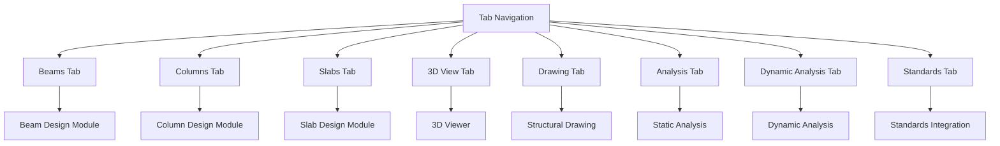
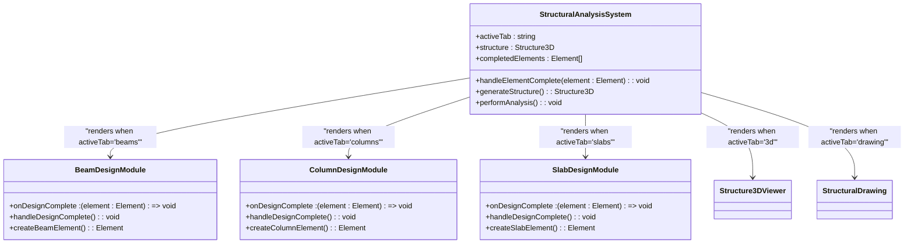
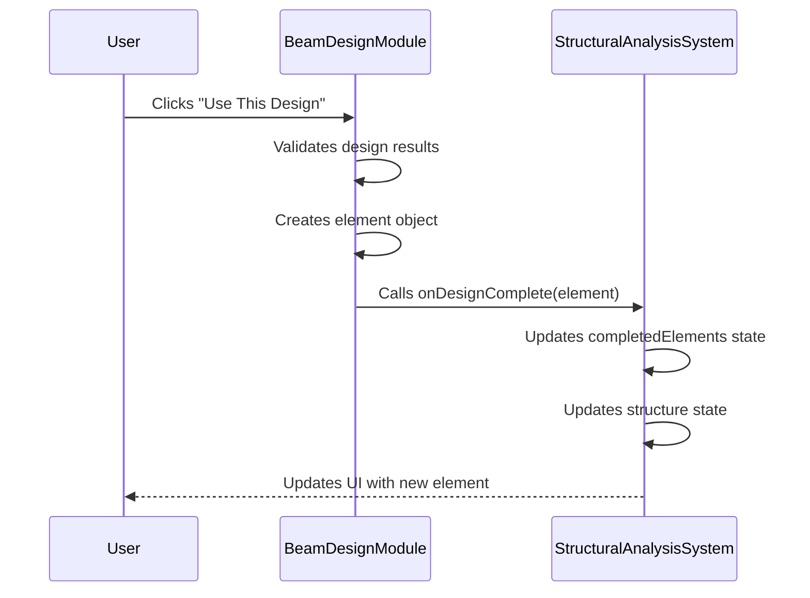
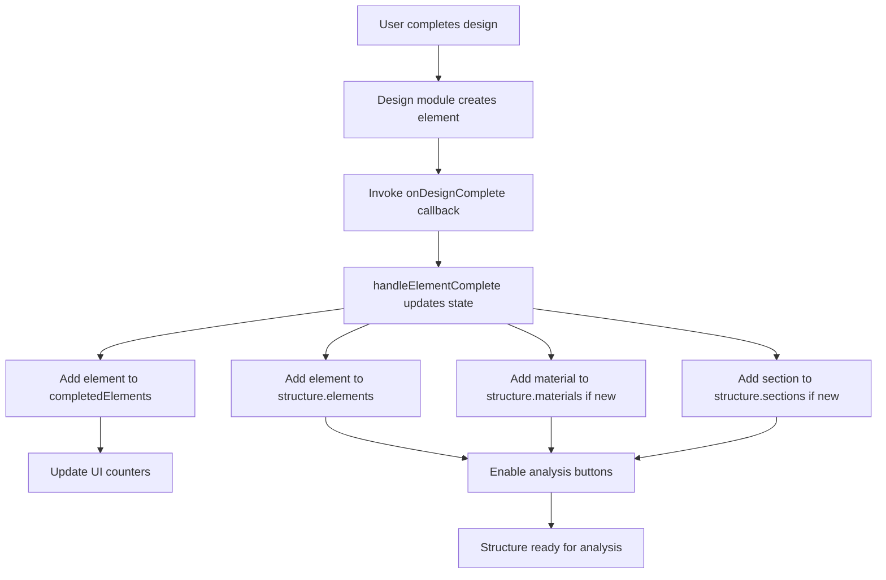
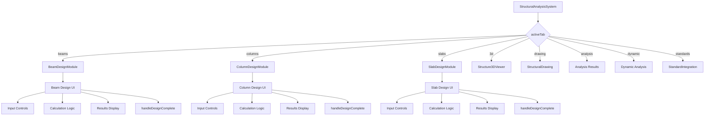

# Design Integration

<cite>
**Referenced Files in This Document**   
- [StructuralAnalysisSystem.tsx](file://src/structural-analysis/StructuralAnalysisSystem.tsx)
- [BeamDesignModule.tsx](file://src/structural-analysis/design/BeamDesignModule.tsx)
- [ColumnDesignModule.tsx](file://src/structural-analysis/design/ColumnDesignModule.tsx)
- [SlabDesignModule.tsx](file://src/structural-analysis/design/SlabDesignModule.tsx)
- [structural.ts](file://src/types/structural.ts)
</cite>

## Table of Contents
1. [Introduction](#introduction)
2. [Tab-Based Interface Architecture](#tab-based-interface-architecture)
3. [Design Module Integration](#design-module-integration)
4. [Callback Pattern Implementation](#callback-pattern-implementation)
5. [Data Flow and State Management](#data-flow-and-state-management)
6. [Component Composition and Conditional Rendering](#component-composition-and-conditional-rendering)
7. [State Synchronization and Conflict Resolution](#state-synchronization-and-conflict-resolution)
8. [Best Practices for Design Integration](#best-practices-for-design-integration)

## Introduction

The Design Integration module within the Structural Analysis System provides a comprehensive framework for integrating beam, column, and slab design functionality into a unified structural analysis workflow. This document explains how these design modules are seamlessly integrated through a tab-based interface, enabling structural engineers to create and analyze building components within a single cohesive environment. The system employs a callback pattern to pass completed structural elements from individual design modules to the central application state, ensuring data consistency and enabling downstream analysis processes.

**Section sources**
- [StructuralAnalysisSystem.tsx](file://src/structural-analysis/StructuralAnalysisSystem.tsx#L1-L50)

## Tab-Based Interface Architecture

The Structural Analysis System implements a tab-based navigation system that allows users to switch between different design modules and analysis views. The interface is organized into distinct tabs for beams, columns, slabs, 3D visualization, structural drawings, static analysis, dynamic analysis, and standards integration. This architecture provides a logical workflow where users can design individual structural elements and then transition to analysis and visualization tools.

The active tab state is managed through React's useState hook, with the `activeTab` variable determining which module is currently displayed. The tab navigation component renders buttons for each module, with visual feedback indicating the currently active tab. This design pattern provides an intuitive user experience by organizing complex functionality into discrete, focused workspaces.

**Diagram sources**
- [StructuralAnalysisSystem.tsx](file://src/structural-analysis/StructuralAnalysisSystem.tsx#L157-L167)

**Section sources**
- [StructuralAnalysisSystem.tsx](file://src/structural-analysis/StructuralAnalysisSystem.tsx#L157-L200)

## Design Module Integration

The beam, column, and slab design modules are integrated into the main system as independent but interoperable components. Each module is implemented as a separate React component file within the `src/structural-analysis/design/` directory, following a consistent design pattern while accommodating the specific requirements of each structural element type.

The integration is achieved through dynamic import statements in the main StructuralAnalysisSystem component, which imports the design modules and renders them conditionally based on the active tab. This modular approach allows each design module to be developed, tested, and maintained independently while ensuring they share a consistent interface with the main application.

**Diagram sources**
- [StructuralAnalysisSystem.tsx](file://src/structural-analysis/StructuralAnalysisSystem.tsx#L157-L167)
- [BeamDesignModule.tsx](file://src/structural-analysis/design/BeamDesignModule.tsx#L158-L627)
- [ColumnDesignModule.tsx](file://src/structural-analysis/design/ColumnDesignModule.tsx#L158-L611)
- [SlabDesignModule.tsx](file://src/structural-analysis/design/SlabDesignModule.tsx#L158-L584)

**Section sources**
- [StructuralAnalysisSystem.tsx](file://src/structural-analysis/StructuralAnalysisSystem.tsx#L157-L167)
- [BeamDesignModule.tsx](file://src/structural-analysis/design/BeamDesignModule.tsx#L158-L627)

## Callback Pattern Implementation

The system employs a callback pattern to pass completed structural elements from design modules to the central application state. This pattern is implemented through the `handleElementComplete` function defined in the StructuralAnalysisSystem component, which serves as the callback handler for all design modules.

Each design module accepts an `onDesignComplete` prop that is assigned to the `handleElementComplete` function. When a user completes a design and clicks the "Use This Design" button, the design module invokes this callback with the newly created element object. This approach follows the React principle of unidirectional data flow, where child components communicate with parent components through function props rather than directly modifying state.

The callback pattern ensures that element creation logic remains encapsulated within each design module while allowing the main system to maintain control over the global state. This separation of concerns enhances code maintainability and enables consistent state management across all design modules.

**Diagram sources**
- [StructuralAnalysisSystem.tsx](file://src/structural-analysis/StructuralAnalysisSystem.tsx#L157-L167)
- [BeamDesignModule.tsx](file://src/structural-analysis/design/BeamDesignModule.tsx#L158-L627)

**Section sources**
- [StructuralAnalysisSystem.tsx](file://src/structural-analysis/StructuralAnalysisSystem.tsx#L157-L167)
- [BeamDesignModule.tsx](file://src/structural-analysis/design/BeamDesignModule.tsx#L158-L627)

## Data Flow and State Management

The data flow in the Design Integration module follows a well-defined pattern that ensures consistency between the design modules and the central system state. When a user completes a design, the data flows from the design module through the callback function to the main application, where it is incorporated into the global structure state.

The system maintains two related state variables: `completedElements` which tracks all successfully designed elements, and `structure` which represents the complete structural model including nodes, elements, materials, and sections. When a new element is completed, it is added to both the `completedElements` array and the `structure.elements` array. Additionally, the element's material and section properties are extracted and added to the `structure.materials` and `structure.sections` arrays if they don't already exist.

This state management approach ensures that all structural data is centralized in the main component, preventing data duplication and inconsistency. The `generateStructure` function creates a complete structure object for analysis and visualization by combining the existing structure with generated nodes when necessary.

**Diagram sources**
- [StructuralAnalysisSystem.tsx](file://src/structural-analysis/StructuralAnalysisSystem.tsx#L157-L167)

**Section sources**
- [StructuralAnalysisSystem.tsx](file://src/structural-analysis/StructuralAnalysisSystem.tsx#L157-L167)

## Component Composition and Conditional Rendering

The Design Integration module demonstrates effective component composition through the conditional rendering of design modules based on the active tab. The main StructuralAnalysisSystem component acts as a container that orchestrates the rendering of child components according to the current application state.

Conditional rendering is implemented using React's JSX syntax with logical && operators and ternary expressions. When the `activeTab` state matches a specific module (e.g., 'beams'), the corresponding design module component is rendered within the designated content area. This approach avoids the performance overhead of mounting and unmounting components unnecessarily, as only the active module is rendered at any given time.

The component composition pattern enables a clean separation of concerns, where each design module is responsible for its own UI and business logic while the main system handles navigation, state management, and integration with other system components. This modular architecture facilitates code reuse and makes the system more maintainable and extensible.

**Diagram sources**
- [StructuralAnalysisSystem.tsx](file://src/structural-analysis/StructuralAnalysisSystem.tsx#L157-L167)

**Section sources**
- [StructuralAnalysisSystem.tsx](file://src/structural-analysis/StructuralAnalysisSystem.tsx#L157-L167)

## State Synchronization and Conflict Resolution

State synchronization between design modules and the main system is achieved through the callback pattern and centralized state management. However, potential issues can arise when multiple users or processes attempt to modify the structure state simultaneously, or when conflicting element definitions are introduced.

To address duplicate element definitions, the system could implement a unique identifier strategy where each element is assigned a UUID upon creation. Before adding a new element to the structure, the system would check for existing elements with the same ID and either update the existing element or reject the duplicate based on business rules.

For conflicting material or section definitions, the system currently adds materials and sections to the structure state without checking for duplicates. This could lead to redundant data in the materials and sections arrays. A more robust approach would involve checking for existing materials and sections with the same properties before adding new ones, updating references to use the existing definitions instead of creating duplicates.

The current implementation handles basic state synchronization effectively for single-user scenarios but would benefit from additional validation and conflict resolution mechanisms for collaborative environments or complex structural models with many interdependent elements.

**Section sources**
- [StructuralAnalysisSystem.tsx](file://src/structural-analysis/StructuralAnalysisSystem.tsx#L157-L167)
- [structural.ts](file://src/types/structural.ts#L1-L129)

## Best Practices for Design Integration

Based on the implementation of the Design Integration module, several best practices emerge for integrating design functionality into structural analysis systems:

1. **Use callback patterns for parent-child communication**: The `onDesignComplete` callback provides a clean interface between design modules and the main system, following React best practices for component communication.

2. **Centralize state management**: Maintaining structure state in the main component prevents data inconsistency and makes state updates predictable and traceable.

3. **Implement modular design**: Separating beam, column, and slab design into independent modules enhances code maintainability and allows for focused development and testing.

4. **Use consistent data structures**: The `Element`, `Material`, and `Section` interfaces defined in structural.ts provide a standardized format for structural data across all modules.

5. **Provide visual feedback**: The tab interface with active state indicators helps users understand their current context within the application workflow.

6. **Enable progressive disclosure**: Advanced options are hidden by default and can be revealed when needed, reducing cognitive load for new users while providing access to detailed controls for experienced users.

7. **Implement immediate validation**: Design modules validate inputs and display results in real-time, helping users identify and correct issues quickly.

These practices contribute to a robust, user-friendly design integration system that balances technical requirements with usability considerations.

**Section sources**
- [StructuralAnalysisSystem.tsx](file://src/structural-analysis/StructuralAnalysisSystem.tsx#L157-L167)
- [BeamDesignModule.tsx](file://src/structural-analysis/design/BeamDesignModule.tsx#L158-L627)