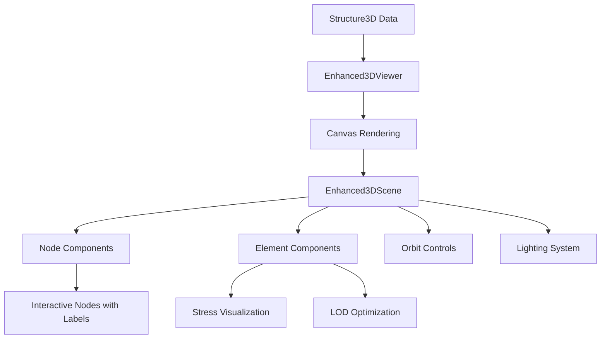
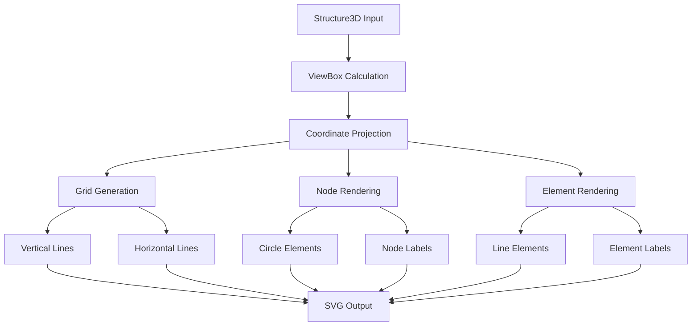
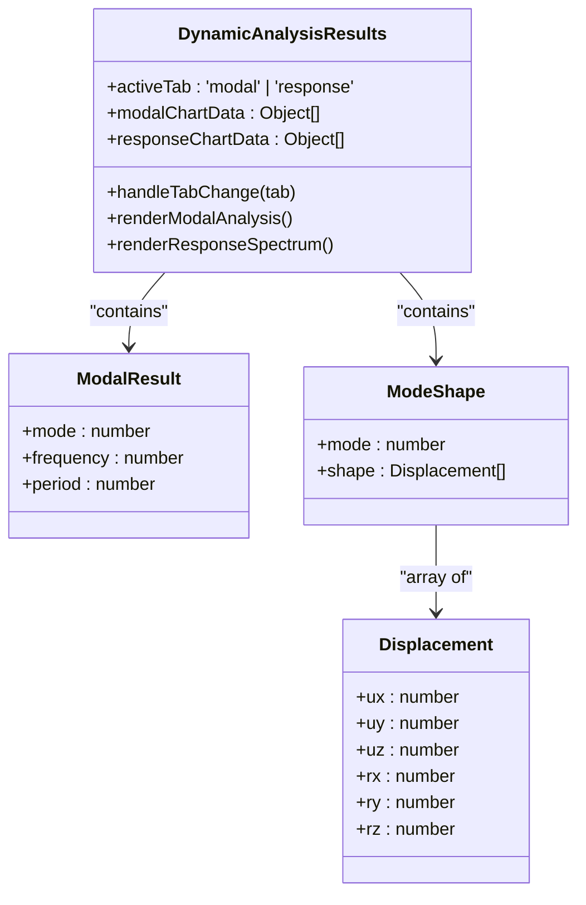
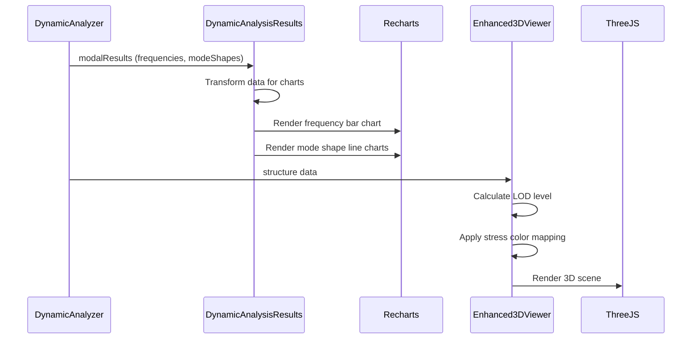

# Results Visualization

<cite>
**Referenced Files in This Document**   
- [Structure3DViewer.tsx](file://src/structural-analysis/Structure3DViewer.tsx)
- [Enhanced3DViewer.tsx](file://src/structural-analysis/advanced-3d/Enhanced3DViewer.tsx)
- [StructuralDrawing.tsx](file://src/structural-analysis/drawing/StructuralDrawing.tsx)
- [DynamicAnalysisResults.tsx](file://src/structural-analysis/DynamicAnalysisResults.tsx)
- [structural.ts](file://src/types/structural.ts)
- [DynamicAnalyzer.ts](file://src/structural-analysis/analysis/DynamicAnalyzer.ts)
</cite>

## Table of Contents
1. [Introduction](#introduction)
2. [3D Viewer Implementation](#3d-viewer-implementation)
3. [2D Drawing Component](#2d-drawing-component)
4. [Dynamic Analysis Results Display](#dynamic-analysis-results-display)
5. [Data Flow from Analysis to Visualization](#data-flow-from-analysis-to-visualization)
6. [User Interaction Patterns](#user-interaction-patterns)
7. [Common Issues and Solutions](#common-issues-and-solutions)
8. [Performance Optimization](#performance-optimization)
9. [Conclusion](#conclusion)

## Introduction
The Results Visualization system provides comprehensive tools for interpreting structural analysis outcomes through three primary components: the 3D Viewer, 2D Drawing, and Dynamic Analysis Results. These components are integrated into a tab-based interface that allows users to seamlessly switch between different visualization modes. The system consumes generated structure data defined by the Structure3D interface, which includes nodes, elements, loads, materials, and sections. Each visualization component transforms this data into meaningful representations that support structural interpretation and decision-making.

**Section sources**
- [structural.ts](file://src/types/structural.ts#L92-L98)

## 3D Viewer Implementation
The 3D Viewer component renders structural models using different approaches depending on complexity requirements. The basic Structure3DViewer uses SVG-based rendering for simple visualization, while the Enhanced3DViewer leverages React Three Fiber and Three.js for advanced 3D rendering with interactive controls.

The Structure3DViewer implements a simple orthographic projection that maps 3D coordinates to 2D SVG space, displaying nodes as circles and elements as lines with different colors based on element type (column, beam, or other). The component calculates an appropriate viewBox based on structure bounds and includes a coordinate grid for reference.

For more sophisticated visualization, the Enhanced3DViewer provides a complete 3D environment with orbit controls, lighting, shadows, and multiple visualization modes (solid, wireframe, or both). It implements Level of Detail (LOD) techniques that adjust geometry complexity based on camera distance and structure size, improving performance with large models. The viewer supports interactive features such as element selection, hover tooltips with detailed information, stress visualization with color gradients, and animation capabilities for time-series analysis results.

**Diagram sources**
- [Enhanced3DViewer.tsx](file://src/structural-analysis/advanced-3d/Enhanced3DViewer.tsx#L450-L870)
- [Structure3DViewer.tsx](file://src/structural-analysis/Structure3DViewer.tsx#L9-L173)

**Section sources**
- [Enhanced3DViewer.tsx](file://src/structural-analysis/advanced-3d/Enhanced3DViewer.tsx#L450-L870)
- [Structure3DViewer.tsx](file://src/structural-analysis/Structure3DViewer.tsx#L9-L173)

## 2D Drawing Component
The StructuralDrawing component creates technical 2D drawings of structural systems using SVG rendering. It provides a top-down view of the structure with labeled nodes and elements, making it suitable for documentation and engineering drawings.

The component calculates an appropriate viewBox based on the structure's spatial bounds and implements a coordinate projection system that maps 3D coordinates to 2D space. Nodes are rendered as circles with ID labels positioned above them, while elements are displayed as lines with ID labels centered along their length. The drawing includes a dynamic grid system that aligns with the structure's coordinate system, with vertical and horizontal lines spaced at 1-meter intervals.

Element types are visually differentiated through color coding: beams use a medium gray-blue (#94a3b8), columns use a darker gray-blue (#64748b), and slabs use a light gray (#9ca3af). The component handles edge cases such as empty structures by displaying a placeholder message with an explanatory icon. The responsive design ensures the drawing scales appropriately within its container while maintaining aspect ratio through SVG's preserveAspectRatio property.

**Diagram sources**
- [StructuralDrawing.tsx](file://src/structural-analysis/drawing/StructuralDrawing.tsx#L9-L211)

**Section sources**
- [StructuralDrawing.tsx](file://src/structural-analysis/drawing/StructuralDrawing.tsx#L9-L211)

## Dynamic Analysis Results Display
The DynamicAnalysisResults component visualizes outcomes from dynamic structural analysis, including modal frequencies, mode shapes, and response spectrum analysis. The component implements a tabbed interface that allows users to switch between modal analysis and response spectrum results.

For modal analysis, the component displays natural frequencies in both tabular and chart form, showing mode number, frequency (in Hz), and period (in seconds). A bar chart visualizes the frequency distribution across different modes. Mode shapes are represented using line charts that show displacement patterns (UX, UY, UZ) across nodes for the first four modes, with displacements scaled to millimeters for better readability.

The response spectrum analysis tab displays base shear, effective modal mass, spectral accelerations in a bar chart, and story forces in a tabular format. The component handles data transformation by converting force units from Newtons to kiloNewtons for display and includes appropriate unit labels. When no results are available, the component shows a placeholder message indicating the absence of dynamic analysis data.

**Diagram sources**
- [DynamicAnalysisResults.tsx](file://src/structural-analysis/DynamicAnalysisResults.tsx#L49-L287)

**Section sources**
- [DynamicAnalysisResults.tsx](file://src/structural-analysis/DynamicAnalysisResults.tsx#L49-L287)

## Data Flow from Analysis to Visualization
The visualization system follows a clear data flow from analysis results to visual representation. The DynamicAnalyzer generates modal analysis results containing frequencies and mode shapes, which are then consumed by the DynamicAnalysisResults component. The modal frequencies are transformed into chart data format with mode labels, while mode shape displacements are scaled from meters to millimeters for better visualization.

For 3D and 2D visualizations, the Structure3D data flows directly from the analysis system to the viewer components. The Structure3D interface defines the core data structure with nodes, elements, and associated properties. The visualization components extract coordinate data (x, y, z) from nodes and connectivity information from elements to render the structural model. Element properties such as type, material, and section are used to determine visual characteristics like color and thickness.

The Enhanced3DViewer implements additional data transformations for advanced visualization, including stress-based color mapping, LOD calculations based on camera distance, and animation state management for time-series data. The component uses React's useMemo and useCallback hooks to optimize performance by preventing unnecessary recalculations and re-renders.

**Diagram sources**
- [DynamicAnalyzer.ts](file://src/structural-analysis/analysis/DynamicAnalyzer.ts#L100-L204)
- [DynamicAnalysisResults.tsx](file://src/structural-analysis/DynamicAnalysisResults.tsx#L49-L287)
- [Enhanced3DViewer.tsx](file://src/structural-analysis/advanced-3d/Enhanced3DViewer.tsx#L450-L870)

**Section sources**
- [DynamicAnalyzer.ts](file://src/structural-analysis/analysis/DynamicAnalyzer.ts#L100-L204)

## User Interaction Patterns
The visualization components implement consistent user interaction patterns across different view types. In the 3D Viewer, users can rotate, pan, and zoom the model using orbit controls, with visual feedback provided through hover effects and selection states. Clicking on elements triggers callbacks that can be used for detailed inspection or property editing.

The Enhanced3DViewer includes a comprehensive control panel with toggles for labels, stress visualization, and grid display, as well as sliders for adjusting node scale. The component supports animation controls for time-series data, allowing users to play, pause, and scrub through different time steps. Interactive tooltips display detailed information about nodes and elements when hovered, including coordinates, dimensions, material properties, and stress values.

For the DynamicAnalysisResults component, users can switch between analysis types using tab buttons and interact with charts through tooltips that display precise values. The 2D Drawing component provides a static but information-rich view with clearly labeled elements and a coordinate grid that aids in spatial understanding. All components handle edge cases gracefully, displaying informative messages when no data is available rather than failing silently.

**Section sources**
- [Enhanced3DViewer.tsx](file://src/structural-analysis/advanced-3d/Enhanced3DViewer.tsx#L450-L870)
- [DynamicAnalysisResults.tsx](file://src/structural-analysis/DynamicAnalysisResults.tsx#L49-L287)

## Common Issues and Solutions
Several common issues arise in structural visualization, particularly with complex models. Rendering performance can degrade with large structures due to the high number of vertices and draw calls. The Enhanced3DViewer addresses this through LOD implementation, frustum culling, and optimized geometry generation that reduces polygon count for distant or complex models.

Coordinate system alignment between analysis and visualization is maintained by using consistent 3D coordinate systems (X, Y, Z) across all components. The orthographic projection used in 2D views preserves spatial relationships, while the 3D viewer maintains the original coordinate system with appropriate axis labeling.

Display accuracy of mode shapes is ensured by proper scaling of displacement values and consistent node ordering in the visualization. The system handles missing or invalid data through validation functions that correct common issues and provide warnings rather than failing. For example, the StructureViewer includes a validation system that checks structure integrity before rendering and displays warnings for potential issues.

**Section sources**
- [Enhanced3DViewer.tsx](file://src/structural-analysis/advanced-3d/Enhanced3DViewer.tsx#L450-L870)
- [StructureViewer.tsx](file://src/structural-analysis/advanced-3d/StructureViewer.tsx#L100-L580)

## Performance Optimization
To maintain responsive visualization with large structural datasets, several optimization techniques are implemented. The Enhanced3DViewer uses React.memo to prevent unnecessary re-renders of node and element components, and useMemo to cache expensive calculations like bounding box and center point. The LOD system dynamically adjusts geometry complexity based on camera distance and model size, reducing rendering load for distant views.

Frustum culling is enabled for all mesh objects, ensuring that only visible elements are processed by the rendering pipeline. The component uses efficient data structures and minimizes state updates during animation sequences. For 2D visualizations, the SVG-based approach provides good performance even with moderately complex structures, as SVG rendering is hardware-accelerated in modern browsers.

Additional optimizations include debounced resize handling, efficient event propagation with stopPropagation, and proper cleanup of animation frames to prevent memory leaks. The system also implements error boundaries to isolate rendering issues and prevent application crashes during visualization.

**Section sources**
- [Enhanced3DViewer.tsx](file://src/structural-analysis/advanced-3d/Enhanced3DViewer.tsx#L450-L870)
- [Structure3DViewer.tsx](file://src/structural-analysis/Structure3DViewer.tsx#L9-L173)

## Conclusion
The Results Visualization system provides a comprehensive suite of tools for interpreting structural analysis outcomes through multiple complementary views. The integration of 3D, 2D, and dynamic analysis visualization components into a cohesive interface enables engineers to thoroughly understand structural behavior from different perspectives. By leveraging modern visualization libraries and implementing performance optimizations, the system delivers responsive and accurate representations even for complex structural models. The consistent data flow from analysis to visualization ensures that results are presented accurately and meaningfully, supporting informed decision-making in structural engineering workflows.