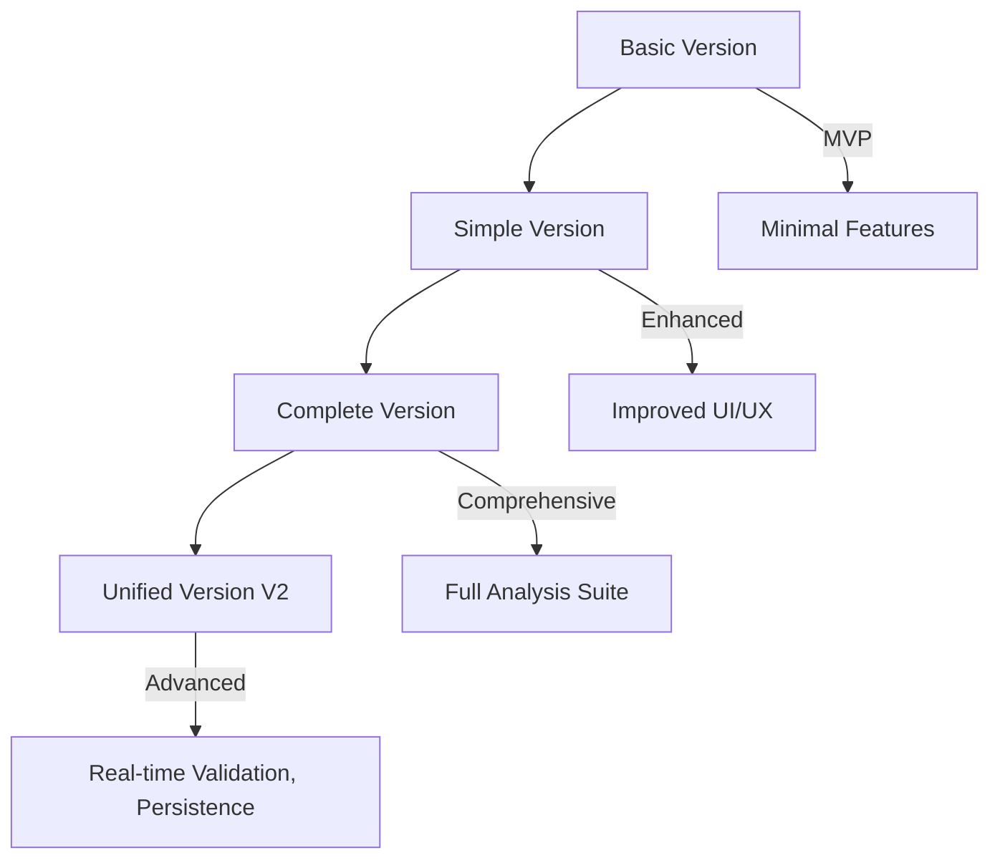
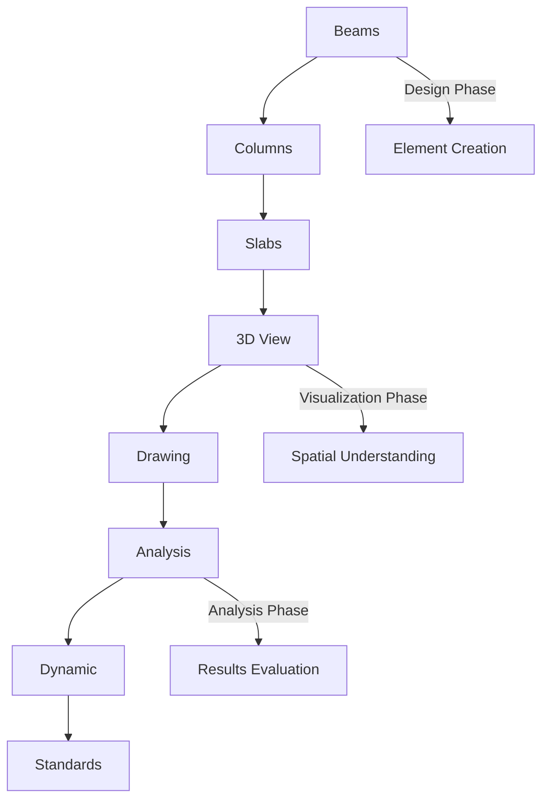
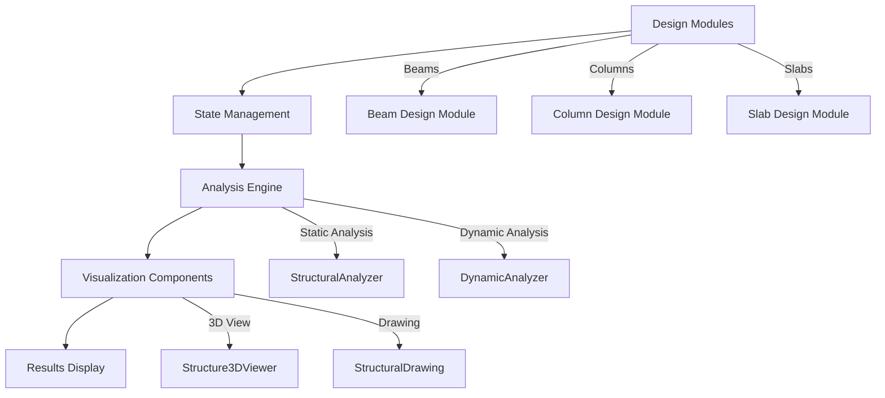

# Structural Analysis System

<cite>
**Referenced Files in This Document**   
- [StructuralAnalysisSystem.tsx](file://src/structural-analysis/StructuralAnalysisSystem.tsx)
- [BasicStructuralAnalysisSystem.tsx](file://src/structural-analysis/BasicStructuralAnalysisSystem.tsx)
- [SimpleStructuralAnalysisSystem.tsx](file://src/structural-analysis/SimpleStructuralAnalysisSystem.tsx)
- [CompleteStructuralAnalysisSystem.clean.tsx](file://src/structural-analysis/CompleteStructuralAnalysisSystem.clean.tsx)
- [CompleteStructuralAnalysisSystemV2.tsx](file://src/structural-analysis/CompleteStructuralAnalysisSystemV2.tsx)
- [StructuralAnalyzer.ts](file://src/structural-analysis/analysis/StructuralAnalyzer.ts)
- [DynamicAnalyzer.ts](file://src/structural-analysis/analysis/DynamicAnalyzer.ts)
- [structural.ts](file://src/types/structural.ts)
- [README.md](file://README.md)
- [ANALYSIS_IMPROVEMENTS.md](file://ANALYSIS_IMPROVEMENTS.md)
- [DYNAMIC_ANALYSIS_FEATURES.md](file://DYNAMIC_ANALYSIS_FEATURES.md)
- [IMPLEMENTATION_SUMMARY.md](file://IMPLEMENTATION_SUMMARY.md)
</cite>

## Table of Contents
1. [Introduction](#introduction)
2. [System Evolution](#system-evolution)
3. [Tab-Based Interface Design](#tab-based-interface-design)
4. [Integration Points](#integration-points)
5. [State Management Pattern](#state-management-pattern)
6. [Error Handling and Validation](#error-handling-and-validation)
7. [Usage Examples](#usage-examples)
8. [Performance Considerations](#performance-considerations)
9. [Relationship with Backup Versions](#relationship-with-backup-versions)
10. [Conclusion](#conclusion)

## Introduction

The Structural Analysis System serves as the primary interface for structural engineering calculations in APP-STRUKTUR-BLACKBOX. This comprehensive system enables engineers to design, analyze, and visualize structural elements for building construction. The system has evolved through multiple versions, each offering enhanced capabilities for structural analysis, from basic calculations to comprehensive dynamic analysis. The interface provides a seamless workflow for structural engineers, integrating design modules, analysis engines, and visualization components into a unified platform.

**Section sources**
- [README.md](file://README.md#L1-L177)

## System Evolution

The Structural Analysis System has progressed through four distinct versions, each representing a significant advancement in functionality and user experience. The Basic version provides fundamental structural analysis capabilities with minimal features, serving as an MVP (Minimum Viable Product) for initial testing and validation. The Simple version expands on this foundation with additional input parameters and improved user interface elements, offering a more functional experience for structural analysis.

The Complete version represents a comprehensive solution with full-featured analysis capabilities, including advanced input forms, detailed results display, and export functionality. This version incorporates robust error handling and validation mechanisms to ensure data integrity throughout the analysis process. The Unified version (V2) further enhances the system with localStorage persistence, real-time validation feedback, and a more sophisticated tab-based navigation system that streamlines the user workflow.

Each version builds upon the previous one, incorporating user feedback and technical improvements to create a more powerful and user-friendly structural analysis tool. The evolution reflects a progression from basic calculation capabilities to a comprehensive engineering platform that supports the entire structural analysis workflow.

**Diagram sources**
- [BasicStructuralAnalysisSystem.tsx](file://src/structural-analysis/BasicStructuralAnalysisSystem.tsx#L82-L486)
- [SimpleStructuralAnalysisSystem.tsx](file://src/structural-analysis/SimpleStructuralAnalysisSystem.tsx#L89-L511)
- [CompleteStructuralAnalysisSystem.clean.tsx](file://src/structural-analysis/CompleteStructuralAnalysisSystem.clean.tsx#L28-L288)
- [CompleteStructuralAnalysisSystemV2.tsx](file://src/structural-analysis/CompleteStructuralAnalysisSystemV2.tsx#L142-L628)

**Section sources**
- [BasicStructuralAnalysisSystem.tsx](file://src/structural-analysis/BasicStructuralAnalysisSystem.tsx#L82-L486)
- [SimpleStructuralAnalysisSystem.tsx](file://src/structural-analysis/SimpleStructuralAnalysisSystem.tsx#L89-L511)
- [CompleteStructuralAnalysisSystem.clean.tsx](file://src/structural-analysis/CompleteStructuralAnalysisSystem.clean.tsx#L28-L288)
- [CompleteStructuralAnalysisSystemV2.tsx](file://src/structural-analysis/CompleteStructuralAnalysisSystemV2.tsx#L142-L628)

## Tab-Based Interface Design

The Structural Analysis System employs a tab-based interface design that guides users through a logical workflow for structural analysis. The interface is organized into multiple tabs, each representing a distinct phase of the analysis process. The primary tabs include Beams, Columns, and Slabs for structural element design, followed by 3D View and Drawing for visualization, and Analysis and Dynamic for computational results.

The tab navigation system provides a clear progression through the analysis workflow, starting with element design and culminating in comprehensive analysis results. Each tab contains specialized components relevant to its function, such as design modules for structural elements, 3D visualization for spatial understanding, and detailed results displays for analysis outcomes. The interface also includes a Standards tab that integrates compliance checking with relevant building codes and standards.

The tab-based design enhances usability by breaking down the complex structural analysis process into manageable sections, allowing users to focus on one aspect at a time. The interface provides visual feedback on progress, with a summary section that displays the number of elements designed and enables navigation to the analysis phase when sufficient data has been entered.

**Diagram sources**
- [StructuralAnalysisSystem.tsx](file://src/structural-analysis/StructuralAnalysisSystem.tsx#L142-L524)

**Section sources**
- [StructuralAnalysisSystem.tsx](file://src/structural-analysis/StructuralAnalysisSystem.tsx#L142-L524)

## Integration Points

The Structural Analysis System integrates multiple components to create a cohesive engineering platform. The design modules for beams, columns, and slabs serve as entry points for structural element creation, with each module handling specific design parameters and calculations for its respective element type. These design modules communicate with the central state management system, updating the structural model as elements are designed and completed.

The analysis engine represents a critical integration point, connecting the designed structural elements with computational algorithms for static and dynamic analysis. The system utilizes a stiffness matrix method for structural analysis, processing the 3D structure data to calculate displacements, forces, and stresses throughout the structure. This analysis engine integrates with both the design modules and visualization components, ensuring consistency between the designed model and its analytical representation.

Visualization components form another key integration point, transforming the structural data into interactive 3D representations and 2D drawings. The 3D viewer component renders the structure based on node and element data, while the drawing component generates technical drawings for documentation purposes. These visualization tools are tightly coupled with the analysis results, allowing users to explore both the geometric and analytical aspects of their structural models.

**Diagram sources**
- [StructuralAnalysisSystem.tsx](file://src/structural-analysis/StructuralAnalysisSystem.tsx#L142-L524)
- [StructuralAnalyzer.ts](file://src/structural-analysis/analysis/StructuralAnalyzer.ts#L1-L762)
- [DynamicAnalyzer.ts](file://src/structural-analysis/analysis/DynamicAnalyzer.ts#L1-L205)

**Section sources**
- [StructuralAnalysisSystem.tsx](file://src/structural-analysis/StructuralAnalysisSystem.tsx#L142-L524)
- [StructuralAnalyzer.ts](file://src/structural-analysis/analysis/StructuralAnalyzer.ts#L1-L762)
- [DynamicAnalyzer.ts](file://src/structural-analysis/analysis/DynamicAnalyzer.ts#L1-L205)

## State Management Pattern

The Structural Analysis System employs a centralized state management pattern to maintain consistency across the application. The core state includes the active tab selection, structural data (nodes, elements, loads, materials, and sections), completed elements, and analysis results. This state is managed using React's useState hook, with individual state variables for different aspects of the system.

The state management pattern follows a unidirectional data flow, where user interactions trigger state updates that propagate through the system. When a user completes the design of a structural element in one of the design modules, the handleElementComplete callback updates both the completed elements list and the main structure state. This ensures that all components have access to the most current structural data for analysis and visualization.

For more complex versions of the system, additional state management features are implemented, including localStorage persistence in the Unified version. This allows users to save their progress between sessions, maintaining the integrity of their structural models across application restarts. The state management system also handles analysis results, storing both static and dynamic analysis outcomes for display and further processing.

The pattern includes specialized functions for generating the complete 3D structure from the current state, ensuring that visualization and analysis components receive consistent data regardless of the input method or design phase.

**Section sources**
- [StructuralAnalysisSystem.tsx](file://src/structural-analysis/StructuralAnalysisSystem.tsx#L142-L524)
- [CompleteStructuralAnalysisSystemV2.tsx](file://src/structural-analysis/CompleteStructuralAnalysisSystemV2.tsx#L142-L628)

## Error Handling and Validation

The Structural Analysis System implements comprehensive error handling and validation mechanisms to ensure data integrity and provide meaningful feedback to users. The system employs ErrorBoundary components at multiple levels, including StructuralAnalysisErrorBoundary, FormErrorBoundary, and VisualizationErrorBoundary, to gracefully handle errors in different parts of the application.

Validation occurs at multiple stages of the analysis workflow. Input forms include real-time validation that checks parameter ranges and relationships between variables, providing immediate feedback to users. Before analysis execution, the system performs structural validation to verify that the model is complete and consistent, checking for required geometry, materials, and loads.

During analysis execution, the system implements robust error handling in the calculation algorithms, with try-catch blocks surrounding critical operations and fallback mechanisms for failed calculations. If an analysis fails, the system provides specific error messages that help users identify and correct the underlying issues. The Unified version includes enhanced validation with a validationResult state that tracks both errors and warnings, providing a comprehensive overview of the model's compliance with engineering requirements.

The error handling system also includes progress indicators and loading states to manage user expectations during potentially lengthy analysis operations, preventing user frustration and interface lockups.

**Section sources**
- [BasicStructuralAnalysisSystem.tsx](file://src/structural-analysis/BasicStructuralAnalysisSystem.tsx#L82-L486)
- [SimpleStructuralAnalysisSystem.tsx](file://src/structural-analysis/SimpleStructuralAnalysisSystem.tsx#L89-L511)
- [CompleteStructuralAnalysisSystemV2.tsx](file://src/structural-analysis/CompleteStructuralAnalysisSystemV2.tsx#L142-L628)

## Usage Examples

The Structural Analysis System supports various common analysis scenarios, with frame structures and load combinations being primary use cases. For frame structure analysis, users can design beam and column elements through the respective design modules, with the system automatically generating a complete 3D structural model based on the designed elements. The analysis engine then calculates displacements, internal forces, and stresses throughout the frame, providing comprehensive results for evaluation.

For load combination scenarios, the system supports multiple load types including dead loads, live loads, wind loads, and seismic loads. Users can define these loads in the input forms, and the analysis engine automatically combines them according to relevant building codes and standards. The system calculates the effects of these combined loads on the structure, determining the maximum displacements and stresses under various loading conditions.

The Dynamic Analysis tab enables modal analysis of structures, calculating natural frequencies and mode shapes that are critical for seismic design. Users can perform modal analysis to determine the fundamental period of the structure and visualize the mode shapes, helping to identify potential dynamic issues in the design. The system also supports response spectrum analysis for seismic design, calculating base shear forces and story forces according to seismic design standards.

**Section sources**
- [StructuralAnalysisSystem.tsx](file://src/structural-analysis/StructuralAnalysisSystem.tsx#L142-L524)
- [DYNAMIC_ANALYSIS_FEATURES.md](file://DYNAMIC_ANALYSIS_FEATURES.md#L1-L167)

## Performance Considerations

The Structural Analysis System incorporates several performance optimizations to handle large structural models efficiently. For large models with many elements and nodes, the system implements lazy loading of components and code splitting to reduce initial load times and memory usage. The analysis algorithms are optimized for performance, using efficient matrix operations and numerical methods to solve the system of equations for structural analysis.

The Complete version includes a Performance Monitor component that tracks and displays performance metrics, helping users understand the computational demands of their models. The system also implements Web Workers for heavy calculations, offloading intensive computations from the main thread to maintain UI responsiveness during analysis operations.

For visualization of large models, the system employs optimized 3D rendering techniques, including level-of-detail rendering and selective element display, to maintain smooth interaction even with complex structures. The analysis engine includes optimizations for sparse matrix operations, reducing memory requirements and computation time for large-scale structural models.

The system also implements debouncing and throttling for user interactions that trigger expensive operations, preventing excessive recalculations during rapid input changes. These performance considerations ensure that the Structural Analysis System remains responsive and usable even with complex structural models.

**Section sources**
- [CompleteStructuralAnalysisSystem.clean.tsx](file://src/structural-analysis/CompleteStructuralAnalysisSystem.clean.tsx#L28-L288)
- [ANALYSIS_IMPROVEMENTS.md](file://ANALYSIS_IMPROVEMENTS.md#L1-L87)

## Relationship with Backup Versions

The Structural Analysis System maintains a clear relationship with backup versions in the repository, reflecting an evolutionary development process. The backup directory contains earlier iterations of the system, including BasicStructuralAnalysisSystem, SimpleStructuralAnalysisSystem, and various versions of the CompleteStructuralAnalysisSystem. These backup versions serve as historical references and fallback options, preserving the development history of the system.

The relationship between the current implementation and backup versions follows a progressive enhancement pattern, with each version building upon the previous one. The current StructuralAnalysisSystem in the src directory represents the main production version, incorporating the best features and improvements from the backup versions. The backup versions provide insight into the development trajectory, showing how features were iteratively added and refined over time.

This versioning strategy enables safe experimentation and development, allowing new features to be tested in backup versions before being integrated into the main system. It also provides a recovery mechanism, as developers can revert to earlier versions if issues arise in the current implementation. The presence of both clean and V2 versions of the CompleteStructuralAnalysisSystem indicates a parallel development approach, where multiple enhancement paths are explored simultaneously.

**Section sources**
- [backup/BasicStructuralAnalysisSystem.tsx](file://backup/BasicStructuralAnalysisSystem.tsx#L82-L486)
- [backup/SimpleStructuralAnalysisSystem.tsx](file://backup/SimpleStructuralAnalysisSystem.tsx#L89-L511)
- [backup/CompleteStructuralAnalysisSystem.clean.tsx](file://backup/CompleteStructuralAnalysisSystem.clean.tsx#L28-L288)
- [backup/CompleteStructuralAnalysisSystemV2.tsx](file://backup/CompleteStructuralAnalysisSystemV2.tsx#L142-L628)

## Conclusion

The Structural Analysis System in APP-STRUKTUR-BLACKBOX represents a comprehensive engineering platform for structural design and analysis. Through its evolution from basic to unified versions, the system has incorporated increasingly sophisticated features while maintaining a user-friendly interface. The tab-based design provides a logical workflow for structural analysis, integrating design, visualization, and computational components into a cohesive environment.

The system's architecture demonstrates thoughtful integration of various components, with well-defined interfaces between design modules, analysis engines, and visualization tools. The state management pattern ensures data consistency across the application, while comprehensive error handling and validation mechanisms maintain data integrity and provide meaningful user feedback.

Performance optimizations enable the system to handle large structural models efficiently, and the relationship with backup versions reflects a disciplined development process that values both innovation and stability. As a primary interface for structural engineering calculations, the system provides engineers with powerful tools for designing safe and efficient structures, supporting both static and dynamic analysis requirements.