# UI Components Library

<cite>
**Referenced Files in This Document**   
- [button.tsx](file://src/components/ui/button.tsx)
- [badge.tsx](file://src/components/ui/badge.tsx)
- [card.tsx](file://src/components/ui/card.tsx)
- [slider.tsx](file://src/components/ui/slider.tsx)
- [input.tsx](file://src/ui/input.tsx)
- [label.tsx](file://src/ui/label.tsx)
- [tabs.tsx](file://src/ui/tabs.tsx)
- [progress.tsx](file://src/ui/progress.tsx)
- [tailwind.config.js](file://tailwind.config.js)
- [MobileWrapper.tsx](file://src/components/ui/MobileWrapper.tsx)
- [MobileComponents.tsx](file://src/components/ui/MobileComponents.tsx)
- [theme.ts](file://src/styles/theme.ts)
- [index.css](file://src/index.css)
</cite>

## Table of Contents
1. [Introduction](#introduction)
2. [Design System Principles](#design-system-principles)
3. [Core Components](#core-components)
4. [Component Reference](#component-reference)
5. [Responsive Design Implementation](#responsive-design-implementation)
6. [Accessibility and Keyboard Navigation](#accessibility-and-keyboard-navigation)
7. [Theming System and Style Customization](#theming-system-and-style-customization)
8. [Performance Optimization](#performance-optimization)
9. [Component Composition Patterns](#component-composition-patterns)
10. [Usage Examples](#usage-examples)

## Introduction
The UI component library in APP-STRUKTUR-BLACKBOX provides a comprehensive set of reusable components designed for structural analysis applications. Built with React and styled using Tailwind CSS, the library ensures consistency, accessibility, and responsiveness across the application. This documentation details the design principles, component APIs, and implementation patterns used throughout the system.

## Design System Principles
The UI design system follows modern glassmorphism principles with a professional blue-purple color palette. Components are designed for clarity in engineering contexts while maintaining aesthetic appeal. The system emphasizes consistency through standardized spacing, typography, and interaction patterns. Accessibility is prioritized with proper contrast ratios and keyboard navigation support. Components are built to be composable, allowing complex interfaces to be constructed from simple building blocks.

**Section sources**
- [theme.ts](file://src/styles/theme.ts#L0-L200)
- [tailwind.config.js](file://tailwind.config.js#L0-L51)

## Core Components
The component library is organized into two primary directories: `src/components/ui` and `src/ui`, containing the core UI elements used throughout the application. These components follow consistent patterns for props, styling, and behavior. The design system implements a utility-first approach with Tailwind CSS, enabling rapid development and consistent styling across components.

**Section sources**
- [button.tsx](file://src/components/ui/button.tsx#L1-L45)
- [badge.tsx](file://src/components/ui/badge.tsx#L1-L30)
- [card.tsx](file://src/components/ui/card.tsx#L1-L83)

## Component Reference

### Button Component
The Button component provides multiple variants and sizes for different use cases. It supports accessibility features including focus states and disabled states. The component uses Tailwind's utility classes for styling and supports the `asChild` prop for rendering as different elements.

**Props:**
- `variant`: 'default' | 'destructive' | 'outline' | 'secondary' | 'ghost' | 'link'
- `size`: 'default' | 'sm' | 'lg' | 'icon'
- `asChild`: boolean (renders as span when true)
- Standard HTML button attributes

**Section sources**
- [button.tsx](file://src/components/ui/button.tsx#L1-L45)
- [button.tsx](file://src/ui/button.tsx#L23-L61)

### Badge Component
The Badge component displays status indicators or labels with different visual styles. It supports multiple variants for different contexts and automatically handles hover states.

**Props:**
- `variant`: 'default' | 'secondary' | 'destructive' | 'outline'
- Standard HTML div attributes

**Section sources**
- [badge.tsx](file://src/components/ui/badge.tsx#L1-L30)
- [badge.tsx](file://src/ui/badge.tsx#L0-L31)

### Card Component
The Card component provides a container for related content with header, title, description, content, and footer sections. It supports composition of multiple card elements to create complex layouts.

**Subcomponents:**
- `Card`: Main container
- `CardHeader`: Top section
- `CardTitle`: Header title
- `CardDescription`: Header description
- `CardContent`: Main content area
- `CardFooter`: Bottom section

**Section sources**
- [card.tsx](file://src/components/ui/card.tsx#L1-L83)

### Slider Component
The Slider component provides a range input with customizable min, max, step, and value. It includes accessibility features and supports change events.

**Props:**
- `min`: minimum value (default: 0)
- `max`: maximum value (default: 100)
- `step`: step increment (default: 1)
- `value`: current value
- `onChange`: callback function for value changes

**Section sources**
- [slider.tsx](file://src/components/ui/slider.tsx#L1-L50)

### Input Component
The Input component provides a styled text input with consistent styling and accessibility features. It supports all standard HTML input attributes.

**Props:**
- `type`: input type (default: 'text')
- Standard HTML input attributes

**Section sources**
- [input.tsx](file://src/ui/input.tsx#L1-L33)

### Label Component
The Label component provides accessible labels for form inputs with proper styling and disabled states.

**Props:**
- Standard HTML label attributes

**Section sources**
- [label.tsx](file://src/ui/label.tsx#L1-L23)

### Tabs Component
The Tabs component provides a tabbed interface for organizing content. It uses React context for state management and supports controlled and uncontrolled usage patterns.

**Subcomponents:**
- `Tabs`: Main container with value state
- `TabsList`: Container for tab triggers
- `TabsTrigger`: Individual tab button
- `TabsContent`: Conditional content renderer

**Props:**
- `value`: controlled value
- `onValueChange`: value change callback
- `defaultValue`: initial value for uncontrolled usage

**Section sources**
- [tabs.tsx](file://src/ui/tabs.tsx#L1-L113)

### Progress Component
The Progress component displays a progress bar with customizable value and maximum.

**Props:**
- `value`: current progress value
- `max`: maximum value (default: 100)

**Section sources**
- [progress.tsx](file://src/ui/progress.tsx#L1-L36)

## Responsive Design Implementation
The component library implements responsive design patterns for optimal display across device sizes. Mobile-specific components and wrappers enhance touch interactions on smaller screens. Media queries in the CSS ensure appropriate sizing and layout adjustments.

```mermaid
flowchart TD
A[Device Detection] --> B{Screen Size}
B --> |Mobile ≤768px| C[Mobile-Optimized Styles]
B --> |Tablet 769-1024px| D[Tablet-Optimized Styles]
B --> |Desktop >1024px| E[Desktop Styles]
C --> F[Increased Touch Targets]
C --> G[Full-Width Components]
C --> H[Enhanced Gestures]
D --> I[Adaptive Layouts]
E --> J[Multi-Column Layouts]
E --> K[Precise Interactions]
```

**Diagram sources**
- [MobileWrapper.tsx](file://src/components/ui/MobileWrapper.tsx#L0-L211)
- [index.css](file://src/index.css#L270-L349)

**Section sources**
- [MobileWrapper.tsx](file://src/components/ui/MobileWrapper.tsx#L0-L211)
- [index.css](file://src/index.css#L270-L349)

## Accessibility and Keyboard Navigation
All components are designed with accessibility in mind, following WCAG guidelines. Buttons and interactive elements have proper focus states and keyboard navigation support. Form components are properly labeled and support screen readers. The tab component implements proper ARIA roles and keyboard interactions for tab switching.

**Section sources**
- [button.tsx](file://src/components/ui/button.tsx#L1-L45)
- [tabs.tsx](file://src/ui/tabs.tsx#L1-L113)
- [input.tsx](file://src/ui/input.tsx#L1-L33)

## Theming System and Style Customization
The theming system is built on Tailwind CSS with custom configuration for consistent design. CSS custom properties (variables) enable dynamic theme switching. The system supports both light and dark modes through CSS variables that are consumed by Tailwind's theme configuration.

**Diagram sources**
- [tailwind.config.js](file://tailwind.config.js#L0-L51)
- [theme.ts](file://src/styles/theme.ts#L0-L200)

**Section sources**
- [tailwind.config.js](file://tailwind.config.js#L0-L51)
- [theme.ts](file://src/styles/theme.ts#L0-L200)

## Performance Optimization
Frequently used components are optimized for performance through various techniques. The button and input components use memoization patterns to prevent unnecessary re-renders. The slider component implements efficient event handling to minimize performance impact during user interaction. The tabs component uses conditional rendering to only display active content, reducing the DOM size.

**Section sources**
- [button.tsx](file://src/components/ui/button.tsx#L1-L45)
- [slider.tsx](file://src/components/ui/slider.tsx#L1-L50)
- [tabs.tsx](file://src/ui/tabs.tsx#L1-L113)

## Component Composition Patterns
The component library supports various composition patterns for building complex interfaces. Cards can be combined with buttons, badges, and inputs to create feature-rich panels. Tabs can contain forms with inputs and buttons for multi-step workflows. The mobile wrapper component can enhance any component with touch gestures and responsive behavior.

**Diagram sources**
- [card.tsx](file://src/components/ui/card.tsx#L1-L83)
- [input.tsx](file://src/ui/input.tsx#L1-L33)
- [button.tsx](file://src/components/ui/button.tsx#L1-L45)
- [MobileWrapper.tsx](file://src/components/ui/MobileWrapper.tsx#L0-L211)
- [MobileComponents.tsx](file://src/components/ui/MobileComponents.tsx#L96-L158)

**Section sources**
- [card.tsx](file://src/components/ui/card.tsx#L1-L83)
- [input.tsx](file://src/ui/input.tsx#L1-L33)
- [button.tsx](file://src/components/ui/button.tsx#L1-L45)
- [MobileWrapper.tsx](file://src/components/ui/MobileWrapper.tsx#L0-L211)

## Usage Examples
The component library provides numerous usage examples throughout the application. The demo page showcases component combinations and interactive patterns. Engineering modules use the components to build complex analysis interfaces with forms, data displays, and control panels. The mobile wrapper enhances critical components for touch-based interaction on smaller screens.

**Section sources**
- [DemoPage.tsx](file://src/demo/DemoPage.tsx#L1-L50)
- [BeamDesignModule.tsx](file://src/structural-analysis/design/BeamDesignModule.tsx#L1-L40)
- [ColumnDesignModule.tsx](file://src/structural-analysis/design/ColumnDesignModule.tsx#L1-L40)
- [SlabDesignModule.tsx](file://src/structural-analysis/design/SlabDesignModule.tsx#L1-L40)