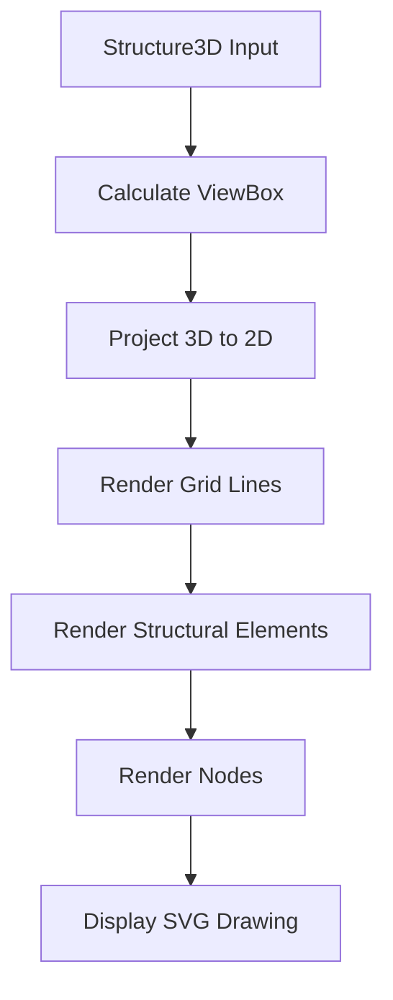

# 2D Drawing System

<cite>
**Referenced Files in This Document**   
- [StructuralDrawing.tsx](file://src/structural-analysis/drawing/StructuralDrawing.tsx)
- [structural.ts](file://src/types/structural.ts)
- [Structure3DViewer.tsx](file://src/structural-analysis/Structure3DViewer.tsx)
</cite>

## Table of Contents
1. [Introduction](#introduction)
2. [2D Drawing Implementation](#2d-drawing-implementation)
3. [Coordinate Mapping and Projections](#coordinate-mapping-and-projections)
4. [Element Rendering and Styling](#element-rendering-and-styling)
5. [Labeling and Annotation System](#labeling-and-annotation-system)
6. [Integration with 3D View](#integration-with-3d-view)
7. [Responsiveness and Scaling](#responsiveness-and-scaling)
8. [Customization Options](#customization-options)

## Introduction
The 2D Drawing System provides structural visualization capabilities through SVG-based rendering of structural models. The system generates plan, elevation, and section views by projecting 3D structural data into 2D space, enabling users to analyze structural layouts, member relationships, and spatial organization. The implementation focuses on clarity, accuracy, and integration with the broader structural analysis workflow.

**Section sources**
- [StructuralDrawing.tsx](file://src/structural-analysis/drawing/StructuralDrawing.tsx#L1-L211)

## 2D Drawing Implementation
The 2D drawing functionality is implemented in the `StructuralDrawing` component, which renders structural models using SVG elements. The component accepts a `Structure3D` object containing nodes, elements, and other structural data, and transforms this 3D information into a 2D representation suitable for display and analysis.

The implementation uses React with TypeScript to ensure type safety and component reusability. The rendering process involves calculating the appropriate viewBox based on the structure's spatial bounds, projecting 3D coordinates to 2D, and rendering structural elements as SVG primitives. The component is designed to be responsive and integrates seamlessly with the application's UI framework.

**Diagram sources**
- [StructuralDrawing.tsx](file://src/structural-analysis/drawing/StructuralDrawing.tsx#L16-L41)
- [StructuralDrawing.tsx](file://src/structural-analysis/drawing/StructuralDrawing.tsx#L46-L51)

**Section sources**
- [StructuralDrawing.tsx](file://src/structural-analysis/drawing/StructuralDrawing.tsx#L9-L211)

## Coordinate Mapping and Projections
The system implements coordinate mapping from 3D to 2D space through orthographic projection. The `projectTo2D` function transforms 3D coordinates (x, y, z) into 2D coordinates (x, y) by using the x and z dimensions of the 3D model, effectively creating a top-down plan view of the structure.

The viewBox calculation determines the appropriate display area based on the structure's spatial extent. The algorithm identifies the minimum and maximum x and z coordinates from all nodes, calculates the width and height of the bounding box, and adds padding to ensure adequate spacing around the structure. This dynamic sizing ensures that structures of various scales are displayed optimally.

**Diagram sources**
- [StructuralDrawing.tsx](file://src/structural-analysis/drawing/StructuralDrawing.tsx#L16-L41)
- [StructuralDrawing.tsx](file://src/structural-analysis/drawing/StructuralDrawing.tsx#L46-L51)

**Section sources**
- [StructuralDrawing.tsx](file://src/structural-analysis/drawing/StructuralDrawing.tsx#L16-L51)

## Element Rendering and Styling
Structural elements are rendered as SVG lines with styling that varies based on element type. Beams, columns, and slabs are differentiated through distinct stroke colors, providing visual cues about the structural system. The rendering process involves mapping each element to its corresponding start and end nodes, calculating the 2D positions, and drawing lines between these points.

Nodes are represented as circles with labels displaying their IDs. The styling includes fill and stroke colors that make nodes easily distinguishable from structural elements. The grid system provides spatial reference through dashed lines at regular intervals, aligned with the structural axes to aid in dimensioning and layout analysis.

**Diagram sources**
- [StructuralDrawing.tsx](file://src/structural-analysis/drawing/StructuralDrawing.tsx#L82-L125)
- [Struct