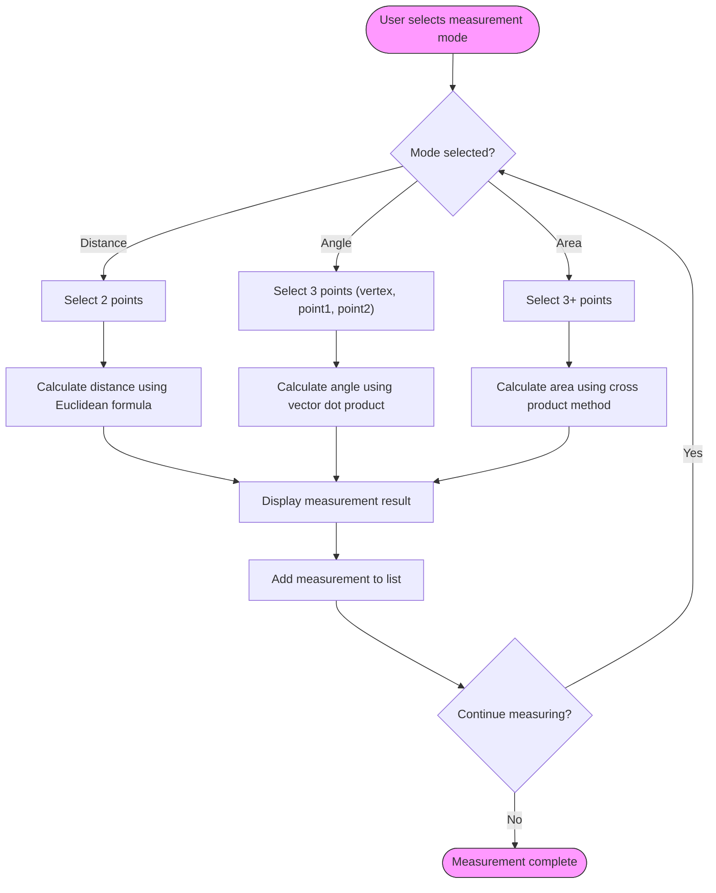
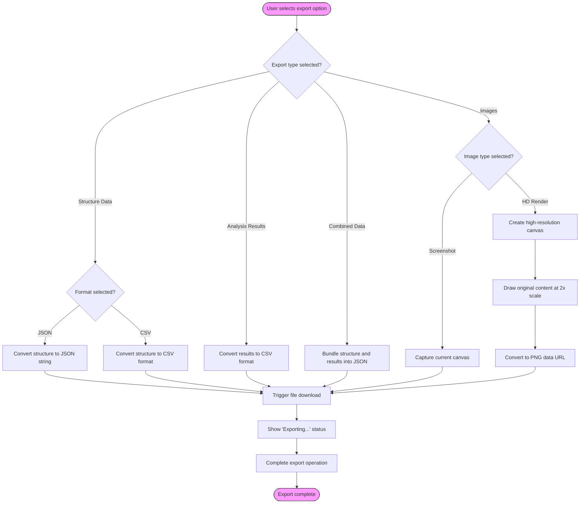

# Advanced 3D Tools

<cite>
**Referenced Files in This Document**   
- [MeasurementTools.tsx](file://src/structural-analysis/advanced-3d/MeasurementTools.tsx)
- [ExportTools.tsx](file://src/structural-analysis/advanced-3d/ExportTools.tsx)
- [advanced-validation.ts](file://src/structural-analysis/advanced-3d/advanced-validation.ts)
- [Enhanced3DViewer.tsx](file://src/structural-analysis/advanced-3d/Enhanced3DViewer.tsx)
</cite>

## Table of Contents
1. [Introduction](#introduction)
2. [Measurement Tools](#measurement-tools)
3. [Export Tools](#export-tools)
4. [Advanced Validation Utilities](#advanced-validation-utilities)
5. [Integration with Enhanced3DViewer](#integration-with-enhanced3dviewer)
6. [Error Handling and Fallback Behaviors](#error-handling-and-fallback-behaviors)

## Introduction
This document provides comprehensive documentation for the auxiliary tools supporting the 3D visualization system in the structural analysis application. The tools covered include MeasurementTools for on-screen measurements, ExportTools for capturing and exporting 3D views, and advanced-validation utilities for ensuring model integrity. These components work together to enhance the functionality of the Enhanced3DViewer, providing users with powerful capabilities for analyzing, measuring, and sharing structural models. The tools are designed to integrate seamlessly with the main 3D visualization component and support various user workflows in structural engineering analysis.

## Measurement Tools

MeasurementTools provides interactive measurement capabilities within the 3D visualization environment, enabling users to perform distance, angle, and area measurements directly on the 3D scene. The tool uses raycasting to capture points on the 3D model and calculates measurements based on geometric algorithms.

The component supports three measurement modes:
- **Distance**: Measures the linear distance between two points
- **Angle**: Calculates the angle formed by three points (vertex and two endpoints)
- **Area**: Computes the area of a polygon defined by three or more points

Users can select the measurement unit (meters, centimeters, or millimeters) and toggle the visibility of all measurements. The tool maintains a list of active measurements that can be reviewed and cleared individually or all at once. When a measurement mode is active, users click on points in the 3D scene to define the measurement geometry. The tool automatically calculates and displays the result once sufficient points are selected.

The implementation uses THREE.js Vector3 objects to represent 3D coordinates and applies standard geometric formulas for calculations. Distance measurements use the Euclidean distance formula, angle measurements use vector dot product calculations, and area measurements use the cross product method for polygon area calculation.

**Diagram sources**
- [MeasurementTools.tsx](file://src/structural-analysis/advanced-3d/MeasurementTools.tsx#L47-L151)

**Section sources**
- [MeasurementTools.tsx](file://src/structural-analysis/advanced-3d/MeasurementTools.tsx#L103-L324)

## Export Tools

ExportTools provides comprehensive export functionality for the 3D visualization system, allowing users to capture and export both data and visual representations of structural models. The component supports multiple export formats for different use cases.

The tool offers the following export capabilities:
- **Structure Data Export**: Exports the structural model as JSON or CSV files containing node and element data
- **Analysis Results Export**: Exports analysis results as CSV files with displacements, forces, and stresses
- **Combined Data Export**: Bundles both structure and analysis data into a single JSON file
- **Image Export**: Captures the current 3D view as a PNG image, with options for standard screenshot or high-resolution render

The export process is handled through a series of callback functions that validate data availability, trigger the export operation, and handle success or error states. For image exports, the tool locates the 3D canvas element and creates a high-resolution version for better quality output. The component displays an exporting status indicator during operations and provides appropriate error messages if exports fail.

For image exports, the tool creates a high-resolution canvas (2x the original resolution) to ensure quality, scales the rendering context, draws the original canvas content, and then converts it to a downloadable PNG file. This approach maintains visual fidelity while providing a convenient export mechanism.

**Diagram sources**
- [ExportTools.tsx](file://src/structural-analysis/advanced-3d/ExportTools.tsx#L76-L122)

**Section sources**
- [ExportTools.tsx](file://src/structural-analysis/advanced-3d/ExportTools.tsx#L129-L389)

## Advanced Validation Utilities

The advanced-validation.ts utility provides comprehensive validation functions for ensuring the integrity of 3D structural models before rendering. The validation system checks for degenerate geometries, invalid transformations, and topology errors that could cause rendering issues or incorrect analysis results.

The validation suite includes three main functions:
- **validateNode**: Validates individual nodes for proper coordinates, ID uniqueness, and valid constraint definitions
- **validateElement**: Validates structural elements for proper connectivity, valid section properties, and reasonable dimensions
- **validateStructure3D**: Validates the complete structure, checking node and element arrays, connectivity, and overall model integrity

The validation process returns detailed results including validity status, error messages, warnings, and optionally corrected data. For nodes, the validator checks coordinate validity, ensures values are within reasonable structural ranges (-1000m to +1000m), and validates constraint definitions. For elements, it verifies that referenced nodes exist, checks for self-connecting elements, and validates section and material properties.

The structure validator performs comprehensive checks including array validation, duplicate ID