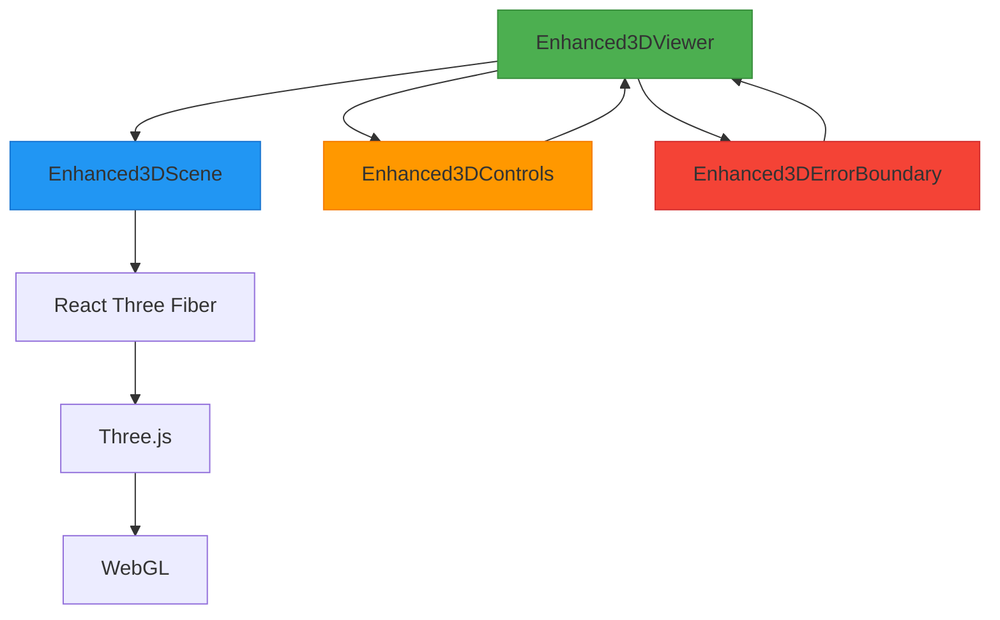
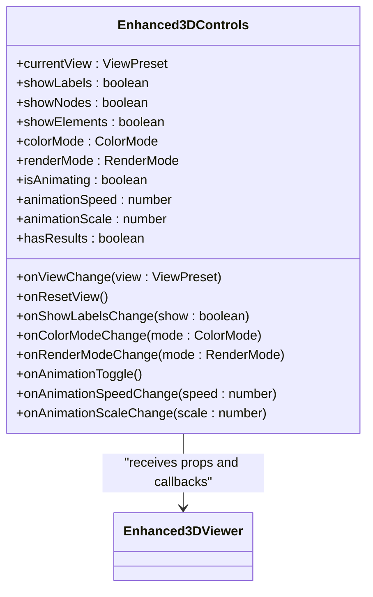
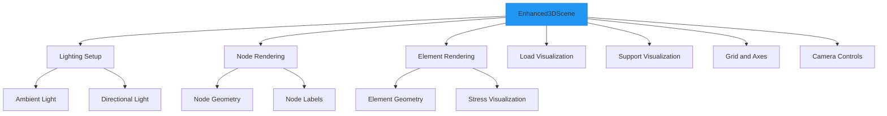
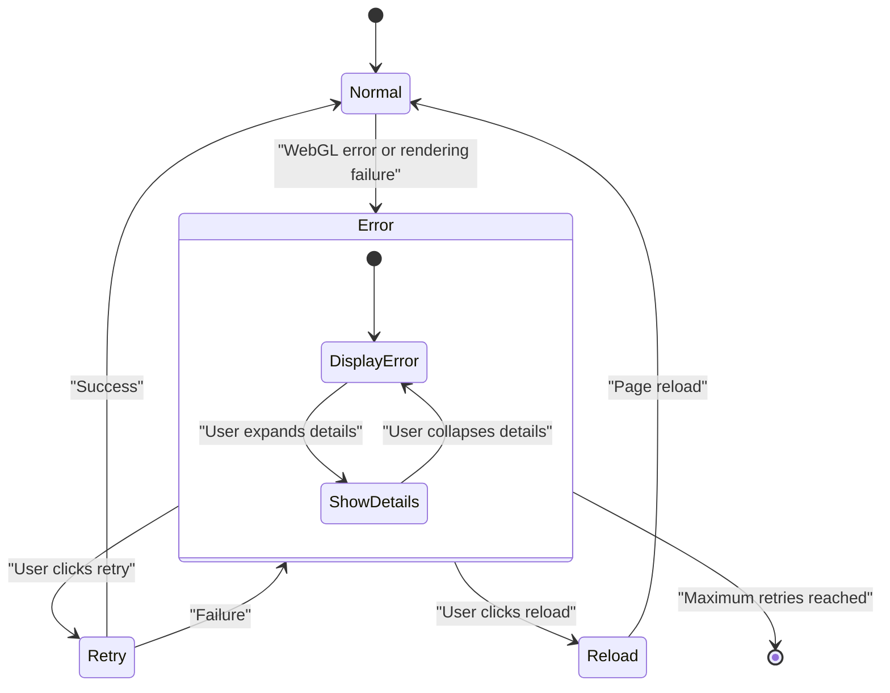
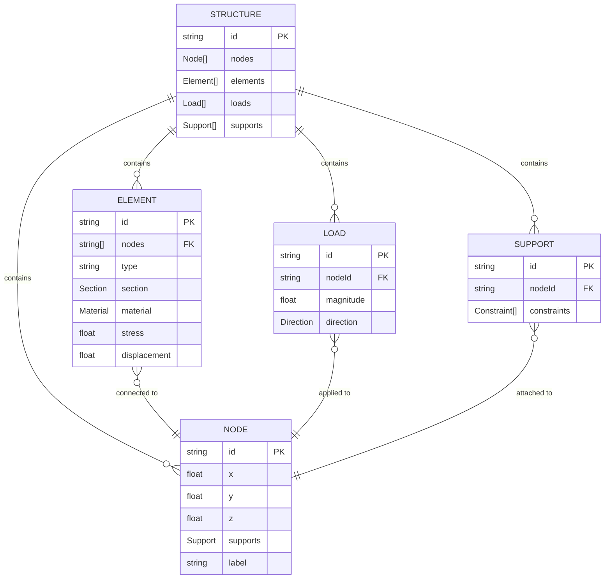
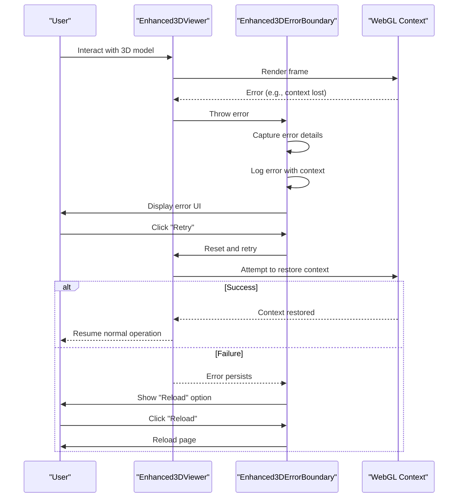

# Enhanced 3D Viewer

<cite>
**Referenced Files in This Document**   
- [Enhanced3DViewer.tsx](file://src/structural-analysis/advanced-3d/Enhanced3DViewer.tsx)
- [Enhanced3DControls.tsx](file://src/structural-analysis/advanced-3d/Enhanced3DControls.tsx)
- [Enhanced3DScene.tsx](file://src/structural-analysis/advanced-3d/Enhanced3DScene.tsx)
- [Enhanced3DErrorBoundary.tsx](file://src/structural-analysis/common/Enhanced3DErrorBoundary.tsx)
</cite>

## Table of Contents
1. [Introduction](#introduction)
2. [Core Components](#core-components)
3. [Architecture Overview](#architecture-overview)
4. [Detailed Component Analysis](#detailed-component-analysis)
5. [User Interaction and Controls](#user-interaction-and-controls)
6. [Scene Composition and Rendering](#scene-composition-and-rendering)
7. [Performance Optimizations](#performance-optimizations)
8. [Error Handling and WebGL Recovery](#error-handling-and-webgl-recovery)
9. [Conclusion](#conclusion)

## Introduction
The Enhanced3DViewer component serves as the primary 3D visualization interface in APP-STRUKTUR-BLACKBOX, providing advanced structural analysis visualization capabilities. Built on React Three Fiber and Three.js, this component enables engineers and analysts to interactively explore structural models with high-fidelity rendering, dynamic lighting, and real-time deformation visualization. The viewer integrates seamlessly with structural analysis workflows, allowing users to visualize stress distributions, displacements, and load paths in an intuitive 3D environment. This documentation details the implementation architecture, user interaction patterns, and technical features that make the Enhanced3DViewer a powerful tool for structural engineering visualization.

## Core Components
The Enhanced3DViewer system comprises several interconnected components that work together to deliver a comprehensive 3D visualization experience. At its core, the Enhanced3DViewer component orchestrates the rendering pipeline, managing state for camera controls, display options, and analysis result visualization. It integrates with Enhanced3DScene, which handles the actual 3D rendering of structural elements, nodes, and supports, while Enhanced3DControls provides the user interface for manipulating the view and visualization parameters. The system is protected by Enhanced3DErrorBoundary, which ensures graceful degradation in case of WebGL or rendering failures. These components work in concert to provide a responsive, interactive 3D environment that can handle complex structural models with thousands of elements while maintaining smooth performance.

**Section sources**
- [Enhanced3DViewer.tsx](file://src/structural-analysis/advanced-3d/Enhanced3DViewer.tsx#L735-L867)
- [Enhanced3DControls.tsx](file://src/structural-analysis/advanced-3d/Enhanced3DControls.tsx#L73-L411)
- [Enhanced3DScene.tsx](file://src/structural-analysis/advanced-3d/Enhanced3DScene.tsx#L369-L507)
- [Enhanced3DErrorBoundary.tsx](file://src/structural-analysis/common/Enhanced3DErrorBoundary.tsx#L17-L272)

## Architecture Overview
The Enhanced3DViewer follows a component-based architecture that separates concerns between visualization, controls, and error handling. The main viewer component acts as the orchestrator, managing state and coordinating between the 3D scene renderer and control panel. React Three Fiber provides the React binding for Three.js, enabling declarative 3D scene composition while maintaining the performance benefits of the underlying WebGL rendering engine. The architecture implements a unidirectional data flow where user interactions in the control panel update the viewer's state, which then propagates changes to the 3D scene component for rendering. This separation allows for independent development and testing of components while ensuring consistent behavior across the visualization system.

**Diagram sources **
- [Enhanced3DViewer.tsx](file://src/structural-analysis/advanced-3d/Enhanced3DViewer.tsx#L735-L867)
- [Enhanced3DScene.tsx](file://src/structural-analysis/advanced-3d/Enhanced3DScene.tsx#L369-L507)
- [Enhanced3DControls.tsx](file://src/structural-analysis/advanced-3d/Enhanced3DControls.tsx#L73-L411)
- [Enhanced3DErrorBoundary.tsx](file://src/structural-analysis/common/Enhanced3DErrorBoundary.tsx#L17-L272)

## Detailed Component Analysis

### Enhanced3DViewer Component
The Enhanced3DViewer component serves as the main container for the 3D visualization system, managing state for display options, animation, and user interactions. It implements a comprehensive state management system using React hooks to track visualization parameters such as label visibility, stress display, view mode, and grid display. The component handles animation state with requestAnimationFrame for smooth playback of time-series analysis results, supporting features like play/pause, speed control, and frame navigation. It also manages camera reset functionality and integrates with the error boundary component to ensure robust operation. The viewer accepts structural data and analysis results as props, enabling dynamic updates when new analysis data becomes available.

**Section sources**
- [Enhanced3DViewer.tsx](file://src/structural-analysis/advanced-3d/Enhanced3DViewer.tsx#L735-L867)

### Enhanced3DControls Component
The Enhanced3DControls component provides a comprehensive interface for manipulating the 3D view and visualization parameters. It offers view presets for common viewing angles (isometric, front, top, etc.) and includes toggles for display options like labels, grid, and stress visualization. The controls are organized into a collapsible panel with tabs for different functionality categories, including colors, rendering, and animation. When analysis results are available, the controls enable animation features with speed and scale adjustments for visualizing structural deformations over time. The component implements a clean, intuitive UI with descriptive icons and tooltips, making complex 3D navigation accessible to users of all experience levels.

**Diagram sources **
- [Enhanced3DControls.tsx](file://src/structural-analysis/advanced-3d/Enhanced3DControls.tsx#L73-L411)

### Enhanced3DScene Component
The Enhanced3DScene component is responsible for rendering the 3D structural model with support for advanced visualization features. It implements a sophisticated scene graph that organizes structural elements, nodes, loads, and supports in a hierarchical structure optimized for rendering performance. The component handles lighting setup with ambient and directional lights to create realistic shadows and depth perception. It supports multiple rendering modes (solid, wireframe, both, transparent) and implements color mapping for visualizing analysis results such as stress and displacement. The scene component also manages camera positioning based on view presets and implements frustum culling to optimize rendering performance for large models.

**Diagram sources **
- [Enhanced3DScene.tsx](file://src/structural-analysis/advanced-3d/Enhanced3DScene.tsx#L369-L507)

### Enhanced3DErrorBoundary Component
The Enhanced3DErrorBoundary component provides robust error handling for the 3D visualization system, specifically designed to handle WebGL and rendering failures. It implements a comprehensive error recovery strategy that includes detailed error logging, user-friendly error messages, and retry mechanisms. When an error occurs, the boundary captures the error information along with contextual data such as WebGL support, memory usage, and performance metrics. It provides users with multiple recovery options, including retry attempts and page reload, while maintaining a professional appearance even in error states. The component also includes technical details in a collapsible section for debugging purposes, making it easier to diagnose and resolve rendering issues.

**Diagram sources **
- [Enhanced3DErrorBoundary.tsx](file://src/structural-analysis/common/Enhanced3DErrorBoundary.tsx#L17-L272)

## User Interaction and Controls
The Enhanced3DViewer implements a comprehensive user interaction system that supports multiple navigation methods and visualization controls. Users can interact with the 3D model through orbit controls, allowing them to rotate, pan, and zoom the view using mouse or touch gestures. The control panel provides quick access to common view presets (isometric, front, top, etc.) and display toggles for labels, grid, and stress visualization. For time-series analysis results, the viewer includes animation controls that allow users to play, pause, and navigate through different time steps of structural deformation. The interface also supports element and node selection, with hover effects and tooltips that display detailed information about selected components. These interaction patterns are designed to be intuitive and accessible, enabling users to explore complex structural models without requiring specialized 3D navigation skills.

**Section sources**
- [Enhanced3DViewer.tsx](file://src/structural-analysis/advanced-3d/Enhanced3DViewer.tsx#L735-L867)
- [Enhanced3DControls.tsx](file://src/structural-analysis/advanced-3d/Enhanced3DControls.tsx#L73-L411)

## Scene Composition and Rendering
The Enhanced3DScene component implements a sophisticated rendering system that handles the visualization of structural elements, nodes, loads, and supports with high fidelity. The scene composition follows a hierarchical structure with proper coordinate system alignment to ensure accurate representation of structural analysis data. Elements are rendered with appropriate geometry based on their type (beam, column, slab, etc.) and material properties, while nodes are displayed as spheres with size scaling options. The rendering system supports multiple visualization modes, including solid, wireframe, and transparent rendering, allowing users to examine different aspects of the structural model. Color mapping is implemented to visualize analysis results, with gradient color schemes for stress and displacement values. The scene also includes environmental elements such as ground planes, coordinate axes, and grid helpers to provide spatial context and measurement references.

**Diagram sources **
- [Enhanced3DScene.tsx](file://src/structural-analysis/advanced-3d/Enhanced3DScene.tsx#L369-L507)

## Performance Optimizations
The Enhanced3DViewer implements several performance optimizations to ensure smooth rendering of complex structural models. Level of Detail (LOD) techniques are employed to reduce geometric complexity based on camera distance and model complexity, improving frame rates for large models. Frustum culling is implemented to avoid rendering objects outside the camera's view, significantly reducing the rendering workload. The component uses React.memo for memoization of expensive rendering operations and implements selective re-rendering to update only the portions of the scene that have changed. Object pooling is used for frequently created and destroyed elements, reducing garbage collection overhead. For animation sequences, the viewer implements efficient animation loops using requestAnimationFrame with proper cleanup to prevent memory leaks. These optimizations work together to maintain interactive frame rates even with models containing thousands of structural elements.

**Section sources**
- [Enhanced3DViewer.tsx](file://src/structural-analysis/advanced-3d/Enhanced3DViewer.tsx#L735-L867)
- [Enhanced3DScene.tsx](file://src/structural-analysis/advanced-3d/Enhanced3DScene.tsx#L369-L507)

## Error Handling and WebGL Recovery
The Enhanced3DErrorBoundary component provides comprehensive error handling and recovery mechanisms for the 3D visualization system. It implements a multi-layered approach to error management, starting with detailed error capture that includes not only the error message and stack trace but also contextual information such as WebGL capabilities, memory usage, and performance metrics. When an error occurs, the boundary displays a user-friendly error message with clear recovery options, including retry attempts and page reload. The component implements a retry mechanism with exponential backoff to handle transient WebGL issues, allowing the viewer to recover from temporary rendering failures. For persistent errors, it provides detailed technical information in a collapsible section to assist with debugging. The error boundary also integrates with error reporting services to capture and analyze errors in production environments, enabling continuous improvement of the visualization system's reliability.

**Diagram sources **
- [Enhanced3DErrorBoundary.tsx](file://src/structural-analysis/common/Enhanced3DErrorBoundary.tsx#L17-L272)

## Conclusion
The Enhanced3DViewer component represents a sophisticated 3D visualization solution for structural engineering applications, combining advanced rendering capabilities with intuitive user interaction patterns. By leveraging React Three Fiber and Three.js, it delivers high-performance 3D visualization that can handle complex structural models with thousands of elements while maintaining smooth interactivity. The component's modular architecture, with clear separation between the viewer, scene, controls, and error handling, enables maintainable and extensible code that can be enhanced with new features over time. The implementation of performance optimizations, comprehensive error handling, and intuitive user controls makes the Enhanced3DViewer a robust and reliable tool for structural analysis visualization. As the primary interface for exploring structural models and analysis results, it plays a critical role in enabling engineers to gain insights from complex data through interactive 3D visualization.