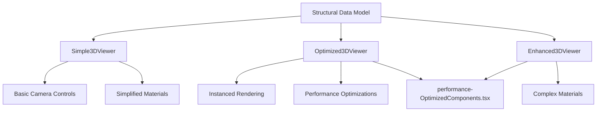
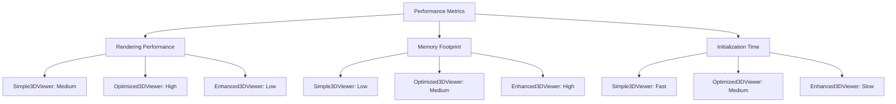

# Simple 3D Viewer

<cite>
**Referenced Files in This Document**   
- [Simple3DViewer.tsx](file://src/structural-analysis/advanced-3d/Simple3DViewer.tsx)
- [Optimized3DViewer.tsx](file://src/structural-analysis/advanced-3d/Optimized3DViewer.tsx)
- [Enhanced3DViewer.tsx](file://src/structural-analysis/advanced-3d/Enhanced3DViewer.tsx)
- [performance-OptimizedComponents.tsx](file://backup/performance-OptimizedComponents.tsx)
</cite>

## Table of Contents
1. [Introduction](#introduction)
2. [Architecture Overview](#architecture-overview)
3. [Simple3DViewer Component](#simple3dviewer-component)
4. [Optimized3DViewer Component](#optimized3dviewer-component)
5. [Performance Comparison](#performance-comparison)
6. [Data Model Compatibility](#data-model-compatibility)
7. [Conditional Rendering and Optimization](#conditional-rendering-and-optimization)
8. [Integration with OptimizedComponents](#integration-with-optimizedcomponents)
9. [Conclusion](#conclusion)

## Introduction
The Simple3DViewer and Optimized3DViewer components are lightweight alternatives to the Enhanced3DViewer, designed specifically for performance-critical scenarios. These viewers provide essential 3D visualization capabilities for structural models while maintaining minimal resource consumption. They are particularly suitable for mobile devices, low-end hardware, or applications involving large-scale structural models where rendering performance is paramount. This document details their architecture, feature sets, performance characteristics, and integration patterns within the application ecosystem.

## Architecture Overview
The 3D viewer components follow a modular architecture with distinct responsibilities. The Simple3DViewer provides basic visualization with minimal features, while the Optimized3DViewer implements advanced performance optimizations through instanced rendering. Both components maintain compatibility with the same structural data model used by the Enhanced3DViewer, ensuring seamless integration across different performance requirements. The architecture leverages React Three Fiber for WebGL rendering, with component-specific optimizations to balance visual fidelity and performance.

**Diagram sources**
- [Simple3DViewer.tsx](file://src/structural-analysis/advanced-3d/Simple3DViewer.tsx#L1-L378)
- [Optimized3DViewer.tsx](file://src/structural-analysis/advanced-3d/Optimized3DViewer.tsx#L1-L621)
- [Enhanced3DViewer.tsx](file://src/structural-analysis/advanced-3d/Enhanced3DViewer.tsx#L1-L870)
- [performance-OptimizedComponents.tsx](file://backup/performance-OptimizedComponents.tsx#L1-L104)

## Simple3DViewer Component
The Simple3DViewer component implements a minimalistic 3D visualization system with basic camera controls and simplified material representation. It uses standard Three.js geometry primitives with basic lighting and minimal interactivity. The component features a simple control panel with grid toggle and reset functionality, focusing on essential visualization needs without advanced features. It implements frustum culling and Level of Detail (LOD) calculations to optimize rendering performance based on camera distance and model complexity.

**Section sources**
- [Simple3DViewer.tsx](file://src/structural-analysis/advanced-3d/Simple3DViewer.tsx#L1-L378)

## Optimized3DViewer Component
The Optimized3DViewer component employs instanced rendering through Three.js InstancedMesh to efficiently render large numbers of structural elements. This approach significantly reduces draw calls and improves rendering performance, especially for complex models with thousands of elements. The component supports performance-optimized features such as instanced nodes and elements, with configurable deformation visualization and color coding based on stress or utilization metrics. It includes an information panel displaying structure statistics and a legend for color-coded visualization.

**Section sources**
- [Optimized3DViewer.tsx](file://src/structural-analysis/advanced-3d/Optimized3DViewer.tsx#L1-L621)

## Performance Comparison
The performance characteristics of the three viewer components differ significantly in rendering performance, memory footprint, and initialization time. The Simple3DViewer offers the fastest initialization and lowest memory usage but limited visualization capabilities. The Optimized3DViewer provides the best rendering performance for large models through instanced rendering, while the Enhanced3DViewer offers the most comprehensive visualization features at the cost of higher resource consumption.

**Diagram sources**
- [Simple3DViewer.tsx](file://src/structural-analysis/advanced-3d/Simple3DViewer.tsx#L1-L378)
- [Optimized3DViewer.tsx](file://src/structural-analysis/advanced-3d/Optimized3DViewer.tsx#L1-L621)
- [Enhanced3DViewer.tsx](file://src/structural-analysis/advanced-3d/Enhanced3DViewer.tsx#L1-L870)

## Data Model Compatibility
Both the Simple3DViewer and Optimized3DViewer maintain full compatibility with the same structural data model used by the Enhanced3DViewer. This ensures that structural data can be visualized consistently across different viewer components based on performance requirements. The shared data model includes nodes with position coordinates and elements with node references, allowing seamless switching between viewer types without data transformation.

**Section sources**
- [Simple3DViewer.tsx](file://src/structural-analysis/advanced-3d/Simple3DViewer.tsx#L1-L378)
- [Optimized3DViewer.tsx](file://src/structural-analysis/advanced-3d/Optimized3DViewer.tsx#L1-L621)
- [Enhanced3DViewer.tsx](file://src/structural-analysis/advanced-3d/Enhanced3DViewer.tsx#L1-L870)

## Conditional Rendering and Optimization
The viewers implement various optimization strategies including lazy loading, conditional rendering based on device capabilities, and Level of Detail (LOD) calculations. The Simple3DViewer uses distance-based LOD to adjust geometry detail, while the Optimized3DViewer leverages instanced rendering for maximum performance. These optimizations enable efficient visualization of large structural models on devices with limited computational resources.

**Section sources**
- [Simple3DViewer.tsx](file://src/structural-analysis/advanced-3d/Simple3DViewer.tsx#L1-L378)
- [Optimized3DViewer.tsx](file://src/structural-analysis/advanced-3d/Optimized3DViewer.tsx#L1-L621)

## Integration with OptimizedComponents
The Optimized3DViewer plays a crucial role in performance-optimized workflows and is integrated with the performance-OptimizedComponents.tsx module. This integration enables lazy loading of heavy components and implements performance monitoring to ensure optimal application behavior. The modular design allows the Optimized3DViewer to be used in scenarios requiring high-performance 3D visualization without compromising overall application responsiveness.

**Section sources**
- [Optimized3DViewer.tsx](file://src/structural-analysis/advanced-3d/Optimized3DViewer.tsx#L1-L621)
- [performance-OptimizedComponents.tsx](file://backup/performance-OptimizedComponents.tsx#L1-L104)

## Conclusion
The Simple3DViewer and Optimized3DViewer components provide essential alternatives to the Enhanced3DViewer for performance-critical applications. By sacrificing advanced visualization features for speed and efficiency, these components enable 3D structural visualization on a wider range of devices and for larger models. Their shared data model ensures consistency across different visualization contexts, while their optimized architectures deliver superior performance characteristics for specific use cases.