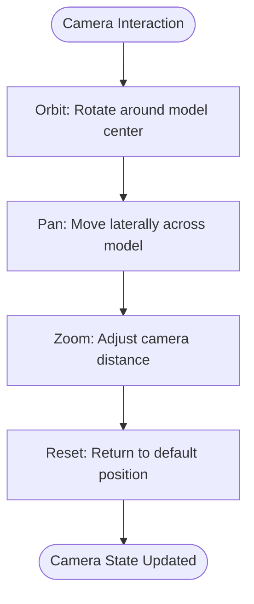
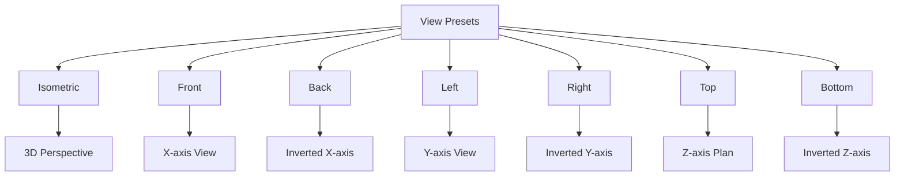
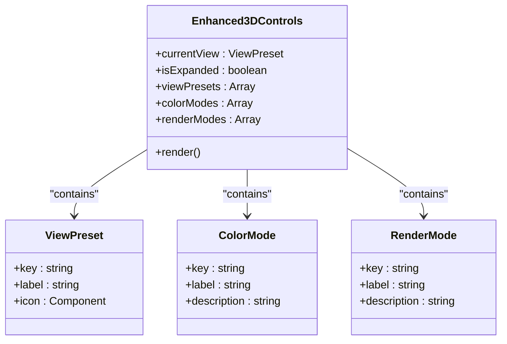
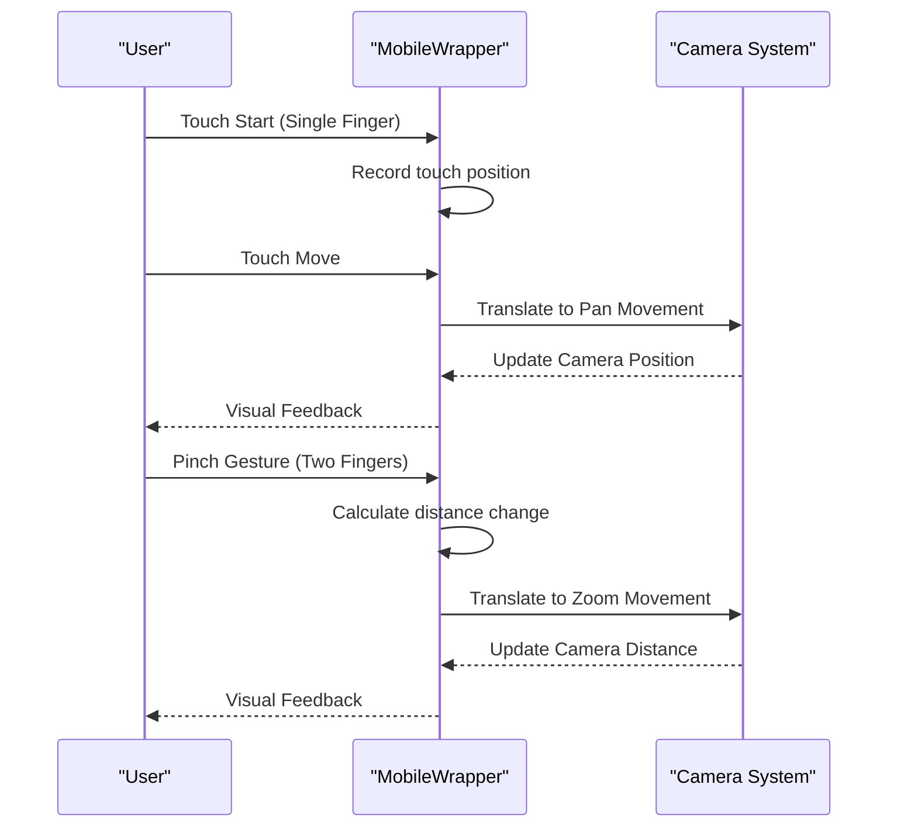

# Camera Controls

<cite>
**Referenced Files in This Document**   
- [Enhanced3DControls.tsx](file://src/structural-analysis/advanced-3d/Enhanced3DControls.tsx)
- [Enhanced3DScene.tsx](file://src/structural-analysis/advanced-3d/Enhanced3DScene.tsx)
- [MobileWrapper.tsx](file://src/components/ui/MobileWrapper.tsx)
</cite>

## Table of Contents
1. [Introduction](#introduction)
2. [Core Camera Functionality](#core-camera-functionality)
3. [View Presets and Navigation](#view-presets-and-navigation)
4. [UI Controls and Visual Feedback](#ui-controls-and-visual-feedback)
5. [Reset View Functionality](#reset-view-functionality)
6. [Navigation for Structural Models](#navigation-for-structural-models)
7. [Accessibility and Input Methods](#accessibility-and-input-methods)
8. [Troubleshooting Common Issues](#troubleshooting-common-issues)

## Introduction
The camera control system in the 3D visualization environment provides structural engineers with intuitive navigation tools for examining complex structural models. Built on React Three Fiber, the system offers comprehensive camera manipulation capabilities including orbit, pan, zoom, and reset functions tailored specifically for structural engineering workflows. The Enhanced3DControls component serves as the primary interface for camera manipulation, offering both quick-access buttons for common views and expanded controls for detailed visualization settings.

**Section sources**
- [Enhanced3DControls.tsx](file://src/structural-analysis/advanced-3d/Enhanced3DControls.tsx#L1-L50)

## Core Camera Functionality
The camera system implements standard 3D navigation patterns optimized for structural analysis. Orbit controls allow users to rotate around the model's center point, providing comprehensive viewing angles of structural elements. Pan functionality enables lateral movement across the model, essential for examining specific sections of large structures. Zoom controls support both mouse wheel interaction and dedicated UI buttons, allowing users to focus on detailed connections or view the entire structure.

The camera maintains proper orientation with the model's coordinate system, preserving the conventional structural engineering orientation where the Z-axis represents vertical direction. This ensures that when users navigate to top or bottom views, they see the expected plan views of the structure. The camera's field of view is optimized to minimize distortion while maintaining context, with automatic fit-to-model functionality that centers the camera on the structure's bounding box.

**Diagram sources**
- [Enhanced3DScene.tsx](file://src/structural-analysis/advanced-3d/Enhanced3DScene.tsx#L300-L350)
- [Enhanced3DControls.tsx](file://src/structural-analysis/advanced-3d/Enhanced3DControls.tsx#L100-L150)

**Section sources**
- [Enhanced3DScene.tsx](file://src/structural-analysis/advanced-3d/Enhanced3DScene.tsx#L300-L350)
- [Enhanced3DControls.tsx](file://src/structural-analysis/advanced-3d/Enhanced3DControls.tsx#L100-L150)

## View Presets and Navigation
The system provides seven predefined view presets optimized for structural engineering analysis: isometric, front, back, left, right, top, and bottom. These presets correspond to standard orthographic projections used in structural drawings, allowing engineers to quickly switch between familiar views. The isometric preset provides a 3D perspective with equal scaling on all axes, ideal for understanding spatial relationships between structural elements.

Each view preset positions the camera at a specific location relative to the model's center, with the camera always looking at the origin point. The front, back, left, and right views align with the principal axes of the structure, while top and bottom views provide plan and inverted plan perspectives. When switching between views, the system maintains consistent scaling to prevent disorientation. The active view is visually indicated through button styling, with the current view button appearing in a highlighted state.

**Diagram sources**
- [Enhanced3DControls.tsx](file://src/structural-analysis/advanced-3d/Enhanced3DControls.tsx#L130-L164)
- [Enhanced3DScene.tsx](file://src/structural-analysis/advanced-3d/Enhanced3DScene.tsx#L300-L350)

**Section sources**
- [Enhanced3DControls.tsx](file://src/structural-analysis/advanced-3d/Enhanced3DControls.tsx#L130-L164)
- [Enhanced3DScene.tsx](file://src/structural-analysis/advanced-3d/Enhanced3DScene.tsx#L300-L350)

## UI Controls and Visual Feedback
The Enhanced3DControls component presents a comprehensive interface for camera manipulation and visualization settings. The primary view controls are organized in a 2x4 grid layout, with each view preset represented by a button containing an icon and label. The current view is indicated through a filled button style, while inactive views appear as outlined buttons, providing clear visual feedback about the current camera orientation.

The control panel includes a settings toggle that expands additional visualization options, including color modes, render modes, and animation controls. Interactive elements provide immediate visual feedback: buttons depress on click, switches toggle with smooth transitions, and sliders update their position and label in real-time. The interface uses consistent iconography from the Lucide React library, with camera-related icons clearly representing their functions.

For analysis results, the system displays a status panel showing maximum stress and displacement values when available. Color legends appear when stress or displacement visualization is active, showing the gradient scale and corresponding values. The expanded controls are organized into tabs for colors, rendering, and animation, preventing information overload while maintaining access to advanced features.

**Diagram sources**
- [Enhanced3DControls.tsx](file://src/structural-analysis/advanced-3d/Enhanced3DControls.tsx#L73-L411)

**Section sources**
- [Enhanced3DControls.tsx](file://src/structural-analysis/advanced-3d/Enhanced3DControls.tsx#L73-L411)

## Reset View Functionality
The reset view functionality restores the camera to its default state, providing a consistent reference point for navigation. When activated, the reset function returns the camera to the isometric view with optimal positioning for the current structure. This includes resetting the camera position, orientation, and zoom level to their default values based on the model's bounding box.

The reset operation also restores all visualization settings to their default states: display options for labels, nodes, elements, loads, and supports are reset to their initial visibility, and the color mode reverts to material-based coloring. This comprehensive reset ensures that users can quickly return to a known state when they become disoriented during navigation or when switching between different structural models.

The reset function is accessible through a dedicated button in the control panel, positioned below the view preset buttons for easy access. The button includes a counter-clockwise rotation icon (RotateCcw) that universally represents reset or return to initial state. For users who have made multiple adjustments, the reset function provides a single-click solution to restore the optimal viewing configuration.

**Section sources**
- [Enhanced3DControls.tsx](file://src/structural-analysis/advanced-3d/Enhanced3DControls.tsx#L150-L160)

## Navigation for Structural Models
The camera system is specifically optimized for navigating complex structural models, which often contain dense arrangements of beams, columns, slabs, and other elements. The orbit controls use damping to provide smooth, natural rotation that prevents overshooting and makes it easier to position the camera precisely. The pan functionality is constrained to the horizontal plane, preventing accidental vertical movement that could disorient the user.

For large structures, the system implements automatic fit-to-model functionality that adjusts the camera distance based on the model's size. This ensures that regardless of the structure's scale, the initial view presents the entire model in context. The zoom limits are set relative to the model's dimensions, preventing users from zooming so far out that the model becomes invisible or so far in that they lose spatial context.

When examining specific structural details, the combination of zoom and pan allows users to focus on critical connections such as beam-column joints or foundation details. The ability to quickly switch between view presets enables engineers to verify structural relationships from multiple perspectives, which is essential for identifying potential design issues or construction conflicts.

**Section sources**
- [Enhanced3DScene.tsx](file://src/structural-analysis/advanced-3d/Enhanced3DScene.tsx#L300-L350)
- [Enhanced3DControls.tsx](file://src/structural-analysis/advanced-3d/Enhanced3DControls.tsx#L100-L150)

## Accessibility and Input Methods
The camera control system supports multiple input methods to accommodate different user preferences and device capabilities. Keyboard shortcuts provide alternative access to view presets and navigation functions, allowing power users to navigate efficiently without relying on mouse input. The system supports standard keyboard navigation patterns, with arrow keys for panning and +/- for zooming.

For touch-enabled devices, the MobileWrapper component implements gesture-based controls that translate touch interactions into camera movements. Pinch gestures control zoom, single-finger drag enables panning, and two-finger rotation supports orbiting. These touch interactions are optimized for mobile and tablet devices, with appropriate touch targets and gesture recognition that prevents accidental inputs.

The interface maintains accessibility standards with sufficient color contrast, clear visual indicators, and semantic HTML elements. All interactive controls are keyboard-navigable and include appropriate ARIA labels for screen reader support. The control layout is responsive, adapting to different screen sizes while maintaining functionality. For users with motor impairments, the large touch targets and gesture tolerance reduce the precision required for navigation.

**Diagram sources**
- [MobileWrapper.tsx](file://src/components/ui/MobileWrapper.tsx#L43-L88)
- [Enhanced3DControls.tsx](file://src/structural-analysis/advanced-3d/Enhanced3DControls.tsx#L100-L150)

**Section sources**
- [MobileWrapper.tsx](file://src/components/ui/MobileWrapper.tsx#L43-L88)
- [Enhanced3DControls.tsx](file://src/structural-analysis/advanced-3d/Enhanced3DControls.tsx#L1