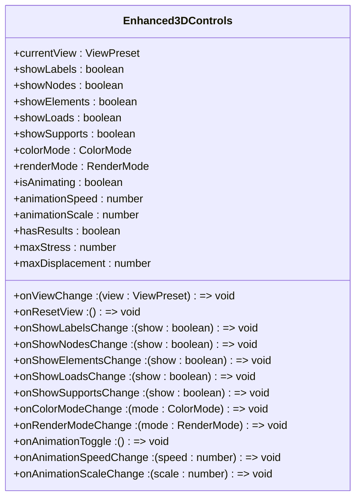
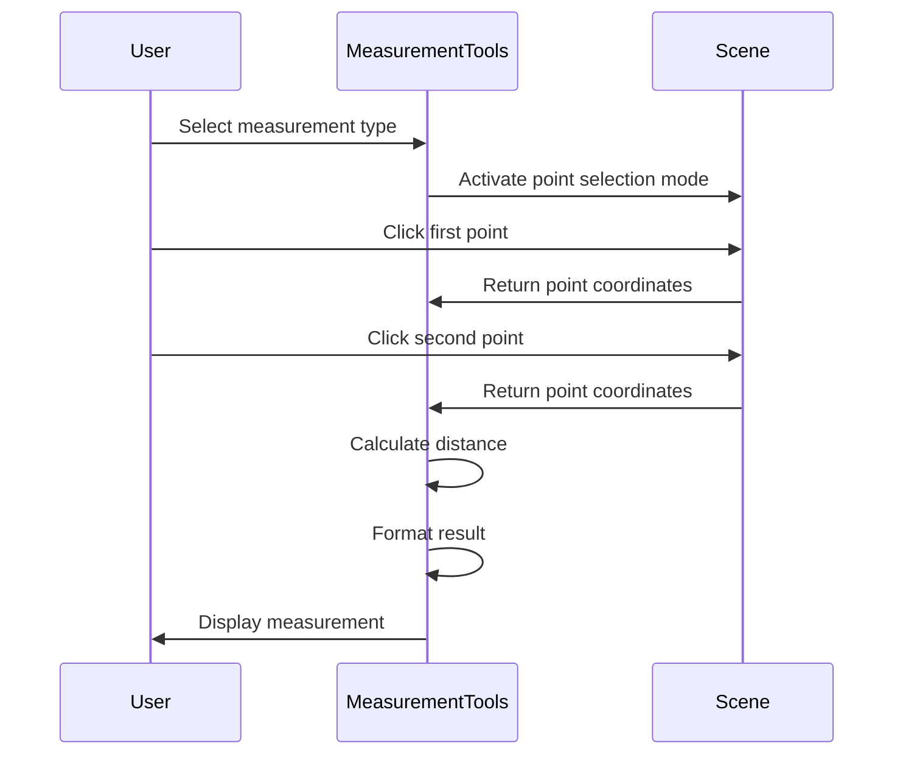
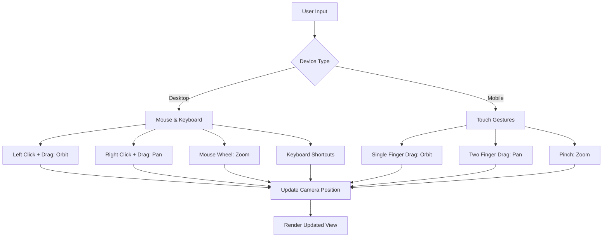
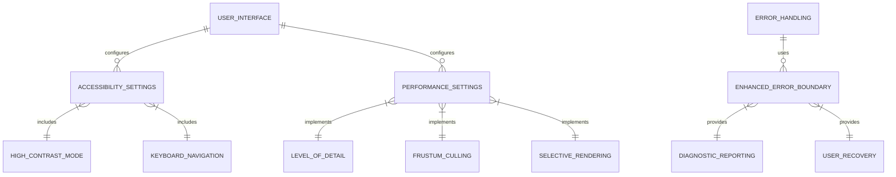

# Camera and Interaction Controls

<cite>
**Referenced Files in This Document**   
- [Enhanced3DControls.tsx](file://src/structural-analysis/advanced-3d/Enhanced3DControls.tsx)
- [MeasurementTools.tsx](file://src/structural-analysis/advanced-3d/MeasurementTools.tsx)
- [Enhanced3DViewer.tsx](file://src/structural-analysis/advanced-3d/Enhanced3DViewer.tsx)
- [Enhanced3DScene.tsx](file://src/structural-analysis/advanced-3d/Enhanced3DScene.tsx)
- [Enhanced3DErrorBoundary.tsx](file://src/structural-analysis/common/Enhanced3DErrorBoundary.tsx)
</cite>

## Table of Contents
1. [Introduction](#introduction)
2. [Core Interaction System](#core-interaction-system)
3. [Enhanced3DControls Implementation](#enhanced3dcontrols-implementation)
4. [Measurement Tools Functionality](#measurement-tools-functionality)
5. [User Interaction Methods](#user-interaction-methods)
6. [Accessibility and Performance](#accessibility-and-performance)
7. [Troubleshooting Guide](#troubleshooting-guide)

## Introduction
The 3D visualization environment provides a comprehensive set of camera and interaction controls specifically designed for structural engineering workflows. These controls enable users to navigate complex structural models with precision, perform accurate measurements, and analyze structural behavior under various loading conditions. The system integrates React Three Fiber's camera controls with custom enhancements to deliver an intuitive and powerful user experience for structural analysis and design.

## Core Interaction System

The core interaction system is built around React Three Fiber's OrbitControls, providing intuitive navigation through orbit, pan, and zoom gestures. The implementation includes custom enhancements for structural engineering workflows, with specialized view presets and display options. The system supports both desktop and mobile devices, with optimized touch interactions for mobile platforms. Camera controls are integrated with the application's state management system, allowing for synchronized updates across multiple components.

**Section sources**
- [Enhanced3DViewer.tsx](file://src/structural-analysis/advanced-3d/Enhanced3DViewer.tsx#L735-L867)
- [Enhanced3DScene.tsx](file://src/structural-analysis/advanced-3d/Enhanced3DScene.tsx#L369-L507)

## Enhanced3DControls Implementation

The Enhanced3DControls component provides a comprehensive interface for camera manipulation and visualization settings. It includes view presets for standard orthographic views (front, back, left, right, top, bottom) and isometric perspective, allowing quick navigation to common viewing angles used in structural engineering. Users can reset the view to its default state with a single click.

The controls support multiple display options including labels, nodes, elements, loads, and supports, which can be toggled independently. The expanded control panel offers additional settings for color modes, render modes, and animation controls. When analysis results are available, color modes include stress and displacement visualization with automatic scaling based on maximum values.

**Diagram sources**
- [Enhanced3DControls.tsx](file://src/structural-analysis/advanced-3d/Enhanced3DControls.tsx#L73-L411)

**Section sources**
- [Enhanced3DControls.tsx](file://src/structural-analysis/advanced-3d/Enhanced3DControls.tsx#L73-L411)

## Measurement Tools Functionality

The MeasurementTools component enables precise distance, angle, and area measurements within the 3D scene. Users can select measurement types (distance, angle, or area) and interact with the model to capture measurements. The tool supports multiple units (meters, centimeters, millimeters) and provides real-time feedback on measurement values.

For distance measurements, users select two points in the 3D space, and the tool calculates the Euclidean distance. Angle measurements require three points (vertex and two endpoints), with the result displayed in degrees. Area measurements can be performed on any polygonal surface by selecting three or more points, with the tool using the shoelace formula for calculation.

**Diagram sources**
- [MeasurementTools.tsx](file://src/structural-analysis/advanced-3d/MeasurementTools.tsx#L103-L324)

**Section sources**
- [MeasurementTools.tsx](file://src/structural-analysis/advanced-3d/MeasurementTools.tsx#L103-L324)

## User Interaction Methods

The system supports multiple interaction methods optimized for different devices and user preferences. On desktop, users can orbit the model by holding the left mouse button and dragging, pan with the right mouse button, and zoom with the mouse wheel. Keyboard shortcuts provide additional control options, including quick access to view presets and reset functions.

For touch devices, the interface adapts to mobile gestures: single-finger drag for orbit, two-finger drag for pan, and pinch gestures for zoom. The control panel is optimized for touch with appropriately sized buttons and responsive layout. The system also supports keyboard navigation for accessibility, allowing users to navigate controls using tab and enter keys.

The integration with React Three Fiber's camera controls is seamless, with custom enhancements for precision navigation in structural engineering contexts. The camera's near and far clipping planes are configured to accommodate large structural models while maintaining rendering performance. The system automatically adjusts the camera position and target based on the model's bounding box for optimal viewing.

**Diagram sources**
- [Enhanced3DViewer.tsx](file://src/structural-analysis/advanced-3d/Enhanced3DViewer.tsx#L735-L867)
- [Enhanced3DScene.tsx](file://src/structural-analysis/advanced-3d/Enhanced3DScene.tsx#L369-L507)

**Section sources**
- [Enhanced3DViewer.tsx](file://src/structural-analysis/advanced-3d/Enhanced3DViewer.tsx#L735-L867)
- [Enhanced3DScene.tsx](file://src/structural-analysis/advanced-3d/Enhanced3DScene.tsx#L369-L507)

## Accessibility and Performance

The interaction system incorporates accessibility considerations to ensure usability for all users. High-contrast color modes are available for users with visual impairments, and keyboard navigation support enables operation without a mouse. The interface follows WCAG guidelines with sufficient color contrast and focus indicators for interactive elements.

Performance optimization is critical for real-time interaction with complex structural models. The system implements level-of-detail (LOD) techniques, reducing geometric complexity when viewing models from a distance. Selective rendering ensures that only visible components are processed, and frustum culling eliminates off-screen elements from the rendering pipeline. The measurement tools use efficient algorithms for geometric calculations, with results cached to prevent redundant computations.

The Enhanced3DErrorBoundary component provides robust error handling, capturing and reporting WebGL compatibility issues, memory constraints, and rendering failures. This component includes detailed diagnostic information and offers users options to retry or reload the visualization, enhancing the overall reliability of the system.

**Section sources**
- [Enhanced3DErrorBoundary.tsx](file://src/structural-analysis/common/Enhanced3DErrorBoundary.tsx#L17-L272)

## Troubleshooting Guide

Common issues with camera controls and interaction typically fall into several categories. Control unresponsiveness may occur due to browser compatibility issues, particularly with WebGL support. Users should verify their browser supports WebGL 2.0 and has hardware acceleration enabled. Clearing browser cache and restarting the application can resolve temporary rendering glitches.

Camera clipping issues, where parts of the model appear cut off, are usually related to the near and far clipping planes. The system automatically configures these based on the model's scale, but extremely large or small models may require manual adjustment. Users can reset the view to restore default camera settings.

Performance degradation during interaction can result from complex models with high polygon counts. The system's performance optimization features should mitigate this, but users may need to disable certain visualization features (such as labels or stress coloring) to improve responsiveness. Monitoring browser memory usage can help identify resource constraints.

For persistent issues, the Enhanced3DErrorBoundary component provides detailed error reporting with technical details that can assist in diagnosis. Users can access these details through the error panel and share them with support personnel for further assistance.

**Section sources**
- [Enhanced3DErrorBoundary.tsx](file://src/structural-analysis/common/Enhanced3DErrorBoundary.tsx#L17-L272)
- [Enhanced3DViewer.tsx](file://src/structural-analysis/advanced-3d/Enhanced3DViewer.tsx#L735-L867)