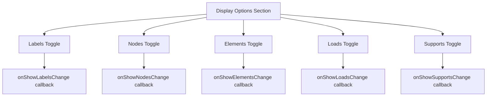
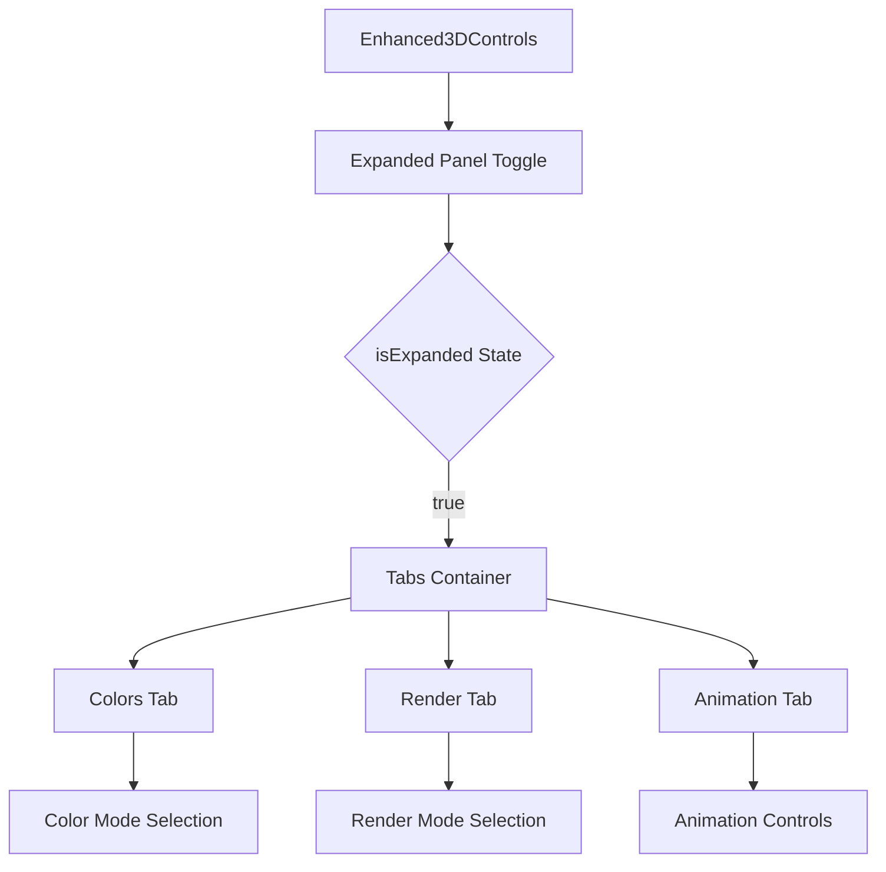
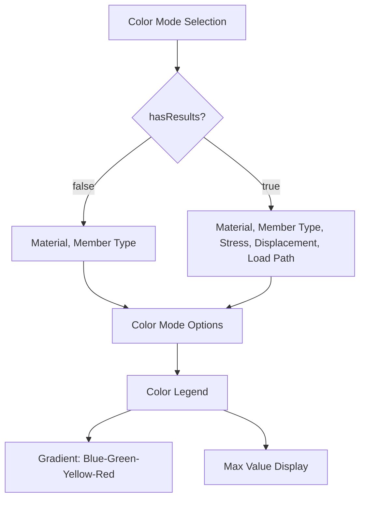
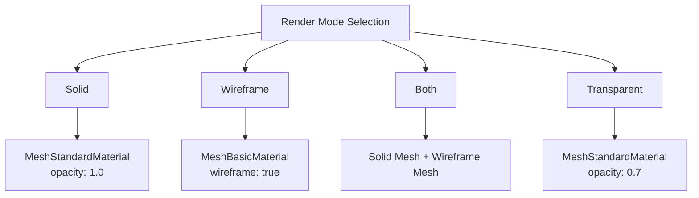
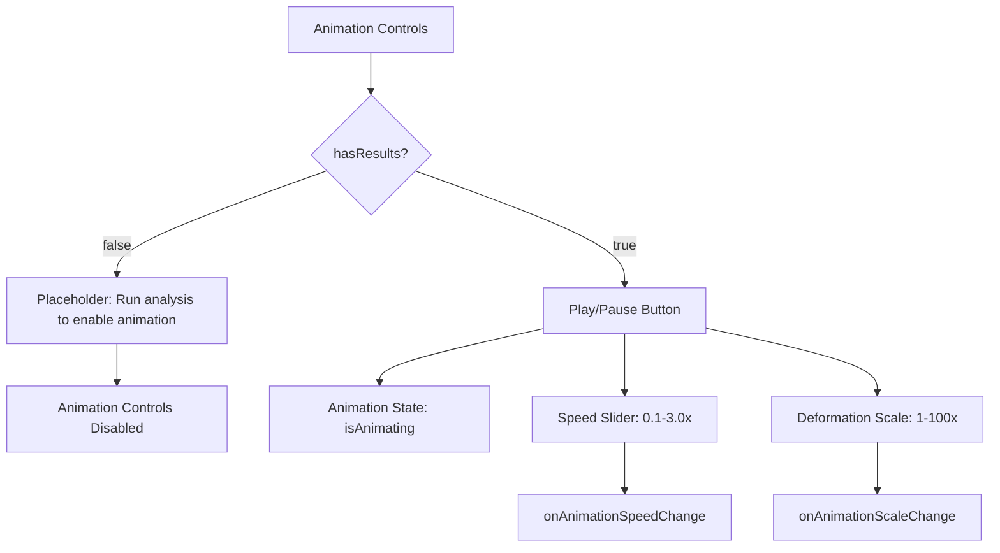

# Interaction Controls

<cite>
**Referenced Files in This Document**   
- [Enhanced3DControls.tsx](file://src/structural-analysis/advanced-3d/Enhanced3DControls.tsx)
- [Enhanced3DScene.tsx](file://src/structural-analysis/advanced-3d/Enhanced3DScene.tsx)
- [Enhanced3DViewer.tsx](file://src/structural-analysis/advanced-3d/Enhanced3DViewer.tsx)
</cite>

## Table of Contents
1. [Introduction](#introduction)
2. [Display Toggles](#display-toggles)
3. [Expanded Control Panel](#expanded-control-panel)
4. [Color Modes](#color-modes)
5. [Render Modes](#render-modes)
6. [Animation Controls](#animation-controls)
7. [User Customization Examples](#user-customization-examples)
8. [Performance Considerations](#performance-considerations)
9. [Troubleshooting Guide](#troubleshooting-guide)

## Introduction
The Enhanced3DControls component provides a comprehensive interface for interacting with 3D structural models in the visualization environment. It enables users to manipulate view angles, toggle display elements, customize color schemes, adjust rendering modes, and animate structural behavior based on analysis results. The control system is designed to support both quick access to essential functions and detailed configuration through an expandable panel with tabbed navigation.

**Section sources**
- [Enhanced3DControls.tsx](file://src/structural-analysis/advanced-3d/Enhanced3DControls.tsx#L1-L50)

## Display Toggles
The Enhanced3DControls component provides quick-access toggles for fundamental visualization elements directly in the main control panel. These binary switches allow users to show or hide specific components of the structural model without navigating to the expanded control section.

The display toggle system includes five key visualization elements:
- **Labels**: Toggles visibility of text identifiers for structural components
- **Nodes**: Controls display of structural nodes (connection points)
- **Elements**: Shows or hides structural members (beams, columns, etc.)
- **Loads**: Toggles visualization of applied forces and load distributions
- **Supports**: Controls display of boundary conditions and support types

These toggles use a Switch component that provides immediate visual feedback and state persistence. Each toggle is bound to a corresponding state variable that propagates changes to the 3D scene renderer, ensuring synchronized updates across the visualization.

**Diagram sources**
- [Enhanced3DControls.tsx](file://src/structural-analysis/advanced-3d/Enhanced3DControls.tsx#L165-L210)

**Section sources**
- [Enhanced3DControls.tsx](file://src/structural-analysis/advanced-3d/Enhanced3DControls.tsx#L165-L210)

## Expanded Control Panel
The Enhanced3DControls component features an expandable panel that reveals advanced configuration options organized into three distinct tabs: Colors, Render, and Animation. This panel is accessed via a settings icon button that toggles the expanded state, providing a clean interface that balances accessibility with screen space efficiency.

The expanded panel uses a tabbed navigation system implemented with the Tabs component, allowing users to switch between different control categories without cluttering the interface. Each tab contains specialized controls relevant to its category, creating a logical grouping of related functionality.

The panel's expandable nature ensures that basic controls remain readily accessible while advanced options are available when needed. This design supports both novice users who may only require basic visualization adjustments and advanced users who need precise control over rendering parameters and animation settings.

**Diagram sources**
- [Enhanced3DControls.tsx](file://src/structural-analysis/advanced-3d/Enhanced3DControls.tsx#L212-L220)

**Section sources**
- [Enhanced3DControls.tsx](file://src/structural-analysis/advanced-3d/Enhanced3DControls.tsx#L212-L220)

## Color Modes
The color mode system in Enhanced3DControls provides multiple visualization schemes for representing structural properties, with availability conditioned on the presence of analysis results. The available color modes are dynamically determined based on the `hasResults` prop, ensuring that analysis-dependent visualization options are only presented when relevant data is available.

Available color modes include:
- **Material**: Colors elements based on material properties (always available)
- **Member Type**: Colors elements according to their structural function (beam, column, etc.) (always available)
- **Stress**: Colors elements based on stress magnitude (available when analysis results exist)
- **Displacement**: Colors elements based on displacement magnitude (available when analysis results exist)
- **Load Path**: Visualizes the path of load transfer through the structure (available when analysis results exist)

When stress or displacement modes are active, a color legend is displayed showing a gradient scale from blue (low values) through green and yellow to red (high values). The legend includes the maximum value from the analysis results, providing context for the color mapping. This conditional rendering ensures that users are not presented with non-functional options and receive appropriate feedback when analysis data is required.

**Diagram sources**
- [Enhanced3DControls.tsx](file://src/structural-analysis/advanced-3d/Enhanced3DControls.tsx#L105-L115)

**Section sources**
- [Enhanced3DControls.tsx](file://src/structural-analysis/advanced-3d/Enhanced3DControls.tsx#L105-L115)

## Render Modes
The render mode system provides four distinct visualization styles for structural elements, each offering different visual characteristics and performance implications. These modes control how structural members are rendered in the 3D scene, allowing users to optimize the visualization for specific analysis or presentation needs.

Available render modes include:
- **Solid**: Displays elements as solid geometric shapes with surface shading
- **Wireframe**: Renders elements as skeletal wireframe outlines
- **Both**: Combines solid rendering with wireframe overlay for enhanced depth perception
- **Transparent**: Displays semi-transparent solid elements that allow visibility through overlapping components

The render mode selection directly affects the material properties applied to 3D mesh objects in the scene. Solid and transparent modes use MeshStandardMaterial with appropriate opacity settings, while wireframe mode uses MeshBasicMaterial with wireframe rendering enabled. The "Both" mode renders two overlapping meshes: one solid and one wireframe, providing the visual benefits of both rendering styles.

**Diagram sources**
- [Enhanced3DControls.tsx](file://src/structural-analysis/advanced-3d/Enhanced3DControls.tsx#L117-L125)

**Section sources**
- [Enhanced3DControls.tsx](file://src/structural-analysis/advanced-3d/Enhanced3DControls.tsx#L117-L125)

## Animation Controls
The animation control system enables dynamic visualization of structural behavior when analysis results are available. These controls are conditionally rendered based on the `hasResults` prop, ensuring they are only accessible when meaningful animation data exists.

Key animation features include:
- **Play/Pause Toggle**: Controls animation playback state
- **Speed Adjustment**: Slider control for animation speed (0.1x to 3.0x)
- **Deformation Scale**: Slider control for amplifying deformation visualization (1x to 100x)

The animation system visualizes structural deformation over time, with the deformation scale allowing users to exaggerate subtle displacements for better visibility. When no analysis results are available, a placeholder message instructs users to run an analysis before animation can be enabled. This prevents confusion and guides users toward the necessary next steps.

The animation speed control uses a logarithmic-like scale from 0.1 to 3.0, allowing for both slow-motion analysis and accelerated playback. The deformation scale uses a linear scale from 1 to 100, providing fine control over the visualization of structural displacements.

**Diagram sources**
- [Enhanced3DControls.tsx](file://src/structural-analysis/advanced-3d/Enhanced3DControls.tsx#L278-L315)

**Section sources**
- [Enhanced3DControls.tsx](file://src/structural-analysis/advanced-3d/Enhanced3DControls.tsx#L278-L315)

## User Customization Examples
The Enhanced3DControls system supports various analysis scenarios through strategic combinations of visualization settings. Users can customize the interface to optimize for specific engineering tasks and presentation needs.

For **structural inspection**, users might:
- Enable all display toggles (labels, nodes, elements, loads, supports)
- Use "Member Type" color mode to distinguish different structural components
- Select "Both" render mode to see both solid forms and wireframe boundaries
- Set deformation scale to 10-20x to visualize subtle displacements

For **stress analysis review**, users would typically:
- Disable labels and loads to reduce visual clutter
- Select "Stress" color mode to visualize stress distribution
- Use "Solid" render mode for clean color representation
- Adjust animation speed to 0.5-1.0x for detailed observation of stress evolution

For **presentation purposes**, users might:
- Enable labels and disable nodes for cleaner appearance
- Use "Material" color mode to highlight construction materials
- Select "Transparent" render mode to show internal structure
- Set animation speed to 1.5-2.0x for dynamic demonstration

For **peer review and collaboration**, users could:
- Use "Load Path" color mode to demonstrate force transfer mechanisms
- Combine "Wireframe" render mode with visible supports to show structural logic
- Set deformation scale to 50-100x to clearly illustrate deflection patterns
- Use isometric view with all elements visible for comprehensive overview

These customization options allow engineers to tailor the visualization to their specific workflow, whether conducting detailed technical analysis or presenting findings to stakeholders.

**Section sources**
- [Enhanced3DControls.tsx](file://src/structural-analysis/advanced-3d/Enhanced3DControls.tsx#L73-L411)

## Performance Considerations
The Enhanced3DControls system incorporates several performance optimizations to ensure smooth operation with complex structural models. These considerations address rendering efficiency, memory usage, and user experience across different hardware capabilities.

Complex models with thousands of elements can impact rendering performance, particularly when using resource-intensive visualization modes. The "Both" render mode has the highest performance cost as it requires rendering each element twice (solid and wireframe). Transparent rendering also imposes additional GPU overhead due to alpha blending calculations.

To mitigate performance issues, users should:
- Use "Wireframe" or "Solid" modes instead of "Both" for large models
- Disable unnecessary display elements (labels, loads) when not needed
- Reduce the deformation scale when high values are not required
- Limit animation usage on lower-end hardware

The system implements conditional rendering of advanced controls, ensuring that performance-intensive features like animation are only active when analysis results are available and explicitly enabled. This prevents unnecessary computational overhead when these features are not in use.

For extremely complex models, consider using the wireframe mode for navigation and switching to solid rendering only when examining specific areas of interest. This approach balances visualization quality with interactive performance.

**Section sources**
- [Enhanced3DScene.tsx](file://src/structural-analysis/advanced-3d/Enhanced3DScene.tsx#L200-L300)
- [Enhanced3DViewer.tsx](file://src/structural-analysis/advanced-3d/Enhanced3DViewer.tsx#L500-L6